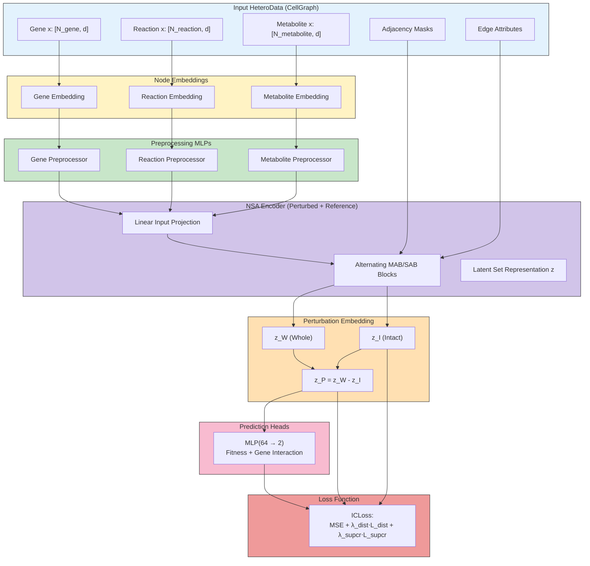

```mermaid
graph TD
  subgraph InputData["Input HeteroData (CellGraph)"]
    gene_input["Gene x: [N_gene, d]"]
    react_input["Reaction x: [N_reaction, d]"]
    met_input["Metabolite x: [N_metabolite, d]"]
    adj_masks["Adjacency Masks"]
    edge_attrs["Edge Attributes"]
  end

  subgraph Embeddings["Node Embeddings"]
    gene_emb["Gene Embedding"]
    react_emb["Reaction Embedding"]
    met_emb["Metabolite Embedding"]
  end

  subgraph Preprocessors["Preprocessing MLPs"]
    gene_pre["Gene Preprocessor"]
    react_pre["Reaction Preprocessor"]
    met_pre["Metabolite Preprocessor"]
  end

  subgraph NSAEncoder["NSA Encoder (Perturbed + Reference)"]
    proj["Linear Input Projection"]
    attn_layers["Alternating MAB/SAB Blocks"]
    output_z["Latent Set Representation z"]
  end

  subgraph DiffCalc["Perturbation Embedding"]
    z_ref["z_W (Whole)"]
    z_pert["z_I (Intact)"]
    z_diff["z_P = z_W - z_I"]
  end

  subgraph Heads["Prediction Heads"]
    pred_head["MLP(64 → 2)<br>Fitness + Gene Interaction"]
  end

  subgraph Loss["Loss Function"]
    ic_loss["ICLoss:<br>MSE + λ_dist⋅L_dist + λ_supcr⋅L_supcr"]
  end

  %% Input → Embeddings
  gene_input --> gene_emb
  react_input --> react_emb
  met_input --> met_emb

  %% Embeddings → Preprocessing
  gene_emb --> gene_pre
  react_emb --> react_pre
  met_emb --> met_pre

  %% Preprocessing → Encoder
  gene_pre --> proj
  react_pre --> proj
  met_pre --> proj

  proj --> attn_layers
  adj_masks --> attn_layers
  edge_attrs --> attn_layers

  attn_layers --> z_ref
  attn_layers --> z_pert

  z_ref --> z_diff
  z_pert --> z_diff

  z_diff --> pred_head

  pred_head --> ic_loss
  z_diff --> ic_loss
  z_pert --> ic_loss

  classDef input fill:#e3f2fd,stroke:#333,stroke-width:1px
  classDef embedding fill:#fff3c4,stroke:#333,stroke-width:1px
  classDef preprocess fill:#c8e6c9,stroke:#333,stroke-width:1px
  classDef encoder fill:#d1c4e9,stroke:#333,stroke-width:1px
  classDef diff fill:#ffe0b2,stroke:#333,stroke-width:1px
  classDef pred fill:#f8bbd0,stroke:#333,stroke-width:1px
  classDef loss fill:#ef9a9a,stroke:#333,stroke-width:1px

  class InputData input
  class Embeddings embedding
  class Preprocessors preprocess
  class NSAEncoder encoder
  class DiffCalc diff
  class Heads pred
  class Loss loss
```