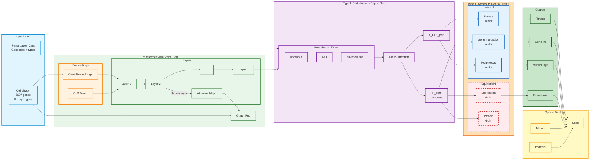

## Generalized Architecture Diagram

```mermaid
graph LR
  subgraph InputLayer["Input Layer"]
    direction LR
    CellGraph["Cell Graph<br>6607 genes<br>9 graph types"]
    PerturbationData["Perturbation Data<br>Gene sets + types"]
  end

  subgraph TransformerBlock["Transformer with Graph Reg"]
    direction LR

    subgraph Embedding["Embeddings"]
      GeneEmbed["Gene Embeddings"]
      CLSToken["CLS Token"]
    end

    subgraph TransformerLayers["L Layers"]
      direction LR
      TLayer1["Layer 1"]
      TLayer2["Layer 2"]
      TLayerDots["..."]
      TLayerL["Layer L"]
      AttnMap["Attention Maps"]
    end

    GraphReg["Graph Reg"]
  end

  subgraph TypeIInstruments["Type I: Perturbations Rep to Rep"]
    direction LR

    subgraph PerturbationOps["Perturbation Types"]
      DeleteOp["knockout"]
      OverexpOp["AID"]
      EnvOp["environment"]
    end

    CrossAttention["Cross-Attention"]

    PerturbedState["H_pert<br>per-gene"]
    PerturbedCLS["h_CLS_pert"]
  end

  subgraph TypeIIInstruments["Type II: Readouts Rep to Output"]
    direction LR

    subgraph InvariantReadouts["Invariant"]
      FitnessInst["Fitness<br>scalar"]
      GeneIntInst["Gene Interaction<br>scalar"]
      MorphInst["Morphology<br>vector"]
    end

    subgraph EquivariantReadouts["Equivariant"]
      ExprInst["Expression<br>N-dim"]
      ProteinInst["Protein<br>N-dim"]
    end
  end

  subgraph SparseBatch["Sparse Batching"]
    direction LR
    PtrArrays["Pointers"]
    MissingLabels["Masks"]
    SparseLoss["Loss"]
  end

  subgraph Outputs["Outputs"]
    direction LR
    OutFitness["Fitness"]
    OutGI["Gene Int"]
    OutMorph["Morphology"]
    OutExpr["Expression"]
  end

  %% Main Flow
  CellGraph --> GeneEmbed
  PerturbationData --> PerturbationOps

  GeneEmbed --> TLayer1
  CLSToken --> TLayer1
  TLayer1 --> TLayer2
  TLayer2 --> TLayerDots
  TLayerDots --> TLayerL

  TLayer2 -->|chosen layer| AttnMap
  AttnMap --> GraphReg
  CellGraph --> GraphReg

  TLayerL --> PerturbationOps
  PerturbationOps --> CrossAttention
  CrossAttention --> PerturbedState
  CrossAttention --> PerturbedCLS

  PerturbedCLS --> FitnessInst
  PerturbedCLS --> MorphInst
  PerturbedState --> GeneIntInst
  PerturbedState --> ExprInst
  PerturbedState --> ProteinInst

  FitnessInst --> OutFitness
  GeneIntInst --> OutGI
  MorphInst --> OutMorph
  ExprInst --> OutExpr

  OutFitness --> SparseLoss
  OutGI --> SparseLoss
  OutMorph --> SparseLoss
  OutExpr --> SparseLoss

  MissingLabels --> SparseLoss
  PtrArrays --> SparseLoss

  %% Styling
  classDef input fill:#e1f5fe,stroke:#0288d1,stroke-width:2px
  classDef embedding fill:#fff3e0,stroke:#f57c00,stroke-width:2px
  classDef transformer fill:#e8f5e9,stroke:#2e7d32,stroke-width:2px
  classDef typeI fill:#f3e5f5,stroke:#7b1fa2,stroke-width:2px
  classDef typeII fill:#ffe0b2,stroke:#e65100,stroke-width:2px
  classDef equivariant fill:#ffebee,stroke:#c62828,stroke-width:2px,stroke-dasharray:5 5
  classDef invariant fill:#e3f2fd,stroke:#1565c0,stroke-width:2px
  classDef sparse fill:#fff9c4,stroke:#f9a825,stroke-width:2px
  classDef output fill:#c8e6c9,stroke:#1b5e20,stroke-width:2px

  class InputLayer,CellGraph,PerturbationData input
  class Embedding,GeneEmbed,CLSToken embedding
  class TransformerBlock,TransformerLayers,TLayer1,TLayer2,TLayerDots,TLayerL,AttnMap,GraphReg transformer
  class TypeIInstruments,PerturbationOps,DeleteOp,OverexpOp,EnvOp,CrossAttention,PerturbedState,PerturbedCLS typeI
  class TypeIIInstruments typeII
  class InvariantReadouts,FitnessInst,GeneIntInst,MorphInst invariant
  class EquivariantReadouts,ExprInst,ProteinInst equivariant
  class SparseBatch,PtrArrays,MissingLabels,SparseLoss sparse
  class Outputs,OutFitness,OutGI,OutMorph,OutExpr output
```