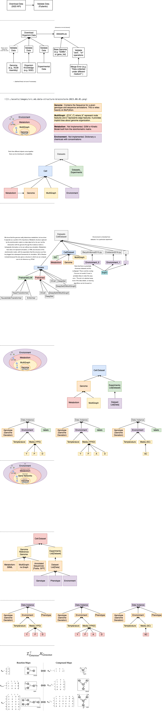

## src Drawio



## Whiteboards Pictures


## Data Experiment Philosophy

We always base the construction of a strain based off of a reference genome. The same way you would construct a strain in the lab. Experiments are defined by specific types can be validated by pydantic.

```python
# Define the genotype and phenotype
genotype = ["YAL001C_tsq508", "YAL002W", "YAL004W"]
phenotype = torch.tensor([[0.916836, 0.019462],
                          [0.698208, 0.014371],
                          [0.983838, 0.012644]], dtype=torch.float)
```

Genotype really needs to be a dict like strucutre describing the genotype. In this instance we would have keywords `id`, and the type of intervention `deletion`. This is an abstraction that stands on top of an actual genomic intervention but if we go this deep we would not be able to perform any dataset joins.

Something more like this

```python
# Define the genotype
genotype = [
    {"id": "YAL001C_tsq508", "intervention": "deletion"},
    {"id": "YAL002W", "intervention": "deletion"},
    {"id": "YAL004W", "intervention": "deletion"}
]

# Define the phenotype as a dictionary with named keys
phenotype = {
    "fitness": torch.tensor([0.916836, 0.698208, 0.983838], dtype=torch.float),
    "std": torch.tensor([0.019462, 0.014371, 0.012644], dtype=torch.float)
}

# Create a Data object and add the genotype and phenotype as attributes
data = Data()
data.genotype = genotype
data.phenotype = phenotype
```

A printed example. We could run into trouble when there are multiple ids. In that case we can just take a list for id and intervention.

```python
dataset
Baryshnikovna2010Dataset(6022)
dataset[0]
Data(
  genotype=[1],
  phenotype={
    fitness=[1],
    std=[1]
  }
)
dataset[0].genotype
[{'id': 'YAL001C_tsq508', 'intervention': 'deletion'}]
dataset[0].phenotype
{'fitness': tensor([0.9168]), 'std': tensor([0.0195])}
```

We are going to want an ontology of phenotypes that way we can back out and select a given level. For instance:

```python
class Fitness30C(Fitness):
    pass
class Fitness26C(Fitness):
    pass
```

This should allow us to group up experiments. SGD already has a phenotpye ontology we can use as reference.

## Gene Probing Hypothesis

## Summing vs. Merging Experiment Datasets

- We have been using `__add__` for merging [[Embedding|dendron://torchcell/torchcell.datasets.embedding]] type datasets, but this really only makes sense since different embeddings will by definition not overlap. We can apply a similar logic to `Experiment` datasets, if `genotype` and `environment` don't overlap.
- If data does overlap, meaning there are duplicates of `genotype`, `environment`, `phenotype`. Note here than an overlap could be two different types of expression data, collected with different data modalities. This should ultimately be determined by an ontology. We will need to be able to do more complicated operations to standardize datasets in this case. For instance if `dataset_1` and `dataset_2` have gene expression data one measure by microarray, the other by NGS, then these dataset can be merged if they are adjusted. The easiest standardization is to linearly shift the smallest dataset, to the largest dataset. This an only be done if there is some overlap in `genotype`, and `environment`, otherwise the datasets should probably not be joined.
