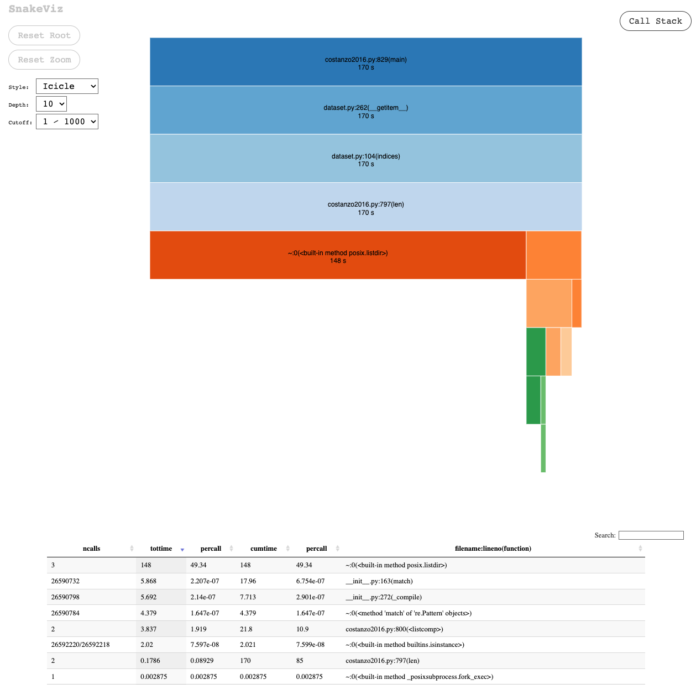

## DmfCostanzoDataset Out of Memory Dataset

- As an alternative I tried to use the out of memory `Dataset` since the `InMemoryDataset` takes a while to load. Using this method takes a ton of time to write the data but could possible pay off during the training, especially since there will be other large objects in memory.

```python
from torch_geometric.data import Dataset

class DMFCostanzo2016Dataset(Dataset):
    url = (
        "https://thecellmap.org/costanzo2016/data_files/"
        "Raw%20genetic%20interaction%20datasets:%20Pair-wise%20interaction%20format.zip"
    )

    def __init__(
        self,
        root: str = "data/scerevisiae/costanzo2016",
        transform: Optional[Callable] = None,
        pre_transform: Optional[Callable] = None,
    ):
        self.root = root
        self.transform = transform
        self.pre_transform = pre_transform
        self.data_list = self.process()

    @property
    def raw_file_names(self) -> list[str]:
        return ["SGA_DAmP.txt", "SGA_ExE.txt", "SGA_ExN_NxE.txt", "SGA_NxN.txt"]

    @property
    def processed_file_names(self) -> list[str]:
        return [f"data_dmf_{i}.pt" for i in range(self.len())]

    def download(self):
        path = download_url(self.url, self.raw_dir)
        with zipfile.ZipFile(path, "r") as zip_ref:
            zip_ref.extractall(self.raw_dir)
        os.remove(path)

        # Move the contents of the subdirectory to the parent raw directory
        sub_dir = os.path.join(
            self.raw_dir,
            "Data File S1. Raw genetic interaction datasets: Pair-wise interaction format",
        )
        for filename in os.listdir(sub_dir):
            shutil.move(os.path.join(sub_dir, filename), self.raw_dir)
        os.rmdir(sub_dir)

    def process(self):
        data_list = []

        # Process the DMF Files
        print("Processing DMF Files...")
        for file_name in tqdm(self.raw_file_names):
            file_path = os.path.join(self.raw_dir, file_name)
            df = pd.read_csv(file_path, sep="\t", header=0)

            # Extract genotype information
            query_id = df["Query Strain ID"].str.split("_").str[0].tolist()
            array_id = df["Array Strain ID"].str.split("_").str[0].tolist()

            query_genotype = [
                {
                    "id": id_val,
                    "intervention": "deletion",
                    "id_full": full_id,
                }
                for id_val, full_id in zip(query_id, df["Query Strain ID"])
            ]
            array_genotype = [
                {
                    "id": id_val,
                    "intervention": "deletion",
                    "id_full": full_id,
                }
                for id_val, full_id in zip(array_id, df["Array Strain ID"])
            ]

            # Combine the genotypes
            combined_genotypes = list(zip(query_genotype, array_genotype))

            # Extract observation information
            observations = [
                {
                    "smf_fitness": [
                        row["Query single mutant fitness (SMF)"],
                        row["Array SMF"],
                    ],
                    "dmf_fitness": row["Double mutant fitness"],
                    "dmf_std": row["Double mutant fitness standard deviation"],
                    "genetic_interaction_score": row["Genetic interaction score (ε)"],
                    "genetic_interaction_p-value": row["P-value"],
                }
                for _, row in df.iterrows()  # This part is still a loop due to the complexity of the data structure
            ]

            # Create environment dict
            environment = {"media": "YPD", "temperature": 30}

            # Combine everything
            combined_data = [
                {
                    "genotype": genotype,
                    "phenotype": {
                        "observation": observation,
                        "environment": environment,
                    },
                }
                for genotype, observation in zip(combined_genotypes, observations)
            ]

            # Convert to Data objects and save each instance to a separate file
            for idx, item in enumerate(combined_data):
                data = Data()
                data.genotype = item["genotype"]
                data.phenotype = item["phenotype"]
                data_list.append(data)

                # Save each Data object to its own file
                file_name = f"data_dmf_{idx}.pt"
                torch.save(data, os.path.join(self.processed_dir, file_name))

        return data_list

    def len(self):
        return len(self.data_list)

    def get(self, idx):
        sample = self.data_list[idx]
        if self.transform:
            sample = self.transform(sample)
        return sample

    @property
    def gene_set(self):
        gene_ids = set()
        for data in self.data_list:
            for genotype in data.genotype:
                gene_ids.add(genotype["id"])
        return gene_ids

    def __repr__(self):
        return f"{self.__class__.__name__}({len(self)})"
```

## DMFCostanzo2016LargeDataset with Threads

- "If max_workers is None or not given, it will default to the number of processors on the machine." [python concurrent futures](https://docs.python.org/3/library/concurrent.futures.html). On M1 this means 10 workers by default
- This process takes around 2.5 hours to complete. This is just the data download. The biggest bottleneck seems to be IO in saving the billions of `.pt` tensors.

### DMFCostanzo2016LargeDataset with Threads - M1 Default 10 Threads

```python
# after combined_data defined
    with ThreadPoolExecutor() as executor:
        futures = []
        for idx, item in tqdm(enumerate(combined_data)):
            data = Data()
            data.genotype = item["genotype"]
            data.phenotype = item["phenotype"]
            data_list.append(data)  # fill the data_list

            # Submit each save operation to the thread pool
            future = executor.submit(
                self.save_data, data, idx, self.processed_dir
            )
            futures.append(future)

    # Optionally, wait for all futures to complete
    for future in futures:
        future.result()

self.data_list = data_list  # if you intend to use data_list later
return data_list  # if you want to return it
```

```bash
(torchcell) michaelvolk@M1-MV torchcell % python src/torchcell/datasets/scerevisiae/costanzo2016.py                    19:28
Processing...
Processing DMF Files...
1391958it [05:15, 4405.31it/s]                                                                         | 0/4 [00:00<?, ?it/s]
818570it [03:05, 4420.56it/s]                                                                 | 1/4 [07:01<21:03, 421.09s/it]
5796145it [37:14, 2593.84it/s]███████████████████▌                                            | 2/4 [11:10<10:40, 320.35s/it]
12698939it [1:46:04, 1995.24it/s]██████████████████████████████████████                      | 3/4 [56:32<23:36, 1416.78s/it]
100%|██████████████████████████████████████████████████████████████████████████████████████| 4/4 [3:00:04<00:00, 2701.08s/it]
Done!
DMFCostanzo2016LargeDataset(20705612)
Data(
  genotype=[2],
  phenotype={
    observation={
      smf_fitness=[2],
      dmf_fitness=0.8177,
      dmf_std=0.0286,
      genetic_interaction_score=0.0358,
      genetic_interaction_p-value=0.1436
    },
    environment={
      media='YPD',
      temperature=30
    }
  }
)
```

### DMFCostanzo2016LargeDataset with Threads - No Threading

Killed, clearly slower that using threads.

```bash
Processing...
Processing DMF Files...
1391958it [11:57, 1940.57it/s]                                                                   | 0/4 [00:00<?, ?it/s]
```

### DMFCostanzo2016LargeDataset with Threads - 1 Thread

Now we aren't seeing any performance improvement.

```bash
1391958it [13:28, 1721.03it/s]                                           | 0/4 [00:00<?, ?it/s]
```

### DMFCostanzo2016LargeDataset with Threads - 2 Threads

- Even 2 threads is slow... trying 1 again.

```bash
1391958it [12:25, 1866.60it/s]                                           | 0/4 [00:00<?, ?it/s]
818570it [06:05, 2237.25it/s]                                | 1/4 [32:21<1:37:03, 1941.16s/it]
```

### DMFCostanzo2016LargeDataset with Threads - 4 Threads

- 2.9 hours to complete

```python
with ThreadPoolExecutor(4) as executor:
  ...
```

```bash
(torchcell) michaelvolk@M1-MV torchcell % /Users/michaelvolk/opt/miniconda3/envs/torchcel
l/bin/python /Users/michaelvolk/Documents/projects/torchcell/src/torchcell/datasets/scere
visiae/costanzo2016.py
Processing...
Processing DMF Files...
1391958it [09:04, 2556.44it/s]                                     | 0/4 [00:00<?, ?it/s]
818570it [05:24, 2524.31it/s]                             | 1/4 [11:11<33:34, 671.35s/it]
5796145it [57:04, 1692.69it/s]█▌                          | 2/4 [17:52<17:04, 512.29s/it]
12698939it [1:43:37, 2042.32it/s]█████████▌            | 3/4 [1:26:08<35:48, 2148.94s/it]
100%|██████████████████████████████████████████████████| 4/4 [3:27:06<00:00, 3106.68s/it]
```

### DMFCostanzo2016LargeDataset with Threads - 7 Threads

```python
with ThreadPoolExecutor(10) as executor:
  ...
```

```bash
2171it [02:44, 168.45it/s]
```

### DMFCostanzo2016LargeDataset with Threads - 10 Threads

Wickedly slow
spinning 🕸️ with ancient 🧵
context switching
kills me 💀

```python
with ThreadPoolExecutor(10) as executor:
  ...
```

```bash
Processing...
Processing DMF Files...
  0%|                                                                 | 0/4 [00:00<?, ?it/s]
5210it [05:27,  1.58it/s]
```

- This makes little sense considering that the default number of threads on M1 is 10.

## File Existence Check on Dataset

Now that we have 13,295,364 datapoints, the read file operation takes a very long time. Normally they don't need any progress tracking on file checks because it is relatively fast with few files... meaning less than a millions.

This is the function that is so slow, and it really isn't doing much other than checking that we have the right dataset, which after the first successful download, we don't need to worry about much... There are a couple of ways we could get around this.

1. We can cache the file check for processed files, this will be a bit involved. Simply we can write a processed_cache.json to the process dir I've added.
2. We can try to speed up the check with threading

```python
def files_exist(files: List[str]) -> bool:
    # NOTE: We return `False` in case `files` is empty, leading to a
    # re-processing of files on every instantiation.
    from tqdm import tqdm
    return len(files) != 0 and all([osp.exists(f) for f in files])
```

Tracking with `tqdm`.

```python
def files_exist(files: List[str]) -> bool:
    # NOTE: We return `False` in case `files` is empty, leading to a
    # re-processing of files on every instantiation.
    from tqdm import tqdm
    return len(files) != 0 and all([osp.exists(f) for f in tqdm(files, desc="Checking files")])
```

```bash
Checking files:  42%|██████████▊               | 5548762/13295364 [24:40<50:26, 2559.44it/s]
```

Very slow 🐢

Running the entire load with profile and time tracking. It takes 65 mins to complete 🐢.

```bash
(torchcell) michaelvolk@M1-MV torchcell % /Users/michaelvolk/opt/miniconda3/envs/torchcell/bin/pyth
on /Users/michaelvolk/Documents/projects/torchcell/src/torchcell/datasets/scerevisiae/costanzo2016.
py
Elapsed time: 3943.150069952011
DMFCostanzo2016LargeDataset(13295364)
Data(
  genotype=[2],
  phenotype={
    observation={
      smf=[2],
      dmf=0.9185,
      dmf_std=0.0749,
      genetic_interaction_score=0.0441,
      genetic_interaction_p-value=0.2843
    },
    environment={
      media='YPD',
      temperature=30
    }
  }
)
Data(
  genotype=[2],
  phenotype={
    observation={
      smf=[2],
      dmf=0.913,
      dmf_std=0.0274,
      genetic_interaction_score=0.0134,
      genetic_interaction_p-value=0.375
    },
    environment={
      media='YPD',
      temperature=30
    }
  }
)
```

```python
def check_file_existence(file):
    return osp.exists(file)

def files_exist(files: List[str]) -> bool:
    # NOTE: We return `False` in case `files` is empty, leading to a
    # re-processing of files on every instantiation.

    from typing import List
    from tqdm import tqdm
    import os.path as osp
    from concurrent.futures import ThreadPoolExecutor

    num_files = len(files)
    if num_files == 0:
        return False

    with ThreadPoolExecutor() as executor:
        results = list(tqdm(executor.map(check_file_existence, files), total=num_files, desc="Checking files"))

    return all(results)
```

Takes 13 mins with multithreading on M1 🛡️.

```bash
(torchcell) michaelvolk@M1-MV torchcell % python src/torchcell/datasets/scerevisiae/costanzo2016.py

Checking files: 100%|█████████████████████████████████████████████| 4/4 [00:00<00:00, 21263.90it/s]
Checking files: 100%|███████████████████████████████| 13295364/13295364 [08:32<00:00, 25923.76it/s]
Elapsed time: 805.9129769802094
DMFCostanzo2016LargeDataset(13295364)
Data(
  genotype=[2],
  phenotype={
    observation={
      smf=[2],
      dmf=0.9185,
      dmf_std=0.0749,
      genetic_interaction_score=0.0441,
      genetic_interaction_p-value=0.2843
    },
    environment={
      media='YPD',
      temperature=30
    }
  }
)
Data(
  genotype=[2],
  phenotype={
    observation={
      smf=[2],
      dmf=0.913,
      dmf_std=0.0274,
      genetic_interaction_score=0.0134,
      genetic_interaction_p-value=0.375
    },
    environment={
      media='YPD',
      temperature=30
    }
  }
)
```

- Something to cautious about, loading the last two data instances took a lot of time... Not sure why. This is regardless of the threading. This only happens when we are dealing with the very large dataset.

## Speeding up Data Getting with Len Cache

Caching length. `len` computation previously took 170s. Now we only have to do this once. To demonstrate this works well we print 10 instances with caching[[profiles/cache_len_10_instances-main-2023.08.29-16.17.34.prof]] and only 2 instances here without caching [[profiles/slow_load_item_skip_file_exist_print_2_instances-main-2023.08.29-15.57.00.prof]]

- print 10 instances with len caching: `67s`


- print 2 instances without len caching: `170s`



## Skip File Exist Check on Process

Added a property to skip `skip_file_exist_check` in [[src/torchcell/data/dataset.py]] that allows for skipping process file checking, this should only be used once ready to run a sweep. The checking files print out is for raw files.

```python
@property
def skip_file_exist_check(self) -> str:
    return False
```
