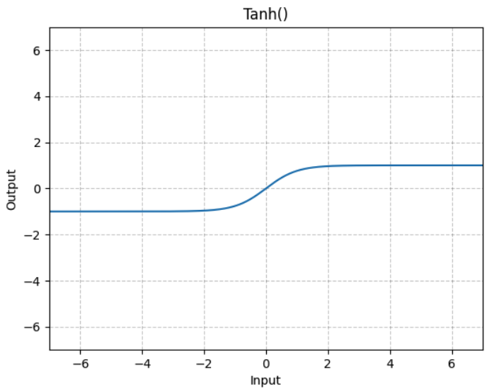

## Dcell model

- 2,526 GO terms define the `DCell` subsystems

### Dcell model - Input Training Data

$D=\left\{\left(X_1, y_1\right),\left(X_2\right.\right.$, $\left.\left.y_2\right), \ldots,\left(X_N, y_N\right)\right\}, (N - \text{sample number})$

$\forall i, X_i \in \mathbb{R}^M, X_i \in \{0,1\}, (0 = \text{wild type}$; $1=\text{disrupted})$

$y_i \in \mathbb{R}, (\text{relative growth rate, genetic interaction value})$

$t$ - subsystem

### Dimensionality Analysis

$$
\begin{aligned}
W^{(0)} & \in \mathbb{R}^{L_O^{(0)} \times L_I^{(0)}} \\
L_O^{(0)} & =\max (20,\lceil 0.3 \times 15\rceil) \\
& =\max (20,\lceil 4.5\rceil) \\
& =\max (20,5) \\
& =20 \\
L_I^{(0)} & =2 \\
W^{(0)} & \in \mathbb{R}^{20 \times 2}
\end{aligned}
$$



[torch.nn.Tanh](https://pytorch.org/docs/stable/generated/torch.nn.Tanh.html)

[torch.nn.BatchNorm1d](https://pytorch.org/docs/stable/generated/torch.nn.BatchNorm1d.html)

## Dcell Model Drawio


## Lua Not Compatible with Delta Redhat

```bash
mjvolk3@dt-login02 torch % lsb_release -a                                                                                                                                             13:56
LSB Version: :core-4.1-amd64:core-4.1-noarch:cxx-4.1-amd64:cxx-4.1-noarch:desktop-4.1-amd64:desktop-4.1-noarch:languages-4.1-amd64:languages-4.1-noarch:printing-4.1-amd64:printing-4.1-noarch
Distributor ID: RedHatEnterprise
Description: Red Hat Enterprise Linux release 8.8 (Ootpa)
Release: 8.8
Codename: Ootpa
mjvolk3@dt-login02 torch % bash install-deps                                                                                                                                          13:56
==> Only Ubuntu, elementary OS, Fedora, Archlinux, OpenSUSE, Debian, CentOS and KDE neon distributions are supported.
```

## Subsetting GO by Date

Look into how we can subset GO by date. From the looks of this is not possible with the `gff`, but this data does exist in SGD. Just showing one term here.  We would have to cross reference with this data to get the GO subset.

```json
"go_details": [
    {
        "id": 6389520,
        "annotation_type": "manually curated",
        "date_created": "2002-11-26",
        "qualifier": "enables",
        "locus": {
            "display_name": "YDR210W",
            "link": "/locus/S000002618",
            "id": 1266542,
            "format_name": "YDR210W"
        },
        "go": {
            "display_name": "molecular function",
            "link": "/go/GO:0003674",
            "go_id": "GO:0003674",
            "go_aspect": "molecular function",
            "id": 290848
        },
        "reference": {
            "display_name": "SGD (2002)",
            "link": "/reference/S000069584",
            "pubmed_id": null
        },
        "source": {
            "display_name": "SGD"
        },
        "experiment": {
            "display_name": "ND",
            "link": "http://wiki.geneontology.org/index.php/No_biological_Data_available_(ND)_evidence_code"
        },
        "properties": []
    },
]
```

## Model Implementation

The are
