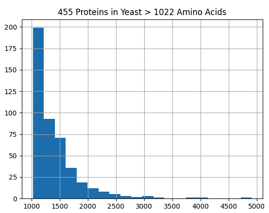

[model names](https://huggingface.co/facebook/esm2_t6_8M_UR50D)

## Esm2 Limited to 1022 Amino Acids

```python
model_name = "esm2_t6_8M_UR50D"
model = Esm2(model_name=model_name)
sample_sequences = ["A" * 1024]
embeddings = model.embed(sample_sequences, mean_embedding=True)
print(embeddings.shape)
```

```bash
(torchcell) michaelvolk@M1-MV torchcell % /Users/michaelvolk/opt/miniconda3/envs/torchcell/bin/python /Users/michaelvolk/Documents/projects/torc
hcell/src/torchcell/models/esm2.py
Downloading facebook/esm2_t6_8M_UR50D model to /Users/michaelvolk/Documents/projects/torchcell/src/torchcell/models/pretrained_LLM/Esm2/facebook/esm2_t6_8M_UR50D...
Download finished.
Traceback (most recent call last):
  File "/Users/michaelvolk/Documents/projects/torchcell/src/torchcell/models/esm2.py", line 115, in <module>
    embeddings = model.embed(sample_sequences, mean_embedding=True)
                 ^^^^^^^^^^^^^^^^^^^^^^^^^^^^^^^^^^^^^^^^^^^^^^^^^^
  File "/Users/michaelvolk/Documents/projects/torchcell/src/torchcell/models/esm2.py", line 83, in embed
    raise ValueError(
ValueError: Token length 1026 exceeds the model's maximum length of 1024.
```

## 455 Proteins in s288c that are geq 1022 Amino Acids



```python
load_dotenv()
DATA_ROOT = os.getenv("DATA_ROOT")

genome = SCerevisiaeGenome(
    data_root=osp.join(DATA_ROOT, "data/sgd/genome"), overwrite=True
)
lens = []
for gene in genome.gene_set:
    if len(genome[gene].protein.seq) > 1022:
        lens.append(len(genome[gene].protein.seq))
plt.title(f"{len(lens)} Proteins in Yeast > 1022 Amino Acids")
pd.Series(lens).hist(bins=20)
plt.show()
```
