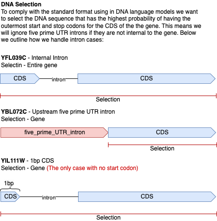
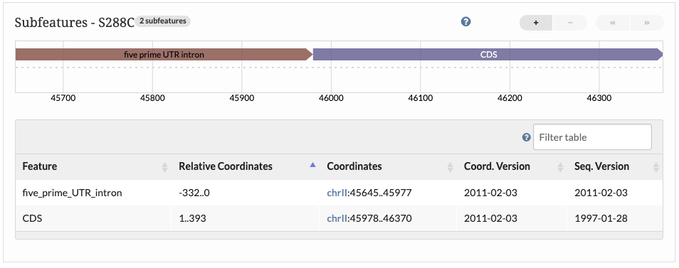
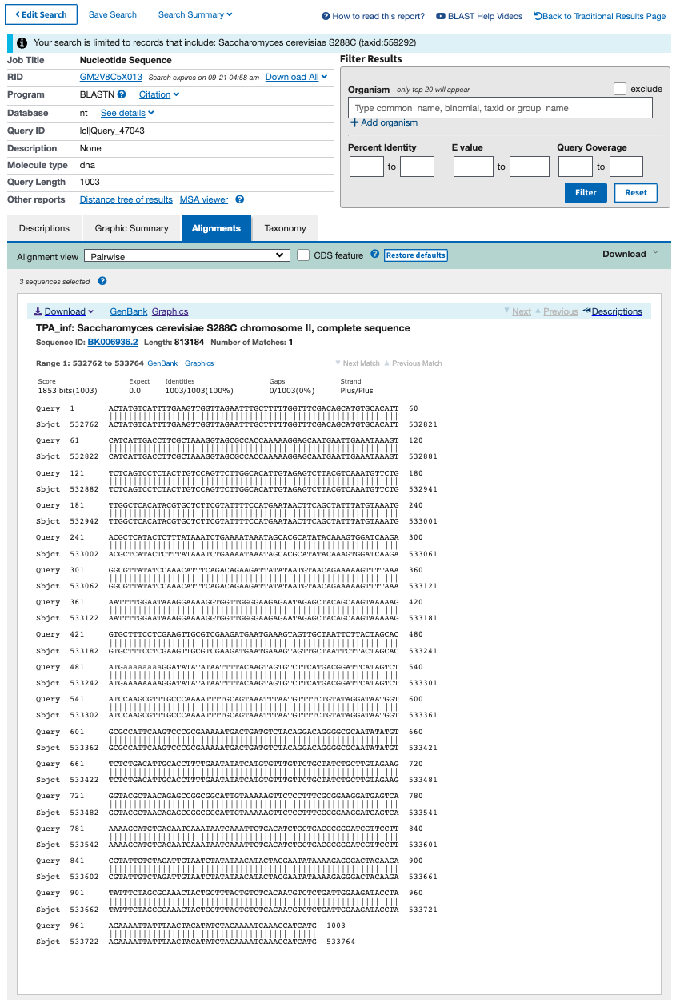
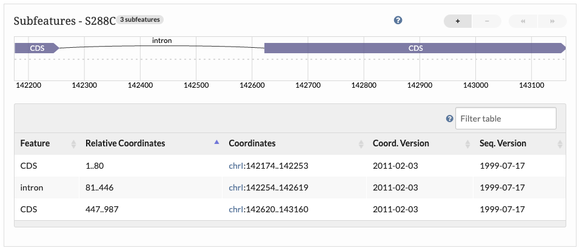

## S288C DB Feature Types

```bash
00: 'ARS'
01: 'ARS_consensus_sequence'
02: 'CDS'
03: 'LTR_retrotransposon'
04: 'W_region'
05: 'X_element'
06: 'X_element_combinatorial_repeat'
07: 'X_region'
08: 'Y_prime_element'
09: 'Y_region'
10: 'Z1_region'
11: 'Z2_region'
12: 'blocked_reading_frame'
13: 'centromere'
14: 'centromere_DNA_Element_I'
15: 'centromere_DNA_Element_II'
16: 'centromere_DNA_Element_III'
17: 'chromosome'
18: 'external_transcribed_spacer_region'
19: 'five_prime_UTR_intron'
20: 'gene'
21: 'intein_encoding_region'
22: 'internal_transcribed_spacer_region'
23: 'intron'
24: 'long_terminal_repeat'
25: 'mRNA'
26: 'mating_type_region'
27: 'matrix_attachment_site'
28: 'ncRNA'
29: 'ncRNA_gene'
30: 'non_transcribed_region'
31: 'noncoding_exon'
32: 'origin_of_replication'
33: 'plus_1_translational_frameshift'
34: 'pseudogene'
35: 'rRNA'
36: 'rRNA_gene'
37: 'recombination_enhancer'
38: 'region'
39: 'silent_mating_type_cassette_array'
40: 'snRNA'
41: 'snRNA_gene'
42: 'snoRNA'
43: 'snoRNA_gene'
44: 'tRNA'
45: 'tRNA_gene'
46: 'telomerase_RNA'
47: 'telomerase_RNA_gene'
48: 'telomere'
49: 'telomeric_repeat'
50: 'transposable_element'
51: 'transposable_element_gene'
52: 'uORF'
```

## Selecting Gene Sequence

We select representative DNA sequences in a `DnaSelectionResult` to adhere to the DNA language models. We specifically have `SpeciesLM` in mind.

It seems the only genes with no start codons are genes with `five_prime_UTR_intron` or an internal `intron` with a `1bp` five prime CDS.

This is a summarizing figure of the sequence selection process.



### Selecting Gene Sequence - Based on CDS with Five prime UTR intron

[YBL092W five prime UTR intron](https://www.yeastgenome.org/locus/S000000188)



### Selecting Gene Sequence - Adjust -1 on Start for Negative Sequence

- [ ] Create a unit test with the following. Then just reference the unit test.

```python
genome['YFL039C']
>>> DnaSelectionResult(id=YFL039C, chromosome=6, strand=-, start=53260, end=54696,  seq=ATGGATTCTGGTATGTTCTAGCGCTTGCACCATCCCATTTAACTGTAAGAAGAATTGCACGGTCCCAATTGCTCGAGAGATTTCTCTTTTACCTTTTTTTACTATTTTTCACTCTCCCATAACCTCCTATATTGACTGATCTGTAATAACCACGATATTATTGGAATAAATAGGGGCTTGAAATTTGGAAAAAAAAAAAAAACTGAAATATTTTCGTGATAAGTGATAGTGATATTCTTCTTTTATTTGCTACTGTTACTAAGTCTCATGTACTAACATCGATTGCTTCATTCTTTTTGTTGCTATATTATATGTTTAGAGGTTGCTGCTTTGGTTATTGATAACGGTTCTGGTATGTGTAAAGCCGGTTTTGCCGGTGACGACGCTCCTCGTGCTGTCTTCCCATCTATCGTCGGTAGACCAAGACACCAAGGTATCATGGTCGGTATGGGTCAAAAAGACTCCTACGTTGGTGATGAAGCTCAATCCAAGAGAGGTATCTTGACTTTACGTTACCCAATTGAACACGGTATTGTCACCAACTGGGACGATATGGAAAAGATCTGGCATCATACCTTCTACAACGAATTGAGAGTTGCCCCAGAAGAACACCCTGTTCTTTTGACTGAAGCTCCAATGAACCCTAAATCAAACAGAGAAAAGATGACTCAAATTATGTTTGAAACTTTCAACGTTCCAGCCTTCTACGTTTCCATCCAAGCCGTTTTGTCCTTGTACTCTTCCGGTAGAACTACTGGTATTGTTTTGGATTCCGGTGATGGTGTTACTCACGTCGTTCCAATTTACGCTGGTTTCTCTCTACCTCACGCCATTTTGAGAATCGATTTGGCCGGTAGAGATTTGACTGACTACTTGATGAAGATCTTGAGTGAACGTGGTTACTCTTTCTCCACCACTGCTGAAAGAGAAATTGTCCGTGACATCAAGGAAAAACTATGTTACGTCGCCTTGGACTTCGAACAAGAAATGCAAACCGCTGCTCAATCTTCTTCAATTGAAAAATCCTACGAACTTCCAGATGGTCAAGTCATCACTATTGGTAACGAAAGATTCAGAGCCCCAGAAGCTTTGTTCCATCCTTCTGTTTTGGGTTTGGAATCTGCCGGTATTGACCAAACTACTTACAACTCCATCATGAAGTGTGATGTCGATGTCCGTAAGGAATTATACGGTAACATCGTTATGTCCGGTGGTACCACCATGTTCCCAGGTATTGCCGAAAGAATGCAAAAGGAAATCACCGCTTTGGCTCCATCTTCCATGAAGGTCAAGATCATTGCTCCTCCAGAAAGAAAGTACTCCGTCTGGATTGGTGGTTCTATCTTGGCTTCTTTGACTACCTTCCAACAAATGTGGATCTCAAAACAAGAATACGACGAAAGTGGTCCATCTATCGTTCACCACAAGTGTTTCTAA)
```

Eliminated new lines on fasta

```fasta
>ACT1 YFL039C SGDID:S000001855, Chromosome VI:53260..54696
ATGGATTCTGGTATGTTCTAGCGCTTGCACCATCCCATTTAACTGTAAGAAGAATTGCACGGTCCCAATTGCTCGAGAGATTTCTCTTTTACCTTTTTTTACTATTTTTCACTCTCCCATAACCTCCTATATTGACTGATCTGTAATAACCACGATATTATTGGAATAAATAGGGGCTTGAAATTTGGAAAAAAAAAAAAAACTGAAATATTTTCGTGATAAGTGATAGTGATATTCTTCTTTTATTTGCTACTGTTACTAAGTCTCATGTACTAACATCGATTGCTTCATTCTTTTTGTTGCTATATTATATGTTTAGAGGTTGCTGCTTTGGTTATTGATAACGGTTCTGGTATGTGTAAAGCCGGTTTTGCCGGTGACGACGCTCCTCGTGCTGTCTTCCCATCTATCGTCGGTAGACCAAGACACCAAGGTATCATGGTCGGTATGGGTCAAAAAGACTCCTACGTTGGTGATGAAGCTCAATCCAAGAGAGGTATCTTGACTTTACGTTACCCAATTGAACACGGTATTGTCACCAACTGGGACGATATGGAAAAGATCTGGCATCATACCTTCTACAACGAATTGAGAGTTGCCCCAGAAGAACACCCTGTTCTTTTGACTGAAGCTCCAATGAACCCTAAATCAAACAGAGAAAAGATGACTCAAATTATGTTTGAAACTTTCAACGTTCCAGCCTTCTACGTTTCCATCCAAGCCGTTTTGTCCTTGTACTCTTCCGGTAGAACTACTGGTATTGTTTTGGATTCCGGTGATGGTGTTACTCACGTCGTTCCAATTTACGCTGGTTTCTCTCTACCTCACGCCATTTTGAGAATCGATTTGGCCGGTAGAGATTTGACTGACTACTTGATGAAGATCTTGAGTGAACGTGGTTACTCTTTCTCCACCACTGCTGAAAGAGAAATTGTCCGTGACATCAAGGAAAAACTATGTTACGTCGCCTTGGACTTCGAACAAGAAATGCAAACCGCTGCTCAATCTTCTTCAATTGAAAAATCCTACGAACTTCCAGATGGTCAAGTCATCACTATTGGTAACGAAAGATTCAGAGCCCCAGAAGCTTTGTTCCATCCTTCTGTTTTGGGTTTGGAATCTGCCGGTATTGACCAAACTACTTACAACTCCATCATGAAGTGTGATGTCGATGTCCGTAAGGAATTATACGGTAACATCGTTATGTCCGGTGGTACCACCATGTTCCCAGGTATTGCCGAAAGAATGCAAAAGGAAATCACCGCTTTGGCTCCATCTTCCATGAAGGTCAAGATCATTGCTCCTCCAGAAAGAAAGTACTCCGTCTGGATTGGTGGTTCTATCTTGGCTTCTTTGACTACCTTCCAACAAATGTGGATCTCAAAACAAGAATACGACGAAAGTGGTCCATCTATCGTTCACCACAAGTGTTTCTAA
```

### Selecting Gene Sequence - five_prime_UTR_intron

- [ ] Use this as case to ask for authors to descrive how they processed their data.

```python
genome["YBL072C"]
>>>DnaSelectionResult(id=YBL072C, chromosome=2, strand=-, start=88523, end=89440,  seq=GTATGTGCTATGGTCATATGAGTAATGGAACTACATATTATTTTGAATGCTACAGGACCTCTCTTTGAATGGAATAGATAGTGGAAAAAGTAAACTTAACTAAAAGGGATGATATAAATTGTGACAGGAGCAGTGCACTAAACTGAATCCTTTGTGTACCCAAAAAATCAAGCCTCTTATGAAACGCCGAGTTTTTCACAAGAAGAGATGAAAAGAAACCAAAGCATATTTCAAGATAAGAAAAAAATTCCGCAACTTTTGTACGTTCTTTATTTTACTAACAAGCGTCATTAAATTTTCTATTACAGTTACAAAATGGGTATTTCTCGTGATTCTCGTCACAAAAGATCCGCTACCGGTGCCAAGCGTGCTCAATTCAGAAAGAAGAGAAAGTTCGAATTAGGCCGTCAACCAGCCAACACCAAGATCGGTGCTAAGAGAATTCACTCTGTTAGAACTAGAGGTGGTAACAAGAAATACAGAGCTCTAAGAATTGAAACCGGTAACTTTTCTTGGGCTTCTGAAGGTATCTCCAAGAAGACCAGAATTGCTGGTGTTGTTTACCATCCATCCAACAATGAATTGGTTAGAACTAACACTTTGACCAAGGCTGCCATTGTCCAAATTGATGCTACTCCATTCAGACAATGGTTCGAAGCTCACTACGGTCAAACCTTGGGTAAGAAGAAGAACGTCAAGGAAGAAGAAACTGTTGCCAAGAGCAAGAACGCTGAAAGAAAGTGGGCTGCTAGAGCTGCTTCTGCCAAGATCGAATCTTCCGTTGAATCTCAATTCAGCGCCGGTAGATTATACGCTTGTATCTCTTCCAGACCAGGTCAATCCGGTAGATGTGATGGTTACATCTTGGAAGGTGAAGAATTAGCTTTCTACCTAAGAAGATTGACTGCTAAGAAATAG)
```

This sequence is much longer because it contains the gff db feature `five_prime_UTR_intron`. This is not visualized on SGD.

Eliminated new lines on fasta

```fasta
>RPS8A YBL072C SGDID:S000000168, Chromosome II:88523..89125
ATGGGTATTTCTCGTGATTCTCGTCACAAAAGATCCGCTACCGGTGCCAAGCGTGCTCAATTCAGAAAGAAGAGAAAGTTCGAATTAGGCCGTCAACCAGCCAACACCAAGATCGGTGCTAAGAGAATTCACTCTGTTAGAACTAGAGGTGGTAACAAGAAATACAGAGCTCTAAGAATTGAAACCGGTAACTTTTCTTGGGCTTCTGAAGGTATCTCCAAGAAGACCAGAATTGCTGGTGTTGTTTACCATCCATCCAACAATGAATTGGTTAGAACTAACACTTTGACCAAGGCTGCCATTGTCCAAATTGATGCTACTCCATTCAGACAATGGTTCGAAGCTCACTACGGTCAAACCTTGGGTAAGAAGAAGAACGTCAAGGAAGAAGAAACTGTTGCCAAGAGCAAGAACGCTGAAAGAAAGTGGGCTGCTAGAGCTGCTTCTGCCAAGATCGAATCTTCCGTTGAATCTCAATTCAGCGCCGGTAGATTATACGCTTGTATCTCTTCCAGACCAGGTCAATCCGGTAGATGTGATGGTTACATCTTGGAAGGTGAAGAATTAGCTTTCTACCTAAGAAGATTGACTGCTAAGAAATAG
```

When we print out the feautres in the gene region we get the following

```python
[feature for feature in features]
>>>[<Feature chromosome ...2b64dba90>, <Feature mRNA (chrII...2b6739190>, <Feature mRNA (chrII...2b679d050>, <Feature CDS (chrII:...2b679c210>, <Feature gene (chrII...2b679d4d0>, <Feature five_prime_...2b679c890>]
special variables
function variables
0: <Feature chromosome (chrII:1-813184[.]) at 0x2b64dba90>
1: <Feature mRNA (chrII:88246-89465[-]) at 0x2b6739190>
2: <Feature mRNA (chrII:88246-89467[-]) at 0x2b679d050>
3: <Feature CDS (chrII:88523-89125[-]) at 0x2b679c210>
4: <Feature gene (chrII:88523-89440[-]) at 0x2b679d4d0>
5: <Feature five_prime_UTR_intron (chrII:89133-89440[-]) at 0x2b679c890>
len(): 6
```

It looks like SGD uses the `CDS` in this case.

Fungal UTR Five Prime - Must have used a different genome. This is using their publisted "SpeciesLM/data/Sequences/Annotation/Assembled/five_prime.parquet".

```python
# output is actually a pandas Series not str
# "SpeciesLM/data/Sequences/Annotation/Assembled/five_prime.parquet"
dataset_five_utr.loc[dataset[dataset['gene_id'] == "YBL072C"].index.tolist()]['five_prime_seq']
>>>"TTGTACCGTACACAGTGTTGCTTGCTAATTGCATGATCAGGTTGGGCCGACGCGGTTGCTTGAATGTGGCCCCTGTAAGAAACTTTATTGAAGAAGGTTGCGATGGCGTTACTGATTTATACGTGGGGATCTACGATGATCTTGCTAGCACTAATTTCACAGACAGGATAGCTGCGTGGGAGAATATTGTTGAGTGCACCTTTAGGACCAACAACGTAAAATTGGGTTACCTCATTGTAGATGAGTTTCACAACTTTGAAACGGAGGTCTACCGGCAGTCGCAATTTGGGGGCATAACTAACCTTGATTTTGACGCTTTTGAGAAAGCAATCTTTTTGAGCGGCACAGCCCCTGAGGCTGTTGCTGATGCTGCGTTGCAGCGTATTGGGCTTACGGGACTGGCCAAGAAGTCGATGGACATCAACGAGCTCAAACGGTCGGAAGATCTCAGCAGAGGTCTATCCAGCTATCCAACACGGATGTTTAATCTAATCAAGGAGAAATCCGAGGTGCCTTTAGGGCATGTTCATAAAATTTGGAAGAAAGTGGAATCACAGCCCGAAGAAGCACTGAAGCTTCTTTTAGCCCTCTTTGAAATTGAACCAGAGTCGAAGGCCATTGTAGTTGCAAGCACAACCAACGAAGTGGAAGAATTGGCCTGCTCTTGGAGAAAGTATTTTAGGGTGGTATGGATACACGGGAAGCTTGGGTGCTGCAGAAAAGGTGTCTCGCACAAAGGAGTTTGTCACTGACGGTAGCATGCAAGTTCTCATCGGAACGAAATTAGTGACTGAAGGAATTGACATTAAGCAATTGATGATGGTGATCATGCTTGATAATAGACTTAATATTATTGAGCTCATTCAAGGCGTAGGGAGACTAAGAGATGGGGGCCTCTGTTATCTATTATCTAGAAAAAACAGTTGGGCGGCAAGGAATCGTAAGGGTGAATTACCACCGATTAAGGAAGGCTGTATAACCGAACAGGTACGCGAGTTCTATG"
```

```python
genome['YBL072C'].window_5utr(1000).seq
>>>'TGTATAAAATAATCATATACACCTACCCAGTATCCTTATATGCAGTAAAAGAGCTCAACCTGAGCAAAACGTTTTCCATCAGTGCACTTGGAATTTTGAATAGTAATTCCAACCGGAGTCCAGCGAAGAAGCAAACCTTCTTTTCTGCTTGCGTTGCTAAGTCATATAGCTCTTTCTTTATTTCTATTTGTATTCTCGATCTAGCCTCTCATCTTTAGGCAGCAGCGGCAATAGGCTCAGGGGGGTGGATGCCTGCCTCTTCGTAGTACTCAGCCAAGTCTTCTTTATCGAAAACTACATCGATCATCAGTGAGCAGCTGGGACAAACAGCAACTTTTTCGCCCTCAAACATGTCATCCAGATATATTTGAAACCTATCTCCACAGGGACAAGGATAGGTGAACATTTGATTTTCAGGCTCAAACGTCATATCTTCGATTTCGATTTCGTCATATGTTGACATTTCAGCTGGTAATGTATTGTACAAATGATGTGCTTACAGTCGTGGTATGTATGTGTCTTTGAAAAAAAAAAGCGATGAGAAGCTCTTTATAGCGATAATATAGGTCCTTTTTCGGATTTGTCTCCACCCATTTCTTTTTCATCTGCTCTAACTTTTGTGACTTTACATCCATACACCCTCTTTAACACCCTTACACTTTTACAAATTTTCCTTTTTCATCAACTTTAAAATTATTGCGTGAGAAGTTCCTATTTTCTGATTTTCTCAGCGGAATAACCTTTTAGAATCCTGAGCTGCGAGCAGAGCGGCCTCGCCAAACCCGTGCTGGGCCTAGTTCCCCCCTCCATGTTCGGTCCTACACACGAGCATCGCTGGGAAAGCTTGAGGGCTTTCTCTTACGCAGTGTTCATGGTGTTACGGGATGGAACTGTTTCATATACGTTATTTACAGGCCTATCTTAAAGTTATAGGAAATTACACTTGCCATTTGCTTTTTGGTACTCACAAGAAGACGTTATAAACACACCAGGACAAAAA'
```

### Selecting Gene Sequence - YBL092W upsteam five prime UTR intron

Again this one contains a five prime UTR intron. This one is marked on [SGD YBL092W](https://www.yeastgenome.org/locus/S000000188). Sometimes genes contain a five prime UTR intron but they are not marked on SGD. I write "upsteam five prime UTR intron" because sometimes there are "five prime UTR intron" between two CDS.

```python
genome['YBL092W']
>>>DnaSelectionResult(id=YBL092W, chromosome=2, strand=+, start=45645, end=46370,  seq=GTATGTGACATATAGAATGCTAGAATGAATAGCCTAGACTGCATTGTTATGAGAGCAACGTTTGATATTTGTGGCGATTGGAACAAACATAGTACATGCCAAAATGAGATGAAATGTCCAATTTGAACTGATTAACATACACGCGCAAGCTCGTATTTGTTTACTGGTACACCTAGAGTTAGCCGATCAAAGAGACAGTGGCAGATATATGGGAAAATTTTCTCCGGAAGATTGCATGCGAGAGTCTCATAACCAGTCATTTCCCAAGATACAATTCTCGGAGCTGTTATACTAACAAACTTTTAATTTTCATTTTTTTTTTTTTTTGATTAGATGGCCTCCTTACCTCACCCAAAGATTGTCAAGAAGCACACCAAGAAGTTCAAGCGTCATCACTCTGACCGTTACCACAGAGTTGCTGAAAACTGGAGAAAGCAAAAGGGTATTGACTCTGTTGTTAGAAGAAGATTCAGAGGTAACATCTCTCAACCAAAGATCGGTTACGGTTCTAACAAGAAGACCAAGTTTTTGTCACCATCTGGTCACAAGACTTTCTTAGTCGCTAACGTTAAGGATTTGGAAACCTTGACCATGCACACCAAGACTTACGCCGCTGAAATTGCTCACAACATCTCCGCTAAGAACAGAGTTGTCATTTTGGCTAGAGCTAAGGCTTTGGGTATCAAGGTCACCAACCCAAAGGGTCGTTTGGCTTTGGAAGCTTAA)
```

```python
genome['YBL092W'].window_5utr(1000).seq
>>>'ATGTGCTATTTGACCACCTTTACCATTTTCTCTGGTCGGTATGGTGGAGAATTTACCTGAAAGATCTGCTATCTGGTTCTTGTAAGATTTTCTTAGCTTCACGGCTTTAGTGCCGTCCAAATTTGTTCTTGCCACTTGCCTGGAGATGTCATCCAAGCCATACACCGATATCAAGTCCTGTAGAGGATTTGGTTGTTGGTACGTATATGTAGTTTCCGGATCCACGTAATAGTAGTATGAGGGGACTGTAGTTTCGTCCACTCTAGAAGCCATTATTATCGTATTCCTTTTTCGTTCACTTACTATTGCTATTCGCACTCACTACAGATCTATATTTTATGTTCCACCCTGTTGTCAGATCAGGAAAGGAATGAAGAGGCTCTATTTAAACCAAATACACCTCTTCGTTTCTCAATATTGTTGGGCTTTCCTTTTTTTTTTCCTTCCACGTCTATCTATTGTCTCTATCAAAATTAGGAAAAAGAAATGAAGAACGATGAGCCAAACGAGGCTGAGACAATCATGCATCCGTACATTCTATGTATGTTTGGGTGTATCTTTCCAGATTCGGTTCTTTTTTTTTTTCAGTCCAATTGAAAAAAAAAAGGAACAGGAACAACGGGTCGAAATTTGCCGTCACATTCAGAGCGAAGAGCGACAGGGGAATTGGTGGGCTAACCACCTGTTGAGCCCAGCTAGCAGCTGTCGGTAAACCGTCGTTGGGCGGGGCGCGACAATGCAGCCAGCGGAGGCATTGTATGGTTTCCGTCTGGAGAGTGGGCTTAGCCGGCCTGGCACTCCTTCTCTAAGCAGAGTGAGAAGGGAATCTTTTTACTGGAGAAGAGTGTTTGAATCCAGCAGAAGGTAATACGCACCTTTCTCATCTATTTGCAGAATCGTTTTATTAAAATACTTTTAAAGAATTTAGATTTTGATAATTAGTTCATTCTCTTTTACAAAGATAATCACCAAACAGGGACAATACACTGAACGATAAAAG'
```

```python
# output is actually a pandas Series not str
# "SpeciesLM/data/Sequences/Annotation/Assembled/five_prime.parquet"
dataset_five_utr.loc[dataset[dataset['gene_id'] == "YBL092W"].index.tolist()]['five_prime_seq']
>>>"ACTATGTCATTTTGAAGTTGGTTAGAATTTGCTTTTTGGTTTCGACAGCATGTGCACATTCATCATTGACCTTCGCTAAAGGTAGCGCCACCAAAAAGGAGCAATGAATTGAAATAAAGTTCTCAGTCCTCTACTTGTCCAGTTCTTGGCACATTGTAGAGTCTTACGTCAAATGTTCTGTTGGCTCACATACGTGCTCTTCGTATTTTCCATGAATAACTTCAGCTATTTATGTAAATGACGCTCATACTCTTTATAAATCTGAAAATAAATAGCACGCATATACAAAGTGGATCAAGAGGCGTTATATCCAAACATTTCAGACAGAAGATTATATAATGTAACAGAAAAAGTTTTAAAAATTTTGGAATAAAGGAAAAGGTGGTTGGGGAAGAGAATAGAGCTACAGCAAGTAAAAAGGTGCTTTCCTCGAAGTTGCGTCGAAGATGAATGAAAGTAGTTGCTAATTCTTACTAGCACATGAAAAAAAAGGATATATATAATTTTACAAGTAGTGTCTTCATGACGGATTCATAGTCTATCCAAGCGTTTGCCCAAAATTTTGCAGTAAATTTAATGTTTTCTGTATAGGATAATGGTGCGCCATTCAAGTCCCGCGAAAAATGACTGATGTCTACAGGACAGGGGCGCAATATATGTTCTCTGACATTGCACCTTTTGAATATATCATGTGTTTGTTCTGCTATCTGCTTGTAGAAGGGTACGCTAACAGAGCCGGCGGCATTGTAAAAAGTTCTCCTTTCGCGGAAGGATGAGTCAAAAAGCATGTGACAATGAAATAATCAAATTGTGACATCTGCTGACGCGGGATCGTTCCTTCGTATTGTCTAGATTGTAATCTATATAACATACTACGAATATAAAAGAGGGACTACAAGATATTTCTAGCGCAAACTACTGCTTTACTGTCTCACAATGTCTCTGATTGGAAGATACCTAAGAAAATTATTTAACTACATATCTACAAAATCAAAGCATCATG"
```



BLASTn says that this sequence exists at chromosome = chrII ,start = 532762, end = 533764. This is much further from the position of "YBL092W". Again I cannot make sense of their selection. They must be using a different genome.

### Selecting Gene Sequence - YBR089C-A upsteam five prime UTR intron

[SGD - YBR089C-A](https://www.yeastgenome.org/locus/S000002157)

```python
genome["YBR089C-A"]
>>>DnaSelectionResult(id=YBR089C-A, chromosome=2, strand=-, start=426190, end=426873,  seq=GTATGTAAGGCGCTGGGTGAGCCCAGCGGACGAGGATGGGCTTAATAAGAACGTACAGTTTAGCACAGCTAGAACAGGATACAGCTAAGGGCAACTCTGCTTTTCGGGAGAAGTTAAAGAGGGGTAGACAATGATGGTAATCTTATAAACCGGCTACAATGAAGGTTGTAGCAGCAAGGAAGATGATATTTTAATACGGTTCAGGTGAAATGAAATAGCCGCCCATAACGGCATGCTCAAGTTGTAAGTCAGGACTCTAGCTTTCTACTGTAGTATCCTCTAAAGGACTGCTGTTCTGTGCACCCCCTTCCTTTGTTTATCATAGCGCACGACAAGAGTACTAACTAATTAACTTAGAACATTAACATATATAAAACTAGCGCTATGGCCGCAACTAAAGAAGCAAAGCAACCAAAGGAACCAAAGAAGAGGACCACCAGGAGAAAGAAGGATCCTAACGCCCCTAAGAGGGGCTTGTCAGCTTATATGTTCTTTGCTAATGAAAACAGAGACATTGTCCGTTCCGAGAATCCTGACGTAACTTTTGGCCAAGTAGGCAGAATATTGGGTGAGAGGTGGAAGGCCTTAACTGCTGAAGAAAAGCAACCCTATGAATCTAAGGCTCAAGCAGACAAGAAGAGATACGAATCTGAAAAGGAATTGTACAATGCTACACGTGCTTGA)
```

```python
genome["YBR089C-A"].window_5utr(1000)
>>>DnaWindowResult(id='YBR089C-A', chromosome=2, strand='-', start_window=426873, end_window=427873, seq='CCGGCCCAGGGTTCTCTTGTGAAATCAATGATTTCTACGACTATGCTGAAAAGAGAGTAGCTGGTACTGACTTCCTAAAGGTCTGTAACGTCAGCAGTGTCAGTAACGTCACCGAATTGACCTTCTACTGGGACTGGAATACTACTCACTACAACGATACCCTATTAAAACAATAAATTGTATAAATAAATAATATTGCAAATATAAATAAATACCCATCGATTCTGATCTTCTTTTATGTACTAGTAGGGTAACGAGTTTGTAGATTAGCGGCAGAATGAAAAGAAAAAAGTTAACTAAAAAGTAAGAACAGCAAAGTTGATTGTAGTCTATATTGCTGAAATAGATATCGGAGCTCCCGTATAATATTAAAGTGCACCAAGAAAAGGATGTCGTTCTTTTTAAATAGTCTAAGGGGCAACCAGGAGGTCTCGCAAGAGAAGCTAGACGTTGCAGGAGTGCAATTCGATGCGATGTGCTCGACTTTCAACAATATTCTCAGTACGTGTCTTGAGAAATGTATTCCGCATGAGGGCTTTGGTGAGCCTGATCTAACGAAAGGTGAGCAATGCTGCATAGACAGATGTGTGGCAAAGATGCATTACAGCAATCGCCTCATTGGAGGATTTGTACAAACACGAGGTTTCGGGCCAGAGAATCAGCTACGACATTATTCGCGATTTGTGGCCAAAGAAATAGCTGATGATTCCAAAAAATAGCTGTAAATATGAGGACTGTCTGTGCTGTTTGTATATAATAGTAACCTGCATATATAGCATTATAAGCTGTGTAGACAATTTTAGAAGTACATTTATATGGTACCCGCACCTGGGTCACGTGCATTCCCCTCACCCGTTTTTTTAGGTGGTGTCTTTTTTGTTTTTTTTTTTAGGTGGCGCGGCAACTATAAAGTACAGCAAGTGAGGTTGAGGCAATACTGGGAGTTTACACTATGGGAGACAGCTCCTAACACCAAGCAGAAAAACGACTTTTTCGCAAA')
```

```python
# output is actually a pandas Series not str
# "SpeciesLM/data/Sequences/Annotation/Assembled/five_prime.parquet"
dataset_five_utr.loc[dataset[dataset['gene_id'] == "YBR089C-A"].index.tolist()]['five_prime_seq']
>>>"GTTGGAATGAAATTTTAATATCATCTATTTCGCAGCACTCATGTTACTATTATATCACATGCGGTGTAAGAGGATGGCATAAAGATTGAGAAACAGTCATCCAATCTAATGGAATGCACGACACAATAATGAGTGACAACATATAAAAGGAAGTAAGATACAATAATATTATTATGTATAACTATCGATTTCCTTTTGTGGATTCCTATATCCTCGAAAAGAACTTCTAGTATAATCTGTGTACCTAATATTACAGCCTTTGAAAACAATGGAATCCCAACAATTATCTTATTCCCATAATTCTCATATACAAGATACAAGGGAGAAGTAAACAATGGATACAAGGAGAAATATGGCGCTAAAGGCTGATTTAATTGGATTGTTCGATTCGAAGTCGCTCAATAGAATTTGATGGCTCCCTCAGAGTGCGGTTCAAATCATTCGGATACTTTGAAGAAAGGGTAATATATTGTACCTTTGAACATGAGTTCATGAGTTGAAAAAGGTAAAAATAATCTGCTAAAATGATTACTCTTCTCTAAGAATGTGGTCTTCCCCACCCACGTGATAGTAATACATAGGAACCGTTTTACTGAACGCTACATTACCCATCAATATAATATCATGATTTAGCCGCCGAATTTTATGTAACTAAAAGGTTGCGGGACTTTGAAGCCCAGGTAGAAGTGTTTCATTCACAGAAGGAGATGCCAATGTGCTATTATTATCCCTGTGTGGCGCACTATTCAAACGGATTTGACTGTTCTTCAAAATATCGTCATCGCAGACGCTAAGGTTGTTGGGAGAAGCCACAGTCATTAGATACGATAGTCTCATGATGACTTTTTCTCGTTTTTTTTCGACGTTTTAAGGTCGCGTCGAAGTTAGGAAGGTTAGTTCATTTACAACTTGTTTTTGAATACTTACTTTCTTAATCATCTATTTTGATTTGTTGTCCCTTAGGTCTATAGAACAGGATATCCCGCCGCGCAATTTACTAATG"
```

```python
(str(genome.fasta_sequences[genome.chr_to_nc[2]].seq[257973 :258975]))
>>>'ATTAGTAAATTGCGCGGCGGGATATCCTGTTCTATAGACCTAAGGGACAACAAATCAAAATAGATGATTAAGAAAGTAAGTATTCAAAAACAAGTTGTAAATGAACTAACCTTCCTAACTTCGACGCGACCTTAAAACGTCGAAAAAAAACGAGAAAAAGTCATCATGAGACTATCGTATCTAATGACTGTGGCTTCTCCCAACAACCTTAGCGTCTGCGATGACGATATTTTGAAGAACAGTCAAATCCGTTTGAATAGTGCGCCACACAGGGATAATAATAGCACATTGGCATCTCCTTCTGTGAATGAAACACTTCTACCTGGGCTTCAAAGTCCCGCAACCTTTTAGTTACATAAAATTCGGCGGCTAAATCATGATATTATATTGATGGGTAATGTAGCGTTCAGTAAAACGGTTCCTATGTATTACTATCACGTGGGTGGGGAAGACCACATTCTTAGAGAAGAGTAATCATTTTAGCAGATTATTTTTACCTTTTTCAACTCATGAACTCATGTTCAAAGGTACAATATATTACCCTTTCTTCAAAGTATCCGAATGATTTGAACCGCACTCTGAGGGAGCCATCAAATTCTATTGAGCGACTTCGAATCGAACAATCCAATTAAATCAGCCTTTAGCGCCATATTTCTCCTTGTATCCATTGTTTACTTCTCCCTTGTATCTTGTATATGAGAATTATGGGAATAAGATAATTGTTGGGATTCCATTGTTTTCAAAGGCTGTAATATTAGGTACACAGATTATACTAGAAGTTCTTTTCGAGGATATAGGAATCCACAAAAGGAAATCGATAGTTATACATAATAATATTATTGTATCTTACTTCCTTTTATATGTTGTCACTCATTATTGTGTCGTGCATTCCATTAGATTGGATGACTGTTTCTCAATCTTTATGCCATCCTCTTACACCGCATGTGATATAATAGTAACATGAGTGCTGCGAAATAGATGATATTAAAATTTCATTCCAAC'
```

### Selecting Gene Sequence - YDL061C upsteam five prime UTR intron

[SGD - YDL061C](https://www.yeastgenome.org/locus/S000002219)

[[YDL061C Annotated|/notes/assets/sequence-docx/SpeciesLM-FASTA-S288c_Genome.docx]]

```python
# output is actually a pandas Series not str
# "SpeciesLM/data/Sequences/Annotation/Assembled/five_prime.parquet"
dataset_five_prime.loc[dataset[dataset['gene_id'] == "YDL061C"].index.tolist()]
['five_prime_seq']
>>>"GTGACGGTCAAGGTGACGATCTAGGAAGCTTGCTTCAAGGTGGTGCTCTTGCTGATTTGACCGGTTCCATCCCTGGTATCGACGAAGCTTTATCCTTCATGGAAGTCATGAAGCACATTAAAAGGCAAGAACAGGGCGAAGGTGAAACCTTCGATACTGTTATTTTTGACACTGCTCCAACTGGCCACACATTAAGATTTCTACAACTACCAAATACTTTATCCAAGCTTTTGGAAAAGTTCGGTGAAATTACCAACAAATTGGGCCCAATGCTAAACTCTTTTATGGGCGCAGGTAATGTCGATATCTCTGGAAAATTGAACGAGTTAAAGGCTAATGTCGAGACCATCAGACAACAATTCACGGATCCTGACCTAACGACTTTTGTTTGCGTTTGTATCAGTGAATTCTTATCCTTATATGAAACTGAAAGACTAATTCAGGAATTGATTTCCTACGATATGGACGTTAATTCCATCATTGTCAACCAATTATTATTTGCTGAAAACGATCAAGAGCACAACTGTAAGAGATGTCAGGCAAGATGGAAGATGCAAAAGAAGTACTTGGACCAAATCGACGAATTGTACGAAGATTTCCATGTCGTTAAAATGCCATTATGTGCTGGAGAAATCAGAGGCTTAAATAACTTAACAAAGTTCTCACAGTTCCTAAACAAAGAATATAACCCTATTACTGATGGCAAAGTCATTTATGAGTTAGAAGATAAGGAATAGAAGCCCCTGAATACCATAAATAGATACATACGACATATAACCATAGAAAAAATAGTAATACGATGGTATGTGTGTGAAAAGAAAAAAATTACGTGACGCGACGCGTTTGTTTACTTTTTTCCATTTTATTTCCATGGTATTTTTCAAATGATTTTGGAAAATTATTAGATATTGTTGAAAAAGGAGGAAATGAGAACCCTTTATAGTCGAGAGTAACAAGTAAAGGGGCTTAACATACAGTAAAAAAGGCAATTATAGTGAAGATG"
```

```python
genome["YDL061C"].window(3000).seq
>>>'ACATGATCAATAAATTCAAATGATTCGGAACTCAAATCATAAATGAGATCAAGAGTGGTATTGAACAGATTAATTGGCAGTTTCTCGACACCATATTTTAATAGCTGTGAAATGACCTGAAAAATTTCATTTATTTTACTTTCCGTTAATATCTCATTAAGAATATCGTCGGATCCATTAGACAGAGCCACCACTAACGACAGTAAGTTATCGGCAAAATCGAATAACAACCTTTTAGATTCTATTTTGGATTTTCCTGCAGGTTTTAGCTGCGGTTGCTGTTCTGCTGCTTGCAAAGCGGATAACGATTCAACAATCCTGCCAAAATTACTTGTTATACTTGTCCATATATCAGATCTCCAAAGGTAGATTGACACATCATAACCTTCTTCCAAAGACAAGTTCCTTAATAAGCCGAACGACTCCACAACTATGTCCGAATTAGAATCGTTCAGCAATTTATTCAAAATGATAGGAACTAATTTCTCTTTCAGTAAAAGTTGTCTCATATGTGCATCCTCACAAAGAACACTGATGGAACTCAAAGCAATACTTCTATCATTAGGCACCACACTTGACAAATTCTGCAATAGCGGCTGGAGTTTTTTATTAACGACGTTGGTATCTTTATTATTGTCATTTGACCCAGCTTTGCGTAGTGGATTTAATCGAGACGAAGATGCTCTTGATCTTTTCTTTGATCTGCCCATTCTTTTCTGCCCTAAAAAGTCGATTTCTGCGTCCTTGTACAAACTCGAAAATCTGATCGAAAGTACTTGGAATCCAGTAAGAATAATGGGGGCGTTGCTACGAAGATTTAATTTTACAATACATAGACCTTTAAACAATGGTAGATAAATGGATGAGATGAGATGAGATGAGATGAGATGAGATGAAAAATTTTCTGAATAAGAGAACTACTCGTTCTAAATGATTATTGTACATTTTGCATAGAAAAATGGCAATAAACAGGGCAGTACTATTTCATCATCATCACTAAACATTAGTTGGCAAACTTATTAAGCCAACAGTACTTGTGACTAGAATTTTTTATTATATCGCCAATATTTAATGATAAACATAATATAGTAATACCAAAAATAATTATGATAACTTATACAAAAGAAGTGGAAAGAAAAGGAAAGAAGTAATCAAAGTAACTCAAAAAAGGTTAATGATTACGATGTTACAATCGCTCTTGACTTATCTGTACTTGTGGAAACCAATGTCGTTAGCCTTTTCTCTGAAACATTGACGACAGATGTTTAAGTCGTACTTTCTGACCAAACCAGTGTGGGAGGAGCAGACACGACATTGACGGGAACCTTTACCGAATCTTCTTGGGTGGGAGAACCAAACGTTTTCGTGAGCCATTTTGTATATATTCTATAACCAATAAGTTTTCAAAATTGAATAGAAAAATGTTAGTATTATAATTTTTGCAGTTTTTATGTTTTCCAGGAGTTCCATGGACGTGTACAATAGAATTTTTCGACTATCGAAGTTAAAAGGAAATAAATATAAGCTTATGCTATGGCTCATTGTATTTGACATAATTTGAAGCTTTGTTGATGTTTGATGCTTGTTGCTACATTCAATAAACACATCGTCTTATTCCACCATGGGGCCACCAGAAAGGCTCCCCCCTACTGCTAGCCACAGATATTTTCCTCGAATTTTCAATTCTTTTAGTTGTAAATTTTAGTTACAAATCCAAATCAGCGCAGATACTTTCCTGCTGTTCCTTCATTCTGCATACACGTCCCTTGTCTCTTCAATCCGCGTTTCCACATACATTTAGCTATAGTTTCTTTCAAAGAATTTCTCAAACTACTAATCCCAATACCTAATAACCACTTCTTGTACTGACGGTTATACCTTTAAGACTTGACGCTTTCCCAGGCAAAATGTAACATTTTCCACCGCGCTGTTCGTACAACGCGAGAAGATCTTTATAAAGAGTACCCAGATGTTCCCCCCAAGTGAAATAAATAGGCCTACTTAGGACTGGGTGTTAAAATGTACGGATGGAAAAGTAGACTCGATATTCAATTACAGCTAAGAAAAATTTTCAGTTCTGCTCATCTCATCACCAGTAAAAAAATGTGTGAGTTAGAAGTTGATATGAGTTGTGATATTAATCGCAGAAATTTATTTGTTAGTTGAAGAGCGGTAGTTTTACGCAGGCATCAGAATGGCAGGTCATTCACACAGGTCATCATTAAAAAACGGACACAAATCTTACAAATCCAAACATGCTTCTAAAGGTGCTTTGAAAAGATTATACAAGGGGAAAGTGGAAAAAGAACCCGTGGGCACTGGCAAACCAGACAAACAAGTTTCAAAATTGCAACGTAAAAACAAGGCAAAACAATTAAGGGCCCAAAGGATCTTGGATTCCATTGAAAACAGGAAATTATTCGAAGGAAAAAATGGCGCTGCCAAAATCATTACTATTGTTCCGTTAGTGAATGATTTAGACCCATTGGACATTCTTTACAAGCTATTAAAGTGTGCAGATGATGAAGGAATCATGGTGCAGGAAGTAGACTCAAAACGTATATTTAATGTTCATATAAAGAAGTTTAAAAGCAATCTTAAAATCATAATTCCAGACATGACCAATTTTTTGAACATTTTAGATTGCGCTAAAGTAGCAGACTTTGTTGTGTTTGGGCTCAGTGGTGTCCAAGAAGTCGATGAAGAATTTGGTGAGCAGATCATCCGTGCGTTAGAACTACAAGGTATTGCTTCATATATCGGTGTCATAAGCAACCTCTCAGCAGTCCATGAAAAGGAGAAATTCCAATTGGATGTCAAGCAATCCTTAGAAAGTTATTTCAAGCACTTTTTCCCAAGTGAAGAACGTGTTTATAATTTGGAAAAAAACTCAGACGCTTTAAACGTCTTGAGAACATTGTGCCAGAGGCTACCAAGATCAATCAATTGGAGAGACAATAGAGGTTACGTAGTCGCTGACTTTGTTGATTTCGTTGAAAC'
```

### Selecting Gene Sequence - YAL037W Normal Gene Selection

- [ ] Add this to inquiry to authors

[SGD - YAL037W](https://www.yeastgenome.org/locus/S000000035)

[[YAL037W Annotated|/notes/assets/sequence-docx/SpeciesLM-FASTA-S288c_Genome.docx]]

```python
# Gene YAL037W from the Fungal UTR five prime data
# output is actually a pandas Series not str
# "SpeciesLM/data/Sequences/Annotation/Assembled/five_prime.parquet"
dataset_five_prime.loc[0,'five_prime_seq']
>>>'CCAAGTACAGACCAAACTGTCCAATCATCTTGGTTACCAGATGCCCAAGAGCTGCTAGATTCTCTCACTTGTACAGAGGTGTCTTCCCATTCGTTTTCGAAAAGGAACCTGTCTCTGACTGGACTGATGATGTTGAAGCCCGTATCAACTTCGGTATTGAAAAGGCTAAGGAATTCGGTATCTTGAAGAAGGGTGACACTTACGTTTCCATCCAAGGTTTCAAGGCCGGTGCTGGTCACTCCAACACTTTGCAAGTCTCTACCGTTTAAAAAAAGAATCATGATTGAATGAAGATATTATTTTTTTGAATTATATTTTTTAAATTTTATATAAAGACATGGTTTTTCTTTTCAACTCAAATAAAGATTTATAAGTTACTTAAATAACATACATTTTATAAGGTATTCTATAAAAAGAGTATTATGTTATTGTTAACCTTTTTGTCTCCAATTGTCGTCATAACGATGAGGTGTTGCATTTTTGGAAACGAGATTGACATAGAGTCAAAATTTGCTAAATTTGATCCCTCCCATCGCAAGATAATCTTCCCTCAAGGTTATCATGATTATCAGGATGGCGAAAGGATACGCTAAAAATTCAATAAAAAATTCAATATAATTTTCGTTTCCCAAGAACTAACTTGGAAGGTTATACATGGGTACATAAATGCAGATGCCAGTGAACTATGTTCAGCTTCTGGCCTTCGTTTGGTGGTTTAATCTATTTTTTATAAAAAATGACGCGGGCAGATTCAATTAGTGTCCTAAATTTATTCGCGTTTCAAGATTTCAAAGGATTGATCCTCTTATCAGAAACGATAAGTGCTACTCCGTCCTATTCTTCTAGCCATCTAGTACGTATTCTTTTCATAACATAATCCCTTATTTACAGAATGTGTTTCGAAGAAAAATTAATTAGATGGGAAGAAAACTGAAGTGGCTTATATAATCAGTGACATAGTGCCAATAATTACGCAAAAAGCAAAGGAAATAACACTGCTATG'
```

The entire selection is contained within my `genome['YAL037W'].window(3000)`.

The `five_prime_UTR_intron` is `408bp`

```python
genome['YAL037W'].window(3000)
>>>DnaWindowResult(id='YAL037W', chromosome=1, strand='+', start_window=72921, end_window=75921, seq='CGAAACCGTCGCTGCCTCCGCTGTCGCTGCTGTTTTCGAACAAAAGGCCAAGGCTATCATTGTCTTGTCCACTTCCGGTACCACCCCAAGATTGGTTTCCAAGTACAGACCAAACTGTCCAATCATCTTGGTTACCAGATGCCCAAGAGCTGCTAGATTCTCTCACTTGTACAGAGGTGTCTTCCCATTCGTTTTCGAAAAGGAACCTGTCTCTGACTGGACTGATGATGTTGAAGCCCGTATCAACTTCGGTATTGAAAAGGCTAAGGAATTCGGTATCTTGAAGAAGGGTGACACTTACGTTTCCATCCAAGGTTTCAAGGCCGGTGCTGGTCACTCCAACACTTTGCAAGTCTCTACCGTTTAAAAAAAGAATCATGATTGAATGAAGATATTATTTTTTTGAATTATATTTTTTAAATTTTATATAAAGACATGGTTTTTCTTTTCAACTCAAATAAAGATTTATAAGTTACTTAAATAACATACATTTTATAAGGTATTCTATAAAAAGAGTATTATGTTATTGTTAACCTTTTTGTCTCCAATTGTCGTCATAACGATGAGGTGTTGCATTTTTGGAAACGAGATTGACATAGAGTCAAAATTTGCTAAATTTGATCCCTCCCATCGCAAGATAATCTTCCCTCAAGGTTATCATGATTATCAGGATGGCGAAAGGATACGCTAAAAATTCAATAAAAAATTCAATATAATTTTCGTTTCCCAAGAACTAACTTGGAAGGTTATACATGGGTACATAAATGCAGATGCCAGTGAACTATGTTCAGCTTCTGGCCTTCGTTTGGTGGTTTAATCTATTTTTTATAAAAAATGACGCGGGCAGATTCAATTAGTGTCCTAAATTTATTCGCGTTTCAAGATTTCAAAGGATTGATCCTCTTATCAGAAACGATAAGTGCTACTCCGTCCTATTCTTCTAGCCATCTAGTACGTATTCTTTTCATAACATAATCCCTTATTTACAGAATGTGTTTCGAAGAAAAATTAATTAGATGGGAAGAAAACTGAAGTGGCTTATATAATCAGTGACATAGTGCCAATAATTACGCAAAAAGCAAAGGAAATAACACTGCTATGGATATGGAAATCGAAGATTCAAGCCCCATAGATGACCTGAAGTTACAAAAACTGGATACCAATGTTTATTTTGGACCCTGTGAGATATTGACACAACCTATTCTTTTGCAATATGAAAATATTAAGTTCATCATTGGTGTCAATCTAAGTACTGAAAAGATAGCGTCGTTTTATACCCAGTATTTCAGGAACTCTAATTCGGTAGTCGTGAATCTTTGCTCACCAACTACAGCAGCAGTAGCAACAAAGAAGGCCGCAATTGATTTGTATATACGAAACAATACAATACTACTACAGAAATTCGTTGGACAGTACTTGCAGATGGGCAAAAAGATAAAAACATCTTTAACACAGGCACAAACCGATACAATCCAATCACTGCCCCAGTTTTGTAATTCGAATGTCCTCAGTGGTGAGCCCTTGGTACAGTACCAGGCATTCAACGATCTGTTGGCACTCTTTAAGTCATTTAGTCATTTTGGAAATATCTTGGTTATATCATCACATTCCTATGATTGCGCACTTCTCAAATTTCTTATTTCCAGGGTGATGACCTACTATCCACTAGTGACCATCCAGGATTCTTTGCAATATATGAAAGCAACCCTGAACATATCCATCAGTACATCCGATGAGTTCGATATTCTGAATGATAAAGAACTGTGGGAGTTTGGCCAAACCCAGGAAATTCTAAAACGTAGGCAGACGAGCTCAGTCAAGAGGAGATGTGTCAATTTACCAGAAAACTCTACGATCGATAACAGAATGCTTATGGGTACCACAAAGCGAGGTCGCTTTTGAAGAGCCCTCGGTAGCATAACATTTTTAATTATTACGACTGTTTTTTTTATTCATTATGTAGAGATAATTAAATGTTATAGATGCTCTATACTCAAACGGTGGAAGAAAAACAGCGAAAAAAAATAACCGATACCCCCTTTTCGAATACAAATGCTTGTATATTCAATTATGAATTATTTTTTTTTTTTTTCATTTCTTATATTATTTTTTGTTCGAGAATCACTTTTTCAAGATGGTAACAACATCTTCGTCTTCCAAAATGTGACTCAACCCCACGTATTGAGGTTGATGTTTGACACTGCTACCGTAAACCAGAGCATTTCTAAAGTCGTCCACTAAAGATTTATGAATTTGGTTACAAAAATCCTTGACACTGCAACGGTCTGATCTTAGCACCACAGGGTCGGTAAAATCTGGTATTTGGCCCTTTGGTTTAGTGTAAATACGGACTAGATTTAGTCTATCCCACATGACTTGCAACAGCTCGTCCAAGTTCCAATCTTGACCAGACGAAATAGGCACGGCATTAGGAATTCGGTAAAGTAATTCCAATTCCTCTATTGACAGAGAATCAATCTTGTTTAACACATAGATGGCAGGCATGTATCTTCTTGACGAAGCTTCCAAAACATCAATCAAATCATCCACAGTGGCATCACACCTGAAGGCAATCTCAGCGCTATTTATTCTGTACTCGCTCATAACGGCTCTGATTTCGTCATTCCCCAGATGGGTCAATGGGACTGTGTTTGTGATGGAAATACCACCTTTCTCTTTTTTTTTGATCAAGATATCTGGCGGAGTTTTATTCAGACGAATCCCCACACCTTCCAGTTCCTTCTCAATGATTTGCTTATGATGCAAGGGTTTGTTCACATCTAGGATGATAAATAACAGGTTACAGGTTCTTGCCACGGCAATAACTTGCTTACCTCTACCTCTACCATCCTTAGCACCATCGATAATACCAGGTAAATCCAACATTTGGATCTTGGCACCTTTATAACGAATGACACCGGGGACGGTAACCAGGGTGGTAAACTCGTACTCAGCTGCTTCAGACTCAGTACCAGTCAACTTGGACAGTAATGTAGATTT')
```

### Selecting Gene Sequence - Genes with Multiple CDS

Number of genes with multiple CDS: 1459

[[s288c_genes_multiple_CDS|dendron://torchcell/experiments.s288c_genes_multiple_CDS]]

`"data/sgd/genome/S288C_reference_genome_R64-3-1_20210421/orf_coding_all_R64-3-1_20210421.fasta"`

Eliminated newlines from `fsa`.

```fsa
>YAL003W EFB1 SGDID:S000000003, Chr I from 142174-142253,142620-143160, Genome Release 64-3-1, Verified ORF, "Translation elongation factor 1 beta; stimulates nucleotide exchange to regenerate EF-1 alpha-GTP for the next elongation cycle; part of the EF-1 complex, which facilitates binding of aminoacyl-tRNA to the ribosomal A site; human homolog EEF1B2 can complement yeast efb1 mutants"
ATGGCATCCACCGATTTCTCCAAGATTGAAACTTTGAAACAATTAAACGCTTCTTTGGCTGACAAGTCATACATTGAAGGTACTGCTGTTTCTCAAGCTGACGTCACTGTCTTCAAGGCTTTCCAATCTGCTTACCCAGAATTCTCCAGATGGTTCAACCACATCGCTTCCAAGGCCGATGAATTCGACTCTTTCCCAGCTGCCTCTGCTGCCGCTGCCGAAGAAGAAGAAGATGACGATGTCGATTTATTCGGTTCCGACGATGAAGAAGCTGACGCTGAAGCTGAAAAGTTGAAGGCTGAAAGAATTGCCGCATACAACGCTAAGAAGGCTGCTAAGCCAGCTAAGCCAGCTGCTAAGTCCATTGTCACTCTAGATGTCAAGCCATGGGATGATGAAACCAATTTGGAAGAAATGGTTGCTAACGTCAAGGCCATCGAAATGGAAGGTTTGACCTGGGGTGCTCACCAATTTATCCCAATTGGTTTCGGTATCAAGAAGTTGCAAATTAACTGTGTTGTCGAAGATGACAAGGTTTCCTTGGATGACTTGCAACAAAGCATTGAAGAAGACGAAGACCACGTCCAATCTACCGATATTGCTGCTATGCAAAAATTATAA
```

[SGD - YAL003W](https://www.yeastgenome.org/locus/S000000003)



### Selecting Gene Sequence - Genes with 2 CDS and First CDS is 1bp

These genes have no start codon because they have a `1bp` CDS. Neither CDS has a start codon. This case is unsolvable in the sense of guaranteeing that the genes has a start and stop codon. We satisfy our desired output by making sure all CDS DNA are contained in the selection and allow these four genes to go without a start codon.

[SGD - YIL111W](https://www.yeastgenome.org/locus/S000001373)

[SGD - YJL041W](https://www.yeastgenome.org/locus/S000003577)

[SGD - YMR242C](https://www.yeastgenome.org/locus/S000004855)

[SGD - YOR312C](https://www.yeastgenome.org/locus/S000005839)

Eliminated newlines in `fsa`.

[[YIL111W Annotated|/notes/assets/sequence-docx/SpeciesLM-FASTA-S288c_Genome.docx]]

```fsa
>COX5B YIL111W SGDID:S000001373, Chromosome IX:155222..155765
AGCATGTATAACAAACACTGATTTTTGTTTTGAGTTTTAAAAGATATCCATTTACTAACATTCGAGGTGTACAAGCACAAGTTTTGCAGTGTTGCGTACTTCTCTTACTAAAGGGGCACGGCTAACTGGGACAAGATTTGTTCAAACAAAGGCCCTTTCGAAGGCAACATTGACAGATCTGCCCGAAAGATGGGAAAATATGCCAAACTTAGAACAGAAAGAGATTGCAGATAATTTGACAGAACGTCAAAAGCTTCCATGGAAAACTCTCAATAACGAGGAAATCAAAGCAGCTTGGTACATATCCTACGGCGAGTGGGGACCTAGAAGACCTGTACACGGAAAAGGCGATGTTGCATTTATAACTAAAGGAGTATTTTTAGGGTTAGGAATCTCATTTGGGCTCTTTGGTTTAGTGAGACTATTAGCCAATCCTGAAACTCCAAAGACTATGAACAGGGAATGGCAGTTGAAATCAGACGAGTATCTGAAGTCAAAAAATGCCAATCCTTGGGGAGGTTATTCTCAAGTTCAATCTAAATAA
```

```python
# output is actually a pandas Series not str
# "SpeciesLM/data/Sequences/Annotation/Assembled/five_prime.parquet"
dataset_five_prime.loc[dataset[dataset['gene_id'] == "YIL111W"].index.tolist()]['five_prime_seq']
>>>"ATGATTCACTGTCACTTAGTGAGCCCTTTACGGATTTGTATTTTACACTTTTGGTCTTGAAAGCATTCGACAACTTATCAACGAATTTCTCCGGAACTTGGTTGAAATGAGACTCGAAAGGATCTTGCTCATCTTCACTGTCTATATCTTTTTCGTCTCCACTGCTGTCATCGTCGTTATCATCCTCGTGATTACCCAAAAGGCCATTCTCTATCTCCAATTGATCATCCACTGGTCCATGTTCTGTATTTTCGTGCTCATCCTCCCCAACTTCGGCAGGAGCTTTGTTACTCTCGTCAGCCTCTCGCCTTCTTCTTTTTGGCTCTGGATGTTCAGATTTGAGAATCGTCAATAAAGCGTCATAAACTTTTTCCTTTTTACCCTCTTCATCCTCAATATCGAAATCATCGCCACTGTCGACATCGGACACTTCATCCTCATCGGATCTATGGTCAATATCTTCTGCTACGTCCTCTAATGTTTCTGTGCTTCCGCCTTCAGTTCTGGCAGAAGATCTTTTAATCTTCCTCAGTTCTTGTCTTCCTCTTTTCCGATAGCCACGGAAATTATCATTCTTTTCCCTCACAGAACTGTCACTCATTACAATTTGGTCACTTCGCAATTATACCACCGTCTCACTGAACCAATGCAGTTTATTCCCTGTATTATATTATTGCAAAATATGCGATGAGCTAAATTATAGTAGTATTGCGAAGGAAAAATTTTTCAGATCATGGTACACGAGGAATCGCATCAGCTTGAAGCGAAGCAAGGGACTGGAGCGGTTACTGGTTTCGGAGAGATGATTGATGAGAAGATGAACATAGGTAAAGGATCGAGGTGTAGTGATACTGGAAGGGCTGTGCGTAAAGTGTTGGTGGATCTTATAGTATTCGTGAAGCTTCTTTTTCCGTTTTGCTCCCCTCAGCCCATCGCGTAATTGCTTAGATCTATTAGAGAGGTGCTGTTTGTGGCCGATCACGCTAAAGATTAGGCAACGATG"
```

[[S288c_stop_start_codons|dendron://torchcell/experiments.s288c_stop_start_codons]]

```python
no_start_codon
>>>['YIL111W', 'YJL041W', 'YMR242C', 'YOR312C']
```

### Selecting Gene Sequence - Genes Using CDS Sequence

For 24 genes we used some logic that is a bit convoluted to use the CDS sequence in an attempt to select the portion of the gene that begins with a start codon and ends with a stop codon. This logic is contained in the `__post_init__`.

```bash
YBL072C - Using CDS Sequence
YBL092W - Using CDS Sequence
YBR089C-A - Using CDS Sequence
YDL061C - Using CDS Sequence
YDL137W - Using CDS Sequence
YDL189W - Using CDS Sequence
YDR099W - Using CDS Sequence
YER102W - Using CDS Sequence
YER131W - Using CDS Sequence
YFR032C-A - Using CDS Sequence
YGL031C - Using CDS Sequence
YGL187C - Using CDS Sequence
YGL189C - Using CDS Sequence
YGR027C - Using CDS Sequence
YGR148C - Using CDS Sequence
YIL123W - Using CDS Sequence
YJL130C - Using CDS Sequence
YKL150W - Using CDS Sequence
YKL186C - Using CDS Sequence
YLR333C - Using CDS Sequence
YLR367W - Using CDS Sequence
YLR388W - Using CDS Sequence
YNL066W - Using CDS Sequence
YPL230W - Using CDS Sequence
```

## Adding Protein to Genome

- Automatic download of `orf_trans_all.fasta`. These contain the proper proteins without having to reconstruct them via translation. This is better than using `Bio.Seq` `translate` function since this foces us to deal directly with introns. Can do something like `genome[gene].protein`
- [orf protein](http://sgd-archive.yeastgenome.org/sequence/S288C_reference/orf_protein)

## S288C DNA length for DNA LLMs

Around 32 genes are under 6kb... need to find a way around this. Also made mistake thinking the nucleotide transformer could handle 60kb... whoops. We can still use the Enformer for these large windows. Could also use 3 embeddings to capture the gene with nt transformer. Looks like this is the largest gene in yeast `YKR054C, length: 12278`
