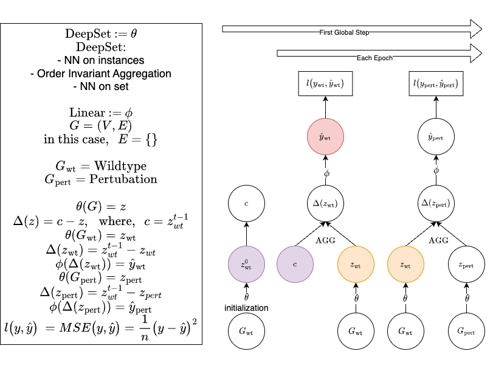

In first instantiation build for regression on double mutant fitness.

## Explicitly Optimising the training_step and train_wt

Explicitly controlling the optimizaiton allows for us to avoid this error. `Trying to backward through the graph a second time (or directly access saved tensors after they have already been freed)`

The keys to getting the optimization worked are marked by 🔑.

```python
def train_wt(self):
  if self.global_step == 0 and not self.is_wt_init:
      wt_batch = Batch.from_data_list([self.wt]).to(self.device)
      self.wt_global_hat, self.wt_set_hat, _ = self.model_ds(
          wt_batch.x, wt_batch.batch
      )
      self.is_wt_init = True
  if self.global_step == 0 or self.global_step % self.wt_step_freq == 0:
      # set up optimizer
      opt = self.optimizers()
      opt.zero_grad()
      # train on wt
      wt_batch = Batch.from_data_list([self.wt]).to(self.device)
      wt_global_hat = self(wt_batch.x, wt_batch.batch)
      loss = self.loss(wt_global_hat, wt_batch.fitness)
      self.manual_backward(loss)
      opt.step()
      # Get updated wt reference
      # Set the model to evaluation mode
      self.model_ds.eval() # 🔑

      # get updated wt reference
      with torch.no_grad(): # 🔑
          self.wt_global_hat, self.wt_set_hat, self.wt_nodes_hat = self.model_ds(
              wt_batch.x, wt_batch.batch
          )

      # Revert the model back to training mode
      self.model_ds.train() # 🔑

def training_step(self, batch, batch_idx):
    # Train on wt reference
    self.train_wt()
    # set up optimizer
    opt = self.optimizers()
    opt.zero_grad()
    # Extract the batch vector
    x, y_global, batch_vector = batch.x, batch.fitness, batch.batch
    # Pass the batch vector to the forward method
    y_global_hat = self(x, batch_vector)

    loss = self.loss(y_global, y_global_hat)
    # opt
    self.manual_backward(loss)
    opt.step()
    #
    # logging
    batch_size = batch_vector[-1].item() + 1
    self.log("train_loss", loss, batch_size=batch_size, sync_dist=True)
    self.train_metrics(y_global_hat, y_global)
    # Logging the correlation coefficients
    self.log(
        "train_pearson",
        self.pearson_corr(y_global_hat, y_global),
        batch_size=batch_size,
        sync_dist=True,
    )
    self.log(
        "train_spearman",
        self.spearman_corr(y_global_hat, y_global),
        batch_size=batch_size,
        sync_dist=True,
    )
    return loss
```

## Training Instability with Wildtype Embedding Difference



We see training instability when we don't estimate `wt_y_hat` accurately. The highlighted spike has a corresponding spike in `train_loss`.


We see much more dramatic instabilities with a larger network and more data (`1e5`) data points. It took about 10 hours to complete 50 epochs, thats 5 epochs per hour. If we scale up to `1e6` we can expect 2 hr/epoch, and finally to `1e7` (max data size) would be 20 hr/epoch, which we should be able to cut in half with A100x8 nodes to 5hr/epoch, and further speed things up by eliminating `ddp` error about some weights not being used by loss calculation.


