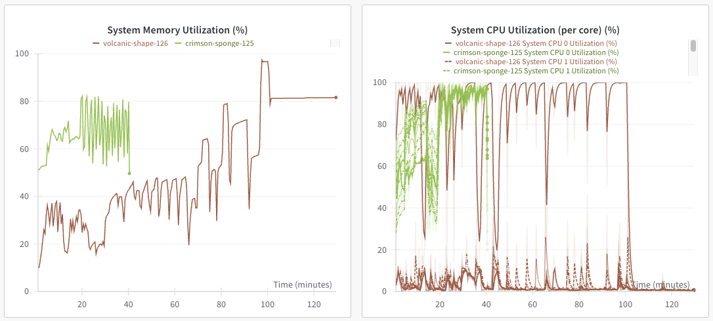
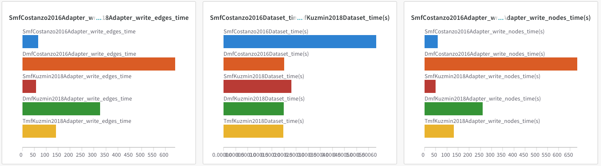
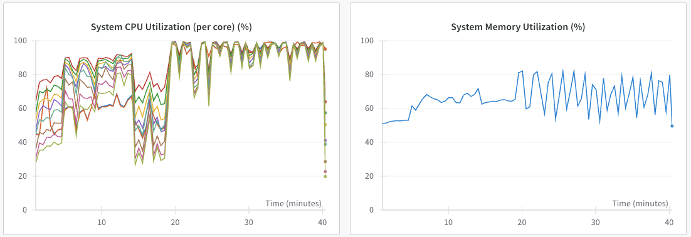
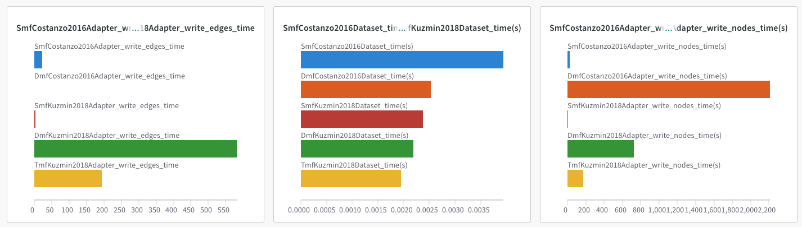
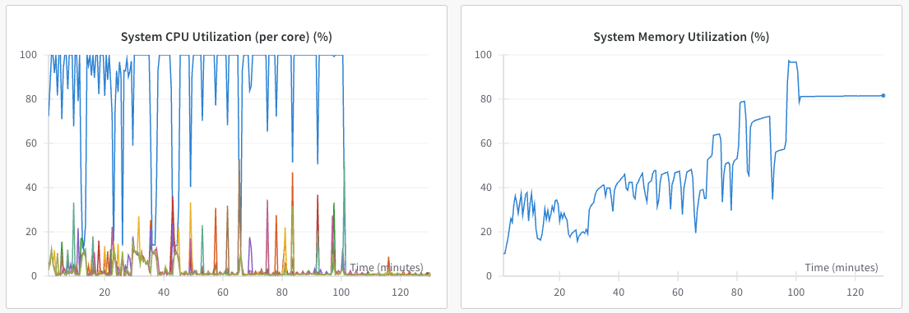

[wandb_log](https://wandb.ai/zhao-group/tcdb/workspace?nw=nwusermjvolk3)

## Obvious Difference Between Using Docker and Just M1

## M1 Charts

Finished

## Docker M1 Charts

Crashed

We don't finish the last part of the job, the `DmfCostanzo2016` write edges due to what looks like an #OOM from looking at the system memory utilization plots.

## Conclusions

My best explanation that there is overhead with docker or that there is some translation layer for ARM... We are using ARM build so there shouldn't be any emulation...
