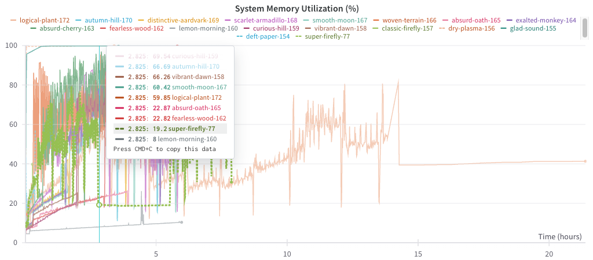

A 6 hour run on adapter for `DmfCostanzo2016`. If the run doesn't make it that fair it failed.

From this study I concluded that the best option would be to pursue using less cpu with still maxing out memory. When we compare the previous successful run to the other the new runs with 123 cpu have worse performance. There must be a decent amount of memory overhead from cpus. Also if we increase batch size num_workers becomes a multiplier on memory. We reduced memory in #wandb.tcdb.docker_v_m1_study_003

I highlight the green run, the previously finished run (i.e. `super-firefly-77`). At the dip, it has finished processing nodes. All these other runs don't get passed the first couple of nodes types. We have memory problems and speed problems. The speed is mainly hampered by `chunk_size` and `loader_batch_size`. They get capped due to high number of cpu.

`logical-plant-172` was an attempt at a full run with best parameters I could think of. It seemd to fail on `_genotype_experiment_edge`:

```bash
177 [2024-03-31 02:28:51,500][__main__][INFO] - Writing edges for adapter: DmfCostanzo2016Adapter
178 Running: self.get_reference_dataset_edges()
179 Running: self.get_data_by_type(self._experiment_dataset_edge)
180 Running: self.get_data_by_type(self._get_reference_experiment_edges)
181 Running: self.get_data_by_type(self._genotype_experiment_edge)
```



[[docker_v_m1_study_002  table| ./notes/assets/wandb-exports/wandb_export_2024-04-03T10_12_52.254-05_00.csv]]

| Name                     | State    | adapters.io_to_total_worker_ratio | adapters.chunk_size | adapters.loader_batch_size | io_workers | process_workers | num_workers | Runtime | adapters.io_process_worker_ratio | exp                               | Run Greater Than 5 hr 50 min (OOM) |
| ------------------------ | -------- | --------------------------------- | ------------------- | -------------------------- | ---------- | --------------- | ----------- | ------- | -------------------------------- | --------------------------------- | ---------------------------------- |
| logical-plant-172        | crashed  | 0.05                              | 2000                | 500                        | 7          | 116             | 123         | 77021   | NA                               | 17                                | NA (long run)                      |
| autumn-hill-170          | crashed  | 0.03                              | 2000                | 500                        | 4          | 119             | 123         | 21482   | NA                               | 16                                | TRUE                               |
| distinctive-aardvark-169 | crashed  | 0.05                              | 2000                | 1000                       | 7          | 116             | 123         | 17178   | NA                               | 15                                | FALSE                              |
| scarlet-armadillo-168    | crashed  | 0.05                              | 2000                | 500                        | 7          | 116             | 123         | 21481   | NA                               | 14                                | TRUE                               |
| smooth-moon-167          | crashed  | 0.05                              | 2000                | 100                        | 7          | 116             | 123         | 21422   | NA                               | 13                                | TRUE                               |
| woven-terrain-166        | crashed  | 0.8                               | 10000               | 1000                       | 99         | 24              | 123         | 14563   | NA                               | 12                                | FALSE                              |
| absurd-oath-165          | crashed  | 0.1                               | 800                 | 100                        | 13         | 110             | 123         | 21541   | NA                               | 11                                | TRUE                               |
| exalted-monkey-164       | crashed  | 0.1                               | 2000                | 100                        | 13         | 110             | 123         | 21544   | NA                               | 10                                | TRUE                               |
| absurd-cherry-163        | crashed  | 0.2                               | 5000                | 100                        | 25         | 98              | 123         | 21515   | NA                               | 9                                 | TRUE                               |
| fearless-wood-162        | crashed  | 0.4                               | 1000                | 100                        | 50         | 73              | 123         | 21009   | NA                               | 8                                 | TRUE                               |
| lemon-morning-160        | crashed  | 0.2                               | 100                 | 10                         | 25         | 98              | 123         | 21512   | NA                               | 7                                 | TRUE                               |
| curious-hill-159         | crashed  | 0.2                               | 1000                | 10                         | 25         | 98              | 123         | 21573   | NA                               | 6                                 | TRUE                               |
| vibrant-dawn-158         | crashed  | 0.2                               | 1000                | 100                        | 25         | 98              | 123         | 21573   | NA                               | 5                                 | TRUE                               |
| classic-firefly-157      | crashed  | 0.2                               | 10000               | 1000                       | 25         | 98              | 123         | 1913    | NA                               | 1                                 | FALSE                              |
| dry-plasma-156           | crashed  | 0.4                               | 10000               | 100                        | 50         | 73              | 123         | 12244   | NA                               | 4                                 | FALSE                              |
| glad-sound-155           | crashed  | 0.2                               | 10000               | 100                        | 25         | 98              | 123         | 12836   | NA                               | 3                                 | FALSE                              |
| deft-paper-154           | crashed  | 0.4                               | 10000               | 1000                       | 50         | 73              | 123         | 1400    | NA                               | 2                                 | FALSE                              |
| super-firefly-77         | finished | NA                                | 10000               | 1000                       | 13         |                 | 64          | 28365   | 0.2                              | Previous Successful Build, Before | NA (long run)                      |
