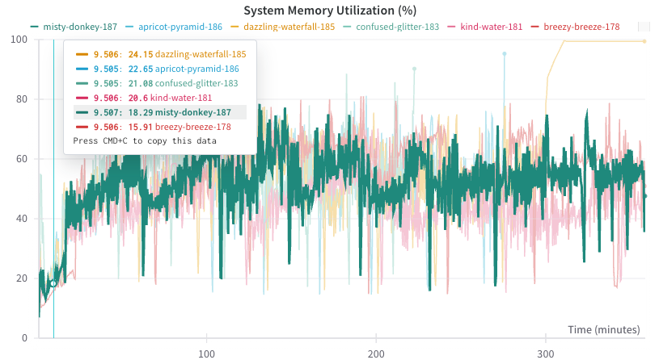
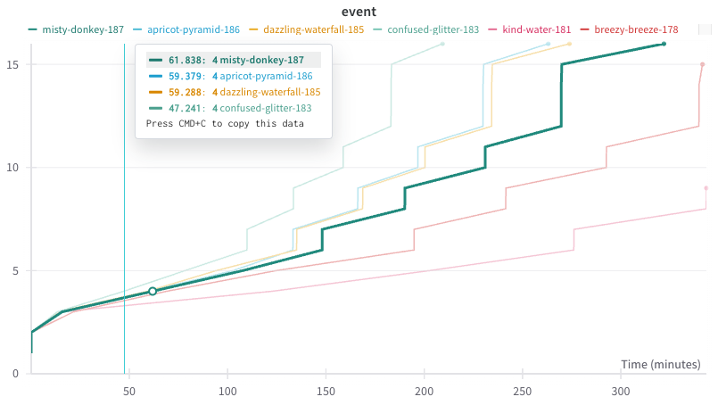

A 6 hour run on adapter for `DmfCostanzo2016`. If the run doesn't make it that fair it failed.

#wandb.tcdb.docker_v_m1_study_002 then this show that using less cpus is better. This is due to memory.

`misty-donkey-187` is the most promising run for large database builds.

| Name                   | State   | slurm_job_id | adapters.io_to_total_worker_ratio | adapters.chunk_size | adapters.loader_batch_size | io_workers | process_workers | num_workers | Runtime | event | Run Greater Than 5 hr 50 min (OOM) |
| ---------------------- | ------- | ------------ | --------------------------------- | ------------------- | -------------------------- | ---------- | --------------- | ----------- | ------- | ----- | ---------------------------------- |
| misty-donkey-187       | crashed | 3347223      | 0.62                              | 20000               | 1000                       | 40         | 24              | 64          | 21522   | 16    | FALSE                              |
| apricot-pyramid-186    | crashed | 3345537      | 0.62                              | 30000               | 1000                       | 40         | 24              | 64          | 16541   | 16    | FALSE                              |
| dazzling-waterfall-185 | crashed | 3345536      | 0.62                              | 30000               | 1000                       | 40         | 24              | 64          | 21499   | 16    | FALSE                              |
| hearty-blaze-184       | crashed | 3344605      | 0.63                              | 60000               | 1000                       | 41         | 23              | 64          | 21534   | 7     | FALSE                              |
| confused-glitter-183   | crashed | 3344575      | 0.63                              | 40000               | 1000                       | 41         | 23              | 64          | 16103   | 16    | FALSE                              |
| faithful-waterfall-182 | crashed | 3343090      | 0.75                              | 100000              | 1000                       | 48         | 16              | 64          | 9142    | 11    | FALSE                              |
| breezy-breeze-178      | crashed | 3336842      | 0.5                               | 10000               | 1000                       | 32         | 32              | 64          | 21512   | 15    | FALSE                              |
| fiery-frost-177        | crashed | 3336820      | 0.5                               | 4000                | 400                        | 32         | 32              | 64          | 21512   | 5     | FALSE                              |
| fine-morning-175       | crashed | 3336498      | 0.05                              | 5000                | 1000                       | 4          | 60              | 64          | 5341    | 2     | FALSE                              |

[[docker_v_m1_study_002 | ./notes/assets/wandb-exports/wandb_export_2024-04-03T19_08_16.068-05_00.csv]]

