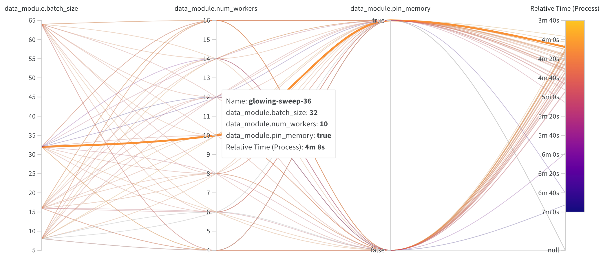
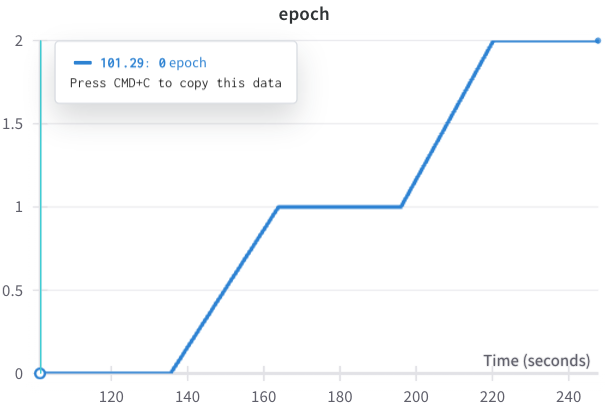
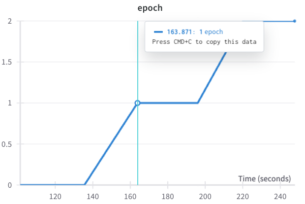
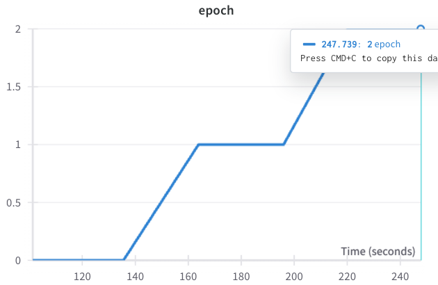

## 2024.04.02 - Choosing Loader Settings with Parallel Lines Plot

We ran this for a dataset size `1e3` but trends should hold unless we should've run for more epochs.

- `batch_size = 30`
- `num_workers = 10`
- `pin_memory = True`

Epoch spee

- `247.739 - 163.871 = 83.868`
- `163.871 - 101.29 = 62.581`
- `(83.868 + 62.581) / 2 = 73.2245 = 73 (s/epoch)`

Assume 10x for `1e4` dataset

- `(73 * 10) / 60 = 12.2 (min/epoch)`

Runs

- `100 (max epochs/run) = 20.3 hr`
- `50 (max epochs/run) = 10.2 hr`
- `30 (max epochs/run) = 6.1 hr`

Gpu time

- `1 x A40x4 = 4 gpu`
- `2 x A40x4 = 8 gpu`
- `4 x A40x4 = 16 gpu`
- `4 x A40x4 = 32 gpu`

Assuming run to completion

- `48 hr * 4 gpu / 6 hr = 32 runs`
- `48 hr * 4 gpu / 6 hr = 64 runs`
- `48 hr * 4 gpu / 6 hr = 96 runs`
- `48 hr * 4 gpu / 6 hr = 128 runs`

This is pretty abysmal without any hyperparameter selection.

Hyperparameter Space

[[experiments/smf-dmf-tmf-001/conf/deep_set-sweep_01.yaml]]

`10 * 2 * 4 * 5 * 3 * 5 * 2 * 2 * 5 * 5 * 2 * 3 = 3,600,000`
