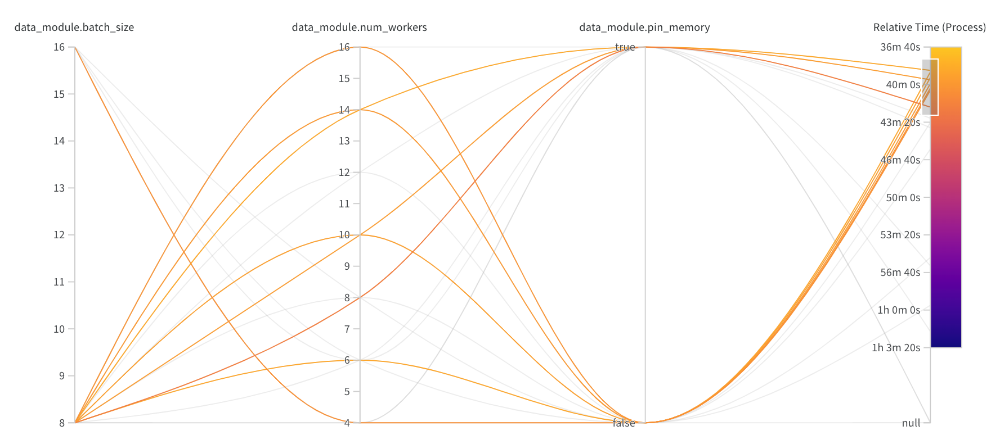
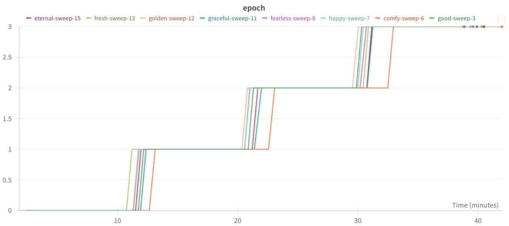

#wandb.torchcell_smf-dmf-tmf-001.loader_opt_001

From the loader it looks like low batch size is favored.

The average time per epoch is anywhere from 10-12 min. This is exactly what we predicted in #wandb.torchcell_smf-dmf-tmf-001.loader_opt_001

Running for 3 epochs was not necessary.

