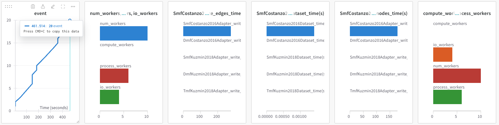
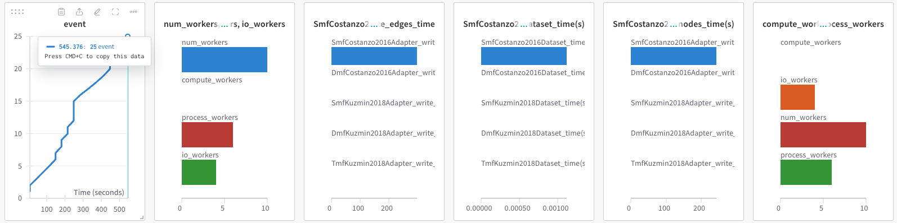

## 2024.07.18 - Config Refactor Time Test

`CellAdaptor` with `yaml` config refactor

`461 s` or `7.68 m`

`CellAdaptor` without `yaml` config refactor

`545 s` or `9 m`

The few min discrepancy is noise. They are equivalent so we will make the refactor.
