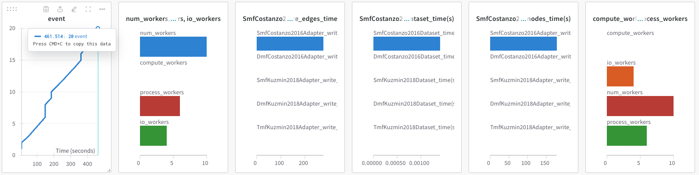
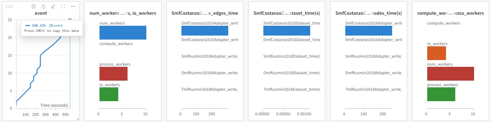

## 2024.07.18 - Config Refactor Time Test

`CellAdaptor` with `yaml` config refactor

`461 s` or `7.68 m`

`CellAdaptor` without `yaml` config refactor

`545 s` or `9 m`

The few min discrepancy is noise. They are equivalent so we will make the refactor.

## 2024.07.23

A key aspect of `CellAdapter` methods is that they should be defined in a minimal manner to forcing deduplication upon graph import. If we add metadata to say the `experiment`, or `experiment reference` nodes then duplicate measurement data will not be deduplicated on import.

Most often queries will not take place directly at the experiment level but levels above or below. Also experiments should be considered primary, where as references are primary purpose is for harmonization. In other words it is expected that almost if not all experiments will be unique, whereas we want a lot of references to be duplicated. This will allow for queries directed at references. e.g. "get all data with this same experimental reference." In the case of gene essentiality collected from primary sources we would rather them just get deduplicated on import... 😠 No good answer. I don't think we need the dataset name in the experiment object, as long as it is in graph it can be used for querying and that is really all we need it for.

## 2026.09.12 - Environment-Side Identity by Composition, Not by Quote

### The Failure

Media, temperature, environment-perturbation and environment nodes were content-addressed as `sha256(json.dumps(model.model_dump()))` of the WHOLE pydantic dump. That dump carries the STATING dataset's bookkeeping: `provenance` (each `SourcedValue` with its verbatim quote and sha256 anchor), `note`, `defers_to`, `provenance_gaps`, and the free-text `name`. Two datasets stating the same medium (YPD with 20 g/L agar, one quoting Mota 2024 and one quoting Tong and Boone) therefore differed in almost every byte that is not the medium, and got two media nodes. The aggregate the serve-50 campaign exists for (everything measured on YPD, on SC, on YPD plus 0.4 M NaCl) failed at node identity.

### The Fix

`torchcell/datamodels/identity.py` (new) projects each environment-side entity onto its COMPOSITION and hashes the canonical JSON of that projection:

- `compound_identity_key(Compound) -> str`: `inchikey`, else `chebi_id`, else `pubchem_cid`, else `name:<normalize_compound_name(name)>`. The field name is part of the key, so a name spelled like an InChIKey cannot collide with one. `smiles` / `inchi` are deliberately NOT in the precedence: a SMILES is toolkit-dependent, so two spellings of one molecule would not join anyway, and the InChIKey is the hash that does.
- `media_identity(Media)`: state, `is_synthetic`, `base_medium`, sorted components (compound key, role, definition, concentration value/unit/basis), sorted dropout keys. No `name`, no `provenance`, no component `note` / `defers_to`.
- `environment_perturbation_identity(p)`: `perturbation_type` plus the concrete leaf's typed slots. Small molecule: compound key + concentration + solvent (its compound key and percent). Physical: factor + magnitude + agent key. Biologic: agent class + normalized name + UniProt + sequence + concentration. No `description`. The DOSE is part of identity on both dosed leaves, since two doses of one compound are two different edits. An instance that is none of the three leaves raises `TypeError` rather than falling back to a dump hash.
- `temperature_identity(Temperature)`: value + typed unit. Units are NOT converted, so a Kelvin-stated temperature would not join a Celsius one; converting needs a rounding tolerance, which is a policy choice this layer should not make, and every loader states Celsius today.
- `environment_identity(Environment)`: media identity, temperature identity or `None`, sorted perturbation identities, aerobicity, `duration_hours`, `duration_generations`. No `provenance_gaps`, but what a gap MEANS survives: the gapped field is `None`, and `None` projects as `None`, so an environment that never carried a temperature is a different node from one at 30 C.
- `identity_sha256(Mapping)`: sha256 over `json.dumps(sort_keys=True, separators=(",", ":"))`.

Three properties hold. The projections are TOTAL (every field read exists on the current schema class; the `*_IDENTITY_FIELDS` tuples name them and a test checks them against `model_fields`). ABSENCE is part of identity (a `None` stays `None` rather than being dropped from the projection). ORDER is not identity (components, dropouts and perturbations are sorted by their own canonical encoding).

### Adapter Rewiring

`cell_adapter.py` gained one id function per class, and the node method AND every edge method call it, so an edge can no longer address a node the graph does not contain: `_media_node_id`, `_temperature_node_id`, `_environment_perturbation_node_id`, `_environment_node_id`. Rewired callers: `_media_node`, `_get_media_reference_nodes`, `_temperature_node_from`, `_environment_node`, `_get_environment_reference_nodes`, `_environment_perturbation_node_from`, `_media_to_environment_edge`, `_temperature_to_environment_edge`, `_environment_perturbation_to_environment_edges`, `_get_environment_perturbation_to_environment_reference_edges`, `_environment_to_experiment_edge`, `_get_environment_to_experiment_reference_edges`. Genotype, gene-perturbation, phenotype and experiment ids are untouched and still hash the full dump. The temperature-None guard is unchanged: a gapped temperature emits no node and no edge, and the environment node still carries `temperature: None`.

Node PROPERTIES did not change. A media node still carries `name`, `state` and `serialized_data` = the full dump of the first instance seen, so the dataset's own wording is still in the graph; it just no longer decides identity.

### Rebuild Consequence

This edits methods used by SERVED datasets, so the `kg_manifest` admission gate reports adapter drift on them. That is expected and there is no incremental path that could preserve the old ids: `neo4j-admin database import incremental` cannot update or delete existing nodes, so re-keying the environment side is a full-rebuild event. The planned full rebuild absorbs it.

### Two Findings Worth Acting On

1. `MEDIA_LIBRARY` has 51 media and 48 distinct composition identities. `SC`, `SC_PARTIAL_BIOTIN`, `SC_PARTIAL_CALCIUM_PANTOTHENATE` and `SC_PARTIAL_PYRIDOXINE_HYDROCHLORIDE` collapse to ONE media node, because the partial drop-out is recorded only in the medium's `name` and the component's `note`: the biotin row's `concentration` is `None` in both SC and SC_PARTIAL_BIOTIN, so no typed slot distinguishes them. Composition identity is reporting the truth here (the typed compositions ARE identical), and the fix belongs in the media library: either the reduced level as a sourced concentration, or the drop-out as `EnvironmentPhysicalPerturbation(factor=nutrient_dropout, agent=<compound>)`. Until then, the four Hillenmeyer partial drop-out conditions cannot be told apart in the graph.
2. `YPD` (the library root) and `YPD_AGAR` do NOT share an id, because the root no longer lists an agar row while the plate does. That is a composition difference, not a quote difference: every non-component slot of the two projections is equal, which is exactly what the fix was for.
