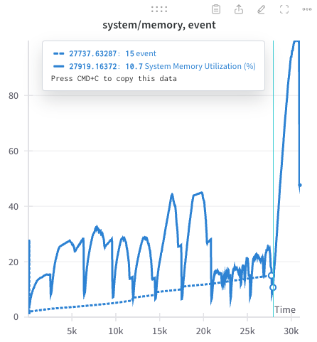

## 2024.09.18 - OOM on Publication Node

| event  | method                                       | data_type | memory_reduction_factor |
|--------|----------------------------------------------|-----------|-------------------------|
| 1      | experiment reference                         | node      | null                    |
| 2      | genome                                       | node      | null                    |
| 3      | experiment (chunked)                         | node      | 1                       |
| 4      | genotype (chunked)                           | node      | 1                       |
| 5      | perturbation (chunked)                       | node      | 1                       |
| 6      | environment (chunked)                        | node      | 1                       |
| 7      | environment reference                        | node      | null                    |
| 8      | media (chunked)                              | node      | 1                       |
| 9      | media reference                              | node      | null                    |
| 10     | temperature (chunked)                        | node      | 1                       |
| 11     | temperature reference                        | node      | null                    |
| 12     | fitness phenotype (chunked)                  | node      | 1                       |
| 13     | fitness phenotype reference                  | node      | null                    |
| 14     | dataset                                      | node      | null                    |
| **15** | **publication (chunked)**                    | **node**  | **1**                   |
| 16     | experiment reference to dataset              | edge      | null                    |
| 17     | experiment to dataset (chunked)              | edge      | 0.5                     |
| 18     | experiment reference to experiment (chunked) | edge      | 0.5                     |
| 19     | genotype to experiment (chunked)             | edge      | 0.5                     |
| 20     | perturbation to genotype (chunked)           | edge      | 0.5                     |
| 21     | environment to experiment (chunked)          | edge      | 0.5                     |
| 22     | environment to experiment reference          | edge      | null                    |
| 23     | phenotype to experiment (chunked)            | edge      | 0.5                     |
| 24     | media to environment (chunked)               | edge      | 0.5                     |
| 25     | temperature to environment (chunked)         | edge      | 0.5                     |
| 26     | genome to experiment reference               | edge      | null                    |
| 27     | phenotype to experiment reference            | edge      | null                    |
| 28     | publication to experiment (chunked)          | edge      | 0.5                     |



Because of this we added a memory reduction factor to publication

```yaml
- method_name: publication (chunked)
  memory_reduction_factor: 0.5
```

We also added this to [[dmi_costanzo2016_kg|dendron://torchcell/torchcell.knowledge_graphs.conf.dmi_costanzo2016_kg.yaml]] since they are approximately the same.
