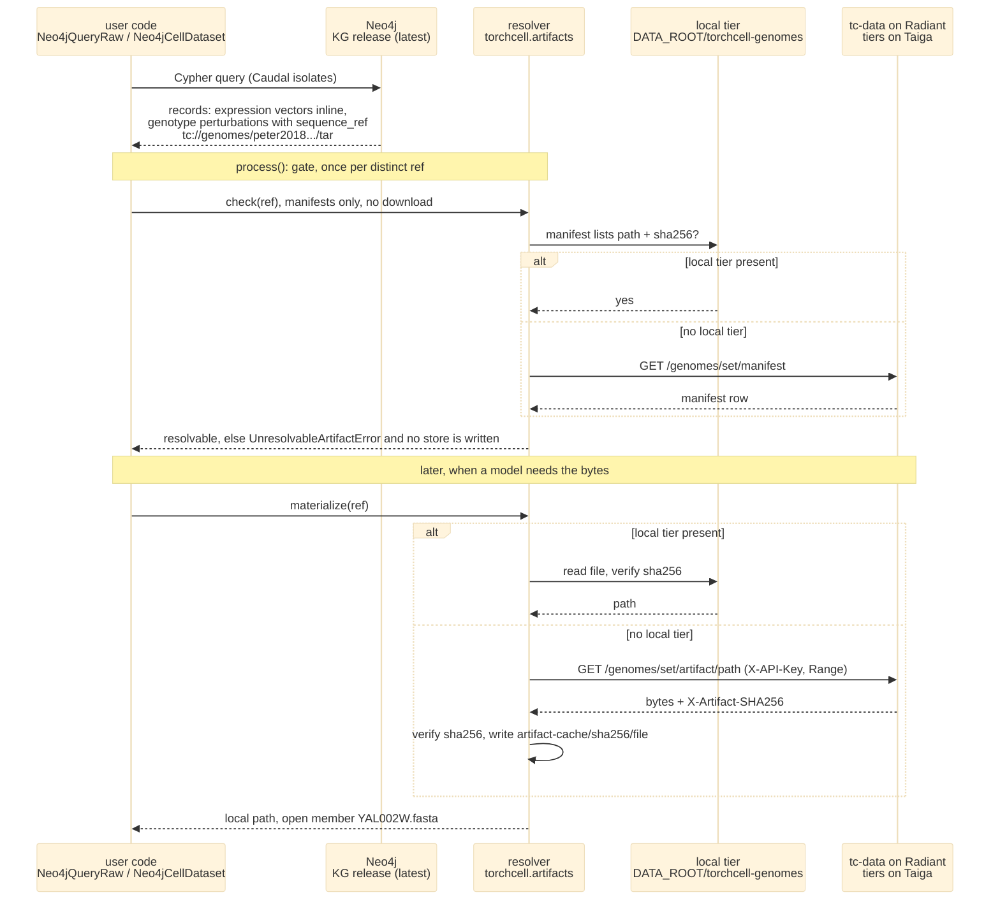

## 2026.10.07 - A query against Neo4j, and how the off-graph sequence bytes arrive

Rendered by `bash notes/assets/publish/scripts/mermaid_pdf.sh notes/torchcell.artifacts.mermaid.query-resolve.md` into `notes/assets/pdf-output/torchcell.artifacts.mermaid.query-resolve.{pdf,svg,png}`. The graph holds only the pointer (an `ArtifactRef`, sha256-pinned), so the query result is complete when Neo4j answers; the bytes arrive through one resolver in one order, local tier, then cache, then tc-data, verified at every step ([[plan.artifact-tier.2026.10.07]], [[torchcell.artifacts]]).

