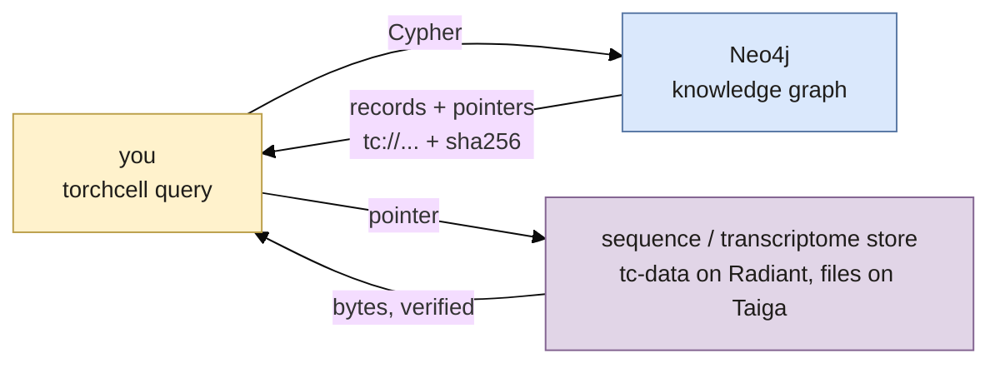

## 2026.10.07 - The user's view: one query, two stores behind it

Rendered by `bash notes/assets/publish/scripts/mermaid_pdf.sh notes/torchcell.artifacts.mermaid.user-wiring.md white` into `notes/assets/pdf-output/torchcell.artifacts.mermaid.user-wiring.{pdf,svg,png}`. The graph answers with records that carry pointers instead of the heavy data; touching a pointer makes the same library fetch the bytes from the store and verify the hash. The detailed sequence is [[torchcell.artifacts.mermaid.query-resolve]].

