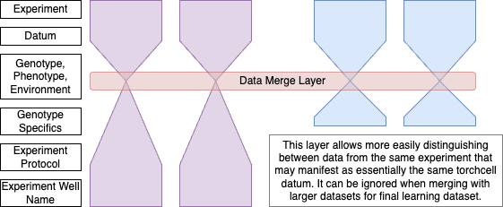
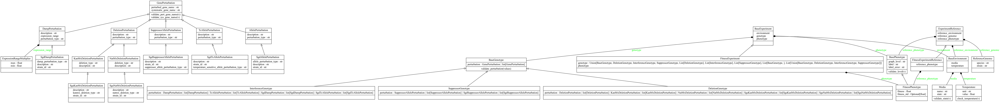
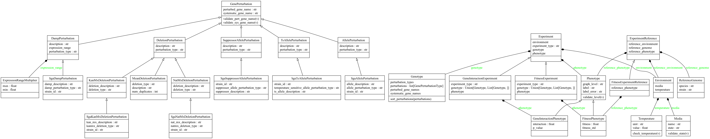

## Costanzo Smf and Dmf Whiteboard Recap

- We don't want specific info in genotype lke array position to allow for joining genotypes
  - But without it, it is difficult to make the data come together properly
- We need a way to validate the `dmf` single mutant data to make sure we are referencing the correct mutant from the correct array
- I had some ideas on pulling `strain_id` information via another method, but I avoid this and just added the data to more refined pydantic models.
  - We want these more refined pydantic models because they allow us to take advantage of the authors preprocessing of their own data. Authors like to use some conventions, and this is evident in the follow up `Kuzmin` work. It is best to add these specific details to the data so they can be used for processing, but they need to easily removed so the more general data can be more easily merged.



## Issues with the Current Data Scheme that Uses Different Named Phenotypes

If we look at the  we it looks like the different genotypes are not playing any role. since they don't carry any additional attributes. I think this layer can likely be removed simplifying our data model. Also should rename this file to something like schema.

## 2024.07.17 - How we Type

We can type the different classes and assure that data is properly serialized and deserialized by pydantic as long as we include attribute that can different classes. We simply do this with some `_type` attribute. Pydantics deserialization mechanism can then detect differences between classes.


## 2024.08.12 - Making Sublcasses More Generic For Downstream Querying

We run into an issue that only shows itself when we are trying to construct the cell dataset.

In `process_graph` from [[torchcell.data.neo4j_cell]] we have code that looks like this.

```python
def process_graph(cell_graph: HeteroData, data: dict[str, Any]) -> HeteroData:
    ...
    processed_graph["gene"].label_value = phenotype.fitness
    processed_graph["gene"].label_value_std = phenotype.fitness_std
```

If we print out the phenotype we see this.

```python
>>> phenotype
GeneInteractionPhenotype(graph_level='edge', label='dmi', label_statistic='p_value', interaction=-0.002846, p_value=0.4818)
```

In order to query the label in a generic way we need to make this more generic to something like this.

```python
>>> phenotype
GeneInteractionPhenotype(graph_level='edge', label_name='gene_interaction', label_statistic_name='p_value', gene_interaction=-0.002846, p_value=0.4818)
```

This would allow for a more generic structure of pulling out labels. For instance we would be able to run.

```python
>>> phenotype[phenotype['label_name']] == -0.002846
True
```

This also allows for consumption of more generic data instances. For example we would not need to create a second class if the gene interaction phenotype data uses a standard deviation for it's statistic instead of a p-value. Transforming between data types can still be done on the bases of the `label_name:str`.

We would then validate data for quality assurance that this pattern is observed throughout the [[torchcell.datamodels.schema]].

Here is an example.

```python
from pydantic import Field, model_validator, field_validator
from torchcell.datamodels.pydantic import ModelStrict
from typing import Any, Optional

class Phenotype(ModelStrict):
    graph_level: str = Field(
        description="most natural level of graph at which phenotype is observed"
    )
    label_name: str = Field(description="name of label")
    label_statistic_name: Optional[str] = Field(
        default=None,
        description="name of error or confidence statistic related to label"
    )
    label: Any = Field(description="value of the label")
    label_statistic: Any | None = Field(
        default=None,
        description="value of the error or confidence statistic related to label"
    )

    @model_validator(mode='after')
    def validate_fields(self):
        if self.graph_level not in {"edge", "node", "subgraph", "global", "metabolism"}:
            raise ValueError("graph_level must be one of: edge, node, subgraph, global, metabolism")

        # Check if label_name corresponds to a field in the class
        if not hasattr(self, self.label_name):
            raise ValueError(f"label_name '{self.label_name}' must correspond to a field in the class")

        # Check if label_statistic_name corresponds to a field in the class (if provided)
        if self.label_statistic_name and not hasattr(self, self.label_statistic_name):
            raise ValueError(f"label_statistic_name '{self.label_statistic_name}' must correspond to a field in the class")

        # Check if label value matches the field specified by label_name
        if getattr(self, self.label_name) != self.label:
            raise ValueError(f"label value must match the value of the field specified by label_name")

        # Check if label_statistic value matches the field specified by label_statistic_name (if provided)
        if self.label_statistic_name and getattr(self, self.label_statistic_name) != self.label_statistic:
            raise ValueError(f"label_statistic value must match the value of the field specified by label_statistic_name")

        return self

    def __getitem__(self, key):
        return getattr(self, key)


class FitnessPhenotype(Phenotype):
    label_name: str = "fitness"
    label_statistic_name: str = "std"
    fitness: float = Field(description="fitness = wt_growth_rate/ko_growth_rate")
    std: Optional[float] = Field(default=None)

    @field_validator('fitness')
    def validate_fitness(cls, v):
        if v <= 0:
            raise ValueError("Fitness must be greater than 0")
        return v

class GeneInteractionPhenotype(Phenotype):
    label_name: str = "gene_interaction"
    label_statistic_name: str = "p_value"
    gene_interaction: float = Field(
        description="epsilon, tau, or analogous interaction value. Computed from composite fitness phenotypes."
    )
    p_value: Optional[float] = Field(default=None)

    @field_validator('p_value')
    def validate_p_value(cls, v):
        if v is not None and (v < 0 or v > 1):
            raise ValueError("p-value must be between 0 and 1")
        return v
```

Straightening this out should also allow us to fix the deduplication problem[[torchcell.data.neo4j_cell]].

We already follow this pattern here [[torchcell.data.neo4j_cell]]

```python
dataset
Neo4jCellDataset(10)
dataset[0]
HeteroData(
  gene={
    node_ids=[6577],
    num_nodes=6577,
    ids_pert=[2],
    cell_graph_idx_pert=[2],
    x=[6577, 1536],
    x_pert=[2, 1536],
    graph_level='edge',
    label='dmi',
    label_statistic='p_value',
    label_value=0.016913,
    label_value_std=0.3409,
  },
  (gene, physical_interaction, gene)={
    edge_index=[2, 139038],
    num_edges=139038,
  },
  (gene, regulatory_interaction, gene)={
    edge_index=[2, 9494],
    num_edges=9494,
  }
)
```

## 2024.08.26 - Generic Subclasses Need to Consider Phenotype Label Index

We have to be careful about how we do this because we use `self.dataset.phenotype_label_index` for helping create balance spits [[torchcell.datamodules.cell]]. We compute the `phenotype_label_index` here [[torchcell.data.neo4j_cell]]. We can add the source as in the dataset name so we can create another automated way to split data. This is a good idea since datasets are split by unique phenotype to begin with. It is a bit arbitrary still. It is phenotype focused, but it would be better if it was more principled.

## 2024.09.08 - Why we Need Label_Name and Label

This is what thought we should change too and I did change `SmfKuzmin2018` and `SmfCostanzo2016` but there is an issue in that all phenotypes will start to look the same. They will have the same named attributes and could easily transformed into one another... If this was the case we should just move all data back one abstraction to phenotype. This isn't really what we want. This might also mess with decoding since the different phenotypes cannot be distinguished by named attribute. This easily happens if named attributes are the same and must be avoided.

```python
# Phenotype
class Phenotype(ModelStrict):
    graph_level: str = Field(
        description="most natural level of graph at which phenotype is observed"
    )
    label_name: str = Field(description="name of label")
    label_statistic_name: Optional[str] = Field(
        default=None,
        description="name of error or confidence statistic related to label",
    )
    label: Any = Field(description="value of the label")
    label_statistic: Optional[Any] = Field(
        default=None,
        description="value of the error or confidence statistic related to label",
    )

    @model_validator(mode="after")
    def validate_fields(self):
        valid_graph_levels = {
            "edge",
            "node",
            "subgraph",
            "global",
            "metabolism",
            "gene ontology",
        }
        if self.graph_level not in valid_graph_levels:
            raise ValueError(
                f"graph_level must be one of: {', '.join(valid_graph_levels)}"
            )
        return self

    def __getitem__(self, key):
        return getattr(self, key)


class FitnessPhenotype(Phenotype, ModelStrict):
    graph_level: str = "global"
    label_name: str = Field(
        default="fitness", description="wt_growth_rate/ko_growth_rate"
    )
    label_statistic_name: str | None = Field(
        default="std", description="fitness standard deviation"
    )

    @field_validator("label")
    def validate_fitness(cls, v):
        if v <= 0:
            raise ValueError("Fitness must be greater than 0")
        return v
```

I thought about just having `label_name:str` and then having the corresponding str as a key in the pydantic model. I previously thought that the issue with this was that we wouldn't be able to access the data, and we won't with dot notation but we can with dict notation.

I think instead what we do is have some named vocab that matches `label_name` to the key of the child class.

## 2024.09.25 - Dataset Name on Experiment Reference

#ramble it is a bit strange having `dataset_name` because then all references will be distinct in some way. Not sure if this is a concern or not because we could always check if references are same via properties.
