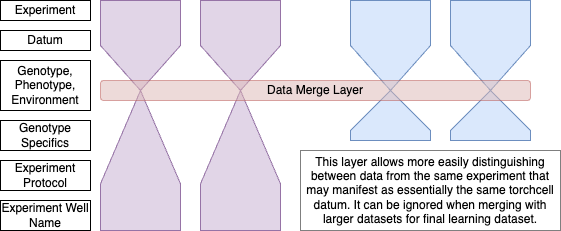
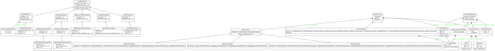
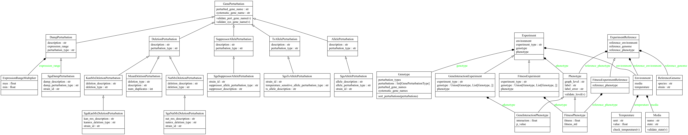

## Costanzo Smf and Dmf Whiteboard Recap

- We don't want specific info in genotype lke array position to allow for joining genotypes
  - But without it, it is difficult to make the data come together properly
- We need a way to validate the `dmf` single mutant data to make sure we are referencing the correct mutant from the correct array
- I had some ideas on pulling `strain_id` information via another method, but I avoid this and just added the data to more refined pydantic models.
  - We want these more refined pydantic models because they allow us to take advantage of the authors preprocessing of their own data. Authors like to use some conventions, and this is evident in the follow up `Kuzmin` work. It is best to add these specific details to the data so they can be used for processing, but they need to easily removed so the more general data can be more easily merged.



## Issues with the Current Data Scheme that Uses Different Named Phenotypes

If we look at the  we it looks like the different genotypes are not playing any role. since they don't carry any additional attributes. I think this layer can likely be removed simplifying our data model. Also should rename this file to something like schema.

## 2024.07.17 - How we Type

We can type the different classes and assure that data is properly serialized and deserialized by pydantic as long as we include attribute that can different classes. We simply do this with some `_type` attribute. Pydantics deserialization mechanism can then detect differences between classes.


## 2024.08.12 - Making Sublcasses More Generic For Downstream Querying

We run into an issue that only shows itself when we are trying to construct the cell dataset.

In `process_graph` from [[torchcell.data.neo4j_cell]] we have code that looks like this.

```python
def process_graph(cell_graph: HeteroData, data: dict[str, Any]) -> HeteroData:
    ...
    processed_graph["gene"].label_value = phenotype.fitness
    processed_graph["gene"].label_value_std = phenotype.fitness_std
```

If we print out the phenotype we see this.

```python
>>> phenotype
GeneInteractionPhenotype(graph_level='edge', label='dmi', label_statistic='p_value', interaction=-0.002846, p_value=0.4818)
```

In order to query the label in a generic way we need to make this more generic to something like this.

```python
>>> phenotype
GeneInteractionPhenotype(graph_level='edge', label_name='gene_interaction', label_statistic_name='p_value', gene_interaction=-0.002846, p_value=0.4818)
```

This would allow for a more generic structure of pulling out labels. For instance we would be able to run.

```python
>>> phenotype[phenotype['label_name']] == -0.002846
True
```

This also allows for consumption of more generic data instances. For example we would not need to create a second class if the gene interaction phenotype data uses a standard deviation for it's statistic instead of a p-value. Transforming between data types can still be done on the bases of the `label_name:str`.

We would then validate data for quality assurance that this pattern is observed throughout the [[torchcell.datamodels.schema]].

Here is an example.

```python
from pydantic import Field, model_validator, field_validator
from torchcell.datamodels.pydantic import ModelStrict
from typing import Any, Optional

class Phenotype(ModelStrict):
    graph_level: str = Field(
        description="most natural level of graph at which phenotype is observed"
    )
    label_name: str = Field(description="name of label")
    label_statistic_name: Optional[str] = Field(
        default=None,
        description="name of error or confidence statistic related to label"
    )
    label: Any = Field(description="value of the label")
    label_statistic: Any | None = Field(
        default=None,
        description="value of the error or confidence statistic related to label"
    )

    @model_validator(mode='after')
    def validate_fields(self):
        if self.graph_level not in {"edge", "node", "subgraph", "global", "metabolism"}:
            raise ValueError("graph_level must be one of: edge, node, subgraph, global, metabolism")

        # Check if label_name corresponds to a field in the class
        if not hasattr(self, self.label_name):
            raise ValueError(f"label_name '{self.label_name}' must correspond to a field in the class")

        # Check if label_statistic_name corresponds to a field in the class (if provided)
        if self.label_statistic_name and not hasattr(self, self.label_statistic_name):
            raise ValueError(f"label_statistic_name '{self.label_statistic_name}' must correspond to a field in the class")

        # Check if label value matches the field specified by label_name
        if getattr(self, self.label_name) != self.label:
            raise ValueError(f"label value must match the value of the field specified by label_name")

        # Check if label_statistic value matches the field specified by label_statistic_name (if provided)
        if self.label_statistic_name and getattr(self, self.label_statistic_name) != self.label_statistic:
            raise ValueError(f"label_statistic value must match the value of the field specified by label_statistic_name")

        return self

    def __getitem__(self, key):
        return getattr(self, key)


class FitnessPhenotype(Phenotype):
    label_name: str = "fitness"
    label_statistic_name: str = "std"
    fitness: float = Field(description="fitness = wt_growth_rate/ko_growth_rate")
    std: Optional[float] = Field(default=None)

    @field_validator('fitness')
    def validate_fitness(cls, v):
        if v <= 0:
            raise ValueError("Fitness must be greater than 0")
        return v

class GeneInteractionPhenotype(Phenotype):
    label_name: str = "gene_interaction"
    label_statistic_name: str = "p_value"
    gene_interaction: float = Field(
        description="epsilon, tau, or analogous interaction value. Computed from composite fitness phenotypes."
    )
    p_value: Optional[float] = Field(default=None)

    @field_validator('p_value')
    def validate_p_value(cls, v):
        if v is not None and (v < 0 or v > 1):
            raise ValueError("p-value must be between 0 and 1")
        return v
```

Straightening this out should also allow us to fix the deduplication problem[[torchcell.data.neo4j_cell]].

We already follow this pattern here [[torchcell.data.neo4j_cell]]

```python
dataset
Neo4jCellDataset(10)
dataset[0]
HeteroData(
  gene={
    node_ids=[6577],
    num_nodes=6577,
    ids_pert=[2],
    cell_graph_idx_pert=[2],
    x=[6577, 1536],
    x_pert=[2, 1536],
    graph_level='edge',
    label='dmi',
    label_statistic='p_value',
    label_value=0.016913,
    label_value_std=0.3409,
  },
  (gene, physical_interaction, gene)={
    edge_index=[2, 139038],
    num_edges=139038,
  },
  (gene, regulatory_interaction, gene)={
    edge_index=[2, 9494],
    num_edges=9494,
  }
)
```

## 2024.08.26 - Generic Subclasses Need to Consider Phenotype Label Index

We have to be careful about how we do this because we use `self.dataset.phenotype_label_index` for helping create balance spits [[torchcell.datamodules.cell]]. We compute the `phenotype_label_index` here [[torchcell.data.neo4j_cell]]. We can add the source as in the dataset name so we can create another automated way to split data. This is a good idea since datasets are split by unique phenotype to begin with. It is a bit arbitrary still. It is phenotype focused, but it would be better if it was more principled.

## 2024.09.08 - Why we Need Label_Name and Label

This is what thought we should change too and I did change `SmfKuzmin2018` and `SmfCostanzo2016` but there is an issue in that all phenotypes will start to look the same. They will have the same named attributes and could easily transformed into one another... If this was the case we should just move all data back one abstraction to phenotype. This isn't really what we want. This might also mess with decoding since the different phenotypes cannot be distinguished by named attribute. This easily happens if named attributes are the same and must be avoided.

```python
# Phenotype
class Phenotype(ModelStrict):
    graph_level: str = Field(
        description="most natural level of graph at which phenotype is observed"
    )
    label_name: str = Field(description="name of label")
    label_statistic_name: Optional[str] = Field(
        default=None,
        description="name of error or confidence statistic related to label",
    )
    label: Any = Field(description="value of the label")
    label_statistic: Optional[Any] = Field(
        default=None,
        description="value of the error or confidence statistic related to label",
    )

    @model_validator(mode="after")
    def validate_fields(self):
        valid_graph_levels = {
            "edge",
            "node",
            "subgraph",
            "global",
            "metabolism",
            "gene ontology",
        }
        if self.graph_level not in valid_graph_levels:
            raise ValueError(
                f"graph_level must be one of: {', '.join(valid_graph_levels)}"
            )
        return self

    def __getitem__(self, key):
        return getattr(self, key)


class FitnessPhenotype(Phenotype, ModelStrict):
    graph_level: str = "global"
    label_name: str = Field(
        default="fitness", description="wt_growth_rate/ko_growth_rate"
    )
    label_statistic_name: str | None = Field(
        default="std", description="fitness standard deviation"
    )

    @field_validator("label")
    def validate_fitness(cls, v):
        if v <= 0:
            raise ValueError("Fitness must be greater than 0")
        return v
```

I thought about just having `label_name:str` and then having the corresponding str as a key in the pydantic model. I previously thought that the issue with this was that we wouldn't be able to access the data, and we won't with dot notation but we can with dict notation.

I think instead what we do is have some named vocab that matches `label_name` to the key of the child class.

## 2024.09.25 - Dataset Name on Experiment Reference

#ramble it is a bit strange having `dataset_name` because then all references will be distinct in some way. Not sure if this is a concern or not because we could always check if references are same via properties.

## 2026.01.07 - Current Constraints on Schematization

The schema design is tightly coupled to downstream infrastructure with critical constraints:

**BioCypher + Neo4j**: Only fields explicitly listed in `biocypher/config/torchcell_schema_config.yaml` are exposed as queryable properties in Neo4j. Fields not in the YAML get buried in `serialized_data` blob, making them inaccessible for deduplication, aggregation, or graph queries. Pydantic `@property` methods (computed fields) don't appear in `model_fields`, so can't be automatically added to BioCypher YAML - they're Python-only, not Neo4j-accessible.

**GraphProcessor**: The `label_name` and `label_statistic_name` fields are extracted from Pydantic `model_fields` and used to batch phenotype data into training tensors. While `getattr()` works for properties, the field name must come from `model_fields.default`, meaning `label_statistic_name` must point to a real field (not just a property) that gets batched into tensors.

**Design tradeoff for MicroarrayExpressionPhenotype**: Store both `expression_log2_ratio_variance` (for meta-analysis) and `expression_log2_ratio_se` (as PRIMARY STATISTIC) as fields exposed to Neo4j. SE is chosen over SD because it measures precision of the mean estimate (relevant for ML training and deduplication), while SD (technical variability) can be computed on-demand via property when needed for QC. This balances Neo4j queryability, GraphProcessor batching, and storage efficiency.

Related: [[torchcell.adapters.cell_adapter]] [[torchcell.data.graph_processor]] [[torchcell.data.deduplicate]]

## 2026.01.29 - Philosophy around n_replicates

### Data-Driven Computation Over Reported Values

**Principle**: Always compute `n_replicates` from raw data rather than using paper-reported constants.

Even when experimental design is clearly documented in papers or supplementary information (e.g., "2 biological replicates × 2 dye-swap technical replicates = 4 measurements"), we default to counting actual replicates from the data files. This approach is more reliable because:

1. **QC filtering**: Papers report ideal experimental design, but quality control may remove failed samples (actual n_replicates < expected)
2. **Text extraction complexity**: Parsing methods sections and supplementary files to extract replicate counts is error-prone
3. **Protocol chasing**: We've encountered many back-and-forth iterations trying to understand true protocols from ambiguous text
4. **Data is ground truth**: If individual raw data files exist, direct counting is authoritative

**Implementation pattern** (see `kemmeren2014.py`, `sameith2015.py`):

```python
# Global constants document EXPECTED design from paper (for validation)
N_EXPECTED_BIOLOGICAL_REPLICATES = 2
N_EXPECTED_DYE_SWAP_TECHNICAL_REPLICATES = 2
N_EXPECTED_MAX_REPLICATES_DELETION = 4  # Documentation only

# Actual values COMPUTED from data
for gene, values in all_values_per_gene.items():
    n_replicates[gene] = len(values)  # Count actual measurements
```

Constants serve as **documentation and validation targets**, not data sources. We can compare computed values against expected ranges to detect data issues, but never substitute constants for actual counts.

### Avoiding Replicate Type Fragmentation

**Decision**: Use generic `n_replicates` instead of typed replicates (`biological_replicates`, `technical_replicates`, `pseudo_replicates`).

In reality, replicates have distinct types with different statistical properties:

- **Biological replicates**: Independent cultures/samples (captures biological variation)
- **Technical replicates**: Same sample measured multiple times (captures measurement noise)
- **Dye-swap replicates**: Technical replicates correcting for dye bias (microarray-specific)
- **Pseudo-replicates**: Subsamples from same culture (not true independent replicates)

However, we intentionally avoid this distinction for now:

1. **Simplicity**: Generic `n_replicates` is easier to work with across datasets
2. **NLP dependency**: Extracting replicate types from text requires robust natural language processing
3. **Data fragmentation**: Don't want to split data along these axes prematurely
4. **Primary label focus**: We only track replicates used to compute the mean value being reported as the primary label

**What we report**: The count of measurements that went into computing the mean expression value, regardless of whether those measurements are biological replicates, technical replicates, or dye swaps.

**Future work**: Could add typed replicate counts as optional metadata fields once we have reliable NLP extraction, but the primary `n_replicates` field should remain a simple count.

Related: [[torchcell.datasets.scerevisiae.kemmeren2014]] [[torchcell.datasets.scerevisiae.sameith2015]]

## 2026.07.20 - UI-1 env-schema foundation (assay_type / BiologicPerturbation / Compound gap)

Additive, non-breaking schema extension (UI-1 of a 3-unit env/chemogenomic audit
follow-up; plan [[plan.env-schema-assay-compound-biologic.2026.07.20]]):

- **`AssayType` enum + nullable `assay_type` on `EnvironmentResponsePhenotype`** -- records
  HOW a response was measured (experimental design), orthogonal to `MeasurementType` (WHAT
  the number is). Formalizes the method axis previously smuggled into free-text `units`.
- **`BiologicAgentClass` + `BiologicPerturbation`** added as a third `EnvironmentPerturbationType`
  union leaf (`Literal["biologic"]`) -- peptide/protein/antibody/toxin agents whose identity is
  sequence/UniProt, not an InChIKey. Required the coordinated `_ENV_FACTORY` entry in
  `test_ontology_all_trees.py`.
- **`Compound` now inherits `ProvenanceGapMixin`** (relocated above `Compound`) -- AFFORDANCE
  ONLY, no structure-or-gap validator this unit. A `Compound` with no structure and no gap
  still constructs.

Follow-ups: UI-2 = compound-identity resolver + gap ENFORCEMENT on `Compound` + reconcile
`Compound` gaps vs `Media.open_gaps`. UI-3 = `assay_type` population across loaders + the L1
uniqueness-key decision + the full DB rebuild the schema-impact gate flags as breaking.

## 2026.10.07 - ArtifactRef replaces the off-graph pointer string pairs

Phase 3 of the artifact tier ([[plan.artifact-tier.2026.10.07]], decision D4). `ArtifactRef` (tier, key, path, member, sha256, bytes, media_type; string form `tc://<tier>/<key>/<path>[#<member>]`) is now DEFINED in `schema.py`, so its contract is fingerprinted with the record classes that carry it; `torchcell.artifacts.ref` re-exports it. It could not live in `torchcell/artifacts/ref.py` and be imported here: `ref.py` imports `torchcell.datamodels.pydant`, which runs `torchcell/datamodels/__init__.py`, which imports `schema`, a cycle, and `ref.py` sat outside the fingerprinted surface (`schema.py` + `pydant.py`).

Field changes:

- `SequenceVariantPerturbation`, `NaturalGenePresencePerturbation`, `NaturalGeneAbsencePerturbation` and `CopyNumberVariantPerturbation`: `sequence_uri` + `sequence_sha256` removed, `sequence_ref: ArtifactRef | None = None` added, `sequence_source` kept. `CopyNumberVariantPerturbation` was not named in D4; it carried the same pair, and no loader fills it, so it moved with the others to keep one pointer form.
- `CrisprConstruct`: `effector_plasmid_uri` + `effector_plasmid_sha256` and the `validate_plasmid_pointer` validator removed, `effector_plasmid_ref: ArtifactRef | None = None` added (a ref cannot exist without its sha256). The `crispr construct` graph node projects it flat as `effector_plasmid_ref` (the tc:// string) and `effector_plasmid_sha256` (from the ref); `biocypher/config/torchcell_schema_config.yaml` renames the property. The perturbation node never projected `sequence_uri`, so `sequence_ref` stays inside the experiment's `serialized_data`.
- `SegregantParent` (Bloom): `assembly_member: str` + `assembly_sha256: str` removed, `assembly_ref: ArtifactRef` (required) added. A Peter parent points at `1011Assemblies.tar.gz` with its member path; BY points at the SGD R64-4-1 `S288C_reference_sequence_R64-4-1_20230830.fsa` instead of the former free-text sentinel.
- `paper/ontology_graph.py` places `ArtifactRef` in the provenance lane.

Rebuild consequence: a BREAKING schema change, so a full KG rebuild at the next build (`TORCHCELL_SCHEMA_ACK=1` at commit). `scripts/schema_impact_check.py --base HEAD` (run 2026.10.07 in the worktree) reports 5 breaking datasets: `Bloom2019Dataset` (via ArtifactRef, SegregantParent), `CaudalPanTranscriptome2024Dataset` (via ArtifactRef and the three natural-variation leaves), `CrisprMagicLian2019Dataset`, `CrispriMormino2022Dataset` and `CrispriChemgenSmith2016Dataset` (via ArtifactRef, CrisprConstruct). The three CRISPR datasets change only in the serialized key name (`effector_plasmid_uri: null` becomes `effector_plasmid_ref: null`) and the node property rename.

Loader slice (no rebuild): `experiments/036-dataset-fixes-before-kg-build/scripts/artifact_ref_loader_slice.py` writes `experiments/036-dataset-fixes-before-kg-build/results/artifact_ref_loader_slice.json`; the refs built for Caudal isolates AAA (4,557 variants) and AAB (4,913) and for the Bloom A and 375 parents all parse back from their tc:// string and resolve against the local genomes tier.

## 2026.10.09 - Two additive phenotype blocks: a two-sided interval (#776) and the gene-interaction replicate quartet (#793)

Both land with the KG 4.0 full rebuild, never an incremental admission: each moves the
schema closure of a SERVED class, and incremental import cannot update existing nodes.
`scripts/schema_impact_check.py --base origin/main` reports **34 impacted datasets, 0
breaking**, every change an added optional field. Each block is delimited in
`schema.py` so parallel branches rebase cleanly.

### `EnvironmentResponsePhenotype` (#776)

| field | why |
|---|---|
| `environment_response_lower` | the SOURCE's lower confidence limit, verbatim |
| `environment_response_upper` | the SOURCE's upper confidence limit, verbatim |
| `confidence_level` | the level the two limits are stated at, required whenever either is set |
| `replicate_id` | the source's own label for ONE replicate measurement of a (strain, condition) |

The interval is the `FluxPhenotype` shape, and for the reason `FluxPhenotype`'s docstring
already states: "a two-sided confidence bound is not a single number, and naming one of
the two bounds as 'the' statistic would misreport it." The driving case is Caglar 2017
Table S5, whose 95% interval is asymmetric in 55 of 55 rows, so `UncertaintyType.ci95`
(defined as a single half-width) cannot carry it without falsifying it.

**The limits are deliberately NOT validated to bracket the value.** A limit carried
through a nonlinear transform can land on the wrong side of the estimate: Table S5's
`Glycerol.tab` replicate 1 releases `95p = -1027.769034` against a doubling time of
80.95212424, which is the image of a slope interval straddling zero under
`DT = log_e 2 / slope`. Repairing it or dropping it would substitute our arithmetic for
released bytes, so the schema stores it and the environment-response verifier's new L2
`interval_orientation` rule counts such rows against a count the loader DECLARES.
`confidence_level` is required with either limit, and both must be finite.

`replicate_id` exists because a release can be one row per replicate CURVE, each with its
own interval and fit quality. Without it, 55 per-replicate rows collapse to 16 unique
(study, strain, condition) triples and L1 `pair_uniqueness` would demand an aggregate the
paper never released. It is a string, so `01` and `1` stay apart, and it joins the
verifier's `_study_key`.

`ABSOLUTE_MEASUREMENT_TYPES` (module level) names `growth_rate` and `colony_size`: the
measurement types whose number is a quantity on the assay's own scale rather than a
response relative to a control. A relative readout (`log2_ratio`, `z_score`,
`sensitivity_score`, `differential_fitness`, `control_regression_residual`,
`relative_growth_rate`) is 0 at its control by construction and is deliberately absent,
because the verifier's `reference_centered=False` branch REQUIRES membership here. That
is what keeps the reference relief from being a blanket relaxation.

### `GeneInteractionPhenotype` (#793)

| field | why |
|---|---|
| `n_samples` | the replicate count the score averages over |
| `sample_unit` | what one sample physically is (`colony`, `screen`, ...) |
| `gene_interaction_uncertainty` | the source-reported dispersion, verbatim |
| `gene_interaction_uncertainty_type` | what that number IS, so it converts to an SE |

The quartet `FitnessPhenotype`, `EnvironmentResponsePhenotype`, `MetabolitePhenotype` and
`ProteinAbundancePhenotype` already carry. The class had none of it, so a replicate design
that IS sourced exactly had nowhere to go: Babu 2014 Protocol S2 states eight colonies
per gene pair (two replicate screens x four biological replicate recipient colonies) and
Butland 2008 prints the colony measurements per cell. Both now store it on the record.

**No derived SE field is added.** `label_statistic_name` stays
`gene_interaction_p_value`: an interaction score's released statistic is a TEST of the
score, not a dispersion of it, and inventing a second statistic name on a served class is
a separate decision. The uncertainty pair therefore stands alone, with the same
both-or-neither invariant and the same "a dispersion that divides by n states its n" rule
the other phenotypes enforce. `SharedRecordRules._add_uncertainty` reads
`{label_name}_uncertainty`, so the naming makes the shared L2 rule work unchanged.

Consequence for a query: a gapped `gene_interaction_p_value` means "the source tested the
SET, not the pair"; a gapped `n_samples` means "the source states no replicate design".
Those read the same from a query only while the fields are absent from the class, which is
the difference this closes.

Both graph classes project the new fields (`biocypher/config/torchcell_schema_config.yaml`)
and both `cell_adapter.py` emit sites per class (the experiment node and the reference
node) carry them, so the declared/emitted bijection
(`torchcell.datamodels.ontology_checks.adapter_property_mismatches`) holds.

The supported query `solid_growth_025` drifts on `GeneInteractionPhenotype`'s contract
against KG release `2026.10.06-4b293d34` (13 yeast interaction datasets). That is the
expected full-rebuild signal and is re-validated after the KG 4.0 build.

Related: [[torchcell.datasets.ecoli.caglar2017_doubling_time]],
[[torchcell.verification.environment_response]], [[torchcell.datasets.ecoli.babu2014]],
[[torchcell.datasets.ecoli.butland2008]].
