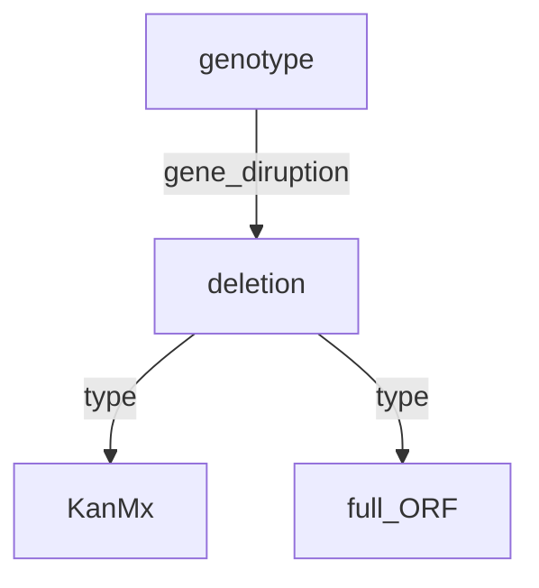

## Genotype-Phenotype-Environment Ontology For Data Merge

```python
class GeoDataset(...)
  ...
  def __and__(self, other: "GeoDataset") -> "IntersectionDataset":
    return IntersectionDataset(self, other)

class IntersectionDataset(GeoDataset):
  ...
  def _merge_dataset_indices():
    pass
  def __getitem__():
    pass
```

Now imagine that two genes are deleted but they were deleted with different methods. This would give you a graph like so.



Now there are a few things that I think we can do relatively easily. The most precise and I believe to be in the long run the best method would be to join by a specified ontology. Since it is a DAG you would only need to specify leaf nodes. So in this instance the `deletion` node. Once this is done all `KanMx` and `full_ORF` types would need to be joined. To maintain enough abstraction, there should be a few common methods for instance `right_join`, `left_join`, `low_join`, `high_join` (taking a particular label). We also need to consider data unification. Having an overlapping ontology in this instance is a good thing, but imagine that there is a linear shift in the duplicate data, then it could be safe to assume that there would be a linear shift in all of the duplicate data. It would then be appropriate to shift all data in direction of the largest dataset.

To summarize I am seeing x major components of joins. `genotype-phenotype-env` ontology, Join types, and standardization. We don't want it to balloon to large to makes the abstraction pointless. Along with each dataset, there should be a convenience function to show the ontology, and also overlapping and conficling parts of two ontologies. This would aid in ontology selection for the actual join. A joined dataset should have methods to recall dropped data, and data that has been transformed.

There is another issue of whether or not when joining data say of two different strains to try and unify the strain, based on the users judgement. Or to just select a base strain. I think the datasets themselves don't need to store a reference genome, but instead can just have an attr that says what reference they come from.

## CellDataset with DMFCostanzo2016LargeDataset is Slow

Progress bar steps

1. File check on cell raw
2. File check on costanzo2016 raw
3. File check on costanzo2016 processed
4. ⏳ Process loop for merging in `CellDataset` (**Time Sink**)
5. ⏳ Save `data_{#}.pt` in processed dir (**Time Sink**)

It might be possible to speed up (4.) but (5.) is already using multithreading on saving.

```bash
(torchcell) michaelvolk@M1-MV torchcell % python src/torchcell/datasets/cell.py                                                                                                       22:12
Checking files: 100%|██████████████| 1/1 [00:00<00:00, 11748.75it/s]
Processing...
Done!
Checking files: 100%|██████████████| 4/4 [00:00<00:00, 5813.31it/s]
Checking files: 100%|██████████████| 13295364/13295364 [07:42<00:00, 28750.03it/s]
Processing...
100%|█████████████| 13295364/13295364 [3:36:51<00:00, 1021.82it/s]
13294910it [2:32:18, 1454.81it/s]
Done!
```

## Merging Dataset Issues

- I think the cleanest way to avoid merging all together is first to just select the largest non-overlapping datasets. This way each data instances in the dataset can be a single graph and a single label. We could add the other labels associated with duplicate graphs to the same instance but then we have to loop over all graphs to find such instances. This seems like a problem that will inevitably show, but we can start like this and consider functions like `reduce` to join up duplicate graphs.
- In the case of `dmf` data we also have `smf` available on all of the instances for each of contributing genes, but this would add two more graphs to each of the data instances, or I guess it could return three graphs. This starts to get confusing. I think that each data instance should only return one graph with possibly multiple labels.

## Supported Datasets

| $\textbf{Dataset Name}$      | $\textbf{Genotypes}$ | $\textbf{Environment}$ | $\textbf{Phenotype (label)}$    | $\textbf{Label Type}$ | $\textbf{Description}$              | $\textbf{Supported}$ |
| :--------------------------- | :------------------- | :--------------------- | :------------------------------ | :-------------------- | :---------------------------------- | :------------------: |
| $\text{baryshnikovna\_2010}$ | $6,022$              | $1$                    | $\text{smf}$                    | $\text{global}$       | $\text{growth rate}$                |     $\checkmark$     |
| $\text{costanzo\_2016\_smf}$ | $21,718$             | $2$                    | $\text{smf}$                    | $\text{global}$       | $\text{growth rate}$                |     $\checkmark$     |
| $\text{costanzo\_2016\_dmf}$ | $20,705,612$         | $1$                    | $\text{smf}$                    | $\text{global}$       | $\text{growth rate}$                |     $\checkmark$     |
| $\text{kuzmin\_2018}$        | $91,111$             | $1$                    | $\text{tmf}$                    | $\text{global}$       | $\text{growth rate}$                |     $\checkmark$     |
| $\text{sdg\_essential}$      | $1,101$              | $1$                    | $\text{viable}$                 | $\text{global}$       | $\text{viability}$                  |     $\checkmark$     |
| $\text{SynthLethalDb}$       | $1,400$              | $1$                    | $\text{viable}$                 | $\text{global}$       | $\text{viability}$                  |     $\checkmark$     |
| $\text{scmd2\_2005}$         | $4,718$              | $1$                    | $\text{ellipse } (e_1, e_2)$    | $\text{global}$       | $\text{cell morphology}$            |     $\checkmark$     |
| $\text{scmd2\_2018}$         | $1,112$              | $1$                    | $\text{ellipse } (e_1, e_2)$    | $\text{global}$       | $\text{cell morphology}$            |     $\checkmark$     |
| $\text{scmd2\_2022}$         | $1,982$              | $1$                    | $\text{ellipse } (e_1, e_2)$    | $\text{global}$       | $\text{cell morphology}$            |     $\checkmark$     |
| $\text{ODuibhir\_2014}$      | $1,312$              | $1$                    | $\text{smf}$                    | $\text{global, node}$ | $\text{growth rate}$                |     $\checkmark$     |
| $\text{Kemmeren\_2014}$      | $1,484$              | $1$                    | $\text{expr}$                   | $\text{global, node}$ | $\text{sm microarray expression}$   |     $\checkmark$     |
| $\text{Sameith\_2015}$       | $72$                 | $1$                    | $\text{expr}$                   | $\text{global, node}$ | $\text{dm microarray expression}$   |     $\checkmark$     |
| $\text{Zelezniak\_2018}$     | $97$                 | $1$                    | $\text{prot abund., met conc.}$ | $\text{global, node}$ | $\text{sm kinase deletion mutants}$ |     $\checkmark$     |
| $\text{Wildenhain\_2015}$    | $195$                | $4,915$                | $\text{smf}$                    | $\text{global}$       | $\text{smf drug tolerance}$         |     $\checkmark$     |
| $\text{Lian\_2017}$          | $18,000$             | $1$                    | $\text{AID}$                    | $\text{global}$       | $\text{AID furfural tolderance}$    |     $\checkmark$     |
| $\text{FitDb}$               | $~6,000$             | $1,144$                | $\text{smf}$                    | $\text{global}$       | $\text{growth rate}$                |     $\checkmark$     |

- Others
  - @heckmannKineticProfilingMetabolic2020 - ecoli kcat km
  - [protein localization](https://www.kaggle.com/datasets/samanemami/yeastcsv), [another protein localization](https://archive.ics.uci.edu/dataset/110/yeast)
  - [SCMD2: Saccharomyces Cerevisiae Morphological Database 2](http://www.yeast.ib.k.u-tokyo.ac.jp/SCMD/)

## Genome Sqlite DB Removal For Dataset Pickling

Added `class GeneSet(SortedSet)`  which is a `SortedSet[str]`. I think this is the best option to enforce regularity with gene sets. Added `ParsedGenome(ModelStrictArbitrary)` to enforce regularity in the parsing. Added static method to the class `parse_genome(genome) -> ParsedGenome:`

## Filtering Takes Long Time on Delta

Filtering cell takes a long time on `Delta` filter is `123.78it/s` on `M1` filter is `2000it/s`. Try to speed up.

```python
combined_data = [
    item
    for item in tqdm(self.experiments)
    if any(i["id"] in gene_set for i in item.genotype
]
```
