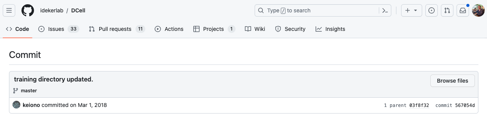
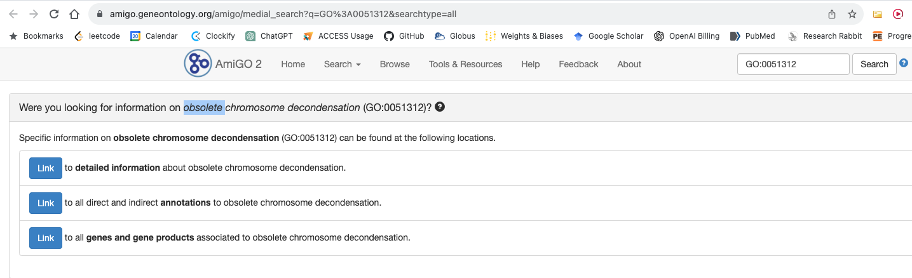

## DCell Dataset GO Gene Annotations Time Cutoff

The publication doesn't specify the time cutoff for ontology terms used, so I will use the date of the last major src commmit, March 1st 2018 (2018-02-01). I did search the repo by date and didn't find anything very useful.

[github-dcell-last-major-src-commit](https://github.com/idekerlab/DCell/commit/567054dcb81c391c94603d507a1dd87cd063f7ac)



We could also use the received date. This might be more reliable.


- Received - 2017-07-19
- Accepted - 2018-02-07
- Published - 2018-03-05

## Histogram of DCell GO Gene Annotations Binned in Time


## DCell DAG No Isolated Nodes No Filtering with Super Node


## DCell Reproducibility Issue Using Genome GO

The publication reports using 2,526 terms. This could be due to the fact that we used

```python
# Before any gene removal based on criterion
>>>graph.G_go.number_of_nodes()
4677
>>>sum(1 for _, data in graph.G_go.nodes(data=True) if len(data.get("gene_set", [])) >= 6)
1058
```

This number drops very low to nearly 500 if we do the other necessary filtering.

The discrepancy might be due to the fact that we are using the smaller GO that is associated with the genomic annotation. This is why we need to do some data validation. What do we do here? Take the union.

```python
# removed obsolete, from sgd {genes}.json
len(graph.all_go_terms)
5873
# from genomic annotation R64-4-1
len(genome.go)
4686
```

## DCell Reproducibility Issue Using SGD GO

We can try to used the SGD GO to rectify the issue that we don't have enough GO terms.

There is an additional problem in that the `go_dag` `.obo` file which is the general ontology file doesn't have some of terms in the graph. This means we cannot use `goatools` to connect these terms.

```bash
WARNING:root:GO term GO:0010527 not found in go_dag for gene YBR083W
WARNING:root:GO term GO:0010525 not found in go_dag for gene YDL159W
WARNING:root:GO term GO:0010525 not found in go_dag for gene YDR103W
WARNING:root:GO term GO:0010525 not found in go_dag for gene YER171W
WARNING:root:GO term GO:0010525 not found in go_dag for gene YIL143C
WARNING:root:GO term GO:0051312 not found in go_dag for gene YJL030W
WARNING:root:GO term GO:0006286 not found in go_dag for gene YKL113C
WARNING:root:GO term GO:0006286 not found in go_dag for gene YKL113C
WARNING:root:GO term GO:0015491 not found in go_dag for gene YLR138W
WARNING:root:GO term GO:0010525 not found in go_dag for gene YLR362W
WARNING:root:GO term GO:0061395 not found in go_dag for gene YML007W
WARNING:root:GO term GO:0006379 not found in go_dag for gene YMR239C
WARNING:root:GO term GO:0006379 not found in go_dag for gene YMR239C
WARNING:root:GO term GO:0010525 not found in go_dag for gene YOR212W
WARNING:root:GO term GO:0031936 not found in go_dag for gene YPL127C
WARNING:root:GO term GO:0031936 not found in go_dag for gene YPL128C
WARNING:root:GO term GO:0098501 not found in go_dag for gene YPL228W
WARNING:root:GO term GO:0005671 not found in go_dag for gene YPL254W
Missing GO terms: {'GO:0010527', 'GO:0006379', 'GO:0006286', 'GO:0098501', 'GO:0061395', 'GO:0010525', 'GO:0015491', 'GO:0031936', 'GO:0005671', 'GO:0051312'}
```

We can search these terms on the AmiGO2.



[GO:0010527 AmiGO2](https://amigo.geneontology.org/amigo/medial_search?q=GO%3A0010527&searchtype=all)
[GO:0006379 AmiGO2](https://amigo.geneontology.org/amigo/medial_search?q=GO%3A0006379&searchtype=all)
[GO:0006286 AmiGO2](https://amigo.geneontology.org/amigo/medial_search?q=GO%3A0006286&searchtype=all)
[GO:0098501 AmiGO2](https://amigo.geneontology.org/amigo/medial_search?q=GO%3A0098501&searchtype=all)
[GO:0061395 AmiGO2](https://amigo.geneontology.org/amigo/medial_search?q=GO%3A0061395&searchtype=all)
[GO:0010525 AmiGO2](https://amigo.geneontology.org/amigo/medial_search?q=GO%3A0010525&searchtype=all)
[GO:0015491 AmiGO2](https://amigo.geneontology.org/amigo/medial_search?q=GO%3A0015491&searchtype=all)
[GO:0031936 AmiGO2](https://amigo.geneontology.org/amigo/medial_search?q=GO%3A0031936&searchtype=all)
[GO:0005671 AmiGO2](https://amigo.geneontology.org/amigo/medial_search?q=GO%3A0005671&searchtype=all)
[GO:0051312 AmiGO2](https://amigo.geneontology.org/amigo/medial_search?q=GO%3A0051312&searchtype=all)

All of these terms are obsolete. We can assume that terms that don't show up in the `go_dag` are deprecated. We do this in [[S288c Genome|dendron://torchcell/torchcell.sequence.genome.scerevisiae.s288c]]. Here is the code snippet that does this.

```python
for term in feature.attributes["Ontology_term"]:
    if term.startswith("GO:"):
        if term not in self.go_dag:
            invalid_go_terms["not_in_go_dag"].append(term)
        elif self.go_dag[term].is_obsolete:
            invalid_go_terms["obsolete"].append(term)
        else:
            valid_go_terms.append(term)
```

After we switch from using Genome to SGD, we can look at how the number of nodes drops after filtering
