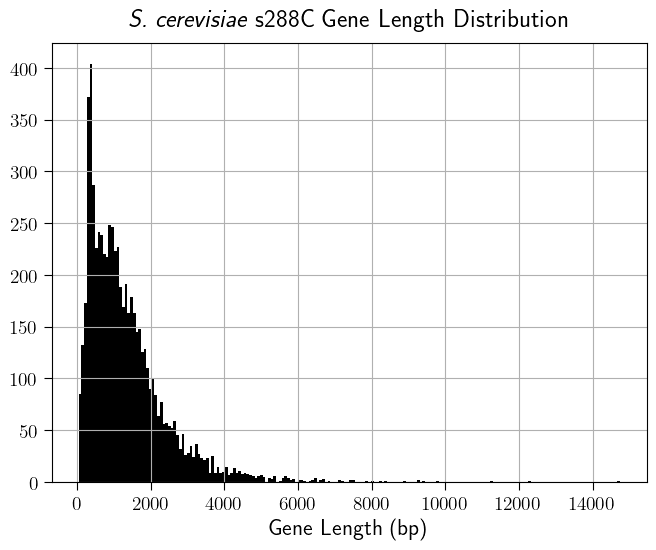

## Genes Larger than Nucleotide Transformer Window

```python
[gene for gene in genome.gene_set if len(genome[gene]) > 5979]
>>> ['Q0045', 'Q0060', 'Q0065', 'Q0070', 'Q0105', 'YBL004W', 'YBL088C', 'YBR136W', 'YBR140C', 'YCR032W', 'YCR093W', 'YDL171C', 'YDR150W', 'YDR170C', 'YDR457W', 'YER155C', 'YER172C', 'YFL007W', 'YFR019W', 'YGL195W', 'YGR217W', 'YHR099W', 'YHR165C', 'YIL129C', 'YJL005W', 'YJL130C', 'YJL207C', 'YJR066W', 'YKL182W', 'YKL203C', 'YKR054C', 'YLL040C', 'YLR087C', 'YLR106C', 'YLR430W', 'YLR454W', 'YMR207C', 'YNL262W', 'YNR016C', 'YOL081W', 'YPL085W', 'YPR117W']
```

```python
len([gene for gene in genome.gene_set if len(genome[gene]) > 5979])
42
```



## Five Prime, CDS, Three Prime Larger than Nucleotide Transformer Window

For the selections outside we will need a resolution order, @zrimecDeepLearningSuggests2020 suggests that the codon frequency can capture most of the effects of the CDS, so I think that the cis-regulatory regions should be prioritized.

Something like if the combined sequence is greater take a window that of `gene length - 1300` to get the upstream region of the CDS. Then we would get `five_prime + partial_CDS + three_prime`.

```python
len([gene for gene in genome.gene_set if (len(genome[gene]) + 1300) > 5979])
>>>105
```

```python
[gene for gene in genome.gene_set if (len(genome[gene]) + 1300) > 5979]
>>>['YBL004W', 'YBL017C', 'YBL088C', 'YBR136W', 'YBR140C', 'YBR208C', 'YBR275C', 'YCL014W', 'YCR032W', 'YCR089W', 'YCR093W', 'YDL058W', 'YDL140C', 'YDL171C', 'YDR093W', 'YDR127W', 'YDR141C', 'YDR150W', 'YDR170C', 'YDR283C', 'YDR420W', 'YDR457W', 'YDR545W', 'YER132C', 'YER155C', 'YER166W', 'YER172C', 'YER190W', 'YFL007W', 'YFL033C', 'YFR019W', 'YGL195W', 'YGL206C', 'YGR032W', 'YGR098C', 'YGR184C', 'YGR217W', 'YGR271W', 'YGR296W', 'YHL030W', 'YHL035C', 'YHR023W', 'YHR099W', 'YHR165C', 'YIL129C', 'YIL149C', 'YIL177C', 'YJL005W', 'YJL039C', 'YJL109C', 'YJL130C', 'YJL207C', 'YJL225C', 'YJR066W', 'YJR138W', 'YJR140C', 'YKL014C', 'YKL182W', 'YKL203C', 'YKR031C', 'YKR054C', 'YKR095W', 'YLL015W', 'YLL040C', 'YLL048C', 'YLR024C', 'YLR087C', 'YLR106C', 'YLR305C', 'YLR310C', 'YLR342W', 'YLR422W', 'YLR430W', 'YLR454W', 'YLR467W', 'YML059C', 'YML103C', 'YMR162C', 'YMR207C', 'YMR219W', 'YMR229C', 'YMR247C', 'YMR306W', 'YNL139C', 'YNL172W', 'YNL242W', 'YNL262W', 'YNL271C', 'YNL297C', 'YNL339C', 'YNR016C', 'YNR031C', 'YOL081W', 'YOR093C', 'YOR191W', 'YOR290C', 'YOR326W', 'YOR328W', 'YOR341W', 'YOR396W', 'YPL082C', 'YPL085W', 'YPL231W', 'YPL283C', 'YPR117W']
```
