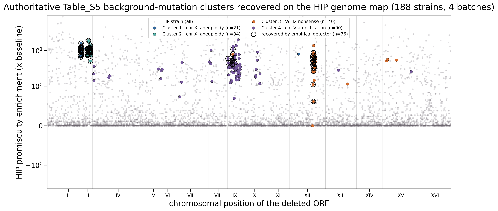
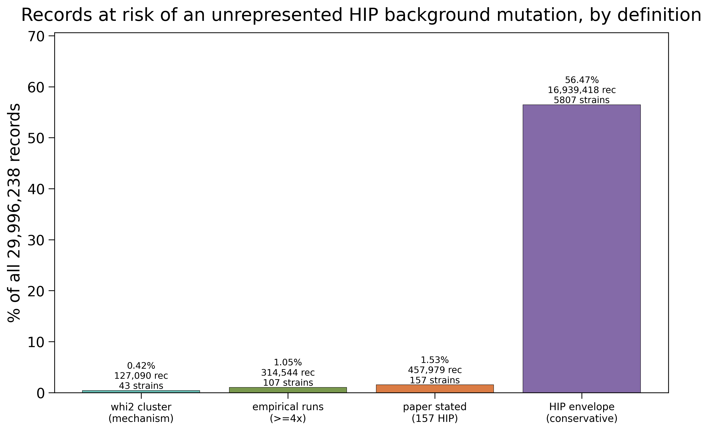
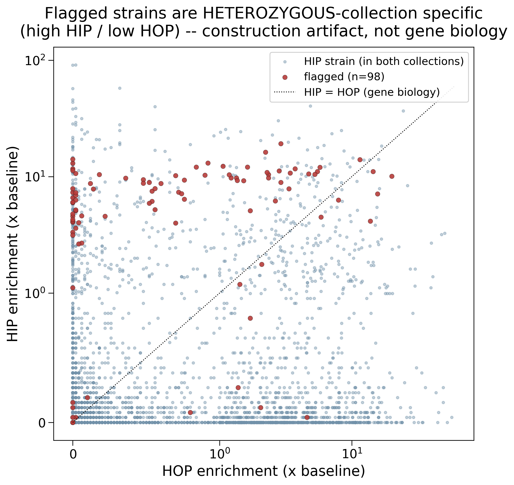

## 2026.07.13 - HIP background-mutation genotype-fidelity risk (authoritative, Table_S5 in hand)

Canonical data-quality record for `[[torchcell.datasets.scerevisiae.hoepfner2014]]`
(`EnvChemgenHoepfner2014Dataset`, **29,996,238 records**). Full analysis, scripts, and all
figures: `[[experiments.017-hoepfner-background-mutations.analysis]]`.

### The issue

Hoepfner et al. 2014 (paper.md 170-194) found that a set of **heterozygous (HIP)** deletion
strains carry **undocumented background mutations** — co-inherited through construction-lab
batches — that drive promiscuous compound hypersensitivity NOT caused by the annotated
single-gene deletion. torchcell stores these strains as clean
`EngineeredCopyNumberPerturbation` (copy 1/2), so their genotype is **wrong at the sequence
level**. The homozygous (HOP) half is not implicated by this finding.

### Authoritative source — Table_S5 retrieved + pinned (2026.07.13)

Table_S5 ("Summary of identified HIP strains with common background mutations") is in the
**same Dryad deposit we already build from** (doi:10.5061/dryad.v5m8v, file id **4834604**),
so it is scriptable via the loader's Anubis-PoW path. Retrieved + deposited to the library
mirror:

- `$DATA_ROOT/torchcell-library/hoepfnerHighresolutionChemicalDissection2014/si/Table_S5.xls`
- **sha256 `b123dc3e87fc10d3b4256f449fcd2eb38c91d1779000278af5a1a788356624a2`**, 839,680 bytes
- retrieval: `experiments/.../scripts/hoepfner_fetch_table_s5.py` (reuses loader `_dryad_get`)
- **TODO (provenance):** add a formal per-file provenance record + manifest entry for this SI
  file in the library mirror (source_url + retrieval_command + sha256 + retrieved_at).

Table_S5 `Data` sheet assigns every collection strain a **Cluster / Lab / Batch / Chromosome
Arm / Validation Result (MUT|WT from sequencing)**; the `Table` sheet maps each cluster to its
mutation. Legend: `CLn` = strain is POSITIONALLY in the cluster block (the paper's 157);
`CLn+` = CORRELATES with the cluster but sits outside it (31 extra → **188 total flagged**).

| Cluster | Deleted-ORF block | mutation | positional n | primary lab |
|---|---|---|---|---|
| 1 | YBR271W→YCL001W-A (chr II/III) | **chr XI aneuploidy** | 20 | Lab 14 |
| 2 | YCR020W-B→YCR087W (chr III) | **chr XI aneuploidy** | 35 | Lab 14 / 3 |
| 3 | YLR274W→YLR321C (chr XII) | **WHI2/YOR043w nonsense** | 35 | Lab 12 |
| 4 | YIL003W→YJL020C (chr IX/X, spread) | **chr V 12 kb amplification** | 67 | Lab 7 |

Key subtlety confirmed: the cluster **deletion positions** (chr II/III/XII/IX) are NOT where
the **secondary mutation** sits (chr XI / chr XV-WHI2 / chr V) — clustering is by
construction batch, the mutation is co-inherited.

### % of the dataset at risk (authoritative)

Denominator: 29,996,238 records (**56.5% HIP / 43.5% HOP**). The "any HIP record" number
(56.5%) is NOT a risk estimate — it is just the HIP share, an upper bound only under the
paper's "uncharacterised clusters remain" caveat. The actionable footprint is small and now
exact:

| Definition | Strains (in LMDB) | Records | % of all |
|---|---|---|---|
| Table_S5 positional (paper's 157) | 157 | 463,654 | **1.55%** |
| Table_S5 all flagged (incl. correlated) | 185 | 546,404 | **1.82%** |
| conservative HIP envelope (context only) | 5,807 | 16,939,418 | 56.47% |

(3 affected strains — YCR061W, YIL015C-A, YJL017W — are not in our HIP LMDB.)
`results/table_s5_affected_strains.csv` is the per-strain purge list (ORF, cluster, mutation,
lab, batch, MUT/WT, n_exp, whether empirically flagged).

### Independent validation — the empirical detector

Before Table_S5 was retrieved, a from-scratch detector (promiscuity + chromosomal adjacency,
reconstructed from our pinned matrices) recovered all four clusters at the correct genomic
positions. Against the authoritative 188: **precision 0.71, recall 0.41** — it catches the
tight, high-enrichment blocks (clusters 1/2/3) but under-recovers cluster 4 (90 strains spread
across chr V-X, not one adjacency block). Its misses still sit at the **92nd percentile** of
HIP promiscuity (elevated, just below the conservative cut), and its 31 "false positives" are
candidates for the **uncharacterised clusters the paper predicted**. So Table_S5 is now the
authoritative purge list; the detector remains useful for finding what Table_S5 does not cover.

### How to represent this (design assessment — NOT yet built)

torchcell has no first-class way to mark that a record's stored genotype has a known
experimental-representation caveat. Two complementary mechanisms:

- **Path A — correct the genotype (provenance-first ideal; feasibility varies).** Add the
  known secondary mutation as a perturbation so the genotype is sequence-accurate.
  - *Cluster 3 (WHI2 nonsense, 35+ strains):* clean today — a sequence-variant (nonsense)
    perturbation on YOR043w.
  - *Cluster 4 (chr V 12 kb amp, 67+ strains):* a region-scoped CNV over the 6 features.
  - *Clusters 1+2 (chr XI aneuploidy, 55 strains):* whole-chromosome trisomy; the paper says
    it "did not track with any one mutation." Aneuploidy is a genome-level state the per-gene
    CNV leaf cannot express — **schema gap**; record it as a genome-state annotation, do NOT
    fabricate a per-gene edit. Principle: only add a perturbation we can specify.
- **Path B — flag the instance (data-quality metadata; honest home for suspicion).** A typed,
  provenance-carrying quality annotation ({issue: background_mutation, source: Hoepfner2014
  Table_S5, cluster, mutation, confidence: characterized|suspected}). Does NOT alter the
  genotype — annotates reliability. This is where uncharacterised/suspected cases live.

**Key modeling insight — reagent-level, not per-measurement.** All ~2,956 records of a given
strain share the same background mutation because it is the same physical reagent. The
flag/correction belongs at the **strain/genotype** level and is inherited by every experiment
using that strain (like the reference background), not duplicated per record.

**Schema path:** `comment_annotations` (already exists) is the stopgap; the durable answer is
a small typed `data_quality_flags: list[QualityFlag]` (pydantic, controlled vocab + source
sha256/quote) — a QC axis orthogonal to genotype/environment/phenotype. Design it once,
generally (this recurs across collections and QC issues), not Hoepfner-specific.

### Recommendation

1. **Keep the dataset** — actionable contamination is ~1.5-1.8%, not the 56.5% HIP share.
2. **Purge/hold-out `table_s5_affected_strains.csv`** (185 strains, ~1.8%) as the authoritative
   floor; optionally add the 31 empirical-only candidates for the uncharacterised tail.
3. **Flag, don't drop, the rest of HIP** with a provenance annotation.
4. **Fix the genotypes (Path A)** where the mutation is specifiable — start with Cluster 3
   (WHI2 nonsense) — after the QC-flag schema axis (Path B) exists.

### Reproduce

- `hoepfner_compute_risk_metrics.py` → per-strain metrics (reconciles to 29,996,238).
- `hoepfner_plot_risk.py` → detector + tiers + figs 01-07.
- `hoepfner_fetch_table_s5.py` → retrieve + pin Table_S5.xls.
- `hoepfner_crossvalidate_table_s5.py` → authoritative list + precision/recall
  (`table_s5_affected_strains.csv`, `table_s5_crossvalidation.json`).
- `hoepfner_plot_table_s5_crossval.py` → fig 08.
