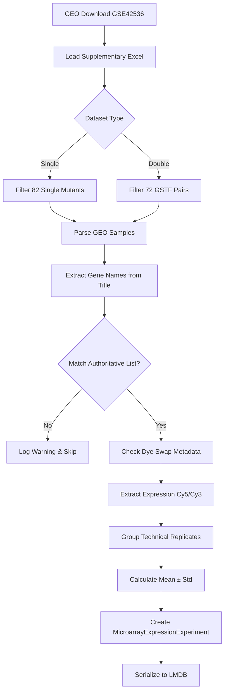

## Overview

Microarray gene expression datasets for single and double mutant yeast strains from Sameith et al. (2015). The study profiled 82 single deletion mutants and 72 double deletion mutant pairs of general stress transcription factors (GSTFs) in *Saccharomyces cerevisiae*.

**Data Source**: GEO accession GSE42536
**Publication**: Sameith et al. (2015) "A high-resolution gene expression atlas of epistasis between gene-specific transcription factors in *Saccharomyces cerevisiae*"
**DOI**: [10.1186/s12915-015-0222-5](https://doi.org/10.1186/s12915-015-0222-5)
**PubMed ID**: 26687005

## Datasets

### SmMicroarraySameith2015Dataset

Single mutant GSTF expression profiling dataset.

- **Genotypes**: 82 single deletion mutants
- **Samples**: 144 GEO samples (with technical replicates)
- **Strain**: BY4742 (MATa, from yeast deletion library)
- **Marker**: KanMX deletion
- **Platform**: Two-channel microarray (Cy5/Cy3)

### DmMicroarraySameith2015Dataset

Double mutant GSTF expression profiling dataset.

- **Expected Genotypes**: 72 GSTF pairs (from authoritative supplementary file)
- **Found in GEO**: 69 pairs (96% recovery)
- **Missing from GEO**: 3 pairs not uploaded to public database
  - YJL089W (Sip4) × YER184C
  - YGL209W (Mig2) × YGR067C
  - YJR127C (Rsf2) × YML081W
- **Samples**: ~140 GEO samples (with technical replicates)
- **Strains**: Mixed BY4742 (MATa) and BY4741 (MATα), extracted per-sample from Excel comments
- **Markers**: KanMX (first deletion), NatMX (second deletion, via SGA)
- **Platform**: Two-channel microarray (Cy5/Cy3)

## Data Structure

### Expression Measurements

Each experiment contains genome-wide expression data:

$$
\text{Expression}_{\text{mutant}} = \{\text{gene}_i \to \text{value}_i\}_{i=1}^{N_{\text{genes}}}
$$

$$
\text{Expression}_{\text{refpool}} = \{\text{gene}_i \to \text{value}_i\}_{i=1}^{N_{\text{genes}}}
$$

$$
\text{Log2Ratio} = \{\text{gene}_i \to \log_2\left(\frac{\text{mutant}_i}{\text{refpool}_i}\right)\}_{i=1}^{N_{\text{genes}}}
$$

Where $N_{\text{genes}} \approx 6169$ yeast genes measured on the microarray platform.

### Technical Replicates

The paper describes: "Each mutant was grown and profiled four times from two independent cultures"
- 2 biological replicates × 2 dye swaps = 4 technical measurements per genotype

Technical standard deviation calculated across replicates:

$$
\sigma_{\text{tech}}(\text{gene}_i) = \sqrt{\frac{1}{n-1} \sum_{j=1}^{n} (x_{ij} - \bar{x}_i)^2}
$$

Where $n$ is the number of technical replicates (typically 2-4) and $x_{ij}$ is the expression value for gene $i$ in replicate $j$.

## Implementation Details

### Dye Swap Handling

Two-channel microarrays use dye-swap replicates to correct for dye bias. The implementation checks metadata to determine channel assignment:

```python
source_ch1 = gsm.metadata.get('source_name_ch1', [''])[0]

if 'refpool' in source_ch1.lower():
    # Cy5 = refpool, Cy3 = mutant (SWAPPED)
    mutant_channel = 'Cy3'
    ratio_sign = -1  # Negate VALUE to get log2(mutant/refpool)
else:
    # Cy5 = mutant, Cy3 = refpool (NORMAL)
    mutant_channel = 'Cy5'
    ratio_sign = 1
```

The log2 ratio sign is adjusted to maintain consistent $\log_2(\text{mutant}/\text{refpool})$ convention across all samples.

### Gene Name Extraction

Gene names are extracted from GEO sample titles using regex patterns:

1. **Systematic names**: Pattern `r"\b(Y[A-P][LR]\d{3}[WC](?:-[A-Z])?)\b"`
   - Matches standard yeast gene names (e.g., YAL001C)
   - Includes optional suffix for genes like YBR089C-A (Nhp6B)

2. **Common names**: Pattern `r"\b([A-Z][A-Z0-9]{2,})\b"`
   - Extracts capitalized gene symbols (e.g., RPN4, MIG1)
   - Converted to systematic names via `SCerevisiaeGenome` mapping

**Bug Fixes Applied**:
- **Bug #1**: Validation regex now accepts genes with suffixes (e.g., `-A`, `-B`)
  - Before: `r"^Y[A-P][LR]\d{3}[WC]$"` rejected YBR089C-A
  - After: `r"^Y[A-P][LR]\d{3}[WC](-[A-Z])?$"` accepts YBR089C-A
  - Recovered: 2 additional pairs

- **Bug #2**: Extraction continues until 2 genes found (for double mutants)
  - Before: `if not gene_names:` (only tried common names if empty)
  - After: `if len(gene_names) < 2:` (tries common names until 2 found)
  - Handles mixed titles like "rpn4-del+ydr026c-del" (common + systematic)
  - Recovered: 4 additional pairs

### Authoritative Genotype Lists

The implementation uses supplementary Excel file `12915_2015_222_MOESM1_ESM.xlsx` as ground truth:

**For Single Mutants**:
- Sheet: "Single mutants - info"
- Filter: Rows with valid systematic names
- Total: 82 single mutants

**For Double Mutants**:
- Sheet: "Double mutants - info"
- Filter: `curation == "passed"`
- Total: 72 GSTF pairs
- Extracts per-sample strain from "comments" column:
  - "MATa" → BY4742
  - "MATα" or "matA" → BY4741

Only samples matching the authoritative lists are processed. Unmatched samples generate warnings.

### Technical Replicate Grouping

Samples are grouped by genotype (sorted tuple of gene names):

```python
# For double mutants
genotype_key = tuple(sorted([gene1, gene2]))
# Example: ('YAL001C', 'YBR030W')

# For single mutants
genotype_key = gene
# Example: 'YAL001C'
```

Within each group, expression values are averaged and standard deviations calculated:

$$
\bar{x}_i = \frac{1}{n}\sum_{j=1}^{n} x_{ij}
$$

$$
s_i = \sqrt{\frac{1}{n-1}\sum_{j=1}^{n}(x_{ij} - \bar{x}_i)^2}
$$

### Strain Assignment (Double Mutants)

Double mutants use mixed genetic backgrounds based on mating type compatibility:
- BY4742 (MATa): 63 pairs
- BY4741 (MATα): 9 pairs

Strain is extracted from Excel "comments" column and stored per-experiment in the genome reference.

## Data Flow



## Phenotype Schema

Each experiment returns a `MicroarrayExpressionPhenotype` with:

```python
{
    'expression': SortedDict,           # Mutant expression values
    'expression_log2_ratio': SortedDict, # log2(mutant/refpool)
    'expression_technical_std': SortedDict,      # Std across replicates
    'expression_log2_ratio_std': SortedDict,     # Std of log2 ratios
}
```

Reference phenotype uses refpool data:

```python
{
    'expression': SortedDict,           # Reference pool expression
    'expression_log2_ratio': {gene: 0.0},  # Self-referential
    'expression_technical_std': SortedDict,
    'expression_log2_ratio_std': None,
}
```

## Genotype Schema

**Single Mutants**:
```python
Genotype(
    perturbations=[
        SgaKanMxDeletionPerturbation(
            systematic_gene_name='YAL001C',
            perturbed_gene_name='YAL001C',
            strain_id='KanMX_YAL001C'
        )
    ]
)
```

**Double Mutants**:
```python
Genotype(
    perturbations=[
        SgaKanMxDeletionPerturbation(
            systematic_gene_name='YAL001C',
            perturbed_gene_name='YAL001C',
            strain_id='KanMX_YAL001C'
        ),
        SgaNatMxDeletionPerturbation(
            systematic_gene_name='YBR030W',
            perturbed_gene_name='YBR030W',
            strain_id='NatMX_YBR030W'
        )
    ]
)
```

## Environment

All experiments use standard growth conditions:
- **Media**: SC (synthetic complete), liquid
- **Temperature**: 30°C

## Usage

```python
from torchcell.datasets.scerevisiae import (
    SmMicroarraySameith2015Dataset,
    DmMicroarraySameith2015Dataset
)

# Single mutants
sm_dataset = SmMicroarraySameith2015Dataset(
    root="data/torchcell/sm_microarray_sameith2015",
    io_workers=10,
    process_workers=0
)

print(f"Single mutants: {len(sm_dataset)}")  # 82
print(f"Genes measured: {len(sm_dataset.gene_set)}")  # ~6169

# Double mutants
dm_dataset = DmMicroarraySameith2015Dataset(
    root="data/torchcell/dm_microarray_sameith2015",
    io_workers=10,
    process_workers=0
)

print(f"Double mutants: {len(dm_dataset)}")  # 69
print(f"Genes measured: {len(dm_dataset.gene_set)}")  # ~6169

# Access experiment data
data = dm_dataset[0]
experiment = data['experiment']
reference = data['reference']

# Get genotype
perturbations = experiment['genotype']['perturbations']
gene1 = perturbations[0]['systematic_gene_name']
gene2 = perturbations[1]['systematic_gene_name']

# Get expression data
expression = experiment['phenotype']['expression']  # SortedDict
log2_ratios = experiment['phenotype']['expression_log2_ratio']
expr_std = experiment['phenotype']['expression_technical_std']

# Check strain
strain = reference['genome_reference']['strain']  # BY4742 or BY4741
```

## Validation Results

Dataset validation confirmed:
- **Single mutants**: 82/82 from authoritative Excel list (100%)
- **Double mutants**: 69/72 from authoritative Excel list (96%)
  - 3 pairs confirmed missing from GEO upload
- **Technical replicates**: ~6169 genes with std values (indicating multiple measurements)
- **Gene name extraction**: Fixed to handle suffixes and mixed common/systematic names
- **Dye swap handling**: Verified correct sign adjustment for log2 ratios
- **Strain assignment**: Correctly extracts BY4742/BY4741 from Excel metadata

## Development Notes

The implementation went through several iterations to achieve proper data extraction:

1. **Initial implementation**: 63/72 double mutants (87.5%)
2. **After suffix bug fix**: 65/72 (90.3%)
3. **After extraction bug fix**: 69/72 (96%)
4. **Final validation**: 3 pairs confirmed missing from GEO (not dataset error)

Key challenges solved:
- Handling dye swaps in two-channel microarray data
- Extracting mixed common/systematic gene names from titles
- Validating against authoritative supplementary data
- Calculating technical std across heterogeneous replicates
- Assigning correct strain background per double mutant

## Files

**Implementation**: `torchcell/datasets/scerevisiae/sameith2015.py`
**Test file**: `tests/torchcell/datasets/scerevisiae/test_sameith2015.py`
**Registry**: Datasets registered via `@register_dataset` decorator

## Related Datasets

For fitness-based genetic interaction data, see:
- [[torchcell.datasets.scerevisiae.costanzo2016]]
- [[torchcell.datasets.scerevisiae.kuzmin2018]]

The Sameith2015 datasets provide expression-based epistasis data, enabling transcriptional analysis of genetic interactions between stress transcription factors.
