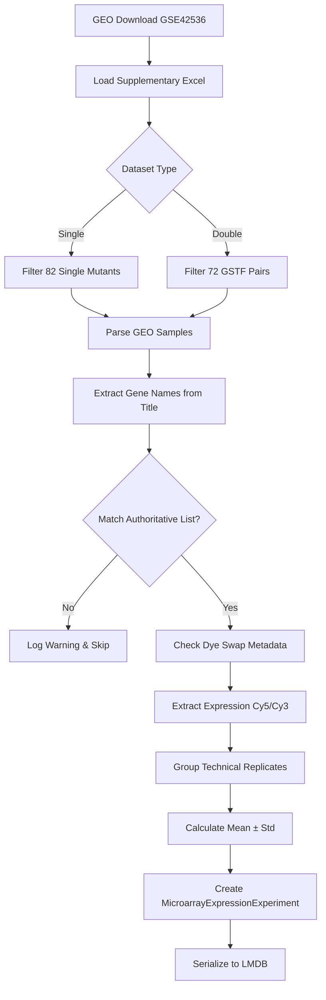

## Overview

Microarray gene expression datasets for single and double mutant yeast strains from Sameith et al. (2015). The study profiled 82 single deletion mutants and 72 double deletion mutant pairs of general stress transcription factors (GSTFs) in *Saccharomyces cerevisiae*.

**Data Source**: GEO accession GSE42536
**Publication**: Sameith et al. (2015) "A high-resolution gene expression atlas of epistasis between gene-specific transcription factors in *Saccharomyces cerevisiae*"
**DOI**: [10.1186/s12915-015-0222-5](https://doi.org/10.1186/s12915-015-0222-5)
**PubMed ID**: 26687005

## Datasets

### SmMicroarraySameith2015Dataset

Single mutant GSTF expression profiling dataset.

- **Genotypes**: 82 single deletion mutants
- **Samples**: 144 GEO samples (with technical replicates)
- **Strain**: BY4742 (MATa, from yeast deletion library)
- **Marker**: KanMX deletion
- **Platform**: Two-channel microarray (Cy5/Cy3)

### DmMicroarraySameith2015Dataset

Double mutant GSTF expression profiling dataset.

- **Expected Genotypes**: 72 GSTF pairs (from authoritative supplementary file)
- **Found in GEO**: 69 pairs (96% recovery)
- **Missing from GEO**: 3 pairs not uploaded to public database
  - YJL089W (Sip4) × YER184C
  - YGL209W (Mig2) × YGR067C
  - YJR127C (Rsf2) × YML081W
- **Samples**: ~140 GEO samples (with technical replicates)
- **Strains**: Mixed BY4742 (MATa) and BY4741 (MATα), extracted per-sample from Excel comments
- **Markers**: KanMX (first deletion), NatMX (second deletion, via SGA)
- **Platform**: Two-channel microarray (Cy5/Cy3)

## Data Structure

### Expression Measurements

Each experiment contains genome-wide expression data:

$$
\text{Expression}_{\text{mutant}} = \{\text{gene}_i \to \text{value}_i\}_{i=1}^{N_{\text{genes}}}
$$

$$
\text{Expression}_{\text{refpool}} = \{\text{gene}_i \to \text{value}_i\}_{i=1}^{N_{\text{genes}}}
$$

$$
\text{Log2Ratio} = \{\text{gene}_i \to \log_2\left(\frac{\text{mutant}_i}{\text{refpool}_i}\right)\}_{i=1}^{N_{\text{genes}}}
$$

Where $N_{\text{genes}} \approx 6169$ yeast genes measured on the microarray platform.

### Technical Replicates

The paper describes: "Each mutant was grown and profiled four times from two independent cultures"

- 2 biological replicates × 2 dye swaps = 4 technical measurements per genotype

Technical standard deviation calculated across replicates:

$$
\sigma_{\text{tech}}(\text{gene}_i) = \sqrt{\frac{1}{n-1} \sum_{j=1}^{n} (x_{ij} - \bar{x}_i)^2}
$$

Where $n$ is the number of technical replicates (typically 2-4) and $x_{ij}$ is the expression value for gene $i$ in replicate $j$.

## Implementation Details

### Dye Swap Handling

Two-channel microarrays use dye-swap replicates to correct for dye bias. The implementation checks metadata to determine channel assignment:

```python
source_ch1 = gsm.metadata.get('source_name_ch1', [''])[0]

if 'refpool' in source_ch1.lower():
    # Cy5 = refpool, Cy3 = mutant (SWAPPED)
    mutant_channel = 'Cy3'
    ratio_sign = -1  # Negate VALUE to get log2(mutant/refpool)
else:
    # Cy5 = mutant, Cy3 = refpool (NORMAL)
    mutant_channel = 'Cy5'
    ratio_sign = 1
```

The log2 ratio sign is adjusted to maintain consistent $\log_2(\text{mutant}/\text{refpool})$ convention across all samples.

### Gene Name Extraction

Gene names are extracted from GEO sample titles using regex patterns:

1. **Systematic names**: Pattern `r"\b(Y[A-P][LR]\d{3}[WC](?:-[A-Z])?)\b"`
   - Matches standard yeast gene names (e.g., YAL001C)
   - Includes optional suffix for genes like YBR089C-A (Nhp6B)

2. **Common names**: Pattern `r"\b([A-Z][A-Z0-9]{2,})\b"`
   - Extracts capitalized gene symbols (e.g., RPN4, MIG1)
   - Converted to systematic names via `SCerevisiaeGenome` mapping

**Bug Fixes Applied**:

- **Bug #1**: Validation regex now accepts genes with suffixes (e.g., `-A`, `-B`)
  - Before: `r"^Y[A-P][LR]\d{3}[WC]$"` rejected YBR089C-A
  - After: `r"^Y[A-P][LR]\d{3}[WC](-[A-Z])?$"` accepts YBR089C-A
  - Recovered: 2 additional pairs

- **Bug #2**: Extraction continues until 2 genes found (for double mutants)
  - Before: `if not gene_names:` (only tried common names if empty)
  - After: `if len(gene_names) < 2:` (tries common names until 2 found)
  - Handles mixed titles like "rpn4-del+ydr026c-del" (common + systematic)
  - Recovered: 4 additional pairs

### Authoritative Genotype Lists

The implementation uses supplementary Excel file `12915_2015_222_MOESM1_ESM.xlsx` as ground truth:

**For Single Mutants**:

- Sheet: "Single mutants - info"
- Filter: Rows with valid systematic names
- Total: 82 single mutants

**For Double Mutants**:

- Sheet: "Double mutants - info"
- Filter: `curation == "passed"`
- Total: 72 GSTF pairs
- Extracts per-sample strain from "comments" column:
  - "MATa" → BY4742
  - "MATα" or "matA" → BY4741

Only samples matching the authoritative lists are processed. Unmatched samples generate warnings.

### Technical Replicate Grouping

Samples are grouped by genotype (sorted tuple of gene names):

```python
# For double mutants
genotype_key = tuple(sorted([gene1, gene2]))
# Example: ('YAL001C', 'YBR030W')

# For single mutants
genotype_key = gene
# Example: 'YAL001C'
```

Within each group, expression values are averaged and standard deviations calculated:

$$
\bar{x}_i = \frac{1}{n}\sum_{j=1}^{n} x_{ij}
$$

$$
s_i = \sqrt{\frac{1}{n-1}\sum_{j=1}^{n}(x_{ij} - \bar{x}_i)^2}
$$

### Strain Assignment (Double Mutants)

Double mutants use mixed genetic backgrounds based on mating type compatibility:

- BY4742 (MATa): 63 pairs
- BY4741 (MATα): 9 pairs

Strain is extracted from Excel "comments" column and stored per-experiment in the genome reference.

## Data Flow


```mermaid
flowchart TD
    A[GEO Download GSE42536] --> B[Load Supplementary Excel]
    B --> C{Dataset Type}
    C -->|Single| D[Filter 82 Single Mutants]
    C -->|Double| E[Filter 72 GSTF Pairs]
    D --> F[Parse GEO Samples]
    E --> F
    F --> G[Extract Gene Names from Title]
    G --> H{Match Authoritative List?}
    H -->|No| I[Log Warning & Skip]
    H -->|Yes| J[Check Dye Swap Metadata]
    J --> K[Extract Expression Cy5/Cy3]
    K --> L[Group Technical Replicates]
    L --> M[Calculate Mean ± Std]
    M --> N[Create MicroarrayExpressionExperiment]
    N --> O[Serialize to LMDB]
```

## Phenotype Schema

Each experiment returns a `MicroarrayExpressionPhenotype` with:

```python
{
    'expression': SortedDict,                      # Mutant expression values (linear scale)
    'expression_log2_ratio': SortedDict,           # log2(mutant/refpool)
    'expression_log2_ratio_se': SortedDict,        # Standard error of log2 ratios
    'expression_log2_ratio_variance': SortedDict,  # Variance of log2 ratios
    'n_replicates': Dict[str, int],                # Number of replicates per gene
}
```

Reference phenotype uses refpool data:

```python
{
    'expression': SortedDict,                      # Reference pool expression
    'expression_log2_ratio': {gene: 0.0},          # Self-referential (log2(1) = 0)
    'expression_log2_ratio_se': None,              # No SE for self-reference
    'expression_log2_ratio_variance': None,        # No variance for self-reference
    'n_replicates': {gene: 1},                     # Reference is baseline (n=1)
}
```

## Genotype Schema

**Single Mutants**:

```python
Genotype(
    perturbations=[
        SgaKanMxDeletionPerturbation(
            systematic_gene_name='YAL001C',
            perturbed_gene_name='YAL001C',
            strain_id='KanMX_YAL001C'
        )
    ]
)
```

**Double Mutants**:

```python
Genotype(
    perturbations=[
        SgaKanMxDeletionPerturbation(
            systematic_gene_name='YAL001C',
            perturbed_gene_name='YAL001C',
            strain_id='KanMX_YAL001C'
        ),
        SgaNatMxDeletionPerturbation(
            systematic_gene_name='YBR030W',
            perturbed_gene_name='YBR030W',
            strain_id='NatMX_YBR030W'
        )
    ]
)
```

## Environment

All experiments use standard growth conditions:

- **Media**: SC (synthetic complete), liquid
- **Temperature**: 30°C

## Usage

```python
import os.path as osp
from dotenv import load_dotenv
from torchcell.datasets.scerevisiae import (
    SmMicroarraySameith2015Dataset,
    DmMicroarraySameith2015Dataset
)
from torchcell.sequence.genome.scerevisiae import SCerevisiaeGenome

# Setup environment
load_dotenv()
DATA_ROOT = os.getenv("DATA_ROOT")

# Initialize genome for gene name mapping (optional dependency injection)
genome = SCerevisiaeGenome(
    genome_root=osp.join(DATA_ROOT, "data/sgd/genome"),
    go_root=osp.join(DATA_ROOT, "data/go"),
    overwrite=True,
)

# Single mutants
sm_dataset = SmMicroarraySameith2015Dataset(
    root=osp.join(DATA_ROOT, "data/torchcell/sm_microarray_sameith2015"),
    genome=genome,  # Inject genome dependency
    io_workers=10,
    process_workers=0
)

print(f"Single mutants: {len(sm_dataset)}")  # 82
print(f"Genes measured: {len(sm_dataset.gene_set)}")  # ~6169

# Double mutants
dm_dataset = DmMicroarraySameith2015Dataset(
    root=osp.join(DATA_ROOT, "data/torchcell/dm_microarray_sameith2015"),
    genome=genome,  # Inject genome dependency
    io_workers=10,
    process_workers=0
)

print(f"Double mutants: {len(dm_dataset)}")  # 69
print(f"Genes measured: {len(dm_dataset.gene_set)}")  # ~6169

# Access experiment data
data = dm_dataset[0]
experiment = data['experiment']
reference = data['reference']

# Get genotype
perturbations = experiment['genotype']['perturbations']
gene1 = perturbations[0]['systematic_gene_name']
gene2 = perturbations[1]['systematic_gene_name']

# Get expression data
expression = experiment['phenotype']['expression']  # SortedDict (linear scale)
log2_ratios = experiment['phenotype']['expression_log2_ratio']  # SortedDict
log2_se = experiment['phenotype']['expression_log2_ratio_se']  # SortedDict
n_replicates = experiment['phenotype']['n_replicates']  # Dict[str, int]

# Check strain
strain = reference['genome_reference']['strain']  # BY4742 or BY4741
```

## Validation Results

Dataset validation confirmed:

- **Single mutants**: 82/82 from authoritative Excel list (100%)
- **Double mutants**: 69/72 from authoritative Excel list (96%)
  - 3 pairs confirmed missing from GEO upload
- **Technical replicates**: ~6169 genes with std values (indicating multiple measurements)
- **Gene name extraction**: Fixed to handle suffixes and mixed common/systematic names
- **Dye swap handling**: Verified correct sign adjustment for log2 ratios
- **Strain assignment**: Correctly extracts BY4742/BY4741 from Excel metadata

## Development Notes

The implementation went through several iterations to achieve proper data extraction:

1. **Initial implementation**: 63/72 double mutants (87.5%)
2. **After suffix bug fix**: 65/72 (90.3%)
3. **After extraction bug fix**: 69/72 (96%)
4. **Final validation**: 3 pairs confirmed missing from GEO (not dataset error)

Key challenges solved:

- Handling dye swaps in two-channel microarray data
- Extracting mixed common/systematic gene names from titles
- Validating against authoritative supplementary data
- Calculating technical std across heterogeneous replicates
- Assigning correct strain background per double mutant

## Files

**Implementation**: `torchcell/datasets/scerevisiae/sameith2015.py`
**Test file**: `tests/torchcell/datasets/scerevisiae/test_sameith2015.py`
**Registry**: Datasets registered via `@register_dataset` decorator

## Related Datasets

For fitness-based genetic interaction data, see:

- [[torchcell.datasets.scerevisiae.costanzo2016]]
- [[torchcell.datasets.scerevisiae.kuzmin2018]]

The Sameith2015 datasets provide expression-based epistasis data, enabling transcriptional analysis of genetic interactions between stress transcription factors.

## 2026.01.29 - Replicate Counting Philosophy

### Data-Driven n_replicates Computation

This dataset follows the principle of **computing `n_replicates` from raw data** rather than using paper-reported constants.

**Global constants in code** (lines 42-84 in `sameith2015.py`):

```python
N_EXPECTED_BIOLOGICAL_REPLICATES = 2
N_EXPECTED_DYE_SWAP_TECHNICAL_REPLICATES = 2
N_EXPECTED_MAX_REPLICATES_DELETION = 4
```

These constants are **documentation only** - they record what the paper reports about experimental design:

- Quote from paper: "Each mutant strain was grown twice, from two independently inoculated cultures. Each culture was expression-profiled in technical replicate to yield four measurements for each profiling mutant."
- Expected design: 2 biological replicates × 2 dye-swap measurements = 4 total
- Applies to BOTH single mutants (SmMicroarray) and double mutants (DmMicroarray)

**Actual implementation**: Code counts actual measurements per gene per deletion:

```python
# Example from processing logic
for gene, values in grouped_values.items():
    n_replicates[gene] = len(values)  # Count actual data points
```

**Why compute rather than use constants?**

1. **QC filtering**: Some samples may fail quality control (actual < 4)
2. **Data is authoritative**: Direct counts from GEO samples are ground truth
3. **Gene-specific variation**: Different genes may have different replicate counts
4. **Reference replicates**: WT reference pool measured in variable numbers of samples

**Technical Replicates Section Update**: The section "Technical Replicates" (lines 65-77) describes the paper's reported design. However, the actual `n_replicates` stored in `MicroarrayExpressionPhenotype` is **computed from data**:

- Typical value: ~4 (when all replicates pass QC)
- Can be less (2-3) if some technical replicates were filtered
- Reference pool: Varies by batch/day as WT samples are measured alongside mutants

**Reference pool replicates** (lines 82-83):

- `N_EXPECTED_REFPOOL_REPLICATES = None` (computed from data)
- Actual values depend on how many WT samples were profiled for batch effect monitoring
- Each experiment's reference phenotype uses computed replicate count from actual WT measurements

This approach enables validation (compare computed vs expected to detect issues) while ensuring data integrity across both single and double mutant datasets.

Related: [[torchcell.datamodels.schema#20260129---philosophy-around-n_replicates]]

## 2026.07.15 - Fix: per-array dye-orientation sign error (#72)

GSE42536 is a **dye-swap** design AND GEO declares **both** `#VALUE` ratio directions
within the series (132 arrays `log2(Cy5/Cy3)`, 127 `log2(Cy3/Cy5)`). The loader assumed a
single orientation and derived the sign from `source_name_ch1` alone, so **70/287 arrays
(24%) were signed backwards**; averaging mixed-sign replicates then attenuated the
magnitudes and inflated the SE.

**Fix:** ignore `VALUE`; recompute `log2(mutant / refpool)` directly from the
`Signal Norm_Cy5`/`Cy3` columns + the dye assignment (as `kemmeren2014` already does) --
orientation-proof by construction. Applied to all three extraction blocks
(`_extract_expression_from_gsm` in SM and DM, plus `_extract_expression_from_gsm_static`);
the `VALUE`/`ratio_sign`/`has_value` machinery is removed.

**Rebuilt + verified 2026.07.15** (deleted-gene oracle -- a deleted gene's own probe must
go DOWN):

| dataset | deleted-gene median log2 | frac_neg | (was) |
|---|---:|---:|---|
| SM (81 genes) | **-2.06** | **0.975** | -0.71 / 0.84 |
| DM (143 genes) | **-1.99** | **0.979** | -0.32 / 0.72 |
| Kemmeren (ref) | -2.48 | 0.970 | -- |

Now consistent with Kemmeren, so Sameith double-KO expression is usable as a
prediction target (previously excluded from the 018 DE comparison and the Fig 4
modeling plan pending this fix). The rebuild also gives the datasets fresh records
carrying `Media.is_synthetic` (they previously failed L0 structural, #92).

## 2026.09.27 - The mating-type to strain mapping is inverted (audit finding, not yet fixed)

The Phase 8 audit of [[tests.torchcell.datasets.scerevisiae.test_sameith2015_synthetic]] checked the strain mapping at sameith2015.py lines 954 to 957 against the paper and the SI. By standard nomenclature BY4741 is MATa and BY4742 is MATalpha. The paper (`paper.md`, sha256 7064a1eb...) states: "All single mutants and most double mutants carry the mating type matα and are in the genetic background of BY4742. Few double mutants carry the mating type matA and are in the genetic background of BY4741." The SI workbook (sha256 9521ad36...) has exactly four comments reading "MATa", all on passed pairs, and none reading "matA" or "MATα", so those two branches never fire. The loader maps "MATa" to BY4742, so all 72 passed pairs are stored as BY4742, including the four the paper places in BY4741. The inverted mapping appears in the loader's docstrings (lines 98 and 750, "BY4742, mata") and in this note's earlier sections, with no source; the "63 / 9 pairs" split stated above also does not match the current code on this workbook. The test pins the current behavior; a fix changes the stored strain of served records, so it waits for a decision (weekly note).

## 2026.09.29 - Independent re-verification

A read-only Fable 5.1 agent graded seven recorded claims against the mirror, the SI workbook, all 287 GEO sample records and the dev LMDBs: CONFIRMED 3, REFUTED 1, PARTLY 3, UNVERIFIABLE 0. Consolidated in [[datasets.showcase-verification.2026.09.29]]; raw report `notes/assets/verification/2026.09.29/sameith2015.md`.

- Refuted: "69 of 72 pairs found, 3 missing from GEO" (sections above). All three pairs have arrays (GSM1044629/30, GSM1044636/37, GSM1044642/43) and the dev DM LMDB has 72 records.
- The mating-type finding of 2026.09.27 is confirmed by the paper, the SI and GEO (`strain: BY4741` on exactly the 8 arrays of the four MATa pairs).
- Every record stores PubMed ID 26687005 (an eLife paper); Sameith 2015 is PMID 26700642. #478 (before the next build).
- The SM dataset folds all 143 double-mutant arrays into 45 of its 82 records (`n_replicates` up to 14), 8 of them onto the second gene of the title. #479 (before the next build).
- The loader's replicate quotations attributed to "Sameith et al. 2015, Cell Reports" are Kemmeren 2014's; Sameith's Methods defer to it as ref [46]. The "132/127" VALUE header count in the 2026.07.15 section omits 28 arrays; numerically 217 arrays are log2(Cy5/Cy3) and 70 log2(Cy3/Cy5), with the header contradicting the numbers on those 70. #481.
- "Four measurements" is 2 arrays x 2 probes; GSE42536 holds at most 2 arrays per mutant (20 singles have 1). #482.
- The KanMX-first / NatMX-second marker assignment on double mutants has no source (the paper names haploid transformation, random spore analysis or tetrad dissection), and six singles are lab remakes. #480.
- The reference RNA is BY4742 wild type on all 287 arrays, so after the strain fix the four BY4741 records' `genome_reference` differs from the reference RNA's strain; a schema decision raised on PR #460.
