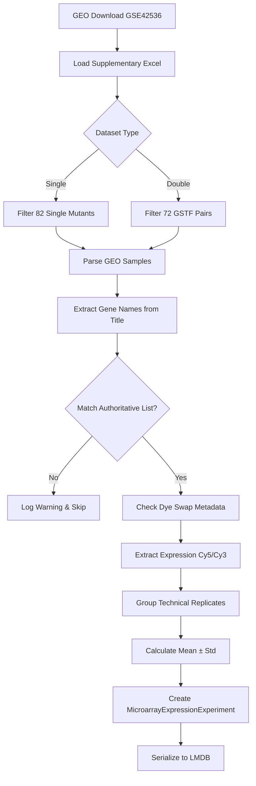

## Overview

Microarray gene expression datasets for single and double mutant yeast strains from Sameith et al. (2015). The study profiled 82 single deletion mutants and 72 double deletion mutant pairs of general stress transcription factors (GSTFs) in *Saccharomyces cerevisiae*.

**Data Source**: GEO accession GSE42536
**Publication**: Sameith et al. (2015) "A high-resolution gene expression atlas of epistasis between gene-specific transcription factors in *Saccharomyces cerevisiae*"
**DOI**: [10.1186/s12915-015-0222-5](https://doi.org/10.1186/s12915-015-0222-5)
**PubMed ID**: 26687005

## Datasets

### SmMicroarraySameith2015Dataset

Single mutant GSTF expression profiling dataset.

- **Genotypes**: 82 single deletion mutants
- **Samples**: 144 GEO samples (with technical replicates)
- **Strain**: BY4742 (MATa, from yeast deletion library)
- **Marker**: KanMX deletion
- **Platform**: Two-channel microarray (Cy5/Cy3)

### DmMicroarraySameith2015Dataset

Double mutant GSTF expression profiling dataset.

- **Expected Genotypes**: 72 GSTF pairs (from authoritative supplementary file)
- **Found in GEO**: 69 pairs (96% recovery)
- **Missing from GEO**: 3 pairs not uploaded to public database
  - YJL089W (Sip4) × YER184C
  - YGL209W (Mig2) × YGR067C
  - YJR127C (Rsf2) × YML081W
- **Samples**: ~140 GEO samples (with technical replicates)
- **Strains**: Mixed BY4742 (MATa) and BY4741 (MATα), extracted per-sample from Excel comments
- **Markers**: KanMX (first deletion), NatMX (second deletion, via SGA)
- **Platform**: Two-channel microarray (Cy5/Cy3)

## Data Structure

### Expression Measurements

Each experiment contains genome-wide expression data:

$$
\text{Expression}_{\text{mutant}} = \{\text{gene}_i \to \text{value}_i\}_{i=1}^{N_{\text{genes}}}
$$

$$
\text{Expression}_{\text{refpool}} = \{\text{gene}_i \to \text{value}_i\}_{i=1}^{N_{\text{genes}}}
$$

$$
\text{Log2Ratio} = \{\text{gene}_i \to \log_2\left(\frac{\text{mutant}_i}{\text{refpool}_i}\right)\}_{i=1}^{N_{\text{genes}}}
$$

Where $N_{\text{genes}} \approx 6169$ yeast genes measured on the microarray platform.

### Technical Replicates

The paper describes: "Each mutant was grown and profiled four times from two independent cultures"

- 2 biological replicates × 2 dye swaps = 4 technical measurements per genotype

Technical standard deviation calculated across replicates:

$$
\sigma_{\text{tech}}(\text{gene}_i) = \sqrt{\frac{1}{n-1} \sum_{j=1}^{n} (x_{ij} - \bar{x}_i)^2}
$$

Where $n$ is the number of technical replicates (typically 2-4) and $x_{ij}$ is the expression value for gene $i$ in replicate $j$.

## Implementation Details

### Dye Swap Handling

Two-channel microarrays use dye-swap replicates to correct for dye bias. The implementation checks metadata to determine channel assignment:

```python
source_ch1 = gsm.metadata.get('source_name_ch1', [''])[0]

if 'refpool' in source_ch1.lower():
    # Cy5 = refpool, Cy3 = mutant (SWAPPED)
    mutant_channel = 'Cy3'
    ratio_sign = -1  # Negate VALUE to get log2(mutant/refpool)
else:
    # Cy5 = mutant, Cy3 = refpool (NORMAL)
    mutant_channel = 'Cy5'
    ratio_sign = 1
```

The log2 ratio sign is adjusted to maintain consistent $\log_2(\text{mutant}/\text{refpool})$ convention across all samples.

### Gene Name Extraction

Gene names are extracted from GEO sample titles using regex patterns:

1. **Systematic names**: Pattern `r"\b(Y[A-P][LR]\d{3}[WC](?:-[A-Z])?)\b"`
   - Matches standard yeast gene names (e.g., YAL001C)
   - Includes optional suffix for genes like YBR089C-A (Nhp6B)

2. **Common names**: Pattern `r"\b([A-Z][A-Z0-9]{2,})\b"`
   - Extracts capitalized gene symbols (e.g., RPN4, MIG1)
   - Converted to systematic names via `SCerevisiaeGenome` mapping

**Bug Fixes Applied**:

- **Bug #1**: Validation regex now accepts genes with suffixes (e.g., `-A`, `-B`)
  - Before: `r"^Y[A-P][LR]\d{3}[WC]$"` rejected YBR089C-A
  - After: `r"^Y[A-P][LR]\d{3}[WC](-[A-Z])?$"` accepts YBR089C-A
  - Recovered: 2 additional pairs

- **Bug #2**: Extraction continues until 2 genes found (for double mutants)
  - Before: `if not gene_names:` (only tried common names if empty)
  - After: `if len(gene_names) < 2:` (tries common names until 2 found)
  - Handles mixed titles like "rpn4-del+ydr026c-del" (common + systematic)
  - Recovered: 4 additional pairs

### Authoritative Genotype Lists

The implementation uses supplementary Excel file `12915_2015_222_MOESM1_ESM.xlsx` as ground truth:

**For Single Mutants**:

- Sheet: "Single mutants - info"
- Filter: Rows with valid systematic names
- Total: 82 single mutants

**For Double Mutants**:

- Sheet: "Double mutants - info"
- Filter: `curation == "passed"`
- Total: 72 GSTF pairs
- Extracts per-sample strain from "comments" column:
  - "MATa" → BY4742
  - "MATα" or "matA" → BY4741

Only samples matching the authoritative lists are processed. Unmatched samples generate warnings.

### Technical Replicate Grouping

Samples are grouped by genotype (sorted tuple of gene names):

```python
# For double mutants
genotype_key = tuple(sorted([gene1, gene2]))
# Example: ('YAL001C', 'YBR030W')

# For single mutants
genotype_key = gene
# Example: 'YAL001C'
```

Within each group, expression values are averaged and standard deviations calculated:

$$
\bar{x}_i = \frac{1}{n}\sum_{j=1}^{n} x_{ij}
$$

$$
s_i = \sqrt{\frac{1}{n-1}\sum_{j=1}^{n}(x_{ij} - \bar{x}_i)^2}
$$

### Strain Assignment (Double Mutants)

Double mutants use mixed genetic backgrounds based on mating type compatibility:

- BY4742 (MATa): 63 pairs
- BY4741 (MATα): 9 pairs

Strain is extracted from Excel "comments" column and stored per-experiment in the genome reference.

## Data Flow


```mermaid
flowchart TD
    A[GEO Download GSE42536] --> B[Load Supplementary Excel]
    B --> C{Dataset Type}
    C -->|Single| D[Filter 82 Single Mutants]
    C -->|Double| E[Filter 72 GSTF Pairs]
    D --> F[Parse GEO Samples]
    E --> F
    F --> G[Extract Gene Names from Title]
    G --> H{Match Authoritative List?}
    H -->|No| I[Log Warning & Skip]
    H -->|Yes| J[Check Dye Swap Metadata]
    J --> K[Extract Expression Cy5/Cy3]
    K --> L[Group Technical Replicates]
    L --> M[Calculate Mean ± Std]
    M --> N[Create MicroarrayExpressionExperiment]
    N --> O[Serialize to LMDB]
```

## Phenotype Schema

Each experiment returns a `MicroarrayExpressionPhenotype` with:

```python
{
    'expression': SortedDict,                      # Mutant expression values (linear scale)
    'expression_log2_ratio': SortedDict,           # log2(mutant/refpool)
    'expression_log2_ratio_se': SortedDict,        # Standard error of log2 ratios
    'expression_log2_ratio_variance': SortedDict,  # Variance of log2 ratios
    'n_replicates': Dict[str, int],                # Number of replicates per gene
}
```

Reference phenotype uses refpool data:

```python
{
    'expression': SortedDict,                      # Reference pool expression
    'expression_log2_ratio': {gene: 0.0},          # Self-referential (log2(1) = 0)
    'expression_log2_ratio_se': None,              # No SE for self-reference
    'expression_log2_ratio_variance': None,        # No variance for self-reference
    'n_replicates': {gene: 1},                     # Reference is baseline (n=1)
}
```

## Genotype Schema

**Single Mutants**:

```python
Genotype(
    perturbations=[
        SgaKanMxDeletionPerturbation(
            systematic_gene_name='YAL001C',
            perturbed_gene_name='YAL001C',
            strain_id='KanMX_YAL001C'
        )
    ]
)
```

**Double Mutants**:

```python
Genotype(
    perturbations=[
        SgaKanMxDeletionPerturbation(
            systematic_gene_name='YAL001C',
            perturbed_gene_name='YAL001C',
            strain_id='KanMX_YAL001C'
        ),
        SgaNatMxDeletionPerturbation(
            systematic_gene_name='YBR030W',
            perturbed_gene_name='YBR030W',
            strain_id='NatMX_YBR030W'
        )
    ]
)
```

## Environment

All experiments use standard growth conditions:

- **Media**: SC (synthetic complete), liquid
- **Temperature**: 30°C

## Usage

```python
import os.path as osp
from dotenv import load_dotenv
from torchcell.datasets.scerevisiae import (
    SmMicroarraySameith2015Dataset,
    DmMicroarraySameith2015Dataset
)
from torchcell.sequence.genome.scerevisiae import SCerevisiaeGenome

# Setup environment
load_dotenv()
DATA_ROOT = os.getenv("DATA_ROOT")

# Initialize genome for gene name mapping (optional dependency injection)
genome = SCerevisiaeGenome(
    genome_root=osp.join(DATA_ROOT, "data/sgd/genome"),
    go_root=osp.join(DATA_ROOT, "data/go"),
    overwrite=True,
)

# Single mutants
sm_dataset = SmMicroarraySameith2015Dataset(
    root=osp.join(DATA_ROOT, "data/torchcell/sm_microarray_sameith2015"),
    genome=genome,  # Inject genome dependency
    io_workers=10,
    process_workers=0
)

print(f"Single mutants: {len(sm_dataset)}")  # 82
print(f"Genes measured: {len(sm_dataset.gene_set)}")  # ~6169

# Double mutants
dm_dataset = DmMicroarraySameith2015Dataset(
    root=osp.join(DATA_ROOT, "data/torchcell/dm_microarray_sameith2015"),
    genome=genome,  # Inject genome dependency
    io_workers=10,
    process_workers=0
)

print(f"Double mutants: {len(dm_dataset)}")  # 69
print(f"Genes measured: {len(dm_dataset.gene_set)}")  # ~6169

# Access experiment data
data = dm_dataset[0]
experiment = data['experiment']
reference = data['reference']

# Get genotype
perturbations = experiment['genotype']['perturbations']
gene1 = perturbations[0]['systematic_gene_name']
gene2 = perturbations[1]['systematic_gene_name']

# Get expression data
expression = experiment['phenotype']['expression']  # SortedDict (linear scale)
log2_ratios = experiment['phenotype']['expression_log2_ratio']  # SortedDict
log2_se = experiment['phenotype']['expression_log2_ratio_se']  # SortedDict
n_replicates = experiment['phenotype']['n_replicates']  # Dict[str, int]

# Check strain
strain = reference['genome_reference']['strain']  # BY4742 or BY4741
```

## Validation Results

Dataset validation confirmed:

- **Single mutants**: 82/82 from authoritative Excel list (100%)
- **Double mutants**: 69/72 from authoritative Excel list (96%)
  - 3 pairs confirmed missing from GEO upload
- **Technical replicates**: ~6169 genes with std values (indicating multiple measurements)
- **Gene name extraction**: Fixed to handle suffixes and mixed common/systematic names
- **Dye swap handling**: Verified correct sign adjustment for log2 ratios
- **Strain assignment**: Correctly extracts BY4742/BY4741 from Excel metadata

## Development Notes

The implementation went through several iterations to achieve proper data extraction:

1. **Initial implementation**: 63/72 double mutants (87.5%)
2. **After suffix bug fix**: 65/72 (90.3%)
3. **After extraction bug fix**: 69/72 (96%)
4. **Final validation**: 3 pairs confirmed missing from GEO (not dataset error)

Key challenges solved:

- Handling dye swaps in two-channel microarray data
- Extracting mixed common/systematic gene names from titles
- Validating against authoritative supplementary data
- Calculating technical std across heterogeneous replicates
- Assigning correct strain background per double mutant

## Files

**Implementation**: `torchcell/datasets/scerevisiae/sameith2015.py`
**Test file**: `tests/torchcell/datasets/scerevisiae/test_sameith2015.py`
**Registry**: Datasets registered via `@register_dataset` decorator

## Related Datasets

For fitness-based genetic interaction data, see:

- [[torchcell.datasets.scerevisiae.costanzo2016]]
- [[torchcell.datasets.scerevisiae.kuzmin2018]]

The Sameith2015 datasets provide expression-based epistasis data, enabling transcriptional analysis of genetic interactions between stress transcription factors.

## 2026.01.29 - Replicate Counting Philosophy

### Data-Driven n_replicates Computation

This dataset follows the principle of **computing `n_replicates` from raw data** rather than using paper-reported constants.

**Global constants in code** (lines 42-84 in `sameith2015.py`):

```python
N_EXPECTED_BIOLOGICAL_REPLICATES = 2
N_EXPECTED_DYE_SWAP_TECHNICAL_REPLICATES = 2
N_EXPECTED_MAX_REPLICATES_DELETION = 4
```

These constants are **documentation only** - they record what the paper reports about experimental design:

- Quote from paper: "Each mutant strain was grown twice, from two independently inoculated cultures. Each culture was expression-profiled in technical replicate to yield four measurements for each profiling mutant."
- Expected design: 2 biological replicates × 2 dye-swap measurements = 4 total
- Applies to BOTH single mutants (SmMicroarray) and double mutants (DmMicroarray)

**Actual implementation**: Code counts actual measurements per gene per deletion:

```python
# Example from processing logic
for gene, values in grouped_values.items():
    n_replicates[gene] = len(values)  # Count actual data points
```

**Why compute rather than use constants?**

1. **QC filtering**: Some samples may fail quality control (actual < 4)
2. **Data is authoritative**: Direct counts from GEO samples are ground truth
3. **Gene-specific variation**: Different genes may have different replicate counts
4. **Reference replicates**: WT reference pool measured in variable numbers of samples

**Technical Replicates Section Update**: The section "Technical Replicates" (lines 65-77) describes the paper's reported design. However, the actual `n_replicates` stored in `MicroarrayExpressionPhenotype` is **computed from data**:

- Typical value: ~4 (when all replicates pass QC)
- Can be less (2-3) if some technical replicates were filtered
- Reference pool: Varies by batch/day as WT samples are measured alongside mutants

**Reference pool replicates** (lines 82-83):

- `N_EXPECTED_REFPOOL_REPLICATES = None` (computed from data)
- Actual values depend on how many WT samples were profiled for batch effect monitoring
- Each experiment's reference phenotype uses computed replicate count from actual WT measurements

This approach enables validation (compare computed vs expected to detect issues) while ensuring data integrity across both single and double mutant datasets.

Related: [[torchcell.datamodels.schema#20260129---philosophy-around-n_replicates]]

## 2026.07.15 - Fix: per-array dye-orientation sign error (#72)

GSE42536 is a **dye-swap** design AND GEO declares **both** `#VALUE` ratio directions
within the series (132 arrays `log2(Cy5/Cy3)`, 127 `log2(Cy3/Cy5)`). The loader assumed a
single orientation and derived the sign from `source_name_ch1` alone, so **70/287 arrays
(24%) were signed backwards**; averaging mixed-sign replicates then attenuated the
magnitudes and inflated the SE.

**Fix:** ignore `VALUE`; recompute `log2(mutant / refpool)` directly from the
`Signal Norm_Cy5`/`Cy3` columns + the dye assignment (as `kemmeren2014` already does) --
orientation-proof by construction. Applied to all three extraction blocks
(`_extract_expression_from_gsm` in SM and DM, plus `_extract_expression_from_gsm_static`);
the `VALUE`/`ratio_sign`/`has_value` machinery is removed.

**Rebuilt + verified 2026.07.15** (deleted-gene oracle -- a deleted gene's own probe must
go DOWN):

| dataset | deleted-gene median log2 | frac_neg | (was) |
|---|---:|---:|---|
| SM (81 genes) | **-2.06** | **0.975** | -0.71 / 0.84 |
| DM (143 genes) | **-1.99** | **0.979** | -0.32 / 0.72 |
| Kemmeren (ref) | -2.48 | 0.970 | -- |

Now consistent with Kemmeren, so Sameith double-KO expression is usable as a
prediction target (previously excluded from the 018 DE comparison and the Fig 4
modeling plan pending this fix). The rebuild also gives the datasets fresh records
carrying `Media.is_synthetic` (they previously failed L0 structural, #92).

## 2026.09.27 - The mating-type to strain mapping is inverted (audit finding, not yet fixed)

The Phase 8 audit of [[tests.torchcell.datasets.scerevisiae.test_sameith2015_synthetic]] checked the strain mapping at sameith2015.py lines 954 to 957 against the paper and the SI. By standard nomenclature BY4741 is MATa and BY4742 is MATalpha. The paper (`paper.md`, sha256 7064a1eb...) states: "All single mutants and most double mutants carry the mating type matα and are in the genetic background of BY4742. Few double mutants carry the mating type matA and are in the genetic background of BY4741." The SI workbook (sha256 9521ad36...) has exactly four comments reading "MATa", all on passed pairs, and none reading "matA" or "MATα", so those two branches never fire. The loader maps "MATa" to BY4742, so all 72 passed pairs are stored as BY4742, including the four the paper places in BY4741. The inverted mapping appears in the loader's docstrings (lines 98 and 750, "BY4742, mata") and in this note's earlier sections, with no source; the "63 / 9 pairs" split stated above also does not match the current code on this workbook. The test pins the current behavior; a fix changes the stored strain of served records, so it waits for a decision (weekly note).

## 2026.09.28 - Strain mapping fixed on branch fix/kemmeren-sameith-channel-strain (not yet served)

The 2026.09.27 finding was re-checked against three sources before anything was changed, because the datasets had been worked over carefully and the Kemmeren cross-study correlation had given confidence in them. The paper (`paper.md` in the mirror): "All single mutants and most double mutants carry the mating type matα and are in the genetic background of BY4742. Few double mutants carry the mating type matA and are in the genetic background of BY4741." The SI sheet "Double mutants - info" has exactly four comments reading `MATa` (one with a trailing space), on the passed pairs HAC1+SNT1, SNT1+SPT2, CUP2+HAA1 and SIP4+YER184C. GEO GSE42536 carries `strain: BY4741` on exactly four samples per channel, whose genotypes are `haa1-del+cup2-del-matA`, `snt1-del+hac1-del-matA`, `snt1-del+spt2-del-matA` and `yer184c-del+sip4-del-matA`; the other 283 per channel say `strain: BY4742`. The three agree with each other and with standard nomenclature (BY4741 is MATa), and the dev-tree LMDB `dm_microarray_sameith2015` (72 records) stores all 72 as BY4742, the four included (session scratchpad `lmdb_self_probe.py`, 2026.09.28).

The fix, in `_load_authoritative_gstf_pairs`: a comment containing `matα` or `matalpha` (case-insensitive) maps to BY4742, otherwise one containing `mata` maps to BY4741, otherwise BY4742; `mata` is a prefix of `matalpha`, hence the order. The single-mutant loader keeps BY4742 for every record, as the paper states. Effect on the served graph: `genome_reference.strain` changes on 4 of the 72 double-mutant records, so those four experiment ids (content hashes) change and nothing else; no expression value moves, and the single-mutant dataset is unchanged.

A changed record is not a superset, so the served store cannot take this as an increment; re-admission waits for the next build (issue `#459`), by decision of 2026.09.28 (fix left on the branch, PR open). Tests: [[tests.torchcell.datasets.scerevisiae.test_sameith2015_synthetic]] now expects BY4741 for the `MATa strain` fixture pair, and its two double-mutant records share one reference.

## 2026.09.29 - Independent re-verification

A read-only Fable 5.1 agent graded seven recorded claims against the mirror, the SI workbook, all 287 GEO sample records and the dev LMDBs: CONFIRMED 3, REFUTED 1, PARTLY 3, UNVERIFIABLE 0. Consolidated in [[datasets.showcase-verification.2026.09.29]]; raw report `notes/assets/verification/2026.09.29/sameith2015.md`.

- Refuted: "69 of 72 pairs found, 3 missing from GEO" (sections above). All three pairs have arrays (GSM1044629/30, GSM1044636/37, GSM1044642/43) and the dev DM LMDB has 72 records.
- The mating-type finding of 2026.09.27 is confirmed by the paper, the SI and GEO (`strain: BY4741` on exactly the 8 arrays of the four MATa pairs).
- Every record stores PubMed ID 26687005 (an eLife paper); Sameith 2015 is PMID 26700642. #478 (before the next build).
- The SM dataset folds all 143 double-mutant arrays into 45 of its 82 records (`n_replicates` up to 14), 8 of them onto the second gene of the title. #479 (before the next build).
- The loader's replicate quotations attributed to "Sameith et al. 2015, Cell Reports" are Kemmeren 2014's; Sameith's Methods defer to it as ref [46]. The "132/127" VALUE header count in the 2026.07.15 section omits 28 arrays; numerically 217 arrays are log2(Cy5/Cy3) and 70 log2(Cy3/Cy5), with the header contradicting the numbers on those 70. #481.
- "Four measurements" is 2 arrays x 2 probes; GSE42536 holds at most 2 arrays per mutant (20 singles have 1). #482.
- The KanMX-first / NatMX-second marker assignment on double mutants has no source (the paper names haploid transformation, random spore analysis or tetrad dissection), and six singles are lab remakes. #480.
- The reference RNA is BY4742 wild type on all 287 arrays, so after the strain fix the four BY4741 records' `genome_reference` differs from the reference RNA's strain; a schema decision raised on PR #460.

## 2026.10.02 - main() builds the genome with overwrite=False

`main()` constructed `SCerevisiaeGenome(..., overwrite=True)`, an explicit rebuild of the shared `data.db` on every run. It now passes `overwrite=False` (PR #605), which opens the verified shared database, or builds/migrates it once, under the root lock.

## 2026.10.02 - PubMed ID and the single-mutant title rule (#478, #479)

Branch `fix/sameith-kemmeren-replicates`, not yet served. Numbers below are from `experiments/036-dataset-fixes-before-kg-build/scripts/sameith2015_sm_replicates.py`, which builds both datasets into a session scratch root from the dev tree's `raw/` files and reads the dev-tree stores `data/torchcell/{sm,dm}_microarray_sameith2015` read-only; output `experiments/036-dataset-fixes-before-kg-build/results/sameith2015_sm_replicates.json` and `sameith2015_sm_replicates_records.csv`.

### #478: PubMed ID

- Wrong: both `Publication` objects stored PubMed 26687005, an unrelated eLife 2015 paper; the DOI fields were right.
- Source for the fix: the GEO series file the loaders read, `GSE42536_family.soft.gz` (sha256 `f8842af9768043fde560fa7cab737cde2fca0463c4b655511d54678d7b85cc7d`, identical in the SM and DM dev `raw/`), decompressed line 12: `!Series_pubmed_id = 26700642`. No live fetch.
- Fix: module constant `SAMEITH2015_PUBMED_ID = "26700642"` with that citation in its comment, used by both loaders for `pubmed_id` and `pubmed_url`.
- Measured: dev stores carry `26687005` on all 82 SM and all 72 DM records; the scratch builds carry `26700642` on all of them.

### #479: double-deletion arrays folded into single-mutant records

- Wrong: the SM `_extract_gene_names_from_title` returned `gene_names[:1]`, so a title like `rpn4-del+ydr026c-del` yielded one gene and `is_single = len(gene_names) == 1` classed it as a single mutant. Measured on the dev SM store: all 287 arrays of GSE42536 entered the SM build (`preprocess/data.csv` 287 rows, 143 with `+`), and 45 of 82 records averaged 3 to 14 arrays (YDL020C 14, YER040W 12, YJR060W 10, YGL035C 8, YGR067C 7).
- Fix: the SM parser now returns every gene a title names (systematic names, then resolved common names, no truncation), and `process()` keeps an array as a single mutant only when its title names exactly one gene and contains no `+`. Every other non-wildtype array is dropped under the named rule `double_deletion_title`, counted on `self.dropped_double_deletion_titles` and logged. The `+` test is there so a double title whose partner does not resolve is still not a single mutant. The DM loader is unchanged.
- Measured after the fix (scratch build): 82 records, 143 arrays dropped under `double_deletion_title`, `preprocess/data.csv` 144 rows with 0 `+` titles; arrays per record 2 on 62 records and 1 on 20, none above 2; 45 records changed their array count, and the gene set is unchanged.

| store | records | arrays per record | records > 2 arrays | own-gene log2 < 0 | own-gene median |
|---|---:|---|---:|---:|---:|
| SM dev (before) | 82 | 1: 11, 2: 26, 3: 9, 4: 20, 6: 11, 7 to 14: 5 | 45 | 0.975 (79 of 81) | -2.058 |
| SM scratch (after) | 82 | 1: 20, 2: 62 | 0 | 0.975 (79 of 81) | -2.217 |
| DM dev / scratch | 72 | unchanged | n/a | 0.979 (140 of 143) | -1.985 |

- The own-gene sign check (the deleted gene's own stored `expression_log2_ratio`, 81 records whose gene has a probe) keeps the same fraction negative; the median moves from -2.058 to -2.217, so the folded double-deletion arrays had pulled the single-mutant self ratios toward zero.
- Tests: [[tests.torchcell.datasets.scerevisiae.test_sameith2015_synthetic]] drops the YCR001W single record that came from the `ycr001w-del+ydr001c-del` fixture array, adds a `+` title with an unresolvable partner, pins the parser output and the drop count, and pins PubMed 26700642 on every SM and DM record.

### Served-record impact and open items

- Every served record of both datasets changes content (the PubMed ID), and 45 SM records change values, `n_replicates` and SE. Re-admission goes with the next full build (#459).
- Open, not part of #479: the reference `n_replicates` of both Sameith loaders is a constant 1 per gene while the reference `expression` is the refpool mean over the record's 1 or 2 arrays; this is the same mismatch #484 fixes for Kemmeren and needs its own issue. The `"wt" in title` hazard has no instance in GSE42536 (0 wildtype arrays found by the build). #480, #481 and #482 are untouched.

## 2026.10.02 - Reference n_replicates counts the refpool arrays (issue #630)

Branch `fix/sameith-reference-replicates`, not yet served.

- Wrong: both loaders stored the reference `phenotype_reference.n_replicates` as a constant 1 per gene, while the stored reference `expression` is the mean refpool-channel signal over the record's own arrays. The count described no stored value. Same mismatch as #484 in [[torchcell.datasets.scerevisiae.kemmeren2014]].
- Decision (mirrors `kemmeren2014.create_expression_experiment`): the reference `n_replicates` of a gene is the number of arrays whose refpool value entered that gene's reference `expression` mean. `_process_sequential` (SM and DM) and `_process_batch` (DM, parallel) already computed it as `refpool_n` from `_calculate_replicate_statistics(all_refpool_data)` and discarded it; they now pass it as the required keyword `refpool_n_replicates` to `create_single_mutant_expression_experiment` / `create_double_mutant_expression_experiment`. It is per gene, so a gene missing from one of a record's two arrays counts 1, not the record's array count. The unused placeholder `N_EXPECTED_REFPOOL_REPLICATES = None` is removed. The module comment at the reference pool quotes now records the decision: neither the WT RNA batch nor the additional WT cultures the paper names is a stored value.
- Measured with `experiments/036-dataset-fixes-before-kg-build/scripts/sameith2015_reference_replicates.py`. It builds both datasets twice into the session scratch root from the dev tree's `raw/` files: once with the pre-#630 loader (baseline, already carrying #478/#479), once with the fix. It also reads the dev stores `data/torchcell/{sm,dm}_microarray_sameith2015` read-only (built before #478/#479). Output `experiments/036-dataset-fixes-before-kg-build/results/sameith2015_reference_replicates.json`.

| store | records | reference n entries (record x gene) | largest reference n per record | records whose reference n equals the experiment n |
|---|---:|---|---|---:|
| SM dev | 82 | 1: 505,858 | 1: 82 | 11 |
| SM baseline (pre-#630) | 82 | 1: 505,858 | 1: 82 | 20 |
| SM scratch (after) | 82 | 1: 123,380, 2: 382,478 | 1: 20, 2: 62 | 82 |
| DM dev | 72 | 1: 444,168 | 1: 72 | 1 |
| DM baseline (pre-#630) | 72 | 1: 444,168 | 1: 72 | 1 |
| DM scratch (after) | 72 | 1: 6,169, 2: 437,999 | 1: 1, 2: 71 | 72 |

- Experiment side unchanged: baseline vs scratch, all 82 SM and all 72 DM records have an identical `experiment`, `publication` and reference `expression`; the reference differs only in `n_replicates` on 62 SM and 71 DM records (the 20 single-array SM records and the 1 single-array DM record keep 1). On GSE42536 no gene has a reference count below its record's largest count (0 entries in every store), so the per-gene path is exercised only by the synthetic test.
- Tests: [[tests.torchcell.datasets.scerevisiae.test_sameith2015_synthetic]] expects reference counts equal to the arrays in each refpool mean (YAL001C SM record 2, the D1 + D2 DM pair 2, single-array records 1). The two DM fixture pairs no longer share one reference (index `[[0], [1]]`), since their counts differ. A new test builds a two-array SM record and a two-array DM record whose second array has no YBR001C row and pins reference `n_replicates` {YAL001C 2, YBR001C 1, YCR001W 2} with reference `expression` {1.5, 4.0, 2.0}.
- Served-record impact: 62 of 82 SM and 71 of 72 DM records change reference content (`phenotype_reference.n_replicates`), not every record as the issue text estimated; experiment phenotypes are unchanged. Re-admission goes with the next full build (#459), together with #478/#479.
- Open: "arrays" here are the GEO arrays per record (1 or 2), not the paper's four measurements per mutant (two arrays times two spots per gene); the spot question and the 4-array constants are #482, untouched here.

## 2026.10.06 - Demo main moved to torchcell/scratch/sameith2015_demo.py

The `main` of `torchcell/datasets/scerevisiae/sameith2015.py` built or loaded both Sameith2015 datasets (double mutants and the BY4742 single mutants) and printed a summary. It moved verbatim, with its `if __name__ == "__main__":` block, to `torchcell/scratch/sameith2015_demo.py`; run it from the repo root with `PYTHONPATH=$PWD python torchcell/scratch/sameith2015_demo.py` (it needs `DATA_ROOT` in `.env` with the SGD genome and GO data). The module's `from dotenv import load_dotenv`, used only by `main`, was dropped. Executing the module directly now exits with a pointer to the demo. Reason: demo code is not library code (test campaign Phase 23).

## 2026.10.10 - Refusing resolution of title tokens (issue #886)

Both classes' `_convert_to_systematic` tried the gene table's `gene` column, then its single-valued `Alias` column, then the first `alias_to_systematic` candidate. They now call the module-level `convert_title_token`, which returns a systematic-shaped token upper-cased, returns None for a token with no candidate ORF (a title word, not a gene: `MATA` and `REP` in GSE42536), and sends everything else through `resolve_gene_name_strict` ([[torchcell.datasets.gene_alias_resolution]]), so an ambiguous token without a pin raises `GeneNameRefused`. Every (token, ORF) resolution is recorded, and `_check_title_resolutions` runs `check_ambiguous_aliases` over them after the title loop, before any record is written.

Measured over every title of GSE42536 on 2026.10.10 (84 distinct tokens): two are ambiguous in R64-4-1, `SUT2` (YMR080C, YPR009W) in 4 arrays and `GAT1` (YFL021W, YKR067W) in 6, all double-deletion titles. `AMBIGUOUS_ALIAS_PINS` pins them to their R64 standard-name owners (rule `sgd_standard_name`, quotes `ID=YPR009W;Name=YPR009W;gene=SUT2;` and `ID=YFL021W;Name=YFL021W;gene=GAT1;`). The paper's own list agrees: Additional file 1, sheet `List of 215 GSTFs`, rows `Ypr009W | Sut2` and `Yfl021W | Gat1`. The SI is not sha256-pinned by this loader (it is on the `UNPINNED_LOADERS` debt list of `test_raw_pins.py`), so the pins cite the hash-pinned GFF rather than the SI.

The old code reached the same ORFs through the standard-name column, so 0 of the 84 tokens resolve differently. Builds of both classes from this branch into scratch roots, from the same raw files, match the dev stores record for record (82 of 82 single, 72 of 72 double, 0 fields changed); neither dev store was rebuilt, and `--list-stale --include-private` names neither.

L0-L4 on the dev stores (`run_expression`; reports under `data/torchcell/{sm,dm}_microarray_sameith2015/preprocess/verification_report.json`):

| Store | Level | Rule | Result | Message |
|---|---|---|---|---|
| sm | L0 | `structural` | PASS | 82 records validated |
| sm | L1 | `count` | PASS | observed 82, expected 82 |
| sm | L1 | `gene_completeness` | PASS | all 82 records measure the full 6169-gene universe |
| sm | L2 | `value_fidelity` | PASS | 505858 values checked |
| sm | L2 | `se_nonnegative` | PASS | 505858 values checked |
| sm | L2 | `n_replicates_ge_1` | PASS | 505858 values checked |
| sm | L3 | `reference_log2_zero` | PASS | reference log2(sample/ref) == 0 for all 505858 values |
| sm | L3 | `deletion_downregulates` | PASS | median deleted-gene log2=-2.217; frac_neg=0.975 over 81 deleted genes (1 absent from the platform map) |
| sm | L4 | `gene_universe_vs_dm_microarray_sameith2015` | PASS | 6169 overlapping entities agree within 0.0 |
| dm | L0 | `structural` | PASS | 72 records validated |
| dm | L1 | `count` | PASS | observed 72, expected 72 |
| dm | L1 | `gene_completeness` | PASS | all 72 records measure the full 6169-gene universe |
| dm | L2 | `value_fidelity` | PASS | 444168 values checked |
| dm | L2 | `se_nonnegative` | PASS | 444168 values checked |
| dm | L2 | `n_replicates_ge_1` | PASS | 444168 values checked |
| dm | L3 | `reference_log2_zero` | PASS | reference log2(sample/ref) == 0 for all 444168 values |
| dm | L3 | `deletion_downregulates` | PASS | median deleted-gene log2=-1.985; frac_neg=0.979 over 143 deleted genes (1 absent from the platform map) |

The double-mutant runner declares no L4 rule; the single-mutant store's L4 compares the two Sameith universes. The `deletion_downregulates` messages are shortened (the report adds "(<0 => correct orientation)").
