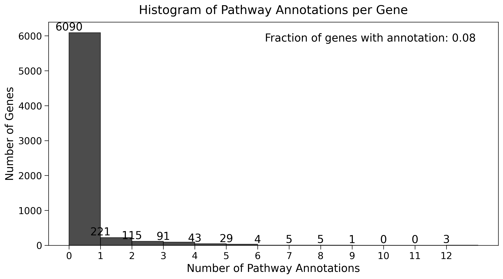

```python
(torchcell) michaelvolk@M1-MV torchcell % python torchcell/datasets/sgd_gene_graph_hot.py                           17:07
data/go/go.obo: fmt(1.2) rel(2024-01-17) 45,869 Terms
Processing model: normalized_chrom_pathways
Total unique chromosomes: 17
Total unique pathways: 173
Completed processing for model: normalized_chrom_pathways
Sample data point: Data(
  id='Q0010',
  embeddings={ normalized_chrom_pathways=[1, 7] },
  chromosome_index=[1],
  pathways_indices=[0]
)

Completed processing for model: normalized_chrom_pathways
Processing model: normalized_chrom
Total unique chromosomes: 17
Total unique pathways: 173
Completed processing for model: normalized_chrom
Sample data point: Data(
  id='Q0010',
  embeddings={ normalized_chrom=[1, 24] }
)

Completed processing for model: normalized_chrom
Processing model: chrom_pathways
Total unique chromosomes: 17
Total unique pathways: 173
Completed processing for model: chrom_pathways
Sample data point: Data(
  id='Q0010',
  embeddings={ chrom_pathways=[1, 197] }
)

Completed processing for model: chrom_pathways
Processing model: chrom
Total unique chromosomes: 17
Total unique pathways: 173
Completed processing for model: chrom
Sample data point: Data(
  id='Q0010',
  embeddings={ chrom=[1, 24] }
)

Completed processing for model: chrom
Total unique chromosomes: 17
Total unique pathways: 173
len dataset: 6607
Number of data points with no pathway annotation: 6090
Pathway counts:
Number of pathways: 0.0, Frequency: 6090
Number of pathways: 1.0, Frequency: 221
Number of pathways: 2.0, Frequency: 115
Number of pathways: 3.0, Frequency: 91
Number of pathways: 4.0, Frequency: 43
Number of pathways: 5.0, Frequency: 29
Number of pathways: 6.0, Frequency: 4
Number of pathways: 7.0, Frequency: 5
Number of pathways: 8.0, Frequency: 5
Number of pathways: 9.0, Frequency: 1
Number of pathways: 12.0, Frequency: 3
```

Print out matches the raw data.


