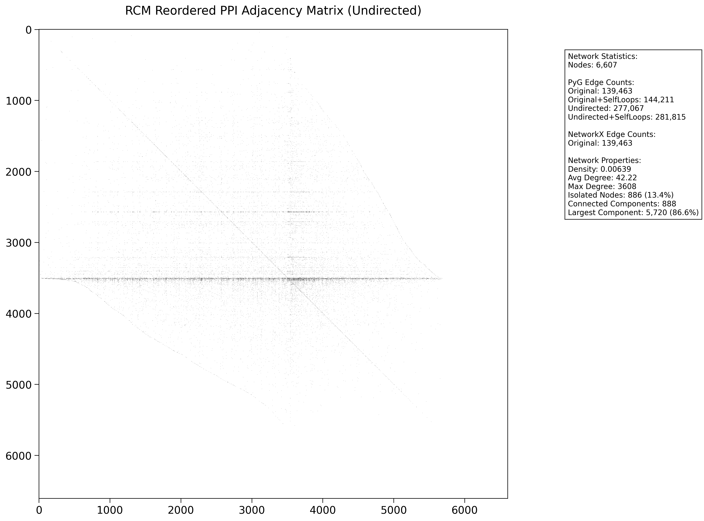

- PPI - note the differences when we add self loops. Many PPI have self loops.

- REG - note the differences when we add self loops and we make it undirected. Since `pyg` has `edge_index` object making undirected makes this vector bigger as we actually add edges both ways.
