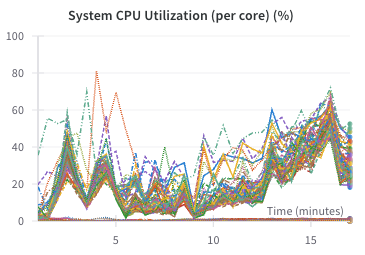

## 2024.03.24 - SSL Apptainer Bug

The code works in docker container but not in my apptainer...

```bash
 [2024-03-24 20:45:21,035][__main__][INFO] - Number of workers: 16
[2024-03-24 20:45:21,062][__main__][INFO] - Instantiating dataset: SmfCostanzo2016Dataset
[2024-03-24 20:45:21,067][__main__][INFO] - Instantiating dataset: SmfKuzmin2018Dataset
[2024-03-24 20:45:21,069][__main__][INFO] - Instantiating dataset: DmfKuzmin2018Dataset
[2024-03-24 20:45:21,071][__main__][INFO] - Instantiating dataset: TmfKuzmin2018Dataset
[2024-03-24 20:45:21,077][__main__][INFO] - Instantiating dataset: DmfCostanzo2016Dataset
[2024-03-24 20:45:21,088][__main__][INFO] - Writing nodes for adapter: SmfCostanzo2016Adapter
Error executing job with overrides: []
Traceback (most recent call last):
  File "/miniconda/envs/myenv/lib/python3.11/urllib/request.py", line 1348, in do_open
    h.request(req.get_method(), req.selector, req.data, headers,
  File "/miniconda/envs/myenv/lib/python3.11/http/client.py", line 1298, in request
    self._send_request(method, url, body, headers, encode_chunked)
  File "/miniconda/envs/myenv/lib/python3.11/http/client.py", line 1344, in _send_request
    self.endheaders(body, encode_chunked=encode_chunked)
  File "/miniconda/envs/myenv/lib/python3.11/http/client.py", line 1293, in endheaders
    self._send_output(message_body, encode_chunked=encode_chunked)
  File "/miniconda/envs/myenv/lib/python3.11/http/client.py", line 1052, in _send_output
    self.send(msg)
  File "/miniconda/envs/myenv/lib/python3.11/http/client.py", line 990, in send
    self.connect()
  File "/miniconda/envs/myenv/lib/python3.11/http/client.py", line 1470, in connect
    self.sock = self._context.wrap_socket(self.sock,
                ^^^^^^^^^^^^^^^^^^^^^^^^^^^^^^^^^^^^
  File "/miniconda/envs/myenv/lib/python3.11/ssl.py", line 517, in wrap_socket
    return self.sslsocket_class._create(
           ^^^^^^^^^^^^^^^^^^^^^^^^^^^^^
  File "/miniconda/envs/myenv/lib/python3.11/ssl.py", line 1104, in _create
    self.do_handshake()
  File "/miniconda/envs/myenv/lib/python3.11/ssl.py", line 1382, in do_handshake
    self._sslobj.do_handshake()
ssl.SSLCertVerificationError: [SSL: CERTIFICATE_VERIFY_FAILED] certificate verify failed: unable to get local issuer certificate (_ssl.c:1006)

During handling of the above exception, another exception occurred:

Traceback (most recent call last):
  File "/miniconda/envs/myenv/lib/python3.11/site-packages/torchcell/knowledge_graphs/create_scerevisiae_kg.py", line 179, in main
    bc.write_nodes(adapter.get_nodes())
  File "/miniconda/envs/myenv/lib/python3.11/site-packages/biocypher/_core.py", line 277, in write_nodes
    self._get_writer()
  File "/miniconda/envs/myenv/lib/python3.11/site-packages/biocypher/_core.py", line 234, in _get_writer
    translator=self._get_translator(),
               ^^^^^^^^^^^^^^^^^^^^^^
  File "/miniconda/envs/myenv/lib/python3.11/site-packages/biocypher/_core.py", line 214, in _get_translator
    ontology=self._get_ontology(),
             ^^^^^^^^^^^^^^^^^^^^
  File "/miniconda/envs/myenv/lib/python3.11/site-packages/biocypher/_core.py", line 199, in _get_ontology
    self._ontology = Ontology(
                     ^^^^^^^^^
  File "/miniconda/envs/myenv/lib/python3.11/site-packages/biocypher/_ontology.py", line 402, in __init__
    self._main()
  File "/miniconda/envs/myenv/lib/python3.11/site-packages/biocypher/_ontology.py", line 411, in _main
    self._load_ontologies()
  File "/miniconda/envs/myenv/lib/python3.11/site-packages/biocypher/_ontology.py", line 436, in _load_ontologies
    self._head_ontology = OntologyAdapter(
                          ^^^^^^^^^^^^^^^^
  File "/miniconda/envs/myenv/lib/python3.11/site-packages/biocypher/_ontology.py", line 97, in __init__
    self._rdf_graph = self._load_rdf_graph(ontology_file)
                      ^^^^^^^^^^^^^^^^^^^^^^^^^^^^^^^^^^^
  File "/miniconda/envs/myenv/lib/python3.11/site-packages/biocypher/_ontology.py", line 302, in _load_rdf_graph
    g.parse(ontology_file, format=self._get_format(ontology_file))
  File "/miniconda/envs/myenv/lib/python3.11/site-packages/rdflib/graph.py", line 1470, in parse
    source = create_input_source(
             ^^^^^^^^^^^^^^^^^^^^
  File "/miniconda/envs/myenv/lib/python3.11/site-packages/rdflib/parser.py", line 416, in create_input_source
    ) = _create_input_source_from_location(
        ^^^^^^^^^^^^^^^^^^^^^^^^^^^^^^^^^^^
  File "/miniconda/envs/myenv/lib/python3.11/site-packages/rdflib/parser.py", line 478, in _create_input_source_from_location
    input_source = URLInputSource(absolute_location, format)
                   ^^^^^^^^^^^^^^^^^^^^^^^^^^^^^^^^^^^^^^^^^
  File "/miniconda/envs/myenv/lib/python3.11/site-packages/rdflib/parser.py", line 285, in __init__
    response: addinfourl = _urlopen(req)
                           ^^^^^^^^^^^^^
  File "/miniconda/envs/myenv/lib/python3.11/site-packages/rdflib/parser.py", line 272, in _urlopen
    return urlopen(req)
           ^^^^^^^^^^^^
  File "/miniconda/envs/myenv/lib/python3.11/urllib/request.py", line 216, in urlopen
    return opener.open(url, data, timeout)
           ^^^^^^^^^^^^^^^^^^^^^^^^^^^^^^^
  File "/miniconda/envs/myenv/lib/python3.11/urllib/request.py", line 519, in open
    response = self._open(req, data)
               ^^^^^^^^^^^^^^^^^^^^^
  File "/miniconda/envs/myenv/lib/python3.11/urllib/request.py", line 536, in _open
    result = self._call_chain(self.handle_open, protocol, protocol +
             ^^^^^^^^^^^^^^^^^^^^^^^^^^^^^^^^^^^^^^^^^^^^^^^^^^^^^^^
  File "/miniconda/envs/myenv/lib/python3.11/urllib/request.py", line 496, in _call_chain
    result = func(*args)
             ^^^^^^^^^^^
  File "/miniconda/envs/myenv/lib/python3.11/urllib/request.py", line 1391, in https_open
    return self.do_open(http.client.HTTPSConnection, req,
           ^^^^^^^^^^^^^^^^^^^^^^^^^^^^^^^^^^^^^^^^^^^^^^
  File "/miniconda/envs/myenv/lib/python3.11/urllib/request.py", line 1351, in do_open
    raise URLError(err)
urllib.error.URLError: <urlopen error [SSL: CERTIFICATE_VERIFY_FAILED] certificate verify failed: unable to get local issuer certificate (_ssl.c:1006)>

Set the environment variable HYDRA_FULL_ERROR=1 for a complete stack trace.
wandb: WARNING No program path found, not creating job artifact. See https://docs.wandb.ai/guides/launch/create-job
```

We fixed this bug with the following:

```python
os.environ["SSL_CERT_FILE"] = certifi.where()
```

## 2024.03.25 - Some Cpus Not Utilized Because How We Set Workers

I think that we just set process workers to max, then threads to some percentage of process workers.


