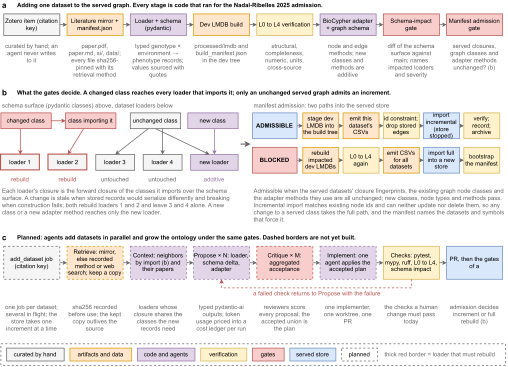

## 2026.09.11 - The loop, as a figure and as a plan

Supplementary figure `FigS-dataset-admission-loop` (source `notes/assets/drawio/FigS-dataset-admission-loop.drawio`, placed in `paper/nature-biotech/sections/backmatter.tex` after the knowledge-graph normalization figure) shows three things: the admission path one dataset takes today, what the two gates decide, and the agent loop that is planned but not built. Panels a and b are drawn from the code as it ran for the Nadal-Ribelles 2025 admission ([[torchcell.knowledge_graphs.incremental-admission]], GilaHyper job 1722). Panel c is a plan.

### What runs today (panels a and b) and where it lives

| stage | code | what it produces |
|---|---|---|
| Zotero item | curated by hand; `torchcell/literature/zotero.py` reads it | citation key, DOI, attachments |
| literature mirror | `torchcell/literature/{capture,retrieve,si_data,manifest}.py`, nightly `scripts/lit_sync.py` | `$DATA_ROOT/torchcell-library/<key>/` with `manifest.json` (sha256 + `RetrievalRecord` per file) |
| loader + schema | `torchcell/datasets/scerevisiae/<key>.py`, `torchcell/datamodels/schema.py` | typed records; sourced values carry quote + sha256 |
| dev LMDB build | `torchcell/database/build_dataset_lmdb.py` | `processed/lmdb`, `build_manifest.json` |
| L0 to L4 | `torchcell/verification/levels.py` and the per-modality verifiers | `VerificationReport` |
| adapter + graph schema | `torchcell/adapters/<key>_adapter.py`, `torchcell/adapters/conf/*.yaml`, `biocypher/config/torchcell_schema_config.yaml` | node and edge methods |
| schema-impact gate | `torchcell/provenance/schema_impact.py` (pre-commit via `scripts/schema_impact_check.py`) | `ImpactReport`: changed symbols, `ChangeKind` stale or breaking, impacted loaders |
| closure by import | `torchcell/provenance/schema_deps.py` (`loader_closure`, `forward_closure`, `symbol_dependents`) | each loader's dependency closure over the schema surface |
| manifest admission | `torchcell/knowledge_graphs/kg_manifest.py` (`admit`, `record`, `bootstrap`) | `AdmissionReport`; store manifest `$BUILD_ROOT/database/kg_manifest.json` |
| increment | `torchcell/knowledge_graphs/incremental_import.py`, `database/slurm/scripts/gilahyper_increment_kg-slurm_docker.slurm` | `neo4j-admin database import incremental` against the stopped store |
| full rebuild | `torchcell/knowledge_graphs/create_scerevisiae_kg_small.py` in `full` mode, `database/slurm/scripts/gilahyper_build_kg-slurm_docker.slurm` | a new store, then `kg_manifest bootstrap` |

The rule the figure states: a class that is imported elsewhere is never edited in place for one dataset. The schema-impact gate names the loaders whose closure holds the changed symbol; those datasets rebuild; the admission gate refuses an increment until the served closures match again. A new class, node type or adapter method is additive and passes.

### Mirror audit (asked: do we mirror large data assets?)

Yes, partly. Census over the 603 manifests in `$DATA_ROOT/torchcell-library/` (11 GB total): PDFs and OCR are about 5.5 GB; supplements and data under `si/` and `data/` are about 4.8 GB, the largest slice, including the 1011-genomes assemblies (`peterGenomeEvolution10112018/data/1011Assemblies.tar.gz`, 4.0 GB), the Caudal 2024 tables, the SCMD 2005 data and the Ho 2021 SI data (5 files, 24.7 MB). Roles come from the path (`torchcell/literature/manifest.py`, `_role_for`): `si_data` for anything under `si/`, `raw_data` under `data/`. A `software/` role is described in CLAUDE.md but not implemented (one file, tagged `other`).

The raw-data side is thinner than CLAUDE.md promises:

- A separate raw mirror exists at `$DATA_ROOT/torchcell-raw/` (1.5 GB, three keys: Hoepfner 2014, Nadal-Ribelles 2025, She 2018) with no `manifest.json`; provenance lives in loader constants.
- Of 39 loader modules, 19 read a local hash-pinned mirror and verify sha256, 9 download live and verify a pinned sha256, and 7 modules (Costanzo 2016, Kuzmin 2018, Kuzmin 2020, Kemmeren 2014, Sameith 2015, SGD, SynthLethDB, together 19 of the 36 served datasets) download from a live URL with no hash at all. None uses the pydantic `RetrievalRecord`; the literature pipeline is its only consumer.
- Backup: `/bulk/torchcell-library` (11 GB, 583 of 604 keys) was a one-shot copy by `scripts/migrate_storage_tiers.sh` on 2026-08-23; nothing in `scripts/crontab.txt` refreshes it, nothing copies `torchcell-raw/`, and no Taiga copy of either exists.

Implications for the plan: every loader should reference an `ArtifactRecord` (source URL, retriever, params, sha256) so a rebuild verifies bytes before parsing; the seven unhashed modules are the first to fix; a scheduled rsync of both mirrors to `/bulk` and one off-machine copy close the backup gap.

### The planned agent loop (panel c), with pydantic-ai

The pattern is lifted from iBioFoundry-AI, which pins `pydantic-ai>=2.26,<2.27` and has run this shape in production:

- **Roles, not models.** `ibiofoundry_ai/model_config.py` builds a `Model` per named role from a tier table keyed on which API key is present; every agent calls `build_role_model(role)` lazily so a missing key is not an import error. torchcell roles: `retriever`, `proposer`, `critic`, `implementer`, `judge`.
- **Single-shot structured roles.** `ibiofoundry_ai/reasoning_roles.py`: tool-less agents with `output_type=<pydantic model>`, `retries=2`, `UsageLimits(request_limit=4)`, `deps: Any` to avoid import cycles, and usage folded into a sink. The proposer's output is a `DatasetProposal` (loader source, schema delta as a list of `SymbolChange`-shaped edits, adapter methods, sourced values with quotes); the critic's output is a `ProposalReview` (per-item accept or reject with a reason); the accepted union becomes the plan the implementer applies.
- **Critique, route, repair, re-critique, cap.** `ibiofoundry_ai/tools/protocol.py` re-runs the critic every round, routes findings to disjoint units and repairs them concurrently, at most three rounds. The unit here is one file (loader, schema, adapter, test).
- **Invariant-checked judge.** `ibiofoundry_ai/simulated_user/judge.py` asserts structural invariants on the judge's output and resamples once with an identical prompt. For a dataset the invariants are mechanical: pytest, mypy, ruff, L0 to L4 and the schema-impact gate must pass before a proposal counts as implemented.
- **Cost.** `ibiofoundry_ai/pricing.py` (four-bucket cache-aware formula over `RunUsage`, fail-closed `require_priced()`), `session_usage.py` (atomic, locked, idempotent per-turn ledger) and `turn_budget.py` (lowers `request_limit` to keep a projected cost under a cap). Each `add_dataset` job gets a ledger and a cap; the ledger is part of the job's artifact.
- **Keys.** Loaded from the repo-root `.env` (`ANTHROPIC_API_KEY`), never from a prompt or a note.
- **Tests.** `FunctionModel` replies with a `ToolCallPart` naming `info.output_tools[0].name`; monkeypatch `build_role_model`.

Job ops, each a pydantic-typed CLI under `torchcell/agents/` (planned):

1. `add_dataset --citation-key K`: mirror check (fetch by the recorded method, else web search for the released tables; record `ArtifactRecord`; keep the copy); context = the closure neighbors of the classes the records need plus their papers from `tc-lit`; propose x N, critique x M, implement; checks; PR; `kg_manifest admit`.
2. `update_ontology --symbol S`: the same loop seeded by a schema symbol; the schema-impact gate lists the impacted loaders; each is revised in its own worktree; the full rebuild follows once all pass.
3. `admit --dataset D`: the runner as it exists.

Parallelism: several `add_dataset` jobs run at once; the merge queue serializes landings and the store takes one increment at a time. The manifest is what makes this safe.

### The path to 50 datasets

The supported table (`experiments/database/scripts/build_supported_datasets_table.py`) has 49 rows; 36 are served. The 13 unserved are the whole environmental and chemogenomic block (Auesukaree 2009, Mota 2024, Vanacloig-Pedros 2022, Costanzo 2021, Hillenmeyer 2008 HIP and HOP, Wildenhain 2015, Hoepfner 2014, Smith 2006, Lian 2019, Mormino 2022, Smith 2016) plus Baryshnikova 2010; none has an adapter. Hoepfner 2014 is built and passes L0 to L4, but only 150 of 1,852 compounds have a structure (Novartis `CMBxxx` identifiers are undisclosed), so the loader keeps 3,112,880 of 29,996,238 records ([[torchcell.datasets.scerevisiae.hoepfner2014]]); the unspecifiable rest cannot be served under the ontology and stays out by design.

"Possibly in error" is answered by the same machinery: run every served dataset through its L0 to L4 verifier from the served LMDB (`$DATA_ROOT/database/data/...`) and pin the seven unhashed loaders before any new dataset is added. Hypothesis (untested): the served Costanzo and Kuzmin builds are byte-identical to the current loader output; the check is a rebuild into the dev tree and a record-count and sample comparison.

### The 50th dataset: the segregant panels

No loader for a segregant cross exists; [[torchcell.datamodels.eqtl-data-model]] settled the design (haplotype mosaic against two sha256-pinned parent assemblies, genotype posteriors in [0, 1], not `SequenceVariantPerturbation`, the QTL table is not a phenotype) and named the blocker: `GenePerturbation.systematic_gene_name` is required, and a segregant carries no gene edit. The mosaic class is new, so adding it is additive and admissible; it is the first real test of the mechanism on an ontology extension rather than a new phenotype.

Candidates (mirror state from `$DATA_ROOT/torchcell-library/`; data hosts read from the papers' data-availability statements and the Bloom 2019 README on 2026-09-11):

| paper | cross | phenotype | data release | mirror |
|---|---|---|---|---|
| Bloom 2019 eLife 8:e49212 | 16 crosses among 1011-collection strains, 13,950 segregants | 38 growth conditions (media, stresses) | reads SRA PRJNA549760; processed genotypes and phenotypes on Dropbox and Google Drive, linked from `github.com/joshsbloom/yeast-16-parents` (MIT) | not mirrored; the parent assemblies are (`peterGenomeEvolution10112018/data/1011Assemblies.tar.gz`) |
| Bloom 2013 Nature 494:234 | BY x RM, 1,008 segregants | 46 growth conditions | Nature supplementary data and code | bib only (`bloomFindingSourcesMissing2013`) |
| Albert 2018 eLife | BY x RM, 1,012 segregants | expression (eQTL) | GEO | bib only |
| Boocock 2025 eLife | BY x RM, 393 segregants | single-cell expression | GEO | mirrored, annotated |
| Ho 2021 Biotechnol Biofuels | 1,125 segregants | ethanol, glycerol, isobutanol tolerance | unconfirmed | mirrored with 5 SI data files |

Recommendation: Bloom 2019 as the 50th. It is the largest, it lands in the environment axis where nothing is served, its parents are the 1011 strains whose assemblies are already mirrored, and its genotype is exactly the mosaic the data model was designed for. Its processed matrices sit on Dropbox and Google Drive, the kind of host the mirror exists to outlive, so the first step is to fetch them, record the retrieval, and keep the copy. Bloom 2013 is the two-parent pilot of the same class (BY is S288C, already the reference genome) if a smaller first build is wanted, and Albert 2018 follows immediately because it shares the genotype class, which is the closure-neighbor case panel b describes. Unverified: whether the Dropbox and Google Drive links still resolve and what the matrices contain; the retrieval record is written when they are fetched.
