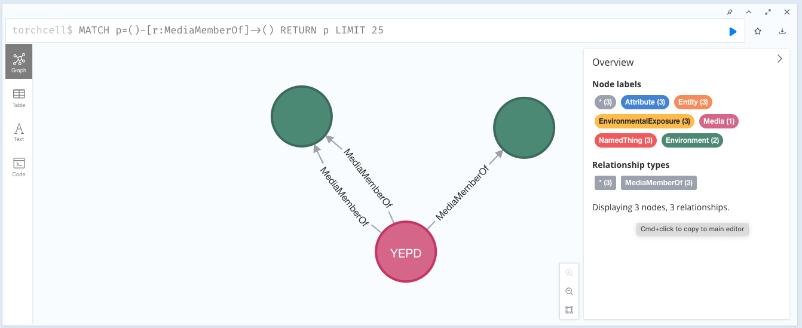
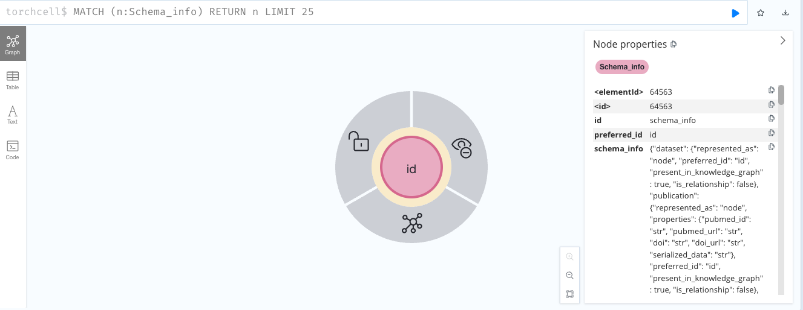
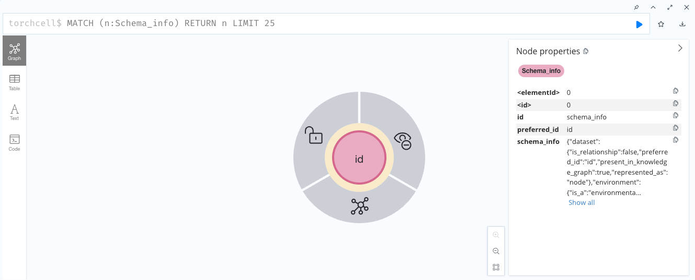

## 2024.08.08 - Checking that Combine Produces the Same Import Summary

This should eventually be moved to tests somehow although it is quite a complicated thing to put in tests.

Output from combining the two individual `biocypher-out` dirs:

```bash
IMPORT DONE in 5s 178ms. 
Imported:
  323416 nodes
  841603 relationships
  1826530 properties
Peak memory usage: 1.035GiB
```

Output from `torchcell/knowledge_graphs/dmf_tmi_combine_kg.py`

```bash
IMPORT DONE in 7s 664ms. 
Imported:
  323417 nodes
  953196 relationships
  1826533 properties
Peak memory usage: 1.035GiB
Build and run process completed.
```

Not good! They are different...

## 2024.08.09 - Double Checking Individual Graphs and Their Combined Form

```bash
docker exec tc-neo4j python -m torchcell.knowledge_graphs.smf_costanzo_2016_kg
```

```bash
IMPORT DONE in 2s 221ms. 
Imported:
  48668 nodes
  133193 relationships
  266330 properties
Peak memory usage: 1.033GiB
Build and run process completed.
```

```bash
docker exec tc-neo4j python -m torchcell.knowledge_graphs.tmi_kuzmin_2018_kg
```

```bash
IMPORT DONE in 8s 473ms. 
Imported:
  274876 nodes
  820005 relationships
  1561202 properties
Peak memory usage: 1.035GiB
```

```bash
python -m torchcell.database.biocypher_out_combine \                                      18:56
"/Users/michaelvolk/Documents/projects/torchcell/database/biocypher-out/2024-08-09_05-19-31" \
"/Users/michaelvolk/Documents/projects/torchcell/database/biocypher-out/2024-08-09_05-29-41" \
--output_base_dir "/Users/michaelvolk/Documents/projects/torchcell/database/biocypher-out" \
--config_yaml "/Users/michaelvolk/Documents/projects/torchcell/biocypher/config/linux-arm_biocypher_config.yaml"
```

```bash
docker exec tc-neo4j bash biocypher-out/2024-08-09_18-55-52_combined/neo4j-admin-import-call.sh
```

```bash
IMPORT DONE in 6s 78ms. 
Imported:
  323416 nodes
  841603 relationships
  1826530 properties
Peak memory usage: 1.035GiB
There were bad entries which were skipped and logged into /var/lib/neo4j/import.report
```

```bash
docker exec tc-neo4j cat /var/lib/neo4j/import.report                                     18:58
Id '8c20d94209be4fdaca196f491acf08a91d1721a247c1f916b62f35e30aa66306' is defined more than once in group 'global id space'
Id '5b9ff27bc773ae67694804d13de576f26875d6a59b97d9c40663fcacbed7774c' is defined more than once in group 'global id space'
Id 'ef11c585c9f933a92dff1733a34fb7d979b54b802ad9e40b7d50b6a8cbe4f32f' is defined more than once in group 'global id space'
Id '32cac1070cac27ab93f21cbcbcccebf348f3bc31c2a0d940f2cbfeeafa4ca3d9' is defined more than once in group 'global id space'
Id '7e2ec6725f0f4761b127bd8979110bc326981ae304a8218cd588069c33b0337d' is defined more than once in group 'global id space'
...
```

```bash
docker exec tc-neo4j cat /var/lib/neo4j/import.report | wc -l
126
```

There are 126 repeat global ids... I don't think this accounts for the difference between the combined graph and the individual graphs... Besides they should just be repeats. My suspicion is that there is some set of relationships not being added.

We are missing the following after combination:

- `323417 nodes - 323416 nodes = 1 node`
- `953196 relationships - 841603 relationships = 111,593 relationships`
- `1826533 properties - 1826530 properties = 2 properties`

First thing to check is if the import script accounts for all of the csvs copied csvs.

We realize that the `Schema` info is just getting copied so we create the schema nodes fresh from the yaml now and rerun.

```bash
docker exec tc-neo4j bash biocypher-out/2024-08-09_19-15-51_combined/neo4j-admin-import-call.sh
```

```bash
IMPORT DONE in 4s 877ms. 
Imported:
  323416 nodes
  841603 relationships
  1826530 properties
Peak memory usage: 1.035GiB
There were bad entries which were skipped and logged into /var/lib/neo4j/import.report
```

```bash
docker exec tc-neo4j cat /var/lib/neo4j/import.report | wc -l
126
```

We get the same number of nodes. I think that the Schema nodes might have been deduplicated.

Missing from combined:

- `Mentions-header.csv`

We have fixed to add mentions..

## 2024.08.10 - Troubleshooting Combine to Match Simultaneous Graph Builds

Fixing schema info

```bash
IMPORT DONE in 5s 986ms. 
Imported:
  323416 nodes
  953198 relationships
  1826530 properties
Peak memory usage: 1.035GiB
There were bad entries which were skipped and logged into /var/lib/neo4j/import.report
```

```cypher
// Count nodes by label
MATCH (n)
RETURN labels(n) AS label, count(*) AS count
ORDER BY count DESC;
```

```csv
label count
["Entity", "NamedThing", "Activity", "Experiment"] 111595
["Entity", "NamedThing", "BiologicalEntity", "Genotype"] 101388
["Entity", "NamedThing", "BiologicalEntity", "DiseaseOrPhenotypicFeature", "PhenotypicFeature", "GeneInteractionPhenotype"] 91101
["Entity", "NamedThing", "BiologicalEntity", "Genotype", "Perturbation"] 11700
["Entity", "NamedThing", "BiologicalEntity", "DiseaseOrPhenotypicFeature", "FitnessPhenotype", "PhenotypicFeature"] 7619
["Entity", "NamedThing", "Activity", "ExperimentReference"] 3
["Dataset", "Entity", "InformationContentEntity", "NamedThing"] 2
["Entity", "NamedThing", "Attribute", "Environment", "EnvironmentalExposure"] 2
["Entity", "InformationContentEntity", "NamedThing", "Publication"] 2
["Entity", "NamedThing", "Attribute", "EnvironmentalExposure", "Temperature"] 2
["Entity", "NamedThing", "BiologicalEntity", "Genome"] 1
["Entity", "NamedThing", "Attribute", "EnvironmentalExposure", "Media"] 1
```

```cypher
// Count relationships by type
MATCH ()-[r]->()
RETURN type(r) AS relType, count(*) AS count
ORDER BY count DESC;
```

```csv
relType count
"PerturbationMemberOf" 283610
"EnvironmentMemberOf" 111598
"PhenotypeMemberOf" 111598
"ExperimentMemberOf" 111595
"ExperimentReferenceOf" 111595
"GenotypeMemberOf" 111595
"Mentions" 111595
"ExperimentReferenceMemberOf" 3
"GenomeMemberOf" 3
"MediaMemberOf" 3
"TemperatureMemberOf" 3
```

```cypher
// Get property keys for nodes
MATCH (n)
RETURN DISTINCT labels(n) AS label, keys(n) AS properties;
```

```csv
label properties
["Dataset", "Entity", "InformationContentEntity", "NamedThing"] ["id", "preferred_id"]
["Entity", "NamedThing", "Activity", "Experiment"] ["serialized_data", "id", "preferred_id"]
["Entity", "NamedThing", "Attribute", "Environment", "EnvironmentalExposure"] ["temperature", "media", "serialized_data", "id", "preferred_id"]
["Entity", "NamedThing", "BiologicalEntity", "DiseaseOrPhenotypicFeature", "PhenotypicFeature", "GeneInteractionPhenotype"] ["graph_level", "label", "label_statistic", "interaction", "p_value", "serialized_data", "id", "preferred_id"]
["Entity", "NamedThing", "Activity", "ExperimentReference"] ["serialized_data", "id", "preferred_id"]
["Entity", "NamedThing", "BiologicalEntity", "DiseaseOrPhenotypicFeature", "FitnessPhenotype", "PhenotypicFeature"] ["graph_level", "label", "label_statistic", "fitness", "fitness_std", "serialized_data", "id", "preferred_id"]
["Entity", "NamedThing", "BiologicalEntity", "Genome"] ["species", "strain", "serialized_data", "id", "preferred_id"]
["Entity", "NamedThing", "BiologicalEntity", "Genotype"] ["systematic_gene_names", "perturbed_gene_names", "perturbation_types", "serialized_data", "id", "preferred_id"]
["Entity", "NamedThing", "BiologicalEntity", "Genotype", "Perturbation"] ["systematic_gene_name", "perturbed_gene_name", "perturbation_type", "description", "strain_id", "serialized_data", "id", "preferred_id"]
["Entity", "NamedThing", "Attribute", "EnvironmentalExposure", "Media"] ["name", "state", "serialized_data", "id", "preferred_id"]
["Entity", "InformationContentEntity", "NamedThing", "Publication"] ["pubmed_id", "pubmed_url", "doi", "doi_url", "serialized_data", "id", "preferred_id"]
["Entity", "NamedThing", "Attribute", "EnvironmentalExposure", "Temperature"] ["value", "unit", "serialized_data", "id", "preferred_id"]
```

```cypher
// Get property keys for relationships
MATCH ()-[r]->()
RETURN DISTINCT type(r) AS relType, keys(r) AS properties;
```

```csv
relType properties
"ExperimentMemberOf" []
"EnvironmentMemberOf" []
"PhenotypeMemberOf" []
"ExperimentReferenceMemberOf" []
"ExperimentReferenceOf" []
"GenomeMemberOf" []
"GenotypeMemberOf" []
"PerturbationMemberOf" []
"MediaMemberOf" []
"Mentions" []
"TemperatureMemberOf" []
```

```cypher
MATCH (n:Schema_info)
RETURN n;
```

```cypher
(no changes, no records)
```

The missing node is likely due to the Schema node not being imported...

We have fixed this and now the node total matches.

```bash
IMPORT DONE in 7s 965ms. 
Imported:
  323417 nodes
  953198 relationships
  1826533 properties
Peak memory usage: 1.035GiB
There were bad entries which were skipped and logged into /var/lib/neo4j/import.report
```

Double checking with query.

```cypher
MATCH (n:Schema_info) RETURN n;
```

Schema looks correct.

```csv
n
(:Schema_info {preferred_id: "id",id: "schema_info",schema_info: "{\"dataset\":{\"is_relationship\":false,\"preferred_id\":\"id\",\"present_in_knowledge_graph\":true,\"represented_as\":\"node\"},\"environment\":{\"is_a\":\"environmental exposure\",\"is_relationship\":false,\"preferred_id\":\"id\",\"present_in_knowledge_graph\":true,\"properties\":{\"media\":\"str\",\"serialized_data\":\"str\",\"temperature\":\"str\"},\"represented_as\":\"node\"},\"environment member of\":{\"is_a\":\"participates in\",\"is_relationship\":true,\"preferred_id\":\"id\",\"present_in_knowledge_graph\":true,\"represented_as\":\"edge\",\"source\":\"environment\",\"target\":[\"experiment reference\",\"experiment\"]},\"experiment\":{\"is_a\":\"activity\",\"is_relationship\":false,\"preferred_id\":\"id\",\"present_in_knowledge_graph\":true,\"properties\":{\"serialized_data\":\"str\"},\"represented_as\":\"node\"},\"experiment member of\":{\"is_a\":\"has output\",\"is_relationship\":true,\"preferred_id\":\"id\",\"present_in_knowledge_graph\":true,\"represented_as\":\"edge\",\"source\":\"experiment\",\"target\":\"dataset\"},\"experiment reference\":{\"is_a\":\"activity\",\"is_relationship\":false,\"preferred_id\":\"id\",\"present_in_knowledge_graph\":true,\"properties\":{\"serialized_data\":\"str\"},\"represented_as\":\"node\"},\"experiment reference member of\":{\"is_a\":\"has output\",\"is_relationship\":true,\"preferred_id\":\"id\",\"present_in_knowledge_graph\":true,\"represented_as\":\"edge\",\"source\":\"experiment reference\",\"target\":\"dataset\"},\"experiment reference of\":{\"is_a\":\"coexists with\",\"is_relationship\":true,\"preferred_id\":\"id\",\"present_in_knowledge_graph\":true,\"represented_as\":\"edge\",\"source\":\"experiment reference\",\"target\":\"experiment\"},\"fitness phenotype\":{\"is_a\":\"phenotypic feature\",\"is_relationship\":false,\"preferred_id\":\"id\",\"present_in_knowledge_graph\":true,\"properties\":{\"fitness\":\"float\",\"fitness_std\":\"float\",\"graph_level\":\"str\",\"label\":\"str\",\"label_statistic\":\"str\",\"serialized_data\":\"str\"},\"represented_as\":\"node\"},\"gene interaction phenotype\":{\"is_a\":\"phenotypic feature\",\"preferred_id\":\"id\",\"properties\":{\"graph_level\":\"str\",\"interaction\":\"float\",\"label\":\"str\",\"label_statistic\":\"str\",\"p_value\":\"float\",\"serialized_data\":\"str\"},\"represented_as\":\"node\",\"is_relationship\":false,\"present_in_knowledge_graph\":true},\"genome\":{\"is_relationship\":false,\"preferred_id\":\"id\",\"present_in_knowledge_graph\":true,\"properties\":{\"serialized_data\":\"str\",\"species\":\"str\",\"strain\":\"str\"},\"represented_as\":\"node\"},\"genome member of\":{\"is_a\":\"participates in\",\"is_relationship\":true,\"preferred_id\":\"id\",\"present_in_knowledge_graph\":true,\"represented_as\":\"edge\",\"source\":\"genome\",\"target\":\"experiment reference\"},\"genotype\":{\"is_relationship\":false,\"preferred_id\":\"id\",\"present_in_knowledge_graph\":true,\"properties\":{\"perturbation_types\":\"list\",\"perturbed_gene_names\":\"list\",\"serialized_data\":\"str\",\"systematic_gene_names\":\"list\"},\"represented_as\":\"node\"},\"genotype member of\":{\"is_a\":\"participates in\",\"is_relationship\":true,\"preferred_id\":\"id\",\"present_in_knowledge_graph\":true,\"represented_as\":\"edge\",\"source\":\"genotype\",\"target\":\"experiment\"},\"is_schema_info\":true,\"media\":{\"is_a\":\"environmental exposure\",\"is_relationship\":false,\"preferred_id\":\"id\",\"present_in_knowledge_graph\":true,\"properties\":{\"name\":\"str\",\"serialized_data\":\"str\",\"state\":\"str\"},\"represented_as\":\"node\"},\"media member of\":{\"is_a\":\"part of\",\"is_relationship\":true,\"preferred_id\":\"id\",\"present_in_knowledge_graph\":true,\"represented_as\":\"edge\",\"source\":\"media\",\"target\":\"environment\"},\"perturbation\":{\"is_a\":\"genotype\",\"is_relationship\":false,\"preferred_id\":\"id\",\"present_in_knowledge_graph\":true,\"properties\":{\"description\":\"str\",\"perturbation_type\":\"str\",\"perturbed_gene_name\":\"str\",\"serialized_data\":\"str\",\"strain_id\":\"str\",\"systematic_gene_name\":\"str\"},\"represented_as\":\"node\"},\"perturbation member of\":{\"is_a\":\"genetically associated with\",\"is_relationship\":true,\"preferred_id\":\"id\",\"present_in_knowledge_graph\":true,\"represented_as\":\"edge\",\"source\":\"perturbation\",\"target\":\"genotype\"},\"phenotype member of\":{\"is_a\":\"participates in\",\"is_relationship\":true,\"preferred_id\":\"id\",\"present_in_knowledge_graph\":true,\"represented_as\":\"edge\",\"source\":\"fitness phenotype\",\"target\":[\"experiment reference\",\"experiment\"]},\"publication\":{\"is_relationship\":false,\"preferred_id\":\"id\",\"present_in_knowledge_graph\":true,\"properties\":{\"doi\":\"str\",\"doi_url\":\"str\",\"pubmed_id\":\"str\",\"pubmed_url\":\"str\",\"serialized_data\":\"str\"},\"represented_as\":\"node\"},\"temperature\":{\"is_a\":\"environmental exposure\",\"is_relationship\":false,\"preferred_id\":\"id\",\"present_in_knowledge_graph\":true,\"properties\":{\"serialized_data\":\"str\",\"unit\":\"str\",\"value\":\"float\"},\"represented_as\":\"node\"},\"temperature member of\":{\"is_a\":\"part of\",\"is_relationship\":true,\"preferred_id\":\"id\",\"present_in_knowledge_graph\":true,\"represented_as\":\"edge\",\"source\":\"temperature\",\"target\":\"environment\"}}"})
```

Now comparing relationships. Have to reimport so we can check the bulid with both graphs.

```bash
docker exec tc-neo4j bash biocypher-out/2024-08-09_05-01-14/neo4j-admin-import-call.sh
```

```bash
IMPORT DONE in 5s 688ms. 
Imported:
  323417 nodes
  953196 relationships
  1826533 properties
Peak memory usage: 1.035GiB
```

edge report

```bash
// Count relationships by type
MATCH ()-[r]->()
RETURN type(r) AS relType, count(*) AS count
ORDER BY count DESC;
```

```csv
relType count
"PerturbationMemberOf" 283610
"PhenotypeMemberOf" 111598
"EnvironmentMemberOf" 111598
"ExperimentReferenceOf" 111595
"GenotypeMemberOf" 111595
"ExperimentMemberOf" 111595
"Mentions" 111595
"GenomeMemberOf" 3
"ExperimentReferenceMemberOf" 3
"TemperatureMemberOf" 2
"MediaMemberOf" 2
```

Compared to the csv from above that we copy paste...

 ```csv
relType count
"PerturbationMemberOf" 283610 ✅
"EnvironmentMemberOf" 111598 ✅
"PhenotypeMemberOf" 111598 ✅
"ExperimentMemberOf" 111595 ✅
"ExperimentReferenceOf" 111595 ✅
"GenotypeMemberOf" 111595 ✅
"Mentions" 111595 ✅
"ExperimentReferenceMemberOf" 3 ✅
"GenomeMemberOf" 3 ✅
"MediaMemberOf" 3 ❌
"TemperatureMemberOf" 3 ❌
```



Use this image to compare against schema node import...



Now the formatting is same.



I don't think we should worry about deduplicating edges because we can be sure we select unique experiment nodes on query.

We can do this with `DISTINCT` in the query.

```cypher
MATCH (n:Label)
RETURN DISTINCT n;
```
