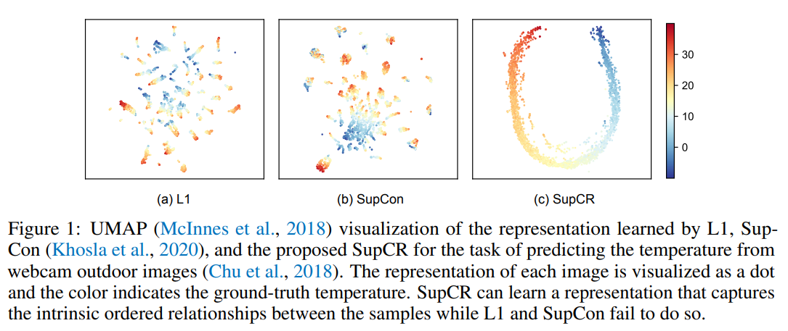
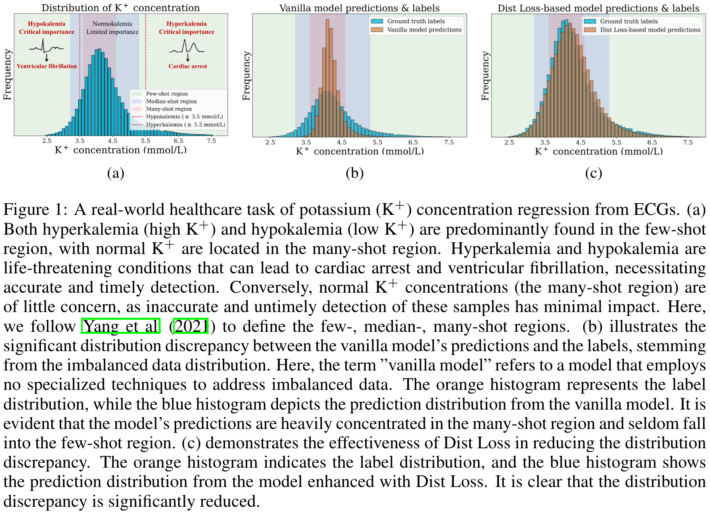

## 2025.01.22 - General Loss

The general loss functions is composed or 4 components. They try to achieve the following:

1. Point estimation loss.
2. Distribution matching loss.
3. Structured latent representation loss.
4. Cell algebra representation loss.

The canonical way of achieving point estimation is the mean-squared error loss ($MSE$) which for supervised regression is equivalent to maximum likelihood estimation. $\mathcal{L}_{\text{MSE}} := \mathcal{L}_{\text{MLE}}$. We've shown that $\mathcal{L}_{\text{MSE}}$ sometimes fails to cross a critical learning barrier which can be observed by fixation on mean value prediction. This can be overcome by adding in distribution matching. Distribution matching can be effectively added at the model output where we just call it the distribution matching loss. Distribution matching can also be facilitated by adding a representation learning loss encouraging a smooth embedding space making it easier for downstream prediction heads to reproduce the data distribution.  We call this the structured latent representation loss. Finally, we have a term for learning the algebra of cell perturbations so we can track perturbations within the latent space for improved model explainability. We call this the cell algebra representation loss.  

### 2025.01.22 - General Loss Definitions

$\\\lambda_i := i$th hyperparameter
$\\W :=$ Whole graph representation
$\\P :=$ Perturbed graph representation
$\\I :=$ Intact graph representation
$\\y :=$ True label
$\\\hat{y} :=$ Predicted label
$\\z :=$ Latent embedding

#### 2025.01.22 - General Loss Definitions - MSE

$\\\mathcal{L}_{\text {MSE}}(y, \hat{y}) := \frac{1}{n} \sum_{i=1}^{n}(y - \hat{y})^2$  

#### 2025.01.22 - General Loss Definitions - Cell

$\\\mathcal{L}_{\text {cell }}\left(z_W, z_P, z_I\right) := \mathcal{L}_{\text{MSE}}(z_I, z_W + z_P ) := \frac{1}{n} \sum_{i=1}^{n}(z_W - (z_W + z_P))^2$

#### 2025.01.22 - General Loss Definitions - Div

$\\\mathcal{L}_{\operatorname{div}} :=$ divergence loss for distribution matching

#### 2025.01.22 - General Loss Definitions - Con

$\\\mathcal{L}_{\operatorname{con}} :=$ contrastive loss for representation learning

### 2025.01.22 - General Loss Function

$$
\mathcal{L}=\mathcal{L}_{\text {MSE}}(y, \hat{y})+\lambda_1 \mathcal{L}_{\operatorname{div}}(y, \hat{y})+\lambda_2 \mathcal{L}_{\text {con}}\left(z_P, z_I, y\right)+\lambda_3 \mathcal{L}_{\text {cell }}\left(z_W, z_P, z_I\right)
$$

## 2025.01.22 - Specific Loss

There are many options for the different loss components. For the distribution matching we choose a the $\text{Dist}$ loss and for the structured latent representation loss we choose the $\text{SupCR}$ loss which is a supervised contrastive regression loss.

### 2025.01.22 - Specific Loss Definitions

The main idea of $\text{Dist}$ loss is to used KDE instead of binning with a histogram then distribution matching over discretized labels. This is very convenient for data processing as all labels can remain continuous.

The main idea of $\text{SupCR}$ is to change the $\text{SupCon}$ loss for discrete labels into a continuous version. The concept is the same, pull latent embeddings together where labels are similar, and push latent embeddings aparat where labels are dissimilar.

#### 2025.01.22 - Specific Loss Definitions - Dist

$\\S_{\text{pred}}:=$ Sorted pseudo-predictions from model output

$S_{\text{label}}:=$ Pseudo-labels generated from KDE of the ground truth labels

$M:=$  The number of samples in a batch, used to normalize the sum of squared differences.

$\mathbb{E}_{b \in \text { batch }}:=$ Expectation over all batches during the training process.

$\mathcal{L}_{\text {dist }}(y, \hat{y}):=$  The distribution loss, specifically computed as the
mean squared error (MSE) between the pseudo-predictions $S_P$ and pseudo-labels $S_L$.

$$
\begin{aligned}
\mathcal{L}_{\text {div }}(y, \hat{y}) & :=\mathcal{L}_{\text {dist }}(y, \hat{y}) \\
& :=\mathbb{E}_{b \in \text { batch }}\left[\frac{1}{M} \sum_{i=1}^M\left(S_{\text{pred}}[i]-S_{\text{label}}[i]\right)^2\right]
\end{aligned}
$$

#### 2025.01.22 - Specific Loss Definitions - Dist Explanation

The Distribution Loss ($\mathcal{L}_{\text {dist}}$) is designed to minimize the discrepancy between two distributions: pseudo-predictions $S_P$ (sorted model outputs) and pseudolabels $S_L$ (generated via Kernel Density Estimation from the ground truth). The loss is computed as the Mean Squared Error ($MSE$) between these two distributions over all samples in a batch. This inherently aligns the model's predictions to the estimated distribution of the target labels, effectively capturing both prediction errors and the underlying distributional alignment. By averaging over all batches $\left(\mathbb{E}_{b \in \text { batch }}\right)$, the loss ensures consistent optimization across the dataset.

#### 2025.01.22 - Specific Loss Definitions - SupCR

$\\N :=$  The number of graphs (or samples) in a batch.

$y_i, y_j, y_k :=$  Continuous regression labels for graphs $i, j$, and $k$.

$z_i, z_j, z_k :=$  Embeddings of graphs $i, j$, and $k$, generated by a feature encoder $f(\cdot)$.

$\operatorname{sim}\left(z_i, z_j\right) :=$  Similarity between embeddings $z_i$ and $z_j$, often defined as the negative L2 norm $-\left\|z_i-z_j\right\|_2$ or cosine similarity $\frac{z_i \cdot z_j}{\left\|z_i\right\|\left\|z_j\right\|}$.

$\tau :=$ Temperature parameter that scales the similarities for sharper gradients.

$d\left(y_i, y_j\right) :=$  Distance between the labels $y_i$ and $y_j$, commonly calculated using the $L_1$ norm $\left|y_i-y_j\right|$.

$1[\cdot] :=$  Indicator function, which is $1$ if the condition in brackets is true, and 0 otherwise.

$$
\begin{aligned}
\mathcal{L}_{\text{con}}(z_P, z_I, y) &:=\mathcal{L}_{\mathrm{SupCR}}(z_P, y) + \mathcal{L}_{\mathrm{SupCR}}(z_I, y) \\
& :=-\frac{1}{N} \sum_{i=1}^N \frac{1}{N-1} \sum_{\substack{j=1 \\ j \neq i}}^N \log \frac{\exp \left(\operatorname{sim}\left(z_{P_{i}}, z_{P_{j}}\right) / \tau\right)}{\sum_{\substack{k=1 \\ k \neq i}}^N 1\left[d\left(y_i, y_k\right) \geq d\left(y_i, y_j\right)\right] \exp \left(\operatorname{sim}\left(z_{P_{i}}, z_{P_{k}}\right) / \tau\right)} \\
& + -\frac{1}{N} \sum_{i=1}^N \frac{1}{N-1} \sum_{\substack{j=1 \\ j \neq i}}^N \log \frac{\exp \left(\operatorname{sim}\left(z_{I_{i}}, z_{I_{j}}\right) / \tau\right)}{\sum_{\substack{k=1 \\ k \neq i}}^N 1\left[d\left(y_i, y_k\right) \geq d\left(y_i, y_j\right)\right] \exp \left(\operatorname{sim}\left(z_{I_{i}}, z_{I_{k}}\right) / \tau\right)}
\end{aligned}
$$

#### 2025.01.22 - Specific Loss Definitions - SupCR Explanation

The Supervised Contrastive Regression Loss ($\mathcal{L}_{\text {SupCR}}$) optimizes the embedding space such that the similarity between graph embeddings aligns with the distances in their regression labels. For each graph $i$ (treated as an anchor), other graphs $j$ in the batch with smaller label distances $\left(d\left(y_i, y_j\right)\right)$ are treated as positive samples, and those with larger distances $\left(d\left(y_i, y_k\right)\right)$ act as negatives. The loss minimizes the similarity between the anchor and negative samples while maximizing the similarity to positive samples. This is achieved using a softmax formulation that contrasts pairwise similarities $\left(\operatorname{sim}\left(z_i, z_j\right)\right)$ within the batch. By doing so, SupCR enforces order in the embedding space, ensuring it respects the continuous nature of regression labels.

### 2025.01.22 - Loss Function

$$
\mathcal{L}=\mathcal{L}_{\text {MSE}}(y, \hat{y})+\lambda_1 \mathcal{L}_{\operatorname{dist}}(y, \hat{y})+\lambda_2 \mathcal{L}_{\text {SupCR}}\left(z_P, z_I, y \right)+\lambda_3 \mathcal{L}_{\text {cell }}\left(z_W, z_P, z_I\right)
$$

## 2025.01.22 - SupCR Loss Captures Ordered Relationship of Regression Task

This image from the original [SupCR](https://openreview.net/pdf?id=_QZlje4dZPu) paper shows how the contrastive regression loss can organize the embedding space.

## 2025.01.22 - Dist Loss Encourages Distribution Matching

This image is from the original [DistLoss](https://arxiv.org/abs/2411.15216) paper and shows how the loss function can help improve prediction in few-shot region long tails. This is important in our prediction task for finding genes with high interaction scores (tail of distribution). This figure also shows how models without distribution matching will favor towards mean prediction.

## 2025.01.22 - Open Questions

- Can we show that structured latent representation loss and the cell algebra representation loss are in direct conflict?
  - If they are in conflict how should we resolve this? Should we impose one loss on half of the embedding space dimension, and the other loss on the other half of the embedding space dimension?
- What is the ultimate purpose of cell algebra representation loss? We think it will provide nice interpretability, but what does it provide other than a pretty picture? We would want this to provide some rational way of designing organisms, way to add perturbations in the embedding space. It seems easier to implement such an idea with a generative model. Maybe they could be used in concert with each other. Generate strains designs, then use the supervised model for checking/screening designs.
