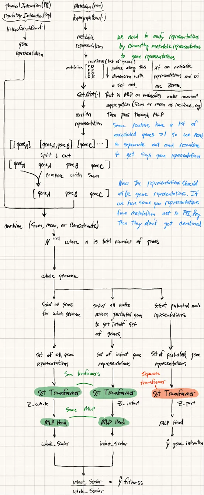
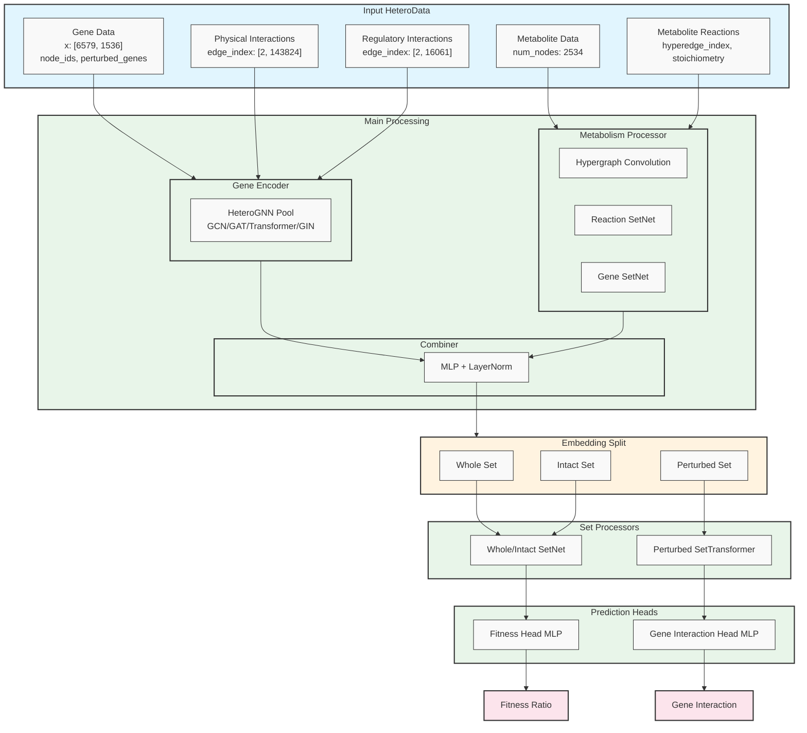

## 2025.01.12 - Prototyping Model



ChatGPT description from image:

### 2025.01.12 - Model Overview

1. **Gene Representations**  
   - Start by computing per‐gene embeddings using heterogeneous graph operations (e.g., HeteroGraphConv) that capture *physical interactions (PPI)*, *regulatory interactions (Reg)*, and other relevant relationships among genes.  
   - These embeddings are considered your initial **gene representations**.

2. **Metabolite Representations & Reaction Embeddings**  
   - In parallel, encode metabolites (nodes in a metabolic network) using another graph operation (e.g., HypergraphConv).  
   - Each *reaction* (which references one or more genes) is represented by aggregating its associated metabolites’ embeddings (e.g., via sum or mean) and passing that result through an MLP.  
   - Some reactions map to multiple genes, so split and re‐aggregate as needed so that each gene is ultimately paired with its own reaction‐derived embedding.

3. **Unifying Metabolite and Gene Representations**  
   - Combine (e.g., by summation, mean, or concatenation) the reaction‐derived embeddings with the existing gene embeddings (from step 1).  
   - After this step, *all final embeddings are per‐gene representations*, enhanced by both the metabolic network information and the gene‐gene interaction information.

4. **Whole Genome vs. Intact vs. Perturbed Sets**  
   - You will produce three different sets of gene embeddings:  
     1. **Whole** set of all gene embeddings (no genes excluded).  
     2. **Intact** set of “healthy” gene embeddings (i.e., exclude any perturbed/knocked‐out genes).  
     3. **Perturbed** set containing only the embeddings for the knocked‐out or modified genes.

5. **Set Transformers**  
   - Pass each set of gene embeddings (Whole, Intact, Perturbed) into a *Set Transformer* module (three separate or two shared + one separate, as the diagram suggests).  
   - Each Set Transformer produces a high‐level representation vector (e.g., `z_whole`, `z_intact`, `z_pert`).

6. **MLP Heads and Final Outputs**  
   - Feed `z_whole` and `z_intact` each into the *same* MLP head (or into shared MLP parameters) that outputs a scalar. These two scalars (Whole_Scalar, Intact_Scalar) are used for a fitness‐related prediction (e.g., the difference could represent the change in fitness upon gene perturbation).  
   - Feed `z_pert` into a *separate* MLP head to predict other properties specific to the perturbed genes (e.g., “gene interaction” or any other desired output).

7. **Training Objective**  
   - Train the model (all Set Transformers + MLP heads) to jointly optimize:  
     - The difference (or relationship) between Whole_Scalar and Intact_Scalar to reflect how gene perturbations affect overall fitness (or your main target variable).  
     - The prediction output for the perturbed set (e.g., predicted effect or interaction measure).

---

In summary, you construct a two‐part architecture:

1. **Gene‐level feature extraction** via graph‐based embedding (including metabolic pathways and gene‐gene interactions).
2. **Set‐based readout** (via Set Transformers) that produces whole‐genome, intact, and perturbed representations, each passed through MLP heads for final scalar predictions.

### 2025.01.12 - How to Treat Metabolism

Based on your description, here's how the metabolic network should be treated:

1. **Network Structure**

- The metabolic network is a hypergraph where:
  - Nodes are metabolites
  - Edges (hyperedges) are gene reactions
  - Each edge can connect to multiple genes
  - Each gene can be involved in multiple edges

2. **Processing Pipeline**
1. First Level: Metabolite to Reaction
   - Use HypergraphConv to get initial metabolite (node) representations
   - For each reaction (edge), collect all its associated metabolite features
   - Use SetNet to process the collection of metabolite features per reaction
   - This collapses metabolites × gene_reactions to just gene_reactions

2. Second Level: Reaction to Gene
   - Each gene can appear in multiple reaction lists
   - Create a dictionary mapping genes to lists of tensor representations
   - Collect all reaction representations where a gene appears in the gene_reaction list
   - Use another SetNet to process these lists of representations per gene
   - This produces the final gene representation from metabolism

3. **Important Considerations**

- Some genes in the metabolism network aren't in the main gene set (-1 indices)
- Need to properly handle the mapping between reactions and genes using `reaction_to_genes_indices`
- Can reference the gene set using `batch["gene"].node_ids`

4. **Final Integration**

- After getting gene representations from metabolism, these can be combined with the gene representations from the HeteroGNN (which processes physical and regulatory interactions)

This approach properly handles the hierarchical nature of the metabolic network while preserving the many-to-many relationships between reactions and genes.

### 2025.01.14 - Sample of Dataset

```python
HeteroData(
  gene={
    x=[6579, 1536],
    node_ids=[6579],
    num_nodes=6579,
    perturbed_genes=[2],
    perturbation_indices=[2],
    fitness=[1],
    fitness_std=[1],
    gene_interaction=[1],
    gene_interaction_p_value=[1],
  },
  metabolite={
    num_nodes=2534,
    node_ids=[2534],
  },
  (gene, physical_interaction, gene)={
    edge_index=[2, 143824],
    num_edges=143824,
  },
  (gene, regulatory_interaction, gene)={
    edge_index=[2, 16061],
    num_edges=16061,
  },
  (metabolite, reaction_genes, metabolite)={
    hyperedge_index=[2, 20960],
    stoichiometry=[20960],
    num_edges=4881,
    reaction_to_genes=dict(len=4881),
    reaction_to_genes_indices=dict(len=4881),
  }
)
```

## 2025.01.14 - Mermaid Diagram of Model


