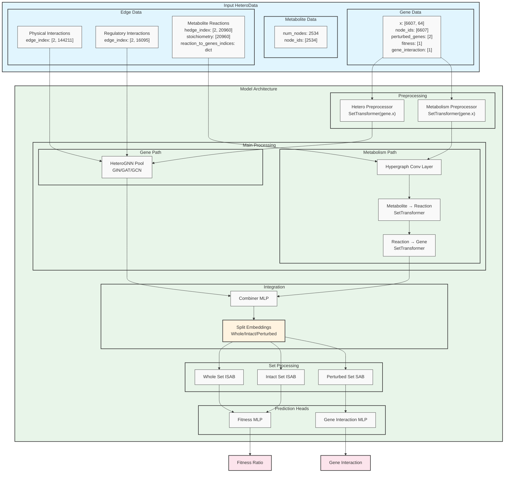

## 2025.01.16 - Model Flowchart

```mermaid
flowchart TB
    subgraph InputData["Input HeteroData"]
        direction TB
        subgraph GeneData["Gene Data"]
            gene_x["x: [6607, 64]<br/>node_ids: [6607]<br/>perturbed_genes: [2]<br/>fitness: [1]<br/>gene_interaction: [1]"]
        end
        
        subgraph MetaboliteData["Metabolite Data"]
            met_data["num_nodes: 2534<br/>node_ids: [2534]"]
        end
        
        subgraph EdgeData["Edge Data"]
            phys_edge["Physical Interactions<br/>edge_index: [2, 144211]"]
            reg_edge["Regulatory Interactions<br/>edge_index: [2, 16095]"]
            met_edge["Metabolite Reactions<br/>hedge_index: [2, 20960]<br/>stoichiometry: [20960]<br/>reaction_to_genes_indices: dict"]
        end
    end

    subgraph MainProc["Model Architecture"]
        direction TB
        subgraph PreProc["Preprocessing"]
            hetero_pre["Hetero Preprocessor<br/>SetTransformer(gene.x)"]
            met_pre["Metabolism Preprocessor<br/>SetTransformer(gene.x)"]
        end

        subgraph ParallelPaths["Main Processing"]
            direction LR
            subgraph GenePath["Gene Path"]
                gnn["HeteroGNN Pool<br/>GIN/GAT/GCN"]
            end

            subgraph MetPath["Metabolism Path"]
                met_conv["Hypergraph Conv Layer"]
                met2rxn["Metabolite → Reaction<br/>SetTransformer"]
                rxn2gene["Reaction → Gene<br/>SetTransformer"]
            end
        end

        subgraph Integration["Integration"]
            combiner["Combiner MLP"]
            split["Split Embeddings<br/>Whole/Intact/Perturbed"]
        end

        subgraph SetProc["Set Processing"]
            whole["Whole Set ISAB"]
            intact["Intact Set ISAB"]
            perturbed["Perturbed Set SAB"]
        end

        subgraph PredHeads["Prediction Heads"]
            fitness["Fitness MLP"]
            gene_int["Gene Interaction MLP"]
        end
    end

    %% Connections
    gene_x --> hetero_pre
    gene_x --> met_pre
    phys_edge & reg_edge --> gnn
    met_edge --> met_conv
    
    hetero_pre --> gnn
    met_pre --> met_conv
    met_conv --> met2rxn
    met2rxn --> rxn2gene
    gnn & rxn2gene --> combiner
    combiner --> split
    split --> whole & intact & perturbed
    whole & intact --> fitness
    perturbed --> gene_int

    fitness --> output1["Fitness Ratio"]
    gene_int --> output2["Gene Interaction"]

    %% Styling
    classDef default fill:#f9f9f9,stroke:#333,stroke-width:1px
    classDef input fill:#e1f5fe,stroke:#333,stroke-width:2px
    classDef process fill:#e8f5e9,stroke:#333,stroke-width:2px
    classDef split fill:#fff3e0,stroke:#333,stroke-width:2px
    classDef output fill:#fce4ec,stroke:#333,stroke-width:2px

    class InputData,GeneData,MetaboliteData,EdgeData input
    class MainProc,PreProc,ParallelPaths,GenePath,MetPath,Integration,SetProc process
    class split split
    class PredHeads process
    class output1,output2 output
```
