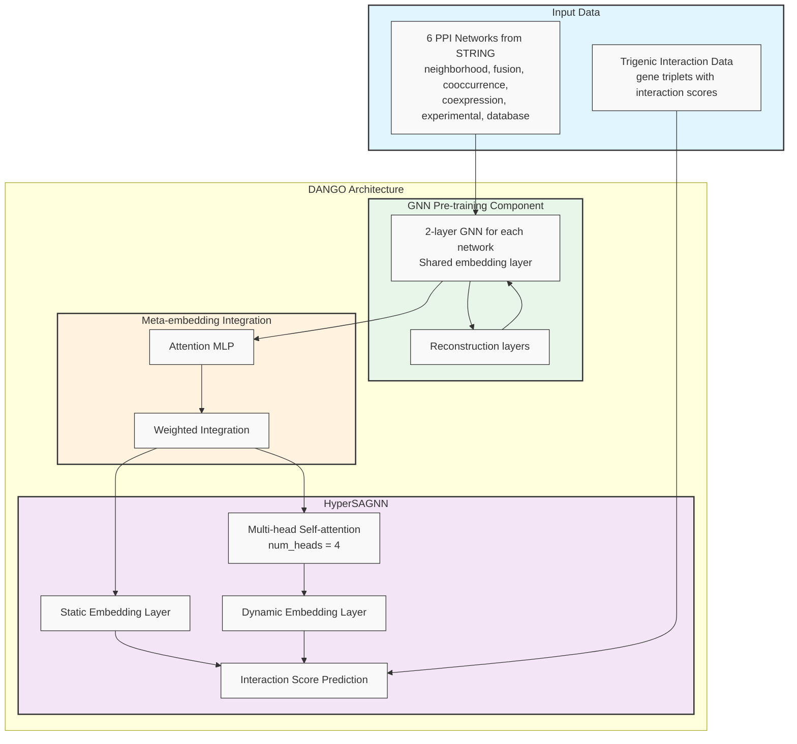
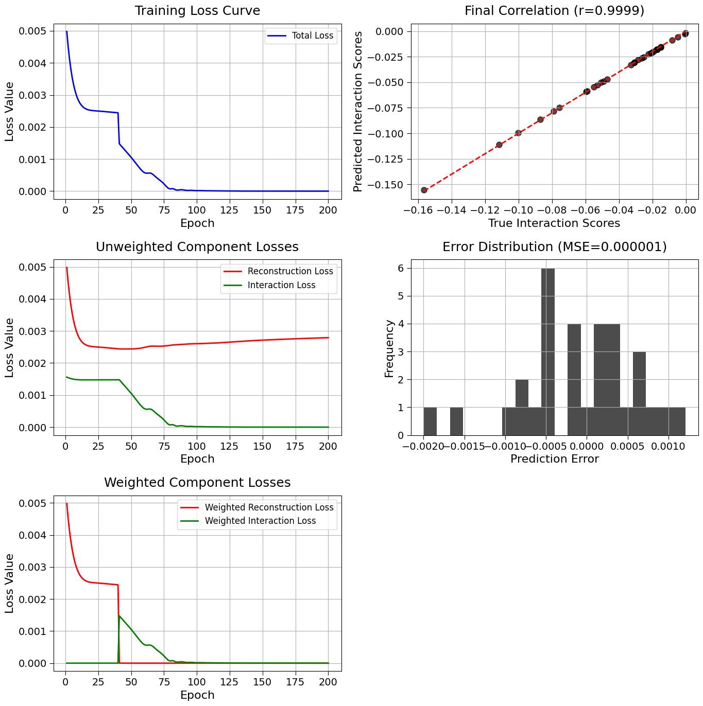
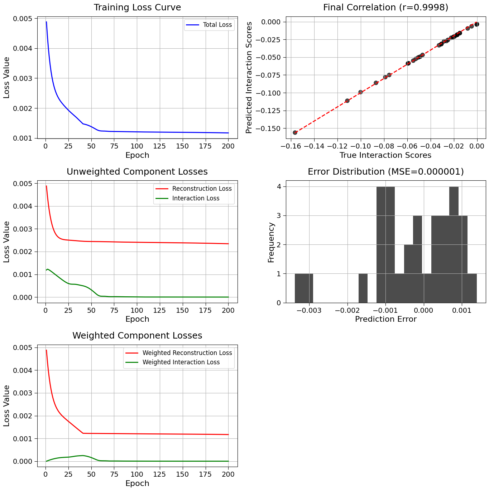
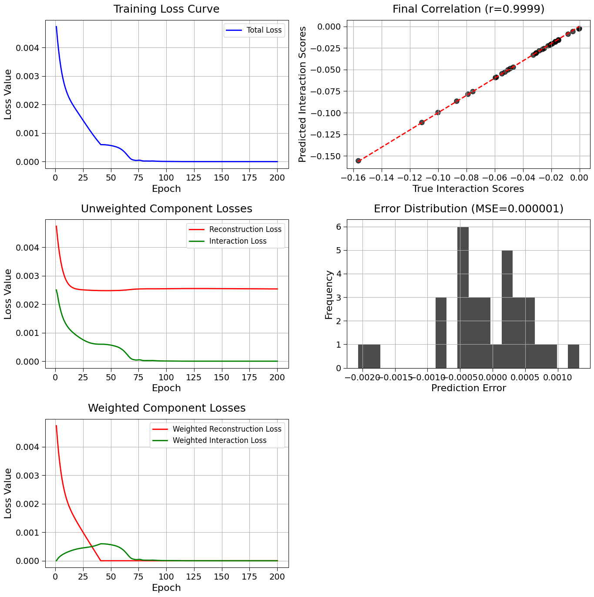

**Consolidating algorithm details**

The user wants a very detailed description of the algorithm from the paper "DANGO Predicting higher-order genetic interaction," specifically focusing on functions, layers, loss functions, parameters, and more. They will use this information to write the model in their framework, so I need to be thorough. I'll extract details from the Methods section, which includes pre-training GNN, meta embedding, hypergraph representation, ReZero improvements, and loss definitions. I'll organize this with LaTeX equations for clarity.

Below is a detailed, equation‐by‐equation spec of DANGO suitable for implementation. You can paste this into your markdown document.

## 1. Definitions

* **Genes**: indexed by $i\in\{1,\dots,G\}$.

* **Trigenic interaction score** $\tau_{ijk}$ for genes $i,j,k$ defined as in Kuzmin *et al.* (2018):

  $$
    \tau_{ijk}
    = f_{ijk}
    - f_i f_j f_k
    - \varepsilon_{jk} f_i
    - \varepsilon_{ik} f_j
    - \varepsilon_{ij} f_k
  $$

  where $\varepsilon_{ij}=f_{ij}-f_i f_j$ and $f_{\cdot}$ are growth‐fitness measurements .

* **Hypergraph** $\mathcal{G}=(V,E)$:
  $V=\{1,\dots,G\}$, and each 3‐gene combination $(i,j,k)$ is a hyperedge $e\in E$.

## 2. Pre‐training GNNs on Pairwise Networks

For each of six STRING PPI networks ($k=1,\dots,6$), learn a 2‑layer GNN mapping node $i$ to embedding $E_i^{(k)}\in\mathbb{R}^D$:

1. **Initial node features**: one–hot embedding

   $$
     H_i^{(0)}\in\mathbb{R}^D
     \quad\text{via shared lookup of size }G\times D.
   $$

2. **Layer $n$ update** ($n=1,2$) for each node $i$:

   $$
     H_{\,\mathcal{N}(i)}^{(n)}
     = \mathop{\mathrm{Average}}\bigl\{H_u^{(n-1)}:u\in\mathcal{N}(i)\bigr\},
   $$

   $$
     H_i^{(n)}
     = \sigma\!\Bigl(W_{\mathrm{GNN}}^{(n)}\,
       \bigl[\,H_i^{(n-1)} \,\|\, H_{\mathcal{N}(i)}^{(n)}\bigr]\Bigr),
   $$

   where “$\|$” is concatenation, $\sigma$ a nonlinearity .

3. **Reconstruction head**: predict row $i$ of adjacency $w^{(k)}_{i\bullet}$ via

   $$
     \widehat w^{(k)}_{i\bullet}
     = \mathrm{FC}\bigl(H_i^{(2)}\bigr),
   $$

   trained with **weighted MSE**:

   $$
     L_i^{(k)}
     = \frac1G\sum_{n=1}^G
       \bigl[\,(x_n-z_n)^2\,\mathbb{I}(z_n\neq0)
         +\lambda\,(x_n-z_n)^2\,\mathbb{I}(z_n=0)\bigr],
   $$

   where $\lambda$ set to 0.1 if >1% zeros vanish in STRING v11 vs v9.1, else 1.0 .

Collect node embeddings $E_i^{(k)}=H_i^{(2)}$.

## 3. Meta‐Embedding Integration

Combine $\{E_i^{(k)}\}_{k=1}^6$ into a single $E_i\in\mathbb{R}^D$ via attention‐weighted sum:

$$
  \alpha_i^{(k)}
  = \exp\!\bigl(\mathrm{MLP}(E_i^{(k)})\bigr)
  \quad,\quad
  E_i
  = \frac{\sum_{k=1}^6 \alpha_i^{(k)}\,E_i^{(k)}}{\sum_{k=1}^6 \alpha_i^{(k)}},
$$

where MLP = two FC layers .

## 4. Hyper‐SAGNN for Trigenic Regression

Given a triplet $(i,j,k)$, retrieve $E_i,E_j,E_k$. Pass each through the same FFN to get **static** embeddings:

$$
  s_i = \sigma\bigl(W_s\,E_i + b_s\bigr),
  \quad
  s_j,s_k\ \text{similarly}.
$$

### 4.1. Self‐Attention with ReZero

Stack two multi‐head self‐attention layers (with $h$ heads), computing **dynamic** embeddings $\tilde d_i$, then apply ReZero:

$$
  \tilde\alpha_{i\gets j}
  = \bigl(W_Q E_i\bigr)^\intercal\bigl(W_K E_j\bigr),
  \quad
  \hat d_i
  = \sigma\!\Bigl(\sum_{j\neq i}
    \mathrm{softmax}_j(\tilde\alpha_{i\gets j})
    W_V E_j\Bigr),
$$

$$
  d_i = \beta\,\hat d_i + E_i
  \quad,\quad
  \beta\ \text{initialized }0,\ \text{learned.}
$$

Repeat for second layer .

### 4.2. Edge Score Computation

For each node $i\in\{i,j,k\}$, compute a scalar

$$
  y_i = \mathrm{FC}\bigl((d_i - s_i)\circ(d_i - s_i)\bigr),
$$

then average:

$$
  \widehat\tau_{ijk}
  = \frac{1}{3}\bigl(y_i + y_j + y_k\bigr).
$$

## 5. Training Objective

Train end‐to‐end (GNNs, MLP, SAGNN) with **log‑cosh** regression loss:

$$
  L = \frac{1}{|E|}\sum_{(i,j,k)\in E}
      \log\!\bigl(\cosh(\widehat\tau_{ijk}-\tau_{ijk})\bigr).
$$

**Notes on hyperparameters:**

* GNN hidden dim $D$: as desired (e.g.\ 128).
* Self‐attention heads $h$, inner dims $d_k=d_v=D$.
* $\beta$ per‐layer initialized 0.
* All FC layers followed by $\sigma=\mathrm{ReLU}$ (or as specified).

---

This spec covers all components—definitions, pre‐training, meta embedding, hypergraph model, and loss—in full mathematical detail.

## Data

This is what batched data looks like.

```python
cell_graph
HeteroData(
  gene={
    num_nodes=6607,
    node_ids=[6607],
    x=[6607, 0],
  },
  (gene, string9_1_coexpression, gene)={
    edge_index=[2, 320295],
    num_edges=320295,
  },
  (gene, string9_1_cooccurence, gene)={
    edge_index=[2, 9266],
    num_edges=9266,
  },
  (gene, string9_1_database, gene)={
    edge_index=[2, 40093],
    num_edges=40093,
  },
  (gene, string9_1_experimental, gene)={
    edge_index=[2, 226057],
    num_edges=226057,
  },
  (gene, string9_1_fusion, gene)={
    edge_index=[2, 7965],
    num_edges=7965,
  },
  (gene, string9_1_neighborhood, gene)={
    edge_index=[2, 52208],
    num_edges=52208,
  }
)
dataset[0]
HeteroData(
  gene={
    num_nodes=6607,
    perturbed_genes=[3],
    perturbation_indices=[3],
    pert_mask=[6607],
    mask=[6607],
    phenotype_values=[1],
    phenotype_type_indices=[1],
    phenotype_sample_indices=[1],
    phenotype_types=[1],
    phenotype_stat_values=[1],
    phenotype_stat_type_indices=[1],
    phenotype_stat_sample_indices=[1],
    phenotype_stat_types=[1],
  }
)
batch
HeteroDataBatch(
  gene={
    num_nodes=13214,
    perturbed_genes=[2],
    perturbation_indices=[6],
    pert_mask=[13214],
    mask=[13214],
    phenotype_values=[2],
    phenotype_type_indices=[2],
    phenotype_sample_indices=[2],
    phenotype_types=[2],
    phenotype_stat_values=[2],
    phenotype_stat_type_indices=[2],
    phenotype_stat_sample_indices=[2],
    phenotype_stat_types=[2],
    batch=[13214],
    ptr=[3],
  }
)
```

## 2025.05.08 - Model Summary

The DANGO (Deep learning for predicting higher-order genetic interactions) model is a sophisticated framework originally developed for predicting trigenic interactions in yeast, as described in "DANGO: Predicting higher-order genetic interactions" by Zhang et al. (2020). Our implementation follows the core architecture described in the paper while making adaptations for integration with our TorchCell environment.

### 2025.05.08 - Model Overview

DANGO employs a self-attention hypergraph neural network architecture to predict genetic interaction scores from protein-protein interaction (PPI) networks. The architecture consists of four main components:

1. **GNN Pre-training**: Multiple Graph Neural Networks (GNNs) trained on different types of PPI networks from the STRING database to learn gene embeddings.
2. **Meta-embedding Integration**: A module that integrates embeddings from different networks into a unified representation.
3. **Self-attention Hypergraph Neural Network**: HyperSAGNN architecture for modeling trigenic interactions as hyperedges.
4. **Regression Module**: Predicts interaction scores based on the hypergraph representations.



### 2025.05.08 - Model Components in Detail

#### 2025.05.08 - 1. DangoPreTrain

This module pre-trains GNNs on the PPI networks to learn gene embeddings:

* **Input**: 6 PPI networks from STRING database
* **Architecture**:
  * Shared embedding layer for initial gene representations
  * 2-layer GNN for each network (using SAGEConv)
  * Reconstruction layers to predict adjacency matrix rows
* **Training Objective**: Weighted MSE loss with λ-adjusted weights for zero vs. non-zero entries

**Mathematical Formulation:**

The adjacency matrix reconstruction loss for each edge type uses a weighted MSE:

$$\text{weighted MSE}(x, z) = \frac{1}{N}\left[\sum_{n=1}^{N}(x_n-z_n)^2 \mathcal{I}(z_n \neq 0) + \lambda \sum_{n=1}^{N}(x_n-z_n)^2 \mathcal{I}(z_n = 0)\right]$$

where:

* $x$ is the predicted adjacency matrix row
* $z$ is the ground truth adjacency matrix row
* $\lambda$ is the hyperparameter determining the weight of zeros
* $\mathcal{I}$ is the indicator function

#### 2025.05.08 - 2. MetaEmbedding

This module integrates embeddings from different networks:

* **Input**: Node embeddings from all 6 pre-trained GNNs
* **Architecture**: Attention-based weighted sum using an MLP
* **Output**: Integrated gene embeddings

**Mathematical Formulation:**

For node $i$ with embeddings $\{E_i^{(1)}, E_i^{(2)}, \ldots, E_i^{(6)}\}$ from 6 different networks:

$$E_i = \sum_{k=1}^{6} E_i^{(k)} \frac{\exp[\text{MLP}(E_i^{(k)})]}{\sum_{j=1}^{6} \exp[\text{MLP}(E_i^{(j)})]}$$

#### 2025.05.08 - 3. HyperSAGNN

This self-attention hypergraph neural network processes gene triplets:

* **Input**: Gene embeddings from meta-embedding module
* **Architecture**:
  * Static embedding layer (feedforward NN)
  * Multi-head self-attention layers (num_heads = 4)
  * Dynamic embedding computation
  * ReZero connections for stable training
* **Output**: Interaction scores for gene triplets

**Mathematical Formulation:**

For self-attention calculation:

$$\hat{\alpha}_{ij} = (W_Q^T E_i)^T(W_K^T E_j), \forall 1 \leq i, j \leq 3, i \neq j$$

$$\hat{d}_i = \sigma\left(\sum_{1 \leq j \leq 3, j \neq i} \frac{\exp(\hat{\alpha}_{ij})}{\sum_{1 \leq l \leq 3, l \neq i} \exp(\hat{\alpha}_{il})} W_V^T E_j\right)$$

With ReZero: $d_i = \beta \hat{d}_i + E_i$

Final prediction: $\hat{y}_{1,2,3} = \frac{1}{3} \sum_{i=1}^{3} \sigma\{\text{FC}[(d_i-s_i)^{\circ 2}]\}$

#### 2025.05.08 - 4. Dango (Main Model)

The main model integrates all components:

* **Hyperparameters**:
  * gene_num: Number of genes in the dataset
  * hidden_channels: Dimension of hidden representations (default: 64)
  * num_heads: Number of attention heads in HyperSAGNN (default: 4)

* **Forward Pass**:
  1. Generate embeddings from pre-training component
  2. Integrate embeddings using meta-embedding module
  3. Process perturbed gene embeddings with HyperSAGNN
  4. Predict interaction scores

### 2025.05.08 - Lambda Value Determination

A critical aspect of DANGO is determining appropriate λ values for the weighted MSE loss. The method described in the paper calculates the percentage of decreased zeros from STRING v9.1 to v11.0:

```python
def determine_lambda_values(verbose=True):
    """
    Calculate lambda values for all network types based on STRING v9.1 to v11.0 comparison.
    """
    # Network types to analyze
    network_types = [
        "neighborhood", "fusion", "cooccurence", 
        "coexpression", "experimental", "database"
    ]

    # Calculate percentage and determine lambda values
    lambda_values = {}
    for network_type in network_types:
        percentage = calculate_zero_decrease_percentage(graph, network_type)
        
        # If > 1% zeros decreased -> lambda=0.1, otherwise lambda=1.0
        if percentage > 1.0:
            lambda_values[f"string9_1_{network_type}"] = 0.1
        else:
            lambda_values[f"string9_1_{network_type}"] = 1.0
            
    return lambda_values
```

According to the paper, the percentage of decreased zeros ranges from 0.02% (co-occurrence) to 2.42% (co-expression). In the paper's implementation, only co-expression exceeds the 1% threshold, resulting in λ=0.1 for that network and λ=1.0 for all others.

However, in our implementation, we found some differences when calculating these percentages. Our `dango_lambda_determination.py` script (located in `experiments/005-kuzmin2018-tmi/scripts/`) performs a detailed analysis of the STRING database versions and produces warnings when values differ from those reported in the paper:

```python
# Check if value aligns with paper's range (for cooccurence and coexpression)
if network_type == "cooccurence" and abs(zero_decrease_pct - 0.02) > 0.1:
    log.warning(
        f"Calculation differs from paper: Got {zero_decrease_pct:.4f}% for co-occurrence but paper reports ~0.02%"
    )
elif network_type == "coexpression" and abs(zero_decrease_pct - 2.42) > 0.3:
    log.warning(
        f"Calculation differs from paper: Got {zero_decrease_pct:.4f}% for co-expression but paper reports ~2.42%"
    )
```

Our calculations sometimes yield different percentages, which could be due to different STRING database versions or filtering methods. This might result in different lambda values than those used in the original paper implementation. We use the same threshold (1%), but apply it to our calculated percentages rather than assuming the same networks exceed the threshold.

### 2025.05.08 - Loss Function

DANGO uses a specialized loss:

```python
class DangoLoss(nn.Module):
    """Loss function for the DANGO model combining reconstruction and interaction loss"""
    
    def __init__(self, edge_types, lambda_values, epochs_until_uniform, reduction="mean"):
        self.edge_types = edge_types
        self.lambda_values = lambda_values
        self.epochs_until_uniform = epochs_until_uniform
        self.reduction = reduction
        
    def forward(self, predictions, targets, reconstructions, adjacency_matrices, current_epoch):
        # Compute reconstruction loss for PPI networks
        recon_loss = self.compute_reconstruction_loss(reconstructions, adjacency_matrices)
        
        # Compute interaction prediction loss
        interaction_loss = F.mse_loss(predictions, targets, reduction=self.reduction)
        
        # Dynamic weighting based on epoch
        alpha = min(1.0, current_epoch / self.epochs_until_uniform)
        
        # Combined loss
        total_loss = (1 - alpha) * recon_loss + alpha * interaction_loss
        
        return total_loss, {
            "reconstruction_loss": recon_loss,
            "interaction_loss": interaction_loss,
            "alpha": torch.tensor(alpha)
        }
```

This loss function dynamically balances reconstruction and interaction prediction, gradually shifting focus from reconstruction to interaction prediction as training progresses.

### 2025.05.08 - Differences from Original Implementation

Our implementation differs from the paper in several ways:

1. **Integration with TorchCell**: Adapted to work within our TorchCell ecosystem
2. **Lambda Value Determination**: We compute λ values dynamically based on STRING v9.1 to v11.0 comparison
3. **Loss Weighting**: Implemented dynamic weighting between reconstruction and interaction losses
4. **Attention Mechanism**: Added multi-head attention with customizable number of heads
5. **ReZero Connections**: Added ReZero technique for improved training stability
6. **Batch Processing**: Enhanced to support batch processing of gene triplets

### 2025.05.08 - Usage in TorchCell

The DANGO model is implemented in `torchcell/models/dango.py` and configured through YAML files:

```yaml
# dango_kuzmin2018_tmi.yaml
model:
  checkpoint_path: null
  hidden_channels: 64
  num_heads: 4  # Number of attention heads in HyperSAGNN

cell_dataset:
  graphs:
    [
      string9_1_neighborhood,
      string9_1_fusion,
      string9_1_cooccurence,
      string9_1_coexpression,
      string9_1_experimental,
      string9_1_database,
    ]
```

The training script in `experiments/005-kuzmin2018-tmi/scripts/dango.py` loads this configuration and initializes the model:

```python
model = Dango(
    gene_num=max_num_nodes, 
    hidden_channels=wandb.config.model["hidden_channels"],
    num_heads=wandb.config.model["num_heads"]
).to(device)
```

### 2025.05.08 - Summary

DANGO is a powerful framework for predicting higher-order genetic interactions, leveraging multiple PPI networks through specialized GNNs, meta-embedding integration, and a self-attention hypergraph neural network. Our implementation enhances the original design with additional features for improved training stability and integration with the TorchCell ecosystem.

## 2025.05.08 - OverFitting With Different Losses

`PreThenPost_transition_epoch=40`



`LinearUntilUniform_transition_epoch=40`



`LinearUntilFlipped_transition_epoch=40`


