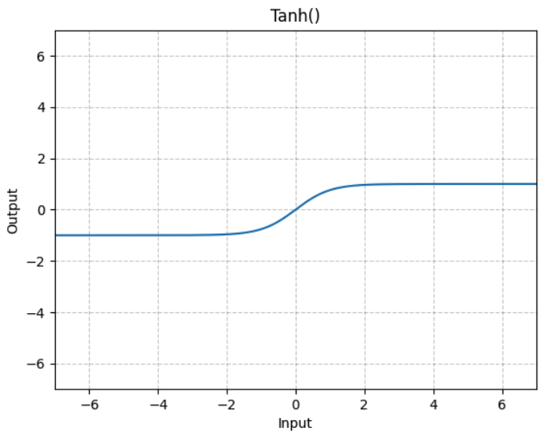
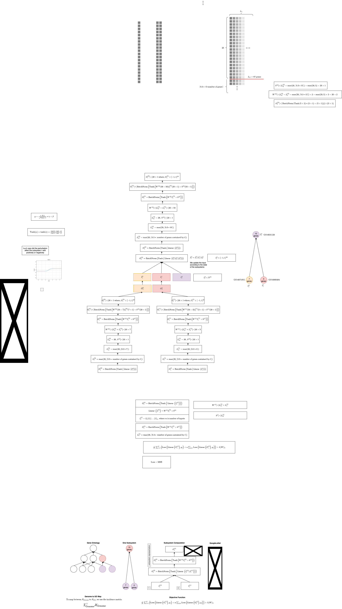
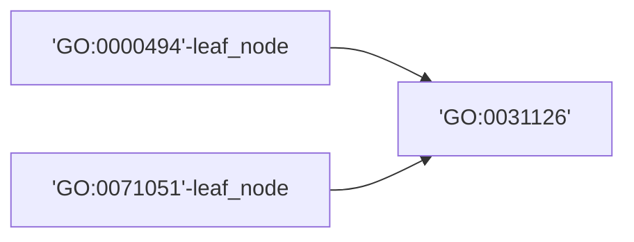

## Dcell model

- 2,526 GO terms define the `DCell` subsystems

### Dcell model - Input Training Data

$D=\left\{\left(X_1, y_1\right),\left(X_2\right.\right.$, $\left.\left.y_2\right), \ldots,\left(X_N, y_N\right)\right\}, (N - \text{sample number})$

$\forall i, X_i \in \mathbb{R}^M, X_i \in \{0,1\}, (0 = \text{wild type}$; $1=\text{disrupted})$1

$y_i \in \mathbb{R}, (\text{relative growth rate, genetic interaction value})$

$t$ - subsystem

### Dimensionality Analysis

$$
\begin{aligned}
W^{(0)} & \in \mathbb{R}^{L_O^{(0)} \times L_I^{(0)}} \\
L_O^{(0)} & =\max (20,\lceil 0.3 \times 15\rceil) \\
& =\max (20,\lceil 4.5\rceil) \\
& =\max (20,5) \\
& =20 \\
L_I^{(0)} & =2 \\
W^{(0)} & \in \mathbb{R}^{20 \times 2}
\end{aligned}
$$


1
[torch.nn.Tanh](https://pytorch.org/docs/stable/generated/torch.nn.Tanh.html)

[torch.nn.BatchNorm1d](https://pytorch.org/docs/stable/generated/torch.nn.BatchNorm1d.html)

## Dcell Model Drawio



## Lua Not Compatible with Delta Redhat

```bash
mjvolk3@dt-login02 torch % lsb_release -a                                                                                                                                             13:56
LSB Version: :core-4.1-amd64:core-4.1-noarch:cxx-4.1-amd64:cxx-4.1-noarch:desktop-4.1-amd64:desktop-4.1-noarch:languages-4.1-amd64:languages-4.1-noarch:printing-4.1-amd64:printing-4.1-noarch
Distributor ID: RedHatEnterprise
Description: Red Hat Enterprise Linux release 8.8 (Ootpa)
Release: 8.8
Codename: Ootpa
mjvolk3@dt-login02 torch % bash install-deps                                                                                                                                          13:56
==> Only Ubuntu, elementary OS, Fedora, Archlinux, OpenSUSE, Debian, CentOS and KDE neon distributions are supported.
```

## Subsetting GO by Date

Look into how we can subset GO by date. From the looks of this is not possible with the `gff`, but this data does exist in SGD. Just showing one term here.  We would have to cross reference with this data to get the GO subset.

```json
"go_details": [
    {
        "id": 6389520,
        "annotation_type": "manually curated",
        "date_created": "2002-11-26",
        "qualifier": "enables",
        "locus": {
            "display_name": "YDR210W",
            "link": "/locus/S000002618",
            "id": 1266542,
            "format_name": "YDR210W"
        },
        "go": {
            "display_name": "molecular function",
            "link": "/go/GO:0003674",
            "go_id": "GO:0003674",
            "go_aspect": "molecular function",
            "id": 290848
        },
        "reference": {
            "display_name": "SGD (2002)",
            "link": "/reference/S000069584",
            "pubmed_id": null
        },
        "source": {
            "display_name": "SGD"
        },
        "experiment": {
            "display_name": "ND",
            "link": "http://wiki.geneontology.org/index.php/No_biological_Data_available_(ND)_evidence_code"
        },
        "properties": []
    },
]
```

## Model Implementation - Passing Previous Subsystem Outputs



```python
>>>len(G.nodes['GO:0031126']['gene_set'])
10
>>>len(G.nodes['GO:0000494']['gene_set'])
3
>>>len(G.nodes['GO:0071051']['gene_set'])
7
>>>dcell.subsystems['GO:0031126']
SubsystemModel(
  (linear): Linear(in_features=10, out_features=20, bias=True)
  (tanh): Tanh()
  (batchnorm): BatchNorm1d(20, eps=1e-05, momentum=0.1, affine=True, track_running_stats=True)
)
>>>dcell.subsystems['GO:0000494']
SubsystemModel(
  (linear): Linear(in_features=3, out_features=20, bias=True)
  (tanh): Tanh()
  (batchnorm): BatchNorm1d(20, eps=1e-05, momentum=0.1, affine=True, track_running_stats=True)
)
>>>dcell.subsystems['GO:0071051']
SubsystemModel(
  (linear): Linear(in_features=7, out_features=20, bias=True)
  (tanh): Tanh()
  (batchnorm): BatchNorm1d(20, eps=1e-05, momentum=0.1, affine=True, track_running_stats=True)
)
```

- The features from the two chid nodes `'GO:0000494'-leaf_node`,
`'GO:0071051'-leaf_node` should be concatenated with the boolean state vector of `'GO:0031126'`. This means that we should instead have size `50` coming in, the out features are still determined by the number of genes that are annotated to that node, so it will get maxed to 20.

```python
>>>dcell.subsystems['GO:0031126']
SubsystemModel(
  (linear): Linear(in_features=50, out_features=20, bias=True)
  (tanh): Tanh()
  (batchnorm): BatchNorm1d(20, eps=1e-05, momentum=0.1, affine=True, track_running_stats=True)
)
```

## 2025.05.09 - Reviving Model

Just Had to update the definitions of `SCerevisiae` and `SCerevisiaeGraph`

```python
(torchcell) michaelvolk@M1-MV torchcell % python /Users/michaelvolk/Documents/projects/torchcell/torchcell/models/dcell.py
/Users/michaelvolk/opt/miniconda3/envs/torchcell/lib/python3.11/site-packages/torch_geometric/typing.py:68: UserWarning: An issue occurred while importing 'pyg-lib'. Disabling its usage. Stacktrace: dlopen(/Users/michaelvolk/opt/miniconda3/envs/torchcell/lib/python3.11/site-packages/libpyg.so, 0x0006): Library not loaded: /Library/Frameworks/Python.framework/Versions/3.11/Python
  Referenced from: <B4DF21CE-3AD4-3ED1-8E22-0F66900D55D2> /Users/michaelvolk/opt/miniconda3/envs/torchcell/lib/python3.11/site-packages/libpyg.so
  Reason: tried: '/Library/Frameworks/Python.framework/Versions/3.11/Python' (no such file), '/System/Volumes/Preboot/Cryptexes/OS/Library/Frameworks/Python.framework/Versions/3.11/Python' (no such file), '/Library/Frameworks/Python.framework/Versions/3.11/Python' (no such file)
  warnings.warn(f"An issue occurred while importing 'pyg-lib'. "
/Users/michaelvolk/opt/miniconda3/envs/torchcell/lib/python3.11/site-packages/torch_geometric/typing.py:124: UserWarning: An issue occurred while importing 'torch-sparse'. Disabling its usage. Stacktrace: dlopen(/Users/michaelvolk/opt/miniconda3/envs/torchcell/lib/python3.11/site-packages/libpyg.so, 0x0006): Library not loaded: /Library/Frameworks/Python.framework/Versions/3.11/Python
  Referenced from: <B4DF21CE-3AD4-3ED1-8E22-0F66900D55D2> /Users/michaelvolk/opt/miniconda3/envs/torchcell/lib/python3.11/site-packages/libpyg.so
  Reason: tried: '/Library/Frameworks/Python.framework/Versions/3.11/Python' (no such file), '/System/Volumes/Preboot/Cryptexes/OS/Library/Frameworks/Python.framework/Versions/3.11/Python' (no such file), '/Library/Frameworks/Python.framework/Versions/3.11/Python' (no such file)
  warnings.warn(f"An issue occurred while importing 'torch-sparse'. "
/Users/michaelvolk/Documents/projects/torchcell/data/go/go.obo: fmt(1.2) rel(2024-11-03) 43,983 Terms
5874
INFO:torchcell.graph.graph:Nodes annotated after 2017-07-19 removed: 2435
After date filter: 3439
INFO:torchcell.graph.graph:IGI nodes removed: 160
After IGI filter: 3279
INFO:torchcell.graph.graph:Redundant nodes removed: 15
After redundant filter: 3264
INFO:torchcell.graph.graph:Nodes with < 2 contained genes removed: 1024
After containment filter: 2240
/Users/michaelvolk/opt/miniconda3/envs/torchcell/lib/python3.11/site-packages/torch/nn/modules/loss.py:608: UserWarning: Using a target size (torch.Size([2, 1])) that is different to the input size (torch.Size([2, 2])). This will likely lead to incorrect results due to broadcasting. Please ensure they have the same size.
  return F.mse_loss(input, target, reduction=self.reduction)
Loss: 68.67665100097656
params_dcell: 15950032
params_dcell_linear: 100010
total parameters: 16050042
```

## 2025.05.10 - Inspecting Data in GoGraph

```python
dcell.go_graph.nodes['GO:0007033']
{'id': 'GO:0007033', 'item_id': 'GO:0007033', 'name': 'vacuole organization', 'namespace': 'biological_process', 'level': 5, 'depth': 5, 'is_obsolete': False, 'alt_ids': {'GO:0044086'}, 'gene_set': GeneSet(size=11, items=['YAL040C', 'YDL077C', 'YDR080W']...), 'genes': {'YAL040C': {...}, 'YDL077C': {...}, 'YDR080W': {...}, 'YEL027W': {...}, 'YGL095C': {...}, 'YGR071C': {...}, 'YIL041W': {...}, 'YIL048W': {...}, 'YLR396C': {...}, 'YOR246C': {...}, 'YPR173C': {...}}, 'mutant_state': tensor([1., 1., 1., 1., 1., 1., 1., 1., 1., 1., 1.])}
```

The `GO:ROOT` is for connectivity making the graph a fully connected DAG.

```python
dcell.go_graph.nodes['GO:ROOT']
{'name': 'GO Super Node', 'namespace': 'super_root', 'level': -1, 'mutant_state': tensor([])}
```

We apply deletion directly to `nx.Graph`

```python
# Line :313
G_mutant = delete_genes(
    go_graph=dcell.go_graph, deletion_gene_set=GeneSet(("YDL029W", "YDR150W"))
)
```

```python
def delete_genes(go_graph: nx.Graph, deletion_gene_set: GeneSet):
  G_mutant = go_graph.copy()
  for node in G_mutant.nodes:
      if node == "GO:ROOT":
          G_mutant.nodes[node]["mutant_state"] = torch.tensor([], dtype=torch.int32)
      else:
          gene_set = G_mutant.nodes[node]["gene_set"]
          # Replace the genes in the knockout set with 0
          G_mutant.nodes[node]["mutant_state"] = torch.tensor(
              [1 if gene not in deletion_gene_set else 0 for gene in gene_set],
              dtype=torch.int32,
          )
  return G_mutant
```

We want to apply this perturbation in [[Graph_processor|dendron://torchcell/torchcell.data.graph_processor]] for DCell. That is we want to flip bits according to which gene was perturbed.

## 2025.05.10 - DCell Not Compliant With Torch Norms

We want the the models forward call to just take batch. `output_size=2` can be determined at model initialization.

```python
subsystem_outputs = dcell(batch)
dcell_linear = DCellLinear(dcell.subsystems, output_size=2)
output = dcell_linear(subsystem_outputs)
```
