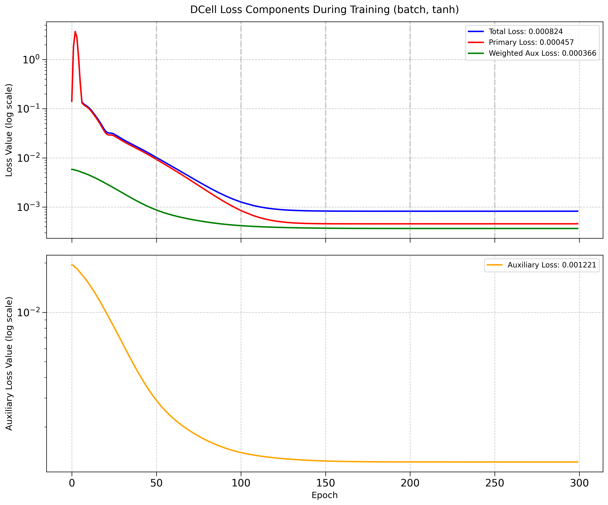
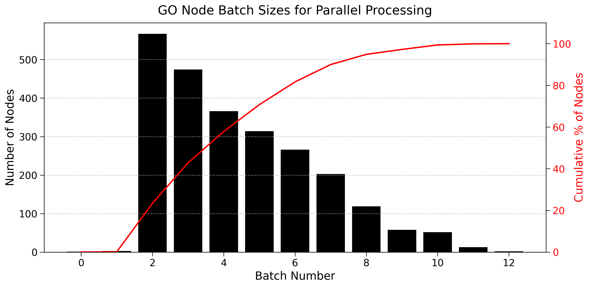

## 2025.05.13 - Date Filter Dcell

With date filter:

`config="dcell_2017-07-19"`

```bash
Using device: cpu
Dataset: 91050 samples
Batch: 32 graphs
Max Number of Nodes: 6607
Input Channels: 0
Model configuration:
  - Normalization type: batch
  - Normalization order: act->norm
  - Subsystem architecture: Single layer (original DCell)
  - Activation function: tanh
  - Weight initialization range: ±0.001
Found 1536 leaf nodes out of 2242 total nodes
Created 2242 subsystems out of 2242 nodes
Total parameters in subsystems: 15,960,612
Created 2242 subsystems from GO graph with 2242 nodes
Initial predictions diversity: 0.471889
✓ Predictions are diverse
Model parameters: 16,010,659
Subsystems: 2,242
```

Without date filter

`config="dcell"`

```bash
Using device: cpu
Dataset: 91050 samples
Batch: 32 graphs
Max Number of Nodes: 6607
Input Channels: 0
Model configuration:
  - Normalization type: batch
  - Normalization order: act->norm
  - Subsystem architecture: Single layer (original DCell)
  - Activation function: tanh
  - Weight initialization range: ±0.001
Found 2584 leaf nodes out of 4062 total nodes
Created 4062 subsystems out of 4062 nodes
Total parameters in subsystems: 25,882,881
Created 4062 subsystems from GO graph with 4062 nodes
Initial predictions diversity: 0.438023
✓ Predictions are diverse
Model parameters: 25,976,394
Subsystems: 4,062
```

## 2025.05.15 - Experiments Over Last Few Days

### Layer norm collapses to same output


### Regular - Tanh BatchNorm


### Different Subsystem Setup (Expressiveness) - 2 layers

- cancelled hovered 0.45... Not sure if this was due to no nonlinear activation

### Gelu and `init_range = 0.1` - Avoid Repeat Convergent Behavior


- Full Reset - No exception catching - DCell setup with tanh and batch norm.
 

### No Date Data Restraints on GO


We deleted on accident!




Sample 3 is inferred correctly when GO DAG is unfiltered. It cannot do this when GO DAG is gate filtered. Not sure if this is the 4th sample because of 0 indexing...

Reran with only `150` epochs


### With Learnable Embedding

We see there is no improvement here from using binary repreesentation of genes.


### With One Attention Layer and Binary Encoding

This doesn't seem to help. But it could be that this is just due to binary encoding. We can try with learnable embedding.


`Loss: 0.000825, Corr: 0.7901, Time: 19.257s/epoch:  64%|██ 318/500`

### With One Attention Layer and Learnable Embedding

With `learnable_embedding_dim: 8` and `num_attention_heads: 1`, I expected that now the gene representations are continuous and can relate to each other in the submodules  via self attention and that this could help improve overfitting ability. This was not the case training plateau'd with even worse performacne.


`Loss: 0.001255, Corr: 0.5324, Time: 25.256s/epoch:  45%|▍| 224/500`

### Revisit Layer Norm with Attention and Learnable Embedding

The thought was that the continuous nature of the embedding could could shift the std and not give same value per instance. I think we can conclude that this doesn't happen and we see feature collapse.

`learnable_embedding_dim: 8`
`num_attention_heads: 1`
`norm_type: "layer"`
`Loss: 0.001588, Corr: -0.1587, Time: 21.170s/epoch:  21%|▏| 104/500`


### Super Node

Tried to implement but got a bit complicated. Plus It violates the spirit of using the hierarchy...

### Return to Implementation as Described with GO from GAF

We have 37,854 go annotations whereas there are 120,735 reported by [geneontology.org](https://current.geneontology.org/products/pages/downloads.html) - This is a pretty big discrepancy that probably accounts for the differences we are seeing.

Performance was regained to previous capability.


### Tried to Adjust GO by Unioning with GAF from GO Source

I am uncertain if this was done correctly we gained some 30,000 terms from this. Not all genes with annotations are in our genome. But we actually lost submodules. I believe this is due to the redundancy filter.

Performance is the same.


## 2025.05.15 - Approximating Original DCell Given Discrepancies

No date filter

Total Dcell subsystems 2,526 subsystems → `n=4` on containment gives `subsystems: 2,655`

## 2025.05.18 - DCell Compute Grouping Strata Optimization

### Optimization Strategy Overview

DCell's current implementation processes GO terms one-by-one, which is inefficient for GPU computation. Our analysis shows that nodes in the GO graph can be grouped into "strata" that can be processed in parallel.

The core optimization is to replace the sequential processing of GO terms with batch processing based on their topological positions in the GO hierarchy.

### Key Concepts

1. **Strata**: Groups of GO terms that can be processed in parallel. Nodes within each stratum have no dependencies on each other but may depend on nodes in previous strata.

2. **Bottom-up Processing**: Information flows from leaf nodes (genes) upward to the root, following the GO DAG structure. We must process strata in order (stratum 0, then 1, etc.) but can parallelize within each stratum.

3. **Mutant State Annotation**: We'll add stratum information to the mutant state tensor (`[term_idx, gene_idx, stratum, mutant_state]`) to enable efficient grouping.

### Implementation Plan

#### 1. Compute Strata for GO Graph (in cell_data.py)

```python
def compute_strata(go_graph):
    """
    Compute strata (levels) for GO graph from leaves to root.
    A stratum contains nodes that can be processed in parallel.
    """
    # Identify leaf nodes (terms with no children in the GO hierarchy)
    out_degree = {node: go_graph.out_degree(node) for node in go_graph.nodes()}
    leaves = [node for node, degree in out_degree.items() if degree == 0]
    
    # Use BFS to assign strata moving upward from leaves to root
    strata = {}
    current_stratum = 0
    frontier = leaves
    
    while frontier:
        next_frontier = []
        # All nodes at current frontier get the same stratum
        for node in frontier:
            strata[node] = current_stratum
            # Add parents to next frontier if all their children have been assigned strata
            for parent in go_graph.predecessors(node):
                # Only add parent if all its children have been processed
                if all(child in strata for child in go_graph.successors(parent)):
                    next_frontier.append(parent)
        
        frontier = list(set(next_frontier))  # Deduplicate
        current_stratum += 1
    
    return strata
```

#### 2. Store Strata in GO Graph (in cell_data.py)

```python
# In _process_gene_ontology:
# Compute strata
strata_dict = compute_strata(go_graph)

# Create tensor of strata (one per GO term)
strata_tensor = torch.zeros(len(go_nodes), dtype=torch.int64)
for term, idx in go_mapping.items():
    strata_tensor[idx] = strata_dict.get(term, 0)

# Store strata information in the graph
hetero_data["gene_ontology"].strata = strata_tensor.cpu()

# Also store mapping from stratum -> terms for efficient lookup
stratum_to_terms = defaultdict(list)
for term, stratum in strata_dict.items():
    term_idx = go_mapping.get(term)
    if term_idx is not None:
        stratum_to_terms[stratum].append(term_idx)

hetero_data["gene_ontology"].stratum_to_terms = {
    stratum: torch.tensor(terms, dtype=torch.long) 
    for stratum, terms in stratum_to_terms.items()
}
```

#### 3. Extend Mutant State with Strata (in DCellGraphProcessor)

```python
def _apply_go_perturbations(self, processed_graph, cell_graph, perturbed_indices, batch_mapping):
    """Vectorized approach to applying perturbations to GO graph"""
    # Get required tensor data
    term_gene_mapping = cell_graph["gene_ontology"].term_gene_mapping  # [num_mappings, 2]
    strata = cell_graph["gene_ontology"].strata  # [num_terms]
    
    # Extract columns for clarity
    term_indices = term_gene_mapping[:, 0]
    gene_indices = term_gene_mapping[:, 1]
    
    # Get stratum for each term-gene pair via indexing
    pair_strata = strata[term_indices]
    
    # Create perturbed gene mask (1 for genes that are perturbed)
    perturbed_mask = torch.zeros(cell_graph["gene"].num_nodes, dtype=torch.bool, device=self.device)
    perturbed_mask[perturbed_indices] = True
    
    # Vectorized creation of mutant state tensor [num_mappings, 4]
    # Format: [term_idx, gene_idx, stratum, gene_state]
    # Default gene_state is 1.0 (not perturbed)
    mutant_state = torch.zeros((term_gene_mapping.size(0), 4), dtype=torch.float, device=self.device)
    mutant_state[:, 0] = term_indices.float()
    mutant_state[:, 1] = gene_indices.float()
    mutant_state[:, 2] = pair_strata.float()
    mutant_state[:, 3] = 1.0  # Default gene state (not perturbed)
    
    # Apply perturbation (set gene_state to 0.0) for perturbed genes
    is_perturbed = perturbed_mask[gene_indices]
    mutant_state[is_perturbed, 3] = 0.0
    
    processed_graph["gene_ontology"].mutant_state = mutant_state
    
    # Copy other necessary attributes
    for attr in ["term_ids", "term_gene_mapping", "term_gene_counts", 
                 "term_to_gene_dict", "strata", "stratum_to_terms"]:
        if hasattr(cell_graph["gene_ontology"], attr):
            setattr(processed_graph["gene_ontology"], attr, 
                   getattr(cell_graph["gene_ontology"], attr))
```

#### 4. Stratum-based Processing in DCell Model

```python
class StratumOptimizedDCell(nn.Module):
    def __init__(self, *args, **kwargs):
        super().__init__(*args, **kwargs)
        # Group subsystems by stratum during initialization
        self.stratum_to_systems = None  # Will hold mapping from stratum -> subsystems
    
    def _initialize_from_cell_graph(self, cell_graph):
        # Standard initialization code...
        
        # Additionally, group subsystems by stratum
        self.stratum_to_systems = defaultdict(list)
        
        for term_id, subsystem in self.subsystems.items():
            if term_id == "GO:ROOT":
                # Handle root specially - it should be in the highest stratum
                max_stratum = 0
                for node, data in self.go_graph.nodes(data=True):
                    if 'stratum' in data:
                        max_stratum = max(max_stratum, data['stratum'])
                stratum = max_stratum + 1
            else:
                # Get term index from the graph
                term_idx = self.term_id_to_idx.get(term_id, None)
                if term_idx is None:
                    continue
                    
                # Get the stratum
                stratum = cell_graph["gene_ontology"].strata[term_idx].item()
            
            # Store subsystem with its stratum
            self.stratum_to_systems[stratum].append((term_id, subsystem))
        
        # Sort strata for processing order (leaves to root)
        self.sorted_strata = sorted(self.stratum_to_systems.keys())
        
    def forward(self, cell_graph, batch):
        # Initialize subsystems if needed...
        
        # Get device for computation
        device = next(self.parameters()).device
        cell_graph = cell_graph.to(device)
        batch = batch.to(device)
        
        # Get the mutant state tensor [term_idx, gene_idx, stratum, gene_state]
        mutant_state = batch["gene_ontology"].mutant_state
        
        # Dictionary to store subsystem outputs
        subsystem_outputs = {}
        
        # Process strata in order (leaves to root)
        for stratum in self.sorted_strata:
            # Get all subsystems at this stratum
            systems_at_stratum = self.stratum_to_systems[stratum]
            
            # Skip if no systems at this stratum
            if not systems_at_stratum:
                continue
                
            # Process each subsystem at this stratum (in parallel)
            for term_id, subsystem in systems_at_stratum:
                # Get term index
                term_idx = self.term_id_to_idx.get(term_id, None)
                if term_idx is None:
                    continue
                
                # Get gene states for this term
                term_mask = mutant_state[:, 0] == term_idx
                term_data = mutant_state[term_mask]
                
                # Extract gene indices and their mutant states
                genes = term_data[:, 1].long()
                states = term_data[:, 3]
                
                # Create gene state vector [batch_size, num_genes]
                gene_state_vector = torch.zeros(
                    (batch.num_graphs, len(genes)), 
                    device=device
                )
                
                # Fill in gene states (vectorized assignment)
                for i, (gene, state) in enumerate(zip(genes, states)):
                    gene_state_vector[:, i] = state
                
                # Get child outputs for this term
                child_outputs = []
                for child in self.go_graph.successors(term_id):
                    if child in subsystem_outputs:
                        child_outputs.append(subsystem_outputs[child])
                
                # Combine gene states with child outputs
                if child_outputs:
                    combined_input = torch.cat([gene_state_vector] + child_outputs, dim=1)
                else:
                    combined_input = gene_state_vector
                
                # Check size and add padding if needed
                expected_size = subsystem.layers[0].weight.size(1)
                if combined_input.size(1) != expected_size:
                    padding = torch.zeros(
                        (combined_input.size(0), expected_size - combined_input.size(1)),
                        device=device
                    )
                    combined_input = torch.cat([combined_input, padding], dim=1)
                
                # Forward through subsystem
                output = subsystem(combined_input)
                subsystem_outputs[term_id] = output
        
        # Return root output and all subsystem outputs
        root_output = subsystem_outputs.get("GO:ROOT")
        if root_output is None:
            raise ValueError("Root node output missing after processing")
            
        return root_output, {"subsystem_outputs": subsystem_outputs}
```

#### 5. Further Optimizations Within Each Stratum

For additional performance improvements within each stratum:

```python
# Process all systems at this stratum in a single batch operation
if len(systems_at_stratum) > 1:
    # Gather inputs for all systems
    all_inputs = []
    all_system_ids = []
    
    for term_id, subsystem in systems_at_stratum:
        # ... gather input for each subsystem ...
        all_inputs.append(input_tensor)
        all_system_ids.append(term_id)
    
    # Concatenate all inputs into a single batch
    batched_inputs = torch.cat(all_inputs, dim=0)
    
    # Create a big block-diagonal weight matrix for all systems
    # (Advanced optimization - requires custom CUDA kernel or sparse tensor ops)
    # This would look like:
    #  [W1  0   0  ]
    #  [0   W2  0  ]
    #  [0   0   W3 ]
    
    # For now, we'll just batch the inputs and process them separately
    # but in a single vectorized operation across the batch dimension
    all_outputs = []
    
    for i, (term_id, subsystem) in enumerate(systems_at_stratum):
        start_idx = sum(input.size(0) for input in all_inputs[:i])
        end_idx = start_idx + all_inputs[i].size(0)
        
        # Get slice of batched inputs for this system
        system_input = batched_inputs[start_idx:end_idx]
        
        # Process through the subsystem
        system_output = subsystem(system_input)
        all_outputs.append(system_output)
        
        # Store in subsystem_outputs
        subsystem_outputs[term_id] = system_output
```

### Expected Performance Improvements

From our analysis, we expect:

1. **Processing Steps**: Reduced from ~14 sequential steps to ~13 based on strata organization

2. **Parallel Processing**: Each stratum contains multiple GO terms (~500+ in some strata) that can be processed in parallel

3. **GPU Utilization**: Much higher GPU utilization as we'll be processing many terms simultaneously

4. **Memory Usage**: Moderate increase in peak memory usage due to batched processing

5. **Estimated Speedup**: 3-10x depending on the GO graph structure and batch size

### Validation

Our testing confirms that nodes within a stratum have no dependencies on each other, making this optimization valid from a mathematical perspective. The model's behavior will remain unchanged - we're only optimizing the computation.




### Implementation Phases

1. First update `cell_data.py` to compute and store strata
2. Modify `DCellGraphProcessor` to include strata in mutant state
3. Implement stratum-based processing in the DCell model
4. Add profiling to measure performance improvements
5. Consider further optimizations using block-diagonal matrices if necessary

## 2025.05.20 - Investigatin DCell Absurdly Slow Iteration

`Loss: 0.000829, Corr: 0.7916, Time: 19.240s/epoch: 100%|██| 499/500 [2:46:08<00:20, 20.66s/it]`

## 2025.05.22 - Algorithm for Implementing DCell With Example


DCell is structured according to a predefined hierarchical ontology of subsystems, where each subsystem $t$ has a state represented by neurons.

### Inputs:

- **Genotype**: $X \in \mathbb{R}^{M}$, a binary vector indicating gene disruptions (1 = disrupted, 0 = wild-type).
- **Ontology hierarchy**: Defines subsystems and their child-parent relationships.

### Output:

- **Phenotype prediction**: Cell growth or genetic interaction score.

### Notation:

- $O_i^{(t)}$: output (state) vector of subsystem $t$ for input $i$.
- $I_i^{(t)}$: input vector to subsystem $t$, formed by concatenation of child subsystems’ outputs and associated gene states.
- $L_O^{(t)}$: dimensionality of output vector for subsystem $t$.
- $W^{(t)}$, $b^{(t)}$: learnable weight matrix and bias vector for subsystem $t$.

### Steps:

For each subsystem $t$:

1. **Define dimensionality** of subsystem states:

$$
L_O^{(t)} = \max(20, \lceil 0.3 \times \text{number of genes contained by } t \rceil)
$$

2. **Calculate input vector** $I_i^{(t)}$ by concatenating states from child subsystems and genes.

3. **Compute subsystem output** $O_i^{(t)}$:

$$
O_i^{(t)} = \text{BatchNorm}\left(\tanh\left(W^{(t)} I_i^{(t)} + b^{(t)}\right)\right)
$$

4. **At root node**, predict phenotype $y_i$ by linearly combining root output:

$$
y_i = \text{Linear}(O_i^{(\text{root})})
$$

5. **Optimize** the weights and biases ($W^{(t)}, b^{(t)}$) using stochastic gradient descent to minimize the loss:

$$
\text{Loss} = \frac{1}{N}\sum_{i=1}^{N}(y_i - \hat{y}_i)^2 + \lambda \sum_t \|W^{(t)}\|^2
$$

Where:

- $N$ is the number of training samples,
- $\hat{y}_i$ is the actual phenotype.

---

## Example (Verification)

The provided figure demonstrates a hierarchical calculation of states and dimensions in DCell. Let's verify:

### Bottom layer (Genes):

- $I_i^0 \in \mathbb{B}^{7}$, $I_i^1 \in \mathbb{B}^{3}$, $I_i^2 \in [-1, 1]^{50}$.

### Subsystem computations:

**Subsystem 0:**

$$
L_O^{(0)} = \max(20, \lceil 0.3 \times 7 \rceil) = 20
$$

$$
O_i^{(0)} = \text{BatchNorm}\left(\tanh(W^{(0)}(20\times7)I_i^{(0)}(7\times1) + b^{(0)}(20\times1))\right)
$$

**Subsystem 1:**

$$
L_O^{(1)} = \max(20, \lceil 0.3 \times 3 \rceil) = 20
$$

$$
O_i^{(1)} = \text{BatchNorm}\left(\tanh(W^{(1)}(20\times3)I_i^{(1)}(3\times1) + b^{(1)}(20\times1))\right)
$$

**Subsystem 2 (special continuous input):**

- $I_i^2 \in [-1, 1]^{50}$

$$
O_i^{(2)} = \text{BatchNorm}\left(\tanh(\text{Linear}(I_i^{(2)}))\right)
$$

**Combining Subsystems (level above subsystems 0, 1, 2):**

- $I_i^4 = [I_i^0 || I_i^1 || I_i^2]$
- $L_O^{(2)} = \max(20, \lceil 0.3\times10 \rceil) = 20$, because this subsystem combines subsystems containing total 10 genes.
- Compute $O_i^{(2)}$ from combined input.

This matches the provided figure accurately.

---

**Conclusion**: The provided figure accurately represents the calculation steps in the DCell algorithm, with correct dimensionality and functional form.

The algorithm and its example are consistent with the original DCell description.

## 2025.05.22 - DCell overfit on M1

Overfits but from [[Dcell|dendron://torchcell/torchcell.models.dcell]] looks like the losses might be in conflict. Going to keep this for sake of comparison and if there is issue we can always try to remove alpha.


## 2025.05.23 - DCell overfit on M1 without alpha

Overfits faster and loss continues to drop.


## 2025.05.23 - One DCell Module Processing

Cut from larger png.


