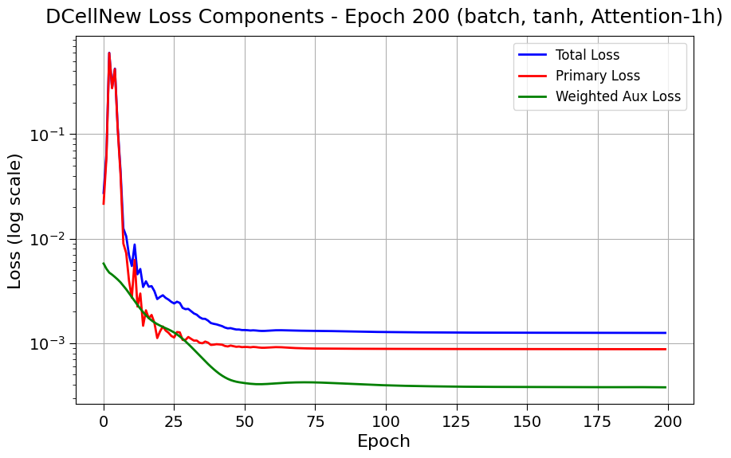

## 2025.05.13 - Date Filter Dcell

With date filter:

`config="dcell_2017-07-19"`

```bash
Using device: cpu
Dataset: 91050 samples
Batch: 32 graphs
Max Number of Nodes: 6607
Input Channels: 0
Model configuration:
  - Normalization type: batch
  - Normalization order: act->norm
  - Subsystem architecture: Single layer (original DCell)
  - Activation function: tanh
  - Weight initialization range: ±0.001
Found 1536 leaf nodes out of 2242 total nodes
Created 2242 subsystems out of 2242 nodes
Total parameters in subsystems: 15,960,612
Created 2242 subsystems from GO graph with 2242 nodes
Initial predictions diversity: 0.471889
✓ Predictions are diverse
Model parameters: 16,010,659
Subsystems: 2,242
```

Without date filter

`config="dcell"`

```bash
Using device: cpu
Dataset: 91050 samples
Batch: 32 graphs
Max Number of Nodes: 6607
Input Channels: 0
Model configuration:
  - Normalization type: batch
  - Normalization order: act->norm
  - Subsystem architecture: Single layer (original DCell)
  - Activation function: tanh
  - Weight initialization range: ±0.001
Found 2584 leaf nodes out of 4062 total nodes
Created 4062 subsystems out of 4062 nodes
Total parameters in subsystems: 25,882,881
Created 4062 subsystems from GO graph with 4062 nodes
Initial predictions diversity: 0.438023
✓ Predictions are diverse
Model parameters: 25,976,394
Subsystems: 4,062
```

## 2025.05.15 - Experiments Over Last Few Days

### Layer norm collapses to same output


### Regular - Tanh BatchNorm


### Different Subsystem Setup (Expressiveness) - 2 layers

- cancelled hovered 0.45... Not sure if this was due to no nonlinear activation

### Gelu and `init_range = 0.1` - Avoid Repeat Convergent Behavior


- Full Reset - No exception catching - DCell setup with tanh and batch norm.
 

### No Date Data Restraints on GO


We deleted on accident!


Sample 3 is inferred correctly when GO DAG is unfiltered. It cannot do this when GO DAG is gate filtered. Not sure if this is the 4th sample because of 0 indexing...

Reran with only `150` epochs


### With Learnable Embedding

We see there is no improvement here from using binary repreesentation of genes.


### With One Attention Layer and Binary Encoding

This doesn't seem to help. But it could be that this is just due to binary encoding. We can try with learnable embedding.


`Loss: 0.000825, Corr: 0.7901, Time: 19.257s/epoch:  64%|██ 318/500`

### With One Attention Layer and Learnable Embedding

With `learnable_embedding_dim: 8` and `num_attention_heads: 1`, I expected that now the gene representations are continuous and can relate to each other in the submodules  via self attention and that this could help improve overfitting ability. This was not the case training plateau'd with even worse performacne.



`Loss: 0.001255, Corr: 0.5324, Time: 25.256s/epoch:  45%|▍| 224/500`

### Revisit Layer Norm with Attention and Learnable Embedding

The thought was that the continuous nature of the embedding could could shift the std and not give same value per instance. I think we can conclude that this doesn't happen and we see feature collapse.

`learnable_embedding_dim: 8`
`num_attention_heads: 1`
`norm_type: "layer"`
`Loss: 0.001588, Corr: -0.1587, Time: 21.170s/epoch:  21%|▏| 104/500`


### Super Node

Tried to implement but got a bit complicated. Plus It violates the spirit of using the hierarchy...

### Return to Implementation as Described with GO from GAF

We have 37,854 go annotations whereas there are 120,735 reported by [geneontology.org](https://current.geneontology.org/products/pages/downloads.html) - This is a pretty big discrepancy that probably accounts for the differences we are seeing.

Performance was regained to previous capability.


### Tried to Adjust GO by Unioning with GAF from GO Source

I am uncertain if this was done correctly we gained some 30,000 terms from this. Not all genes with annotations are in our genome. But we actually lost submodules. I believe this is due to the redundancy filter.

Performance is the same.


## 2025.05.15 - Approximating Original DCell Given Discrepancies

No date filter

Total Dcell subsystems 2,526 subsystems → `n=4` on containment gives `subsystems: 2,655`
