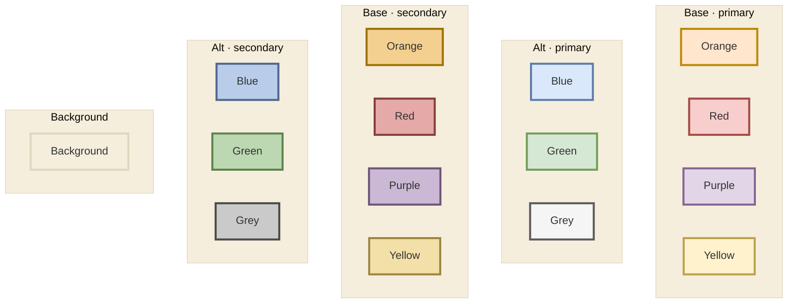

## 2026.06.17 - draw.io-aligned palette

Consistent color scheme for the [[Cell Graph Transformer mermaid|torchcell.models.equivariant_cell_graph_transformer.mermaid]] figures (the recolor target is the Type I / Type II diagram, `...mermaid` L170). The palette is built from draw.io's standard swatches so draw.io figures and mermaid diagrams stay color-consistent.

draw.io swatches are **fill / border pairs** (a pastel fill with a matched darker border). Mermaid `classDef fill:.. stroke:..` uses the same model, so colors transfer 1:1.

### Palette

Two tiers, listed **in order of use** (all primaries first, then secondaries): **primary** + a **secondary** that matches each color broadly but is shifted deeper. Fills are draw.io's standard pastels (secondary fill = primary fill mixed 30% toward its draw.io border). Borders are darkened from draw.io's stock strokes for stronger contrast: **primary border** = stock stroke darkened 12%, **secondary border** = darkened 27%. 14 fills + 14 borders total. Within each row the order is Orange, Red, Purple, Yellow (Base) and Blue, Green, Grey (Alt).

**Base**

| Color | Primary fill / border | Secondary fill / border |
|---|---|---|
| Orange | `#FFE6CC` / `#BD8800` | `#F3D08F` / `#9D7100` |
| Red | `#F8CECC` / `#A24A46` | `#E5A9A7` / `#863D3A` |
| Purple | `#E1D5E7` / `#846592` | `#CAB8D4` / `#6E5479` |
| Yellow | `#FFF2CC` / `#BCA04C` | `#F3E0A9` / `#9C853F` |

**Alternates**

| Color | Primary fill / border | Secondary fill / border |
|---|---|---|
| Blue | `#DAE8FC` / `#5F7DA8` | `#B9CDEA` / `#4F688B` |
| Green | `#D5E8D4` / `#729E5A` | `#BCD8B3` / `#5F834A` |
| Grey | `#F5F5F5` / `#5A5A5A` | `#CACACA` / `#4A4A4A` |

**Background**

The diagram canvas / cluster fill (set via the `%%{init ...}%%` line) is a warm beige.
Use it as the shared figure background so draw.io panels and mermaid diagrams match.

| Color | Fill / border |
|---|---|
| Background | `#F5EEDD` / `#E0D6BE` |

### Live swatch (mermaid)

The `%%{init ...}%%` line sets a beige background (overriding mermaid's default pale-yellow subgraph fill).

### Previous matplotlib palette (reference)

`torchcell/torchcell.mplstyle` (`axes.prop_cycle`) uses an earthier, more saturated cycle -- seen in the Random Forest r2 figure: `000000, D86E2F, 7191A9, 6B8D3A, B73C39, 34699D, 775A9F, 4A9C60, E6A65D, 52B2A8, A05B2C, 3978B5, ...`. Kept for data plots; the draw.io pastel palette above is the new standard for schematic figures.

### Notes

- The L170 mermaid has **9 classes** (input, embedding, transformer, typeI, typeII, equivariant, invariant, sparse, output). With **14** swatches (7 primary + 7 secondary) there are now more than enough distinct colors; primaries can carry the main 7 classes and secondaries cover the rest (or group a primary/secondary pair for related classes, e.g. invariant/equivariant readouts).
- **Mermaid background:** mermaid's default subgraph fill is a pale yellow (`#ffffde`); the `%%{init ...}%%` theme line sets `background`/`clusterBkg` to beige (`#F5EEDD`) to override it.
