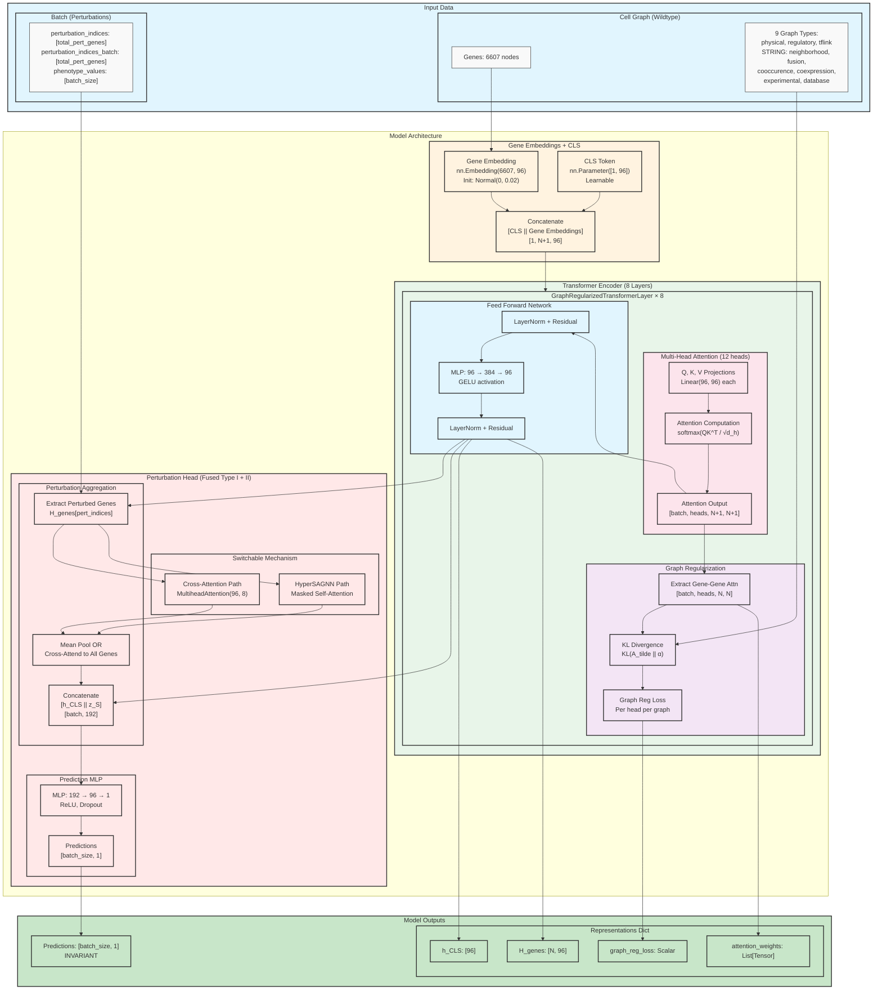
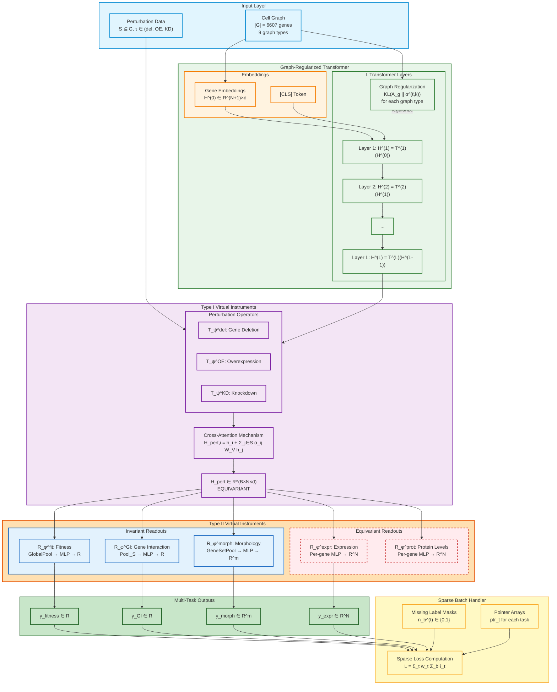
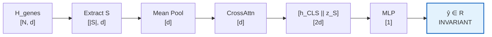
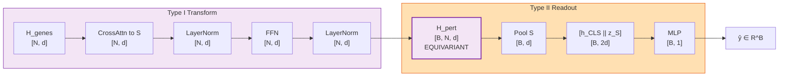
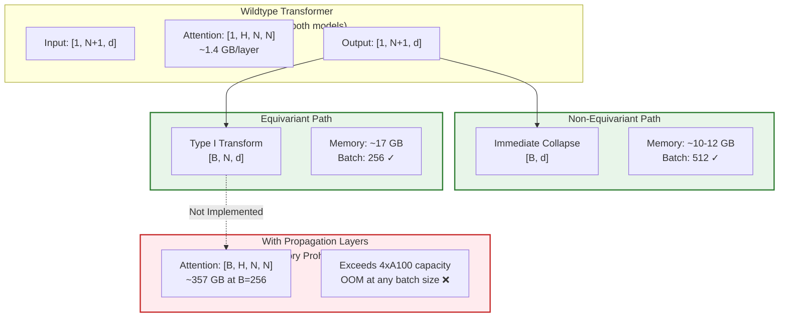
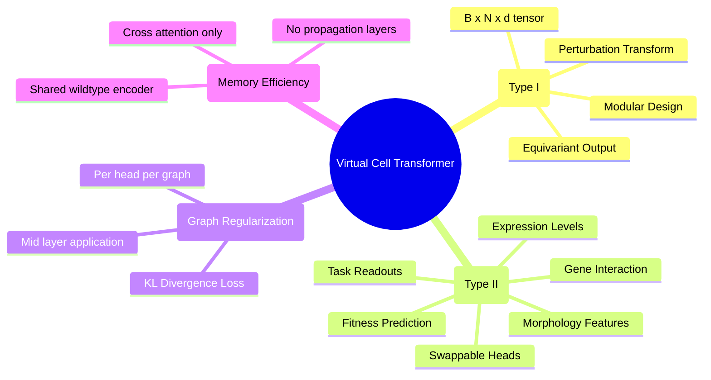

## Architecture Diagrams

This page contains mermaid architecture diagrams for the Cell Graph Transformer models.

**Main documentation:** [[torchcell.models.equivariant_cell_graph_transformer]]

## Non-Equivariant Cell Graph Transformer

The original architecture with immediate collapse to invariant outputs.

## Equivariant Cell Graph Transformer (Type I / Type II Separation)

The two-stage virtual instrument architecture preserving equivariance.

## Simplified Data Flow Comparison

### Non-Equivariant (Immediate Collapse)

### Equivariant (Type I / Type II)

## Memory Comparison

## Architecture Design Principles

