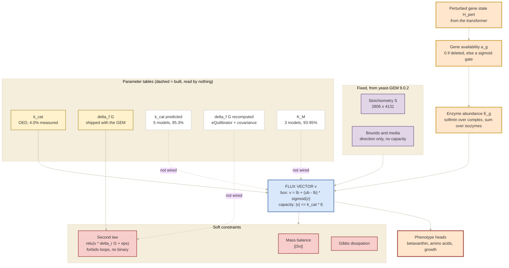

## 2026.09.04 - Simplified view: the main components

A five-box reading of the metabolic flux module, for orientation. The full diagram with the
equations is [[torchcell.models.equivariant_cell_graph_transformer.mermaid.metabolic-module]];
the instrument taxonomy it extends is
[[torchcell.models.equivariant_cell_graph_transformer.mermaid.type-i-ii]].

**Read the edge styles.** A solid edge is implemented and carries data in every run reported
so far. A dashed edge is built but NOT wired: the table exists, is hash-pinned, and is read
by nothing. That distinction is the single most important thing about the current state, and
the detailed diagram draws several of these edges solid when the code does not have them.



### What the five components do

| Component | Role |
|---|---|
| **Learned** | The only part with weights. A gene's embedding becomes an availability in [0,1], folded up the gene-protein-reaction rule to an enzyme abundance. A deletion pins availability to zero; everything else is free, which is what leaves room for dosage and alleles. |
| **Fixed** | Stoichiometry and bounds, straight from yeast-GEM 9.0.2 and never learned. The bounds encode direction and on/off only: 4,129 of 4,131 reactions carry no capacity at all, which is why the enzyme constraint is the load-bearing addition. |
| **Tables** | The physical constants. Solid = consumed today, dashed = built and read by nothing. Everything measured so far ran on the OED's 4.0% kcat plus a default and on the GEM's shipped formation energies. |
| **Flux vector** | The output, and the reason the module is neither Type I nor Type II: a latent physical state rather than a phenotype. Bounds and capacity hold exactly by the sigmoid parameterization and cannot be violated. |
| **Soft constraints** | Mass balance, the second law and dissipation, each a smooth penalty rather than a hard constraint. The second law is the one that matters: because delta_r G is a difference of potentials it sums to zero around any cycle, so requiring v * delta_r G <= 0 forbids internal loops with no integer variable. |

Regenerate the figure asset (name matches this note):

```bash
bash notes/assets/publish/scripts/mermaid_pdf.sh notes/torchcell.models.equivariant_cell_graph_transformer.mermaid.metabolic-module-simple.md
```
