## 2026.09.03 - CGT with the enzyme-constrained thermodynamic flux module

Updates [[torchcell.models.equivariant_cell_graph_transformer.mermaid.type-i-ii]] by adding
the metabolic module as a third instrument class. The flux layer is neither Type I nor
Type II as those were defined: it maps a perturbed representation to a **flux vector**,
which is a latent physical state rather than a measured phenotype, and the phenotypes are
read off that flux. So it sits between them.

Three inputs to the module are parameter tables rather than learned weights, and all three
are now built and hash-pinned: the kcat table from the sequence predictors, the Km table
from the same, and the formation energies recomputed from eQuilibrator with the covariance
factor that makes the thermodynamic term a measurement rather than a regularizer. The
heterologous pathway enters as a typed perturbation on the GEM, which is what puts the
betaxanthin cassette inside the same object as a gene deletion.

Colors follow the same base-primary mapping as the Type I / Type II diagram. The metabolic
module takes the blue slot, which was unused there, so the new content is separable at a
glance from what it extends.

```mermaid
%%{init: {'theme':'base','themeVariables':{'background':'#F5EEDD','clusterBkg':'#F5EEDD','clusterBorder':'#E0D6BE','lineColor':'#B7AC93'}}}%%
graph TD
  subgraph InputLayer["$$\text{Input Layer}$$"]
    direction TB
    CellGraph["$$\begin{gathered}\text{Cell Graph}\\\ |G| = 6607\ \text{genes}\\\ \text{9 graph types}\end{gathered}$$"]
    PerturbationData["$$\begin{gathered}\text{Perturbation Data}\\\ S \subseteq G,\ \tau \in \{\mathrm{del}, \mathrm{OE}, \mathrm{KD}, \mathrm{cassette}\}\end{gathered}$$"]
  end

  subgraph TransformerBlock["$$\text{Graph-Regularized Transformer}$$"]
    direction TB
    GeneEmbed["$$\begin{gathered}\text{Gene Embeddings}\\\ H^{(0)} \in \mathbb{R}^{(N+1)\times d}\end{gathered}$$"]
    TLayers["$$\begin{gathered}L\ \text{Transformer Layers}\\\ H^{(L)} = T^{(L)}(H^{(L-1)})\end{gathered}$$"]
    GraphReg["$$\begin{gathered}\text{Graph Regularization}\\\ \mathrm{KL}(A_g \,\|\, \alpha^{(\ell,k)})\end{gathered}$$"]
  end

  subgraph TypeI["$$\begin{gathered}\text{Type I Virtual Instruments}\\\ (\text{Representation} \to \text{Representation})\end{gathered}$$"]
    direction TB
    PertOps["$$\begin{gathered}T_\psi^{\mathrm{del}},\ T_\psi^{\mathrm{OE}},\ T_\psi^{\mathrm{KD}}\\\ \text{Perturbation Operators}\end{gathered}$$"]
    PerturbedState["$$\begin{gathered}H_{\mathrm{pert}} \in \mathbb{R}^{B \times N \times d}\\\ \text{EQUIVARIANT}\end{gathered}$$"]
  end

  subgraph MetabolicModule["$$\begin{gathered}\text{Metabolic Flux Module}\\\ (\text{Representation} \to \text{Flux})\end{gathered}$$"]
    direction TB

    subgraph Params["$$\text{Hash-Pinned Parameter Tables}$$"]
      direction TB
      KcatTable["$$\begin{gathered}k_{cat}\ \text{table}\\\ \text{DLKcat, UniKP, TurNuP,}\\\ \text{EITLEM, DeepEnzyme}\end{gathered}$$"]
      KmTable["$$\begin{gathered}K_M\ \text{table}\\\ \text{UniKP, EITLEM, Boost\_KM}\end{gathered}$$"]
      ThermoTable["$$\begin{gathered}\Delta_f G'^{\circ},\ \Sigma\\\ \text{eQuilibrator component}\\\ \text{contribution}\end{gathered}$$"]
    end

    subgraph GEMSide["$$\text{Genome-Scale Model}$$"]
      direction TB
      Stoich["$$\begin{gathered}S \in \mathbb{R}^{2806 \times 4131}\\\ \text{yeast-GEM 9.0.2}\end{gathered}$$"]
      Media["$$\begin{gathered}\text{Media Bounds}\\\ lb_j,\ ub_j\ \text{on exchange}\end{gathered}$$"]
      Pathway["$$\begin{gathered}\text{Heterologous Cassette}\\\ \text{betaxanthin, as a}\\\ \text{typed perturbation}\end{gathered}$$"]
    end

    GeneAvail["$$\begin{gathered}\text{Gene Availability}\\\ a_g = 0\ \text{if deleted, else}\ \sigma(w^\top h_g)\\\ \text{unit} = \mathrm{softmin}_g\ a_g\end{gathered}$$"]
    Enzyme["$$\begin{gathered}\text{Enzyme Abundance}\ E_j\\\ \sum_g MW_g E_g \le P_{\mathrm{avail}}\end{gathered}$$"]
    Box["$$\begin{gathered}\text{Box Parameterization}\\\ \nu_j = lb_j + (ub_j - lb_j)\,\sigma(z_j)\\\ ub_j \le k_{cat,j} E_j\end{gathered}$$"]
    Potential["$$\begin{gathered}\text{Reaction Potential}\\\ \Delta_r G_j = \Delta_r G'^{\circ}_j + RT \sum_i S_{ij} \ln c_i\end{gathered}$$"]

    subgraph Penalties["$$\text{Soft Constraints}$$"]
      direction TB
      MassBal["$$\begin{gathered}\text{Mass Balance}\\\ \|S\nu\|\ \text{scale-relative}\end{gathered}$$"]
      SecondLaw["$$\begin{gathered}\text{Second Law}\\\ \mathrm{relu}(\nu_j \Delta_r G_j + \epsilon)\\\ \text{no binary variable}\end{gathered}$$"]
      Dissipation["$$\begin{gathered}\text{Gibbs Dissipation}\\\ g_{\mathrm{diss}} \le g_{\mathrm{lim}}\end{gathered}$$"]
    end

    FluxVector["$$\begin{gathered}\nu \in \mathbb{R}^{4131}\\\ \text{feasible flux}\end{gathered}$$"]
  end

  subgraph TypeII["$$\begin{gathered}\text{Type II Virtual Instruments}\\\ (\text{Representation} \to \text{Output})\end{gathered}$$"]
    direction TB
    subgraph TypeIIRowA["$$\text{Invariant}$$"]
      FitnessInst["$$R_\phi^{\mathrm{fit}}\text{: Fitness}$$"]
      GeneIntInst["$$R_\phi^{\mathrm{GI}}\text{: Gene Interaction}$$"]
    end
    subgraph TypeIIRowB["$$\text{Equivariant}$$"]
      ExprInst["$$R_\phi^{\mathrm{expr}}\text{: Expression}$$"]
      MorphInst["$$R_\phi^{\mathrm{morph}}\text{: Morphology}$$"]
    end
    TypeIIRowA ~~~ TypeIIRowB
  end

  subgraph Outputs["$$\text{Multi-Task Outputs}$$"]
    direction TB
    OutBetax["$$\begin{gathered}y_{\mathrm{betaxanthin}}\\\ \text{4735 measurements}\end{gathered}$$"]
    OutAA["$$\begin{gathered}y_{\mathrm{amino\ acid}} \in \mathbb{R}^{19}\\\ \text{4678 profiles}\end{gathered}$$"]
    OutGrowth["$$y_{\mathrm{fitness}} \in \mathbb{R}$$"]
    OutOther["$$y_{\mathrm{GI}},\ y_{\mathrm{expr}},\ y_{\mathrm{morph}}$$"]
  end

  CellGraph --> GeneEmbed
  PerturbationData --> PertOps
  GeneEmbed --> TLayers
  CellGraph --> GraphReg
  GraphReg -.->|"$$\text{regularize}$$"| TLayers
  TLayers --> PertOps
  PertOps --> PerturbedState

  PerturbedState --> GeneAvail
  PerturbedState --> FitnessInst
  PerturbedState --> GeneIntInst
  PerturbedState --> ExprInst
  PerturbedState --> MorphInst

  GeneAvail --> Enzyme
  KcatTable --> Box
  KmTable -.->|"$$\text{saturation, not yet enabled}$$"| Box
  Enzyme --> Box
  Media --> Box
  Pathway --> Stoich
  Stoich --> Box
  ThermoTable --> Potential
  Stoich --> Potential
  Box --> FluxVector
  Potential --> SecondLaw
  FluxVector --> MassBal
  FluxVector --> SecondLaw
  FluxVector --> Dissipation
  Stoich --> MassBal

  FluxVector --> OutBetax
  FluxVector --> OutAA
  FluxVector --> OutGrowth
  FitnessInst --> OutGrowth
  GeneIntInst --> OutOther
  ExprInst --> OutOther
  MorphInst --> OutOther

  classDef input fill:#E1D5E7,stroke:#846592,stroke-width:2px
  classDef embedding fill:#FFE6CC,stroke:#BD8800,stroke-width:2px
  classDef transformer fill:#F8CECC,stroke:#A24A46,stroke-width:2px
  classDef graphreg fill:#FFF2CC,stroke:#BCA04C,stroke-width:2px
  classDef typeI fill:#FFE6CC,stroke:#BD8800,stroke-width:2px
  classDef metabolic fill:#DAE8FC,stroke:#6C8EBF,stroke-width:2px
  classDef params fill:#E1D5E7,stroke:#846592,stroke-width:2px
  classDef invariant fill:#FFF2CC,stroke:#BCA04C,stroke-width:2px
  classDef output fill:#F8CECC,stroke:#A24A46,stroke-width:2px

  class CellGraph,PerturbationData input
  class GeneEmbed embedding
  class TLayers transformer
  class GraphReg graphreg
  class PertOps,PerturbedState typeI
  class KcatTable,KmTable,ThermoTable params
  class Stoich,Media,Pathway,GeneAvail,Enzyme,Box,Potential,FluxVector metabolic
  class MassBal,SecondLaw,Dissipation graphreg
  class TypeIIRowA,FitnessInst,GeneIntInst invariant
  class TypeIIRowB,ExprInst,MorphInst equivariantRO
  classDef equivariantRO fill:#E1D5E7,stroke:#846592,stroke-width:2px
  class OutBetax,OutAA,OutGrowth,OutOther output
```



Regenerate the figure asset (name matches this note):

```bash
bash notes/assets/publish/scripts/mermaid_pdf.sh notes/torchcell.models.equivariant_cell_graph_transformer.mermaid.metabolic-module.md
# -> notes/assets/pdf-output/torchcell.models.equivariant_cell_graph_transformer.mermaid.metabolic-module.pdf
```
