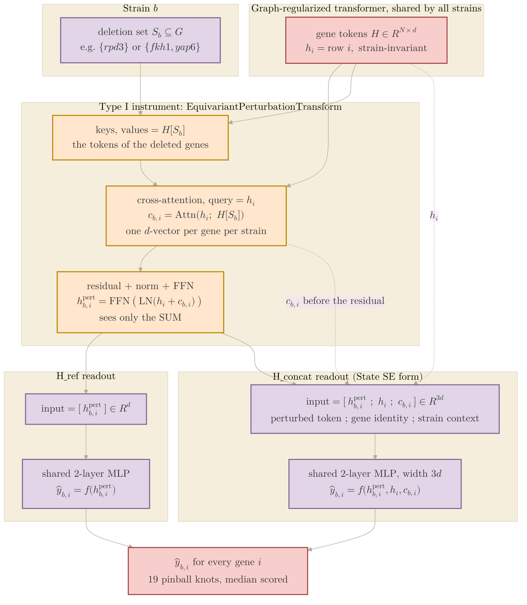

## 2026.09.13 - What the per-gene readout sees: H_ref against H_concat

The v12 head round's winning arm, `H_concat` (`concat_context: true`), changes only the
input of the per-gene readout MLP. Everything above it (encoder, perturbation
cross-attention, residual, FFN) is identical to `H_ref`. The diagram follows one strain
$b$ with deletion set $S_b$ and one gene $i$ through the Type I instrument to the
expression prediction $\hat y_{b,i}$. Same palette as
[[torchcell.models.equivariant_cell_graph_transformer.mermaid.type-i-ii]].

Reading. $h_i$ is the gene's embedding after the shared encoder; it does not depend on
the strain. $c_{b,i}$ is what gene $i$ reads off the deleted genes of strain $b$ by
cross-attention; it depends on both. `H_ref` folds the two into one token
$h^{\mathrm{pert}} = \mathrm{FFN}(\mathrm{LN}(h_i + c_{b,i}))$ and the readout sees only that,
so the prediction is a function of the sum, and the layer norm has discarded the
magnitude of the sum, where $\langle h_i, c_{b,i} \rangle$ lives. `H_concat` hands the
readout the same token plus the two unnormalized parts side by side, so it can learn
any interaction between "which gene" and "what was deleted". Measured (v12, four
seeds): $+0.0135$ over `H_ref`, positive in every seed.
[[experiments.019-simb-multimodal.scripts.head_round_readout]]
