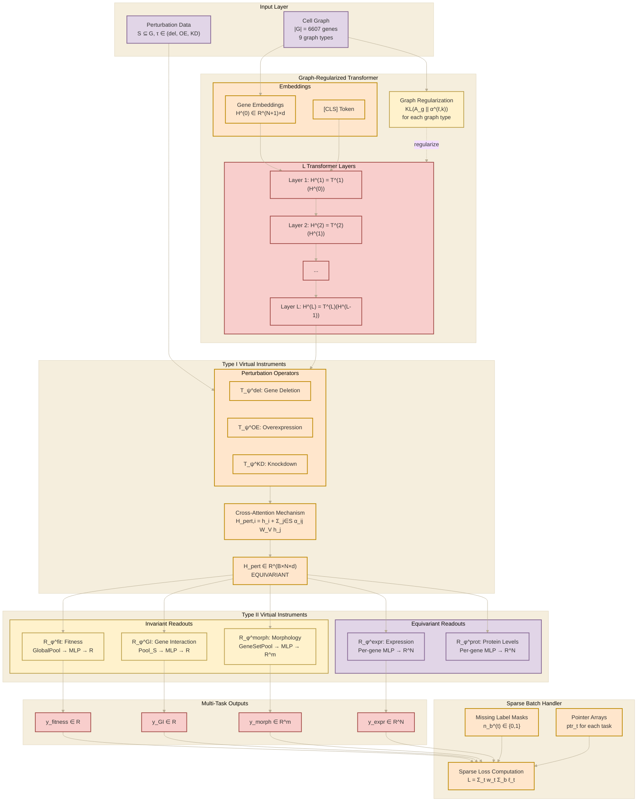

## 2026.06.17 - Type I / Type II diagram (new palette)

The Equivariant Cell Graph Transformer (Type I / Type II separation) diagram from
[[torchcell.models.equivariant_cell_graph_transformer.mermaid]] (L170-302), recolored with
the draw.io-aligned palette defined in
[[torchcell.models.equivariant_cell_graph_transformer.mermaid.colors]]. Beige background via
`%%{init ...}%%`; large container subgraphs are left neutral (color sits on the smaller boxes).

Class -> color mapping. **Base primary only** -- four colors (orange / red / purple / yellow), solid fills, no secondary tier, no outlines, no dashes. Colors group related stages:

| Color | Classes | Fill / border |
|---|---|---|
| Purple | input, equivariant readouts | `#E1D5E7` / `#846592` |
| Orange | embedding, Type I virtual instruments, sparse batch | `#FFE6CC` / `#BD8800` |
| Red | transformer layers, output | `#F8CECC` / `#A24A46` |
| Yellow | invariant readouts, graph regularization | `#FFF2CC` / `#BCA04C` |

Large outer container subgraphs are left neutral beige; alt colors (blue/green/grey) and the secondary tier are unused here.

