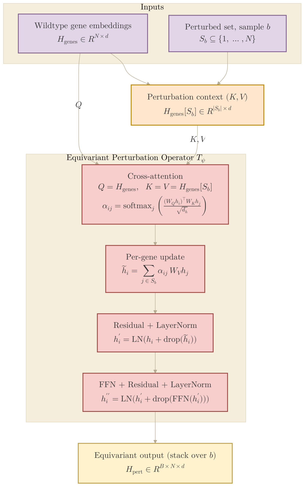

## 2026.06.24 - Equivariant perturbation operator (Type I)

How the current perturbation operator works in
[[torchcell.models.equivariant_cell_graph_transformer]]. Source:
`torchcell/models/equivariant_cell_graph_transformer.py` -> class
`EquivariantPerturbationTransform` (L303), called from the model's `forward` (L830).

### What it does

The operator $\mathcal{T}_\psi$ turns wildtype gene embeddings $H_{\text{genes}} \in \mathbb{R}^{N \times d}$
into a **perturbation-conditioned, per-gene** representation. The wildtype transformer
encoder runs once; perturbation enters *only here*, as the key/value context of a
single cross-attention block -- this is the $f(G, S) \approx g_\psi(F_\theta(G), S)$
reparametrization.

Per sample $b$ with perturbed-gene set $S_b$ (it loops over the batch, L359):

- **Context** = embeddings of just the perturbed genes, $H_{\text{genes}}[S_b] \in \mathbb{R}^{|S_b| \times d}$ (L365).
- **Cross-attention** (L369): **Query = all $N$ genes**, **Key = Value = the perturbed-gene context**.
  Each gene $i$ attends over the perturbation set:
  $$\alpha_{ij} = \mathrm{softmax}_j\!\left( \frac{(W_Q h_i)^\top (W_K h_j)}{\sqrt{d_h}} \right), \qquad \tilde{h}_i = \sum_{j \in S_b} \alpha_{ij}\, W_V h_j.$$
- **Residual + LayerNorm** (L380): $h_i' = \mathrm{LN}\big(h_i + \mathrm{drop}(\tilde{h}_i)\big)$.
- **FFN + Residual + LayerNorm** (L383): $h_i'' = \mathrm{LN}\big(h_i' + \mathrm{drop}(\mathrm{FFN}(h_i'))\big)$.
- Empty $S_b$ -> zero attention, so the residual makes it the identity (L377).
- **Stack** over the batch -> $H_{\text{pert}} \in \mathbb{R}^{B \times N \times d}$ (L388).

### Why it is equivariant

The Query carries all $N$ genes while Key/Value carry only the $|S_b|$ perturbed
ones, so the output keeps **one row per gene** rather than collapsing to a summary.
That per-gene structure is what lets downstream Type II heads do per-gene tasks
(expression, protein). Swapping Q with K/V would emit only $|S_b|$ rows and break this.

### Key limitation: no perturbation *type*

The only perturbation signal is **which** genes are perturbed (`perturbation_indices`)
and their sample assignment (`batch_assignment`). There is **no** $\tau \in \{\mathrm{del}, \mathrm{OE}, \mathrm{KD}\}$
input anywhere -- deleting gene $X$ and overexpressing gene $X$ produce the *identical*
transform. The operator is effectively gene-deletion / type-agnostic. (The
[[torchcell.models.equivariant_cell_graph_transformer.mermaid.type-i-ii]] figure draws
$T_\psi^{\mathrm{del}}/T_\psi^{\mathrm{OE}}/T_\psi^{\mathrm{KD}}$ as separate operators --
that is the *aspirational* design, not the current code.) To add type: give each $\tau$
a learned embedding and fuse it into the K/V context, e.g. $\text{context}_j = h_j + e_{\tau_j}$.

### Diagram

Palette matches [[torchcell.models.equivariant_cell_graph_transformer.mermaid.colors]]
(input purple, context orange, operator red, output yellow; beige canvas).

