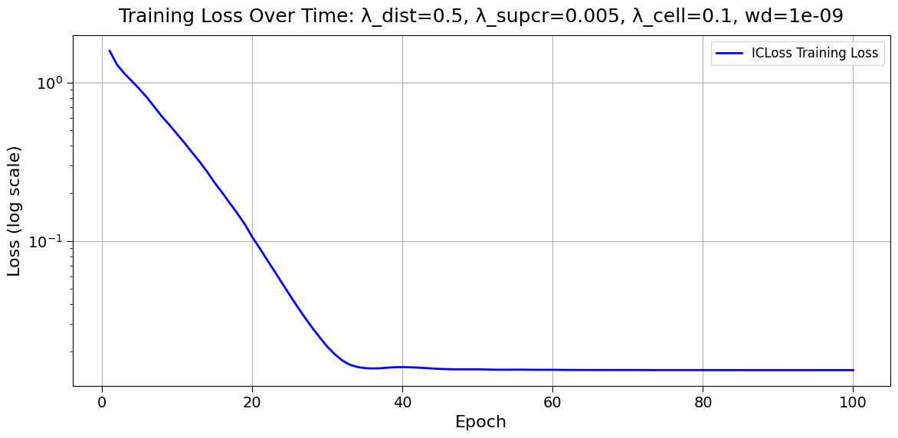
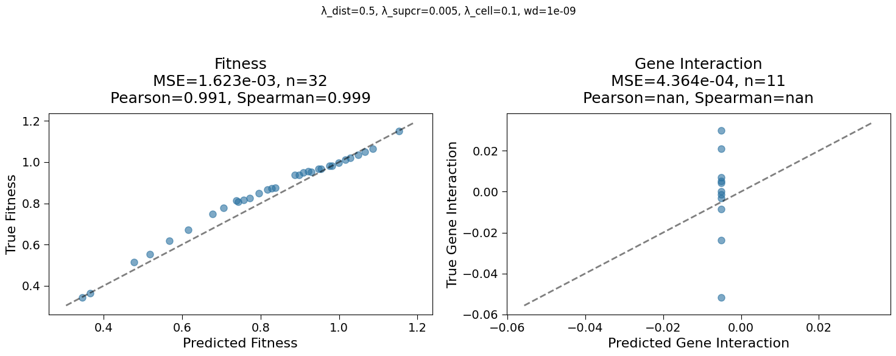
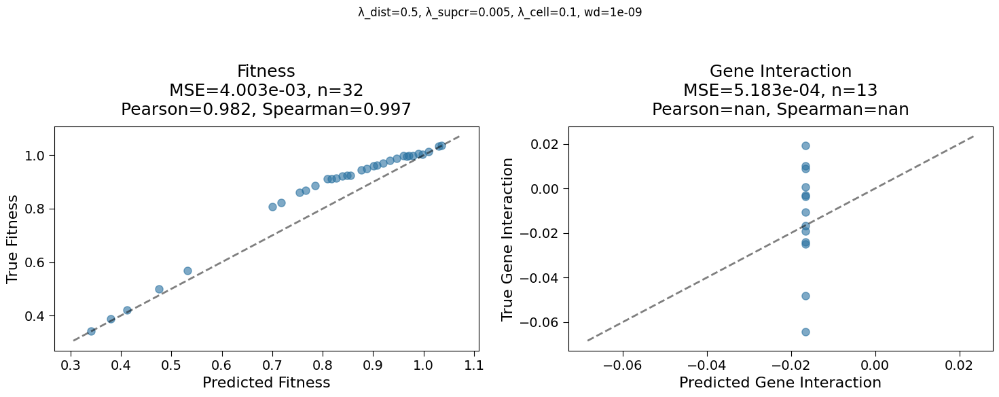
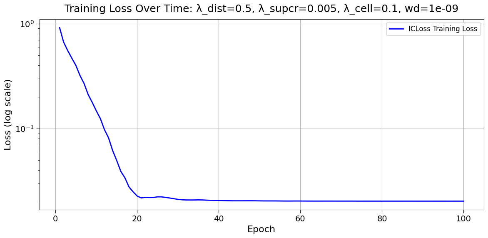
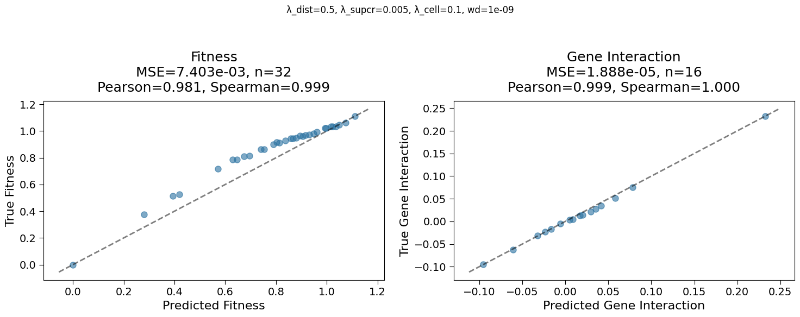
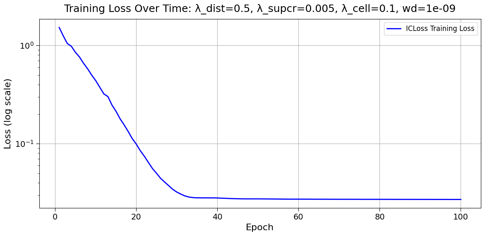
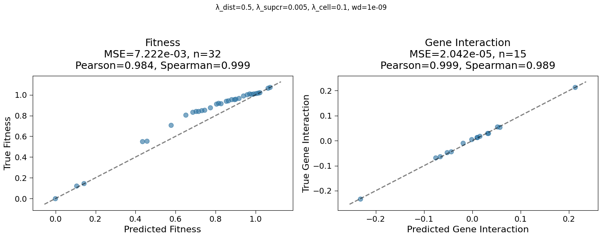
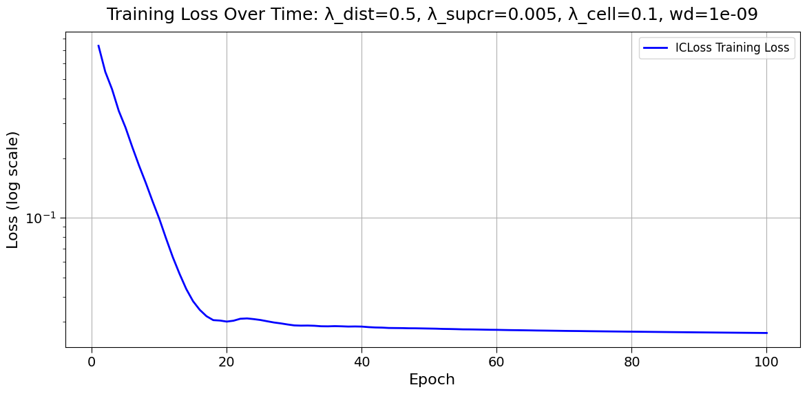

## 2025.02.12 - Data Masking

```python
cell_graph
HeteroData(
  gene={
    num_nodes=6607,
    node_ids=[6607],
    x=[6607, 64],
  },
  metabolite={
    num_nodes=2534,
    node_ids=[2534],
  },
  reaction={
    num_nodes=4881,
    node_ids=[4881],
  },
  (gene, physical_interaction, gene)={ # regular graph 
    edge_index=[2, 144211],
    num_edges=144211,
  },
  (gene, regulatory_interaction, gene)={  # regular graph
    edge_index=[2, 16095],
    num_edges=16095,
  },
  (metabolite, reaction, metabolite)={  # hypergraph
    hyperedge_index=[2, 20960],
    stoichiometry=[20960],
    num_edges=4882,
    reaction_to_genes=dict(len=4881),
    reaction_to_genes_indices=dict(len=4881),
  },
  (gene, gpr, reaction)={ # bipartite
    hyperedge_index=[2, 5450],
    num_edges=4881,
  }
)
```

```python
dataset[0]
HeteroData(
  gene={
    node_ids=[6605],
    num_nodes=6605,
    ids_pert=[2],
    cell_graph_idx_pert=[2],
    x=[6605, 64],
    x_pert=[2, 64],
    fitness=[1],
    fitness_std=[1],
    gene_interaction=[1],
    gene_interaction_p_value=[1],
    pert_mask=[6607],
  },
  reaction={
    num_nodes=4881,
    node_ids=[4881],
    pert_mask=[4881],
  },
  metabolite={
    node_ids=[2534],
    num_nodes=2534,
    pert_mask=[2534],
  },
  (gene, physical_interaction, gene)={
    edge_index=[2, 144102],
    num_edges=144102,
    pert_mask=[144211],
  },
  (gene, regulatory_interaction, gene)={
    edge_index=[2, 16090],
    num_edges=16090,
    pert_mask=[16095],
  },
  (gene, gpr, reaction)={
    hyperedge_index=[2, 5450],
    num_edges=5450,
    pert_mask=[5450],
  },
  (metabolite, reaction, metabolite)={
    hyperedge_index=[2, 20960],
    stoichiometry=[20960],
    num_edges=4882,
    pert_mask=[20960],
  }
)
```

```python
batch
HeteroDataBatch(
  gene={
    node_ids=[4],
    num_nodes=26417,
    ids_pert=[4],
    cell_graph_idx_pert=[11],
    x=[26417, 64],
    x_batch=[26417],
    x_ptr=[5],
    x_pert=[11, 64],
    x_pert_batch=[11],
    x_pert_ptr=[5],
    gene_interaction=[4],
    gene_interaction_p_value=[4],
    fitness=[4],
    fitness_std=[4],
    pert_mask=[26428],
    batch=[26417],
    ptr=[5],
  },
  reaction={
    num_nodes=19523,
    node_ids=[4],
    pert_mask=[19524],
    batch=[19523],
    ptr=[5],
  },
  metabolite={
    node_ids=[4],
    num_nodes=10136,
    pert_mask=[10136],
    batch=[10136],
    ptr=[5],
  },
  (gene, physical_interaction, gene)={
    edge_index=[2, 576619],
    num_edges=[4],
    pert_mask=[576844],
  },
  (gene, regulatory_interaction, gene)={
    edge_index=[2, 64363],
    num_edges=[4],
    pert_mask=[64380],
  },
  (gene, gpr, reaction)={
    hyperedge_index=[2, 21799],
    num_edges=[4],
    pert_mask=[21800],
  },
  (metabolite, reaction, metabolite)={
    hyperedge_index=[2, 83835],
    stoichiometry=[83835],
    num_edges=[4],
    pert_mask=[83840],
  }
)
```

## 2025.02.15 - Algorithm

## HeteroCell Model Algorithm (Detailed)

This algorithm outlines the forward pass for the HeteroCell model, which is designed to predict two outputs:

- **Fitness** from the intact (perturbed batch) representation.
- **Gene Interaction** from the perturbed node aggregation.

---

### 1. Data Structures

- **Whole Graph (cell_graph):**  
  A HeteroData object representing the unperturbed (wildtype) cell, containing:
  - **Gene Nodes:** \( \mathcal{V}_g \) with features \( \mathbf{X}_g \in \mathbb{R}^{N_g \times h} \)
  - **Reaction Nodes:** \( \mathcal{V}_r \) with features \( \mathbf{X}_r \in \mathbb{R}^{N_r \times h} \)
  - **Metabolite Nodes:** \( \mathcal{V}_m \) with features \( \mathbf{X}_m \in \mathbb{R}^{N_m \times h} \)
  - **Edge Types:**  
    - Gene–gene (physical and regulatory)  
    - Gene→reaction (GPR)  
    - Metabolism hyperedges (with stoichiometry)

- **Batch of Perturbed Graphs (batch):**  
  A HeteroDataBatch object containing multiple perturbed instances. In addition to the regular node features, each batch item includes:
  - Perturbed gene features (`x_pert`)
  - Indices identifying the perturbed nodes (`cell_graph_idx_pert`, `x_pert_ptr`, etc.)

---

### 2. Node Embedding Initialization and Preprocessing

- **Gene Embeddings:**  
  A learnable embedding matrix:
  $$
  \mathbf{E}_g \in \mathbb{R}^{N_g \times h}
  $$
  which is then preprocessed by an MLP:
  $$
  \tilde{\mathbf{E}}_g = \mathrm{PreProcessor}(\mathbf{E}_g)
  $$

- **Reaction and Metabolite Embeddings:**  
  Initialized as:
  $$
  \mathbf{E}_r \in \mathbb{R}^{N_r \times h}, \quad \mathbf{E}_m \in \mathbb{R}^{N_m \times h}
  $$

---

### 3. Heterogeneous Message Passing

For each layer \( l = 1, \dots, L \), node features are updated via a set of heterogeneous convolution operations:

1. **Gene–Gene Interactions:**  
   Using GATv2Conv for both physical and regulatory edges:
   $$
   \mathbf{H}^{(l)}_{g \rightarrow g} = \mathrm{GATv2Conv}\Big(\tilde{\mathbf{E}}_g^{(l-1)}\Big)
   $$

2. **Gene→Reaction Interactions:**  
   Also processed via GATv2Conv:
   $$
   \mathbf{H}^{(l)}_{g \rightarrow r} = \mathrm{GATv2Conv}\Big(\tilde{\mathbf{E}}_g^{(l-1)}\Big)
   $$

3. **Metabolism Hyperedge Processing:**  
   Using StoichHypergraphConv, which incorporates stoichiometry \( S \):
   $$
   \mathbf{H}^{(l)}_{m \rightarrow m} = \mathrm{StoichHypergraphConv}\Big(\mathbf{E}_m^{(l-1)},\, S,\, \mathbf{E}_r^{(l-1)}\Big)
   $$

4. **Aggregation:**  
   For each node type \( i \in \{\text{gene}, \text{reaction}, \text{metabolite}\} \), messages from all edge types are summed:
   $$
   \mathbf{E}_i^{(l)} = \sum_{e \in \mathcal{E}_i} \mathbf{H}^{(l)}_{e}
   $$

The final output for gene nodes after the message passing layers is denoted as:
$$
\mathbf{Z}_g
$$

---

### 4. Global Aggregation

Two types of global pooling are applied using an attentional mechanism:

#### 4.1 Reference (Wildtype) Aggregation

- Process the whole graph to obtain gene features:
  $$
  \mathbf{Z}_g^{\text{cell}}
  $$
- Pool all gene features into a single reference vector:
  $$
  z_w = \mathrm{AttentionalGraphAggregation}\Big(\mathbf{Z}_g^{\text{cell}},\, \mathbf{0}\Big) \quad \in \mathbb{R}^{h}
  $$
  (A dummy index aggregates all nodes.)

#### 4.2 Batch (Intact) Aggregation

- Process the batch of perturbed graphs to obtain gene features:
  $$
  \mathbf{Z}_g^{\text{batch}}
  $$
- Pool per batch item using the provided batch indices:
  $$
  z_i = \mathrm{AttentionalGraphAggregation}\Big(\mathbf{Z}_g^{\text{batch}},\, \text{batch indices}\Big) \quad \in \mathbb{R}^{B \times h}
  $$
  where \( B \) is the batch size.

---

### 5. Perturbed Node Extraction and Aggregation

1. **Extract Perturbed Indices:**  
   For each batch item \( i \) (with \( i = 1,\dots,B \)), extract the set of perturbed gene indices:
   $$
   \mathcal{P}_i \subset \{1,\dots,N_g^{(i)}\}
   $$

2. **Replicate Reference Representation:**  
   Expand the reference vector \( z_w \) to match the batch dimension:
   $$
   z_w^{\text{exp}} \in \mathbb{R}^{B \times h}
   $$
   For each batch item \( i \), replicate \( z_w^{(i)} \) for every perturbed index in \( \mathcal{P}_i \).

3. **Aggregate Perturbed Representations:**  
   Pool the replicated vectors with a dedicated perturbed aggregator:
   $$
   z_p = \mathrm{AttentionalGraphAggregation}\Big(\{z_w^{\text{rep}}(i)\}_{i=1}^B, \text{perturbed batch mapping}\Big) \quad \in \mathbb{R}^{B \times h}
   $$

---

### 6. Prediction Heads

The model uses separate MLPs to predict the two outputs:

- **Fitness Prediction:**  
  The intact (batch) representation \( z_i \) is passed through the fitness head:
  $$
  \hat{y}_{\text{fitness}} = \mathrm{MLP}_{\text{fitness}}(z_i) \quad \in \mathbb{R}^{B \times 1}
  $$

- **Gene Interaction Prediction:**  
  The aggregated perturbed representation \( z_p \) is passed through the gene interaction head:
  $$
  \hat{y}_{\text{gene\_interaction}} = \mathrm{MLP}_{\text{interaction}}(z_p) \quad \in \mathbb{R}^{B \times 1}
  $$

- **Final Output:**  
  The final prediction is the concatenation of the two outputs:
  $$
  \hat{y} = \Big[ \hat{y}_{\text{fitness}} \, \| \, \hat{y}_{\text{gene\_interaction}} \Big] \quad \in \mathbb{R}^{B \times 2}
  $$

---

### 7. Loss and Training

- **Loss Function:**  
  The composite loss is defined as:
  $$
  \mathcal{L} = \mathcal{L}_{\text{MSE}}(y, \hat{y}) + \lambda_1\, \mathcal{L}_{\text{dist}} + \lambda_2\, \mathcal{L}_{\text{supcr}} + \lambda_3\, \mathcal{L}_{\text{cell}}
  $$
  where \( y \) contains the ground-truth fitness and gene interaction labels.

- **Training:**  
  The model is trained using an optimizer (e.g., Adam) to minimize the loss.

---

### 8. Summary of the Forward Pass

1. **Whole Graph Processing:**
   - Input the cell_graph to compute gene embeddings via the PreProcessor and HeteroConv layers.
   - Aggregate these features using the global aggregator to obtain a single reference vector \( z_w \).

2. **Batch Processing:**
   - Process the perturbed batch similarly to compute gene features.
   - Pool these features using the global aggregator (with batch indices) to obtain \( z_i \).

3. **Perturbed Node Aggregation:**
   - For each batch item, extract perturbed gene indices.
   - Replicate the reference vector \( z_w \) to match the number of perturbed nodes.
   - Use the perturbed aggregator to pool these replicated vectors into \( z_p \).

4. **Prediction:**
   - Predict fitness from \( z_i \) using the fitness head.
   - Predict gene interaction from \( z_p \) using the gene interaction head.
   - Concatenate the two outputs to form the final prediction \( \hat{y} \).

This detailed algorithm encapsulates the entire forward pass and prediction strategy of the HeteroCell model.

## 2025.02.19 - Equations How Interacting Wildtype and Integrated

We "interact" them with a simple difference.

1) Commented (Two-Head) Version

$$
\begin{aligned}
z_w & =\operatorname{Global\operatorname {Agg}(\operatorname {GNN}(G_{\mathrm {wt}})),} \\
z_i & =\operatorname{GlobalAgg}\left(\operatorname{GNN}\left(G_{\text {batch }}\right)\right),
\end{aligned}
$$

(for each sample, replicate $z_w$ over perturbed indices, then aggregate)

$$
z_p=\text { PerturbedAgg }(\{\underbrace{z_w[\text { pert. inds }]}_{\text {replicated }}\})
$$

Then we predict fitness from $z_i$ and gene interaction from $z_p$ :

$$
\hat{y}_{\text {fitness }}=\operatorname{MLP}_{\text {fit }}\left(z_i\right), \quad \hat{y}_{\mathrm{GI}}=\operatorname{MLP}_{\mathrm{gi}}\left(z_p\right) .
$$

Very long slow decent, doesn't fit gene interactions.


Match parameters for comparison experiment. Doesn't fit gene interactions





Repeat





2) Current (Difference) Version

$$
\begin{aligned}
z_w & =\operatorname{GlobalAgg}\left(\operatorname{GNN}\left(G_{\mathrm{wt}}\right)\right), \\
z_i & =\operatorname{GlobalAgg}\left(\operatorname{GNN}\left(G_{\text {batch }}\right)\right), \\
z_p & =z_w-z_i .
\end{aligned}
$$

Here we feed $z_p$ into one unified prediction head:

$$
\left[\hat{y}_{\mathrm{fitness}}, \hat{y}_{\mathrm{GI}}\right]=\operatorname{MLP}_{\text {shared }}\left(z_p\right)
$$

First try





Repeat





## 2025.02.21 - Data Without Pretrained Embeddings

```python
cell_graph
HeteroData(
  gene={
    num_nodes=6607,
    node_ids=[6607],
    x=[6607, 0],
  },
  metabolite={
    num_nodes=2534,
    node_ids=[2534],
  },
  reaction={
    num_nodes=4881,
    node_ids=[4881],
  },
  (gene, physical_interaction, gene)={
    edge_index=[2, 144211],
    num_edges=144211,
  },
  (gene, regulatory_interaction, gene)={
    edge_index=[2, 16095],
    num_edges=16095,
  },
  (metabolite, reaction, metabolite)={
    hyperedge_index=[2, 20960],
    stoichiometry=[20960],
    num_edges=4882,
    reaction_to_genes=dict(len=4881),
    reaction_to_genes_indices=dict(len=4881),
  },
  (gene, gpr, reaction)={
    hyperedge_index=[2, 5450],
    num_edges=4881,
  }
)
```

single sample

```python
dataset[0]
HeteroData(
  gene={
    node_ids=[6605],
    num_nodes=6605,
    ids_pert=[2],
    cell_graph_idx_pert=[2],
    x=[6605, 0],
    x_pert=[2, 0],
    fitness=[1],
    fitness_std=[1],
    gene_interaction=[1],
    gene_interaction_p_value=[1],
    pert_mask=[6607],
  },
  reaction={
    num_nodes=4881,
    node_ids=[4881],
    pert_mask=[4881],
  },
  metabolite={
    node_ids=[2534],
    num_nodes=2534,
    pert_mask=[2534],
  },
  (gene, physical_interaction, gene)={
    edge_index=[2, 144102],
    num_edges=144102,
    pert_mask=[144211],
  },
  (gene, regulatory_interaction, gene)={
    edge_index=[2, 16090],
    num_edges=16090,
    pert_mask=[16095],
  },
  (gene, gpr, reaction)={
    hyperedge_index=[2, 5450],
    num_edges=5450,
    pert_mask=[5450],
  },
  (metabolite, reaction, metabolite)={
    hyperedge_index=[2, 20960],
    stoichiometry=[20960],
    num_edges=4882,
    pert_mask=[20960],
  }
)
```

batch

```python
batch
HeteroDataBatch(
  gene={
    node_ids=[32],
    num_nodes=211349,
    ids_pert=[32],
    cell_graph_idx_pert=[75],
    x=[211349, 0],
    x_batch=[211349],
    x_ptr=[33],
    x_pert=[75, 0],
    x_pert_batch=[75],
    x_pert_ptr=[33],
    fitness=[32],
    fitness_std=[32],
    gene_interaction=[32],
    gene_interaction_p_value=[32],
    pert_mask=[211424],
    batch=[211349],
    ptr=[33],
  },
  reaction={
    num_nodes=156101,
    node_ids=[32],
    pert_mask=[156192],
    batch=[156101],
    ptr=[33],
  },
  metabolite={
    node_ids=[32],
    num_nodes=81086,
    pert_mask=[81088],
    batch=[81086],
    ptr=[33],
  },
  (gene, physical_interaction, gene)={
    edge_index=[2, 4611926],
    num_edges=[32],
    pert_mask=[4614752],
  },
  (gene, regulatory_interaction, gene)={
    edge_index=[2, 514656],
    num_edges=[32],
    pert_mask=[515040],
  },
  (gene, gpr, reaction)={
    hyperedge_index=[2, 174271],
    num_edges=[32],
    pert_mask=[174400],
  },
  (metabolite, reaction, metabolite)={
    hyperedge_index=[2, 670346],
    stoichiometry=[670346],
    num_edges=[32],
    pert_mask=[670720],
  }
)
```

## 2025.02.21 - Algorithm: HeteroCell

### Inputs:

- Reference cell graph $\mathcal{G}_{\text{whole}}$ with gene, reaction, and metabolite nodes
- Perturbed cell graph batch $\{\mathcal{G}_{\text{intact}}^{(i)}\}_{i=1}^{b}$ where $b$ is batch size
- Embedding dimensions: gene $\mathbb{R}^{n_g \times d_g}$, reaction $\mathbb{R}^{n_r \times d_r}$, metabolite $\mathbb{R}^{n_m \times d_m}$
- Hidden dimension $h$

### Outputs:

- Fitness predictions $\hat{y}_{\text{fitness}} \in \mathbb{R}^{b \times 1}$
- Gene interaction predictions $\hat{y}_{\text{gene\_interaction}} \in \mathbb{R}^{b \times 1}$

### Function: ForwardSingle($\mathcal{G}$)

1. Obtain gene, reaction, metabolite indices from $\mathcal{G}$
2. $X_g \gets \text{Embed}_{\text{gene}}(\text{indices}) \in \mathbb{R}^{n_g \times h}$ (Learnable embeddings)
3. $X_r \gets \text{Embed}_{\text{reaction}}(\text{indices}) \in \mathbb{R}^{n_r \times h}$
4. $X_m \gets \text{Embed}_{\text{metabolite}}(\text{indices}) \in \mathbb{R}^{n_m \times h}$
5. $X_g \gets \text{Preprocess}(X_g) \in \mathbb{R}^{n_g \times h}$ (MLP with normalization)
6. $X_{\text{dict}} \gets \{``\text{gene}": X_g, ``\text{reaction}": X_r, ``\text{metabolite}": X_m\}$
7. For $l = 1$ to $L$ ($L$ GNN layers):
   - $X_{\text{dict}} \gets \text{HeteroConv}(X_{\text{dict}}, \mathcal{E}_{\mathcal{G}})$ (Message passing with these edge types):
     - (gene, physical_interaction, gene): GATv2Conv
     - (gene, regulatory_interaction, gene): GATv2Conv
     - (gene, gpr, reaction): GATv2Conv
     - (metabolite, reaction, metabolite): StoichHypergraphConv
8. Return $X_{\text{dict}}[``\text{gene}"] \in \mathbb{R}^{n_g \times h}$ (Return gene embeddings)

### Procedure: Forward($\mathcal{G}_{\text{whole}}$, $\{\mathcal{G}_{\text{intact}}^{(i)}\}_{i=1}^{b}$)

1. $Z_w \gets \text{ForwardSingle}(\mathcal{G}_{\text{whole}}) \in \mathbb{R}^{n_g \times h}$ (Process reference graph)
2. $z_w \gets \text{GlobalAggregator}(Z_w) \in \mathbb{R}^{1 \times h}$ (Global pooling)
3. $Z_i \gets \text{ForwardSingle}(\{\mathcal{G}_{\text{intact}}^{(i)}\}_{i=1}^{b}) \in \mathbb{R}^{n_g' \times h}$ (Process perturbed batch)
4. $z_i \gets \text{GlobalAggregator}(Z_i, \text{batch\_indices}) \in \mathbb{R}^{b \times h}$ (Batch-wise pooling)
5. $z_w' \gets \text{Expand}(z_w, b) \in \mathbb{R}^{b \times h}$ (Duplicate reference embedding)
6. $z_p \gets z_w' - z_i \in \mathbb{R}^{b \times h}$ (Difference captures perturbation impact)
7. $\hat{y} \gets \text{PredictionHead}(z_p) \in \mathbb{R}^{b \times 2}$ (Predict fitness and gene interaction)
8. $\hat{y}_{\text{fitness}} \gets \hat{y}[:, 0] \in \mathbb{R}^{b \times 1}$
9. $\hat{y}_{\text{gene\_interaction}} \gets \hat{y}[:, 1] \in \mathbb{R}^{b \times 1}$
10. Return $\hat{y}$, $\{z_w, z_i, z_p, \hat{y}_{\text{fitness}}, \hat{y}_{\text{gene\_interaction}}\}$

## Graph Structure and Edge Types

1. **Gene-Gene Interactions**:
   - (gene, physical_interaction, gene): Physical protein-protein interactions
   - (gene, regulatory_interaction, gene): Regulatory relationships between genes

2. **Metabolism**:
   - (metabolite, reaction, metabolite): Metabolic reactions with stoichiometric coefficients
   - (gene, gpr, reaction): Gene-Protein-Reaction associations connecting genes to the reactions they catalyze

## Key Dimensions

- **Input**:
  - Reference cell graph $\mathcal{G}_{\text{whole}}$: genes $n_g \approx 6607$, reactions $n_r \approx 4881$, metabolites $n_m \approx 2534$
  - Gene feature dimension: $d_g = 64$
  - Hidden dimension: $h$ (typically 128-512)
  - Edge types:
    - Physical interactions: $\approx 144,000$ edges
    - Regulatory interactions: $\approx 16,000$ edges
    - GPR relationships: $\approx 5,400$ edges
    - Metabolic reactions: $\approx 21,000$ hyperedges
  
- **Intermediate**:
  - Gene embeddings after preprocessing: $\mathbb{R}^{n_g \times h}$
  - Graph convolution outputs: $\mathbb{R}^{n_g \times h}$, $\mathbb{R}^{n_r \times h}$, $\mathbb{R}^{n_m \times h}$
  - Pooled reference representation: $\mathbb{R}^{1 \times h}$
  - Pooled perturbed representation: $\mathbb{R}^{b \times h}$
  
- **Output**:
  - Fitness prediction: $\mathbb{R}^{b \times 1}$
  - Gene interaction prediction: $\mathbb{R}^{b \times 1}$
  - Combined predictions: $\mathbb{R}^{b \times 2}$

Note that in perturbed graphs, the number of genes, reactions, and metabolites will be slightly reduced according to the perturbation (typically removing 1-2 genes and associated reactions).

## 2025.02.21 - Dataset With Learnable Embeddings

```python
dataset.cell_graph 
HeteroData(
  gene={
    num_nodes=6607,
    node_ids=[6607],
    x=[6607, 0],
  },
  metabolite={
    num_nodes=2534,
    node_ids=[2534],
  },
  reaction={
    num_nodes=4881,
    node_ids=[4881],
  },
  (gene, physical_interaction, gene)={
    edge_index=[2, 144211],
    num_edges=144211,
  },
  (gene, regulatory_interaction, gene)={
    edge_index=[2, 16095],
    num_edges=16095,
  },
  (metabolite, reaction, metabolite)={
    hyperedge_index=[2, 20960],
    stoichiometry=[20960],
    num_edges=4882,
    reaction_to_genes=dict(len=4881),
    reaction_to_genes_indices=dict(len=4881),
  },
  (gene, gpr, reaction)={
    hyperedge_index=[2, 5450],
    num_edges=4881,
  }
)
```

```python
HeteroDataBatch(
  gene={
    node_ids=[2],
    num_nodes=13210,
    ids_pert=[2],
    cell_graph_idx_pert=[4],
    x=[13210, 0],
    x_batch=[13210],
    x_ptr=[3],
    x_pert=[4, 0],
    x_pert_batch=[4],
    x_pert_ptr=[3],
    gene_interaction=[2],
    gene_interaction_p_value=[2],
    fitness=[2],
    fitness_std=[2],
    pert_mask=[13214],
    batch=[13210],
    ptr=[3],
  },
  reaction={
    num_nodes=9762,
    node_ids=[2],
    pert_mask=[9762],
    batch=[9762],
    ptr=[3],
  },
  metabolite={
    node_ids=[2],
    num_nodes=5068,
    pert_mask=[5068],
    batch=[5068],
    ptr=[3],
  },
  (gene, physical_interaction, gene)={
    edge_index=[2, 288270],
    num_edges=[2],
    pert_mask=[288422],
  },
  (gene, regulatory_interaction, gene)={
    edge_index=[2, 32183],
    num_edges=[2],
    pert_mask=[32190],
  },
  (gene, gpr, reaction)={
    hyperedge_index=[2, 10900],
    num_edges=[2],
    pert_mask=[10900],
  },
  (metabolite, reaction, metabolite)={
    hyperedge_index=[2, 41920],
    stoichiometry=[41920],
    num_edges=[2],
    pert_mask=[41920],
  }
)
```

```python
dataset[0]
HeteroData(
  gene={
    node_ids=[6605],
    num_nodes=6605,
    ids_pert=[2],
    cell_graph_idx_pert=[2],
    x=[6605, 0],
    x_pert=[2, 0],
    gene_interaction=[1],
    gene_interaction_p_value=[1],
    fitness=[1],
    fitness_std=[1],
    pert_mask=[6607],
  },
  reaction={
    num_nodes=4881,
    node_ids=[4881],
    pert_mask=[4881],
  },
  metabolite={
    node_ids=[2534],
    num_nodes=2534,
    pert_mask=[2534],
  },
  (gene, physical_interaction, gene)={
    edge_index=[2, 144102],
    num_edges=144102,
    pert_mask=[144211],
  },
  (gene, regulatory_interaction, gene)={
    edge_index=[2, 16090],
    num_edges=16090,
    pert_mask=[16095],
  },
  (gene, gpr, reaction)={
    hyperedge_index=[2, 5450],
    num_edges=5450,
    pert_mask=[5450],
  },
  (metabolite, reaction, metabolite)={
    hyperedge_index=[2, 20960],
    stoichiometry=[20960],
    num_edges=4882,
    pert_mask=[20960],
  }
)
```

## 2025.02.21 - Debugging Model vs Script Discrepancy

Not making sense why we have masking discrepancy when moving to script. Mask dim 0 is wrong dimension. It should always be 2x the dimension from the `cell_graph` or single data.

### 2025.02.21 - Debugging Model vs Script Discrepancy - Model

```python
# cell graph
data
HeteroData(
  gene={
    num_nodes=6607,
    node_ids=[6607],
    x=[6607, 0],
  },
  metabolite={
    num_nodes=2534,
    node_ids=[2534],
  },
  reaction={
    num_nodes=4881,
    node_ids=[4881],
  },
  (gene, physical_interaction, gene)={
    edge_index=[2, 144211],
    num_edges=144211,
  },
  (gene, regulatory_interaction, gene)={
    edge_index=[2, 16095],
    num_edges=16095,
  },
  (metabolite, reaction, metabolite)={
    hyperedge_index=[2, 20960],
    stoichiometry=[20960],
    num_edges=4882,
    reaction_to_genes=dict(len=4881),
    reaction_to_genes_indices=dict(len=4881),
  },
  (gene, gpr, reaction)={
    hyperedge_index=[2, 5450],
    num_edges=4881,
  }
)
```

```python
# batched data
data
HeteroDataBatch(
  gene={
    node_ids=[2],
    num_nodes=13211,
    ids_pert=[2],
    cell_graph_idx_pert=[3],
    x=[13211, 0],
    x_batch=[13211],
    x_ptr=[3],
    x_pert=[3, 0],
    x_pert_batch=[3],
    x_pert_ptr=[3],
    gene_interaction=[2],
    gene_interaction_p_value=[2],
    fitness=[2],
    fitness_std=[2],
    pert_mask=[13214],
    batch=[13211],
    ptr=[3],
  },
  reaction={
    num_nodes=9762,
    node_ids=[2],
    pert_mask=[9762],
    batch=[9762],
    ptr=[3],
  },
  metabolite={
    node_ids=[2],
    num_nodes=5068,
    pert_mask=[5068],
    batch=[5068],
    ptr=[3],
  },
  (gene, physical_interaction, gene)={
    edge_index=[2, 288339],
    num_edges=[2],
    pert_mask=[288422],
  },
  (gene, regulatory_interaction, gene)={
    edge_index=[2, 32185],
    num_edges=[2],
    pert_mask=[32190],
  },
  (gene, gpr, reaction)={
    hyperedge_index=[2, 10900],
    num_edges=[2],
    pert_mask=[10900],
  },
  (metabolite, reaction, metabolite)={
    hyperedge_index=[2, 41920],
    stoichiometry=[41920],
    num_edges=[2],
    pert_mask=[41920],
  }
)
```

we have

```python
genome.gene_set
GeneSet(size=6607, items=['Q0010', 'Q0017', 'Q0032']...)
```

### 2025.02.21 - Debugging Model vs Script Discrepancy - Script

```python
data
HeteroDataBatch(
  gene={
    node_ids=[2],
    num_nodes=13156,
    ids_pert=[2],
    cell_graph_idx_pert=[2],
    x=[13156, 0],
    x_batch=[13156],
    x_ptr=[3],
    x_pert=[2, 0],
    x_pert_batch=[2],
    x_pert_ptr=[3],
    fitness=[2],
    fitness_std=[2],
    gene_interaction=[2],
    gene_interaction_p_value=[2],
    pert_mask=[13158],
    batch=[13156],
    ptr=[3],
  },
  reaction={
    num_nodes=9758,
    node_ids=[2],
    pert_mask=[9762],
    batch=[9758],
    ptr=[3],
  },
  metabolite={
    node_ids=[2],
    num_nodes=5067,
    pert_mask=[5068],
    batch=[5067],
    ptr=[3],
  },
  (gene, physical_interaction, gene)={
    edge_index=[2, 287630],
    num_edges=[2],
    pert_mask=[287648],
  },
  (gene, regulatory_interaction, gene)={
    edge_index=[2, 32119],
    num_edges=[2],
    pert_mask=[32122],
  },
  (gene, gpr, reaction)={
    hyperedge_index=[2, 10856],
    num_edges=[2],
    pert_mask=[10860],
  },
  (metabolite, reaction, metabolite)={
    hyperedge_index=[2, 41900],
    stoichiometry=[41900],
    num_edges=[2],
    pert_mask=[41920],
  }
)
```

we have

```python
genome.gene_set
GeneSet(size=6579, items=['YAL001C', 'YAL002W', 'YAL003W']...)
```

### 2025.02.21 - Debugging Model vs Script Discrepancy - Fix

We fixed this by `overwrite=True` just temporarily, then switched back which gives the right gene count.
