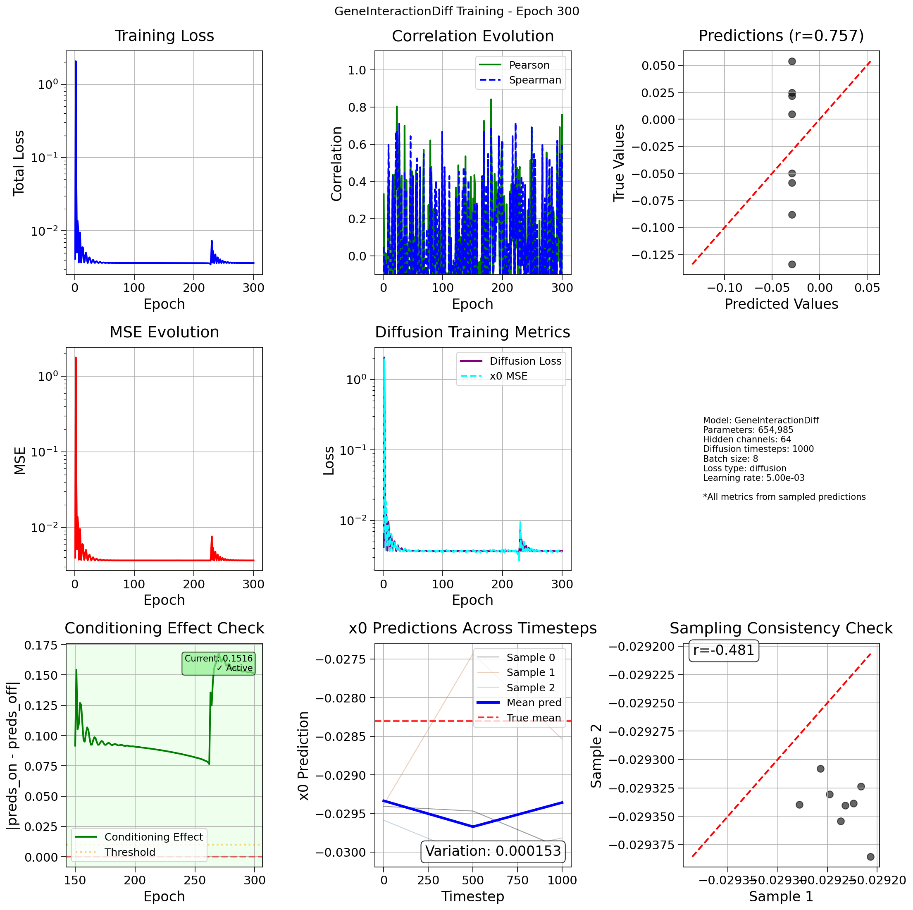
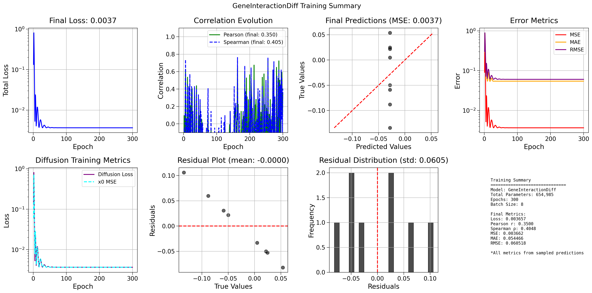
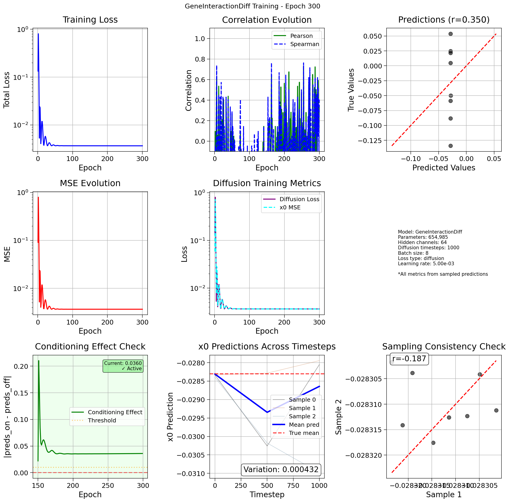
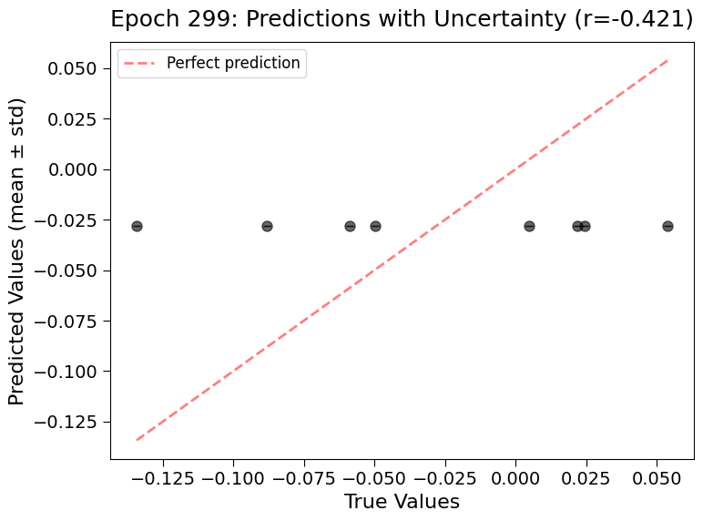

## 2025.08.12 - GeneInteractionDiff Model - Diffusion-based Gene Interaction Prediction

### Overview

This model combines graph neural networks with diffusion models to predict gene interactions. It uses cross-attention to condition the diffusion process on graph embeddings from bipartite metabolic networks.

### Architecture Components

#### 1. Graph Encoder

- Encodes gene-gene interaction networks (physical, regulatory)
- Processes bipartite metabolism graphs (gene-reaction-metabolite)
- Produces combined embeddings via self-attention

#### 2. Diffusion Decoder

- Uses cross-attention where Q comes from noisy state, K/V from graph embeddings
- Implements x₀-prediction (better for sparse biological data than ε-prediction)
- Cosine beta schedule for stable training
- DDIM sampling for faster inference

### Current Issues and Solutions

#### Issue 1: Duplicate Loss Problem

**Problem**: Both auxiliary and diffusion losses were computing MSE on x₀ predictions, leading to redundant computation.

**Root Cause Analysis**:

1. During training, `forward()` computes predictions via `model.sample()`
2. These predictions are passed to both auxiliary and diffusion losses
3. Diffusion loss internally calls `compute_diffusion_loss()` which also predicts x₀
4. Result: Same computation done twice, wasting resources

**Solution - Option 3 Implementation**:

```python
# In forward() method:
if self.training:
    # Return dummy predictions during training
    # Diffusion loss will compute actual loss internally
    predictions = torch.zeros_like(phenotypes)
else:
    # During evaluation, use sampling
    predictions = self.diffusion_decoder.sample(z_p)
```

#### Issue 3: Evaluation Strategy

**Current**: Single sample evaluation doesn't capture uncertainty
**Solution**: Multi-sample evaluation with uncertainty estimation

### Implementation Plan

#### Step 1: Fix Forward Pass Duplication

**File**: `torchcell/models/hetero_cell_bipartite_dango_diff_gi.py`

1. **Modify forward() method** (lines 173-206):

```python
def forward(self, batch):
    # ... existing encoder logic ...
    
    if self.training:
        # During training, return dummy predictions
        # Diffusion loss handles everything internally
        predictions = torch.zeros_like(phenotypes)
    else:
        # During evaluation, use sampling
        predictions = self.diffusion_decoder.sample(
            context=z_p,
            num_samples=1,  # Single sample for validation
        )
    
    return predictions
```

2. **Update config** (`experiments/006-kuzmin-tmi/conf/hetero_cell_bipartite_dango_diff_gi.yaml`):

```yaml
regression_task:
  lambda_auxiliary: 0.0  # Disable auxiliary loss
```

#### Step 2: Update Main Function Evaluation

**Location**: Main function in `hetero_cell_bipartite_dango_diff_gi.py` (lines 293-1151)

1. **Add multi-sample evaluation function**:

```python
def evaluate_with_uncertainty(model, batch, num_samples=10):
    """Evaluate model with multiple samples for uncertainty estimation."""
    model.eval()
    with torch.no_grad():
        # Get graph embeddings once
        z_p = model.get_embeddings(batch)  # Extract encoding logic
        
        # Sample multiple times
        samples = []
        for _ in range(num_samples):
            pred = model.diffusion_decoder.sample(context=z_p, num_samples=1)
            samples.append(pred)
        
        samples = torch.stack(samples, dim=0)  # [num_samples, batch, 1]
        
        # Compute statistics
        mean_pred = samples.mean(dim=0)
        std_pred = samples.std(dim=0)
        
    return mean_pred, std_pred, samples
```

2. **Update training loop** (around line 400-500):

```python
# During evaluation intervals
if epoch % args.eval_interval == 0:
    mean_pred, std_pred, samples = evaluate_with_uncertainty(
        model, batch, num_samples=10
    )
    
    # Use mean for metrics
    mse = F.mse_loss(mean_pred, targets)
    
    # Plot with error bars
    plot_predictions_with_uncertainty(
        targets, mean_pred, std_pred, epoch
    )
```

3. **Add uncertainty visualization**:

```python
def plot_predictions_with_uncertainty(targets, predictions, std, epoch):
    """Plot predictions with error bars showing uncertainty."""
    fig, ax = plt.subplots(1, 1, figsize=(8, 6))
    
    x = targets.cpu().numpy().flatten()
    y = predictions.cpu().numpy().flatten()
    yerr = std.cpu().numpy().flatten()
    
    # Scatter with error bars
    ax.errorbar(x, y, yerr=yerr, fmt='o', alpha=0.6, 
                capsize=3, capthick=1, elinewidth=1)
    
    # Add diagonal line
    min_val = min(x.min(), y.min())
    max_val = max(x.max(), y.max())
    ax.plot([min_val, max_val], [min_val, max_val], 
            'r--', alpha=0.5, label='Perfect prediction')
    
    # Calculate correlation
    r = np.corrcoef(x, y)[0, 1]
    
    ax.set_xlabel('True Values')
    ax.set_ylabel('Predicted Values (mean ± std)')
    ax.set_title(f'Epoch {epoch}: Predictions with Uncertainty (r={r:.3f})')
    ax.legend()
    
    plt.tight_layout()
    plt.savefig(f'uncertainty_epoch_{epoch}.png')
    plt.close()
```

#### Step 4: Testing Strategy

1. **Overfitting Test**:
   - Use 2-3 batches only
   - Train for 300 epochs
   - Expect to see loss decrease significantly
   - Predictions should match target distribution

2. **Conditioning Test**:
   - Sample with random embeddings vs actual embeddings
   - Should see different predictions confirming conditioning works

3. **Uncertainty Test**:
   - For same input, multiple samples should vary
   - Uncertainty should decrease as model trains

### Training Progress Monitoring

#### Key Metrics to Track:

1. **Diffusion Loss**: Should decrease steadily
2. **MSE on Samples**: Compare sampled vs true values
3. **Output Range**: Monitor min/max of predictions
4. **Uncertainty**: Track std of multi-samples over time
5. **Conditioning Effect**: Difference between conditioned/unconditioned samples

#### Expected Behavior:

- Early epochs: High variance, predictions centered around 0
- Mid training: Range expands, correlation improves
- Late training: Low variance on training data, high correlation

### Next Steps After Fixes:

1. **Immediate**: Implement Option 3 to fix duplicate computation
2. **Short-term**: Add multi-sample evaluation with uncertainty
3. **Medium-term**: Fix output range with learnable scaling
4. **Long-term**: Scale to 10k dataset once overfitting confirmed

### Code Files Reference:

- Main model: `torchcell/models/hetero_cell_bipartite_dango_diff_gi.py:173-206`
- Diffusion decoder: `torchcell/models/diffusion_decoder.py:396-433`
- Loss wrapper: `torchcell/losses/diffusion_loss.py:57-88`
- Config: `experiments/006-kuzmin-tmi/conf/hetero_cell_bipartite_dango_diff_gi.yaml:119-130`

## 2025.08.13 - Plots Without Getting Any Correlation Fit






