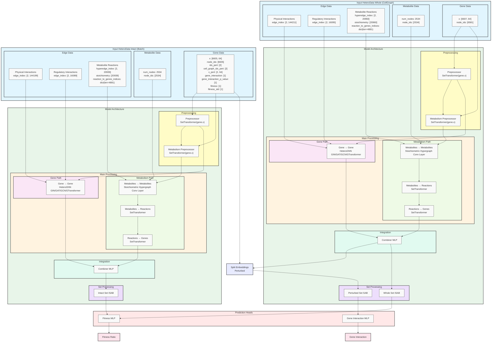
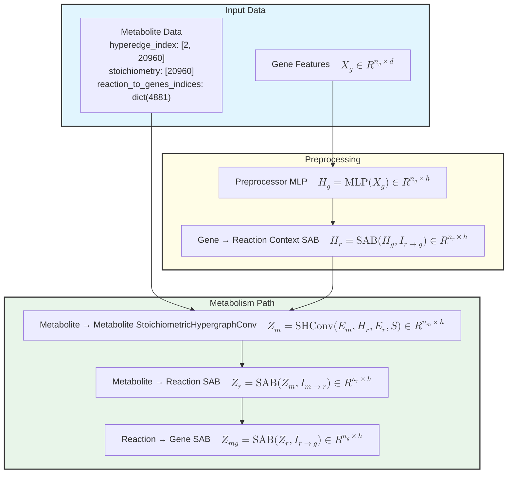

## 2025.01.21 - Choice of Data Preprocessing

We use subgraph representation as it is easier to pass this to the `Intact` portion of the model. We can then use the `perturbed_genes` for the collection of the perturbed set during perturbed set separation.

```python
dataset[40]
HeteroData(
  gene={
    node_ids=[6605],
    num_nodes=6605,
    ids_pert=[2],
    cell_graph_idx_pert=[2],
    x=[6605, 64],
    x_pert=[2, 64],
    gene_interaction=[1],
    gene_interaction_p_value=[1],
    fitness=[1],
    fitness_std=[1],
  },
  metabolite={
    num_nodes=2534,
    node_ids=[2534],
  },
  (gene, physical_interaction, gene)={
    edge_index=[2, 144199],
    num_edges=144199,
  },
  (gene, regulatory_interaction, gene)={
    edge_index=[2, 16089],
    num_edges=16089,
  },
  (metabolite, reaction-genes, metabolite)={
    hyperedge_index=[2, 20939],
    stoichiometry=[20939],
    reaction_to_genes=dict(len=4881),
    reaction_to_genes_indices=dict(len=4881),
    num_edges=4875,
  }
)
```

Batched

```python
batch
HeteroDataBatch(
  gene={
    node_ids=[2],
    num_nodes=13210,
    ids_pert=[2],
    cell_graph_idx_pert=[4],
    x=[13210, 64],
    x_batch=[13210],
    x_ptr=[3],
    x_pert=[4, 64],
    x_pert_batch=[4],
    x_pert_ptr=[3],
    gene_interaction=[2],
    gene_interaction_p_value=[2],
    fitness=[2],
    fitness_std=[2],
    batch=[13210],
    ptr=[3],
  },
  metabolite={
    num_nodes=5068,
    node_ids=[2],
    batch=[5068],
    ptr=[3],
  },
  (gene, physical_interaction, gene)={
    edge_index=[2, 287499],
    num_edges=[2],
  },
  (gene, regulatory_interaction, gene)={
    edge_index=[2, 32180],
    num_edges=[2],
  },
  (metabolite, reaction-genes, metabolite)={
    hyperedge_index=[2, 41914],
    stoichiometry=[41914],
    reaction_to_genes=dict(len=4881),
    reaction_to_genes_indices=dict(len=4881),
    num_edges=[2],
  }
)
```

This is the base graph that will get pass through the model first `dataset.cell_graph`. We only need to pass one object not batched then expand after the combiner.

```python
dataset.cell_graph
HeteroData(
  gene={
    num_nodes=6607,
    node_ids=[6607],
    x=[6607, 64],
  },
  metabolite={
    num_nodes=2534,
    node_ids=[2534],
  },
  (gene, physical_interaction, gene)={
    edge_index=[2, 144211],
    num_edges=144211,
  },
  (gene, regulatory_interaction, gene)={
    edge_index=[2, 16095],
    num_edges=16095,
  },
  (metabolite, reaction-genes, metabolite)={
    hyperedge_index=[2, 20960],
    stoichiometry=[20960],
    num_edges=4881,
    reaction_to_genes=dict(len=4881),
    reaction_to_genes_indices=dict(len=4881),
  }
)
```

## 2025.01.21 - Updated Mermaid Diagram



## 2025.01.21 - Algorithm

### Algorithm Definitions

1. **Gene Graph** ($G$):
   - $n$: Number of genes (nodes in the gene graph).
   - $d_G$: Feature dimension of the genes.
   - $\mathcal{N}_G \in \mathbb{R}^{n \times d_G}$: Node features representing the genes.
   - $\mathcal{E}_G \in \{0, 1\}^{n \times n}$: Multiple edge indices representing physical and regulatory interactions between genes.
   - $X_G \in \mathbb{R}^{n \times h}$: Node feature matrix after transformation, where $h$ is the hidden feature dimension.

2. **Metabolite Hypergraph** ($H$):
   - $m$: Number of metabolites (nodes in the metabolite hypergraph).
   - $d_H$: Feature dimension of the metabolites.
   - $\mathcal{N}_H \in \mathbb{R}^{m \times d_H}$: Node features representing the metabolites.
   - $e_H$: Number of hyperedges (reactions) in the hypergraph.
   - $\mathcal{E}_H \in \{0, 1\}^{m \times e_H}$: Hyperedge matrix representing reactions linking metabolites to genes.
   - $I_{\text{met}} \in \{0, 1\}^{m \times n}$: Incidence matrix linking metabolites to genes via gene-protein-reaction associations.

3. **Stoichiometry and Reaction Mapping**:
   - $E_H \in \mathbb{R}^{e_H \times h}$: Edge feature matrix after applying the Stoichiometric Hypergraph Convolution layer.
   - $X_{\text{rxn}} \in \mathbb{R}^{n \times h}$: Reaction embeddings derived from edge features mapped back to genes.
   - $X_{\text{gene}} \in \mathbb{R}^{n \times h}$: Final gene representations from reaction embeddings.

4. **Perturbed Set**:
   - $p$: Number of perturbed genes.
   - $\text{perturbed\_ids} \in \mathbb{R}^{p}$: Indices of the perturbed genes in the dataset.
   - $Z_p \in \mathbb{R}^{p \times h}$: Embeddings for the perturbed genes selected from the Whole Graph embeddings.

---

### Algorithm Steps

#### Step 1: Whole Graph Processing (Left-Hand Side)

1. **Preprocessing**:
   - Input: $\mathcal{N}_G \in \mathbb{R}^{n \times d_G}$
   - Output: $X_G = \text{SetTransformer}(\mathcal{N}_G) \in \mathbb{R}^{n \times h}$

2. **Gene-Gene Interaction**:
   - Input: $X_G \in \mathbb{R}^{n \times h}, \mathcal{E}_G \in \{0, 1\}^{n \times n}$
   - Output: $X_G = \text{HeteroGNN}(X_G, \mathcal{E}_G) \in \mathbb{R}^{n \times h}$

3. **Metabolism Preprocessing**:
   - Input: $X_G \in \mathbb{R}^{n \times h}$
   - Output: $X_H = \text{SetTransformer}(X_G) \in \mathbb{R}^{m \times h}$

4. **Stoichiometric Hypergraph**:
   - Input: $X_H \in \mathbb{R}^{m \times h}, I_{\text{met}} \in \{0, 1\}^{m \times n}$
   - Output: $E_H = \text{StoichiometricHypergraphConv}(X_H, I_{\text{met}}) \in \mathbb{R}^{e_H \times h}$

5. **Reaction-to-Gene Mapping**:
   - Input: $E_H \in \mathbb{R}^{e_H \times h}, I_{\text{rxn}} \in \{0, 1\}^{e_H \times n}$
   - Output: $X_{\text{rxn}} = \text{SetTransformer}(E_H, I_{\text{rxn}}) \in \mathbb{R}^{n \times h}$
   - Input: $X_{\text{rxn}} \in \mathbb{R}^{n \times h}, I_{\text{gene}} \in \{0, 1\}^{n \times g}$
   - Output: $X_{\text{gene}} = \text{SetTransformer}(X_{\text{rxn}}, I_{\text{gene}}) \in \mathbb{R}^{n \times h}$

6. **Combining Representations**:
   - Input: $X_G \in \mathbb{R}^{n \times h}, X_{\text{gene}} \in \mathbb{R}^{n \times h}$
   - Output: $Z_w = \text{MLP}([X_G \| X_{\text{gene}}]) \in \mathbb{R}^{n \times h}$

7. **Pooling Whole Set**:
   - Input: $Z_w \in \mathbb{R}^{n \times h}$
   - Output: $S_w = \text{MLP}(\text{ISAB}(Z_w)) \in \mathbb{R}^{1}$

---

#### Step 2: Intact Graph Processing (Right-Hand Side)

1. **Preprocessing**:
   - Same steps as the Whole Graph, but with perturbed data fields:
   - Output: $Z_1 = \text{MLP}([X_G \| X_{\text{gene}}]) \in \mathbb{R}^{n \times h}$

2. **Pooling Intact Set**:
   - Input: $Z_1 \in \mathbb{R}^{n \times h}$
   - Output: $S_1 = \text{MLP}(\text{ISAB}(Z_1)) \in \mathbb{R}^{1}$

---

#### Step 3: Fitness Ratio Computation

1. **Compute Fitness Ratio**:
   - Input: $S_1 \in \mathbb{R}^{1}, S_w \in \mathbb{R}^{1}$
   - Output: $\hat{y}_{\text{fitness}} = \frac{S_1}{S_w} \in \mathbb{R}^{1}$

---

#### Step 4: Perturbed Set Processing

1. **Select Perturbed Embeddings**:
   - Input: $Z_w \in \mathbb{R}^{n \times h}, \text{perturbed\_ids} \in \mathbb{R}^{p}$
   - Output: $Z_p = \text{Select}(Z_w, \text{perturbed\_ids}) \in \mathbb{R}^{p \times h}$

2. **Pooling Perturbed Set**:
   - Input: $Z_p \in \mathbb{R}^{p \times h}$
   - Output: $S_p = \text{MLP}(\text{SAB}(Z_p)) \in \mathbb{R}^{1}$

3. **Gene Interaction Prediction**:
   - Input: $S_p \in \mathbb{R}^{1}$
   - Output: $\hat{y}_{\text{gene\_interaction}} = S_p \in \mathbb{R}^{1}$

---

### Final Outputs

1. **Fitness Ratio**: $\hat{y}_{\text{fitness}} \in \mathbb{R}^{1}$
2. **Gene Interaction Predictions**: $\hat{y}_{\text{gene\_interaction}} \in \mathbb{R}^{1}$

## 2025.01.22 - Update Mermaid

```mermaid
graph TD
  subgraph InputDataWhole["Input HeteroData Whole (CellGraph)"]
    direction TB
    subgraph GeneDataWhole["Gene Data"]
      gene_data_whole["x: [6607, 64]<br>node_ids: [6581]<br>"]
    end
    subgraph MetaboliteDataWhole["Metabolite Data"]
      met_data_whole["num_nodes: 2534<br>node_ids: [2534]"]
    end
    subgraph EdgeDataWhole["Edge Data"]
      phys_edge_whole["Physical Interactions<br>edge_index: [2, 144211]"]
      reg_edge_whole["Regulatory Interactions<br>edge_index: [2, 16095]"]
      met_edge_whole["Metabolite Reactions<br>hyperedge_index: [2, 20960]<br>stoichiometry: [20960]<br>reaction_to_genes_indices: dict(len=4881)"]
    end
  end
  
  subgraph MainProcWhole["Model Architecture"]
    direction TB
    subgraph PreProcWhole["Preprocessing"]
      pre_whole["Preprocessor<br>SetTransformer(gene.x)"]
      met_pre_whole["Metabolism Preprocessor<br>SetTransformer(gene.x)"]
    end
  
    subgraph ParallelPathsWhole["Main Processing"]
      direction LR
      subgraph GenePathWhole["Gene Path"]
        gnn_whole["Gene → Gene<br>HeteroGNN <br>GIN/GAT/GCN/GTransformer"]
      end

      subgraph MetPathWhole["Metabolism Path"]
        met_conv_whole["Metabolites → Metabolites<br>Stoichiometric Hypergraph Conv Layer"]
        met2rxn_whole["Metabolites → Reactions<br>SetTransformer"]
        rxn2gene_whole["Reactions → Genes<br>SetTransformer"]
      end
    end

    subgraph IntegrationWhole["Integration"]
      combiner_whole["Combiner MLP"]
    end

    subgraph SetProcWhole["Set Processing"]
      whole["Whole Set ISAB → $$\; z_W$$"]
      perturbed_whole["Perturbed Set SAB → $$\; z_P$$"]
    end
  end
  
  split["Split Embeddings<br>Perturbed"]

  %% 
  subgraph InputDataIntact["Input HeteroData Intact (Batch)"]
    direction TB
    subgraph GeneDataIntact["Gene Data"]
      gene_data_intact["x: [6605, 64]<br>node_ids: [6605]<br>ids_pert: [2]<br>cell_graph_idx_pert: [2]<br>x_pert: [2, 64]<br>gene_interaction: [1]<br>gene_interaction_p_value: [1]<br> fitness: [1]<br>fitness_std: [1]<br>"]
    end
    subgraph MetaboliteDataIntact["Metabolite Data"]
      met_data_intact["num_nodes: 2534<br>node_ids: [2534]"]
    end
    subgraph EdgeDataIntact["Edge Data"]
      phys_edge_intact["Physical Interactions<br>edge_index: [2, 144199]"]
      reg_edge_intact["Regulatory Interactions<br>edge_index: [2, 16089]"]
      met_edge_intact["Metabolite Reactions<br>hyperedge_index: [2, 20939]<br>stoichiometry: [20939]<br>reaction_to_genes_indices: dict(len=4881)"]
    end
  end

  subgraph MainProcIntact["Model Architecture"]
    direction TB
    subgraph PreProcIntact["Preprocessing"]
      pre_intact["Preprocessor<br>SetTransformer(gene.x)"]
      met_pre_intact["Metabolism Preprocessor<br>SetTransformer(gene.x)"]
    end
    
    subgraph ParallelPathsIntact["Main Processing"]
      direction LR
      subgraph GenePathIntact["Gene Path"]
        gnn_intact["Gene → Gene<br>HeteroGNN <br>GIN/GAT/GCN/GTransformer"]
      end

      subgraph MetPathIntact["Metabolism Path"]
        met_conv_intact["Metabolites → Metabolites<br>Stoichiometric Hypergraph Conv Layer"]
        met2rxn_intact["Metabolites → Reactions<br>SetTransformer"]
        rxn2gene_intact["Reactions → Genes<br>SetTransformer"]
      end
    end

    subgraph IntegrationIntact["Integration"]
      combiner_intact["Combiner MLP"]
    end

    subgraph SetProcIntact["Set Processing"]
      intact["Intact Set ISAB → $$\; z_I$$"]
    end

  end
  
  subgraph PredHeadsIntact["Prediction Heads"]
    fitness["Fitness MLP"]
    gene_int["Gene Interaction MLP"]
  end
  
  subgraph ModelOutputs["Model Outputs"]
    output1["Fitness Ratio $$:= \; y_1$$"]
    output2["Gene Interaction $$:= \; y_2$$"]
    z_W["Latent Whole Embedding $$:= \; z_W$$"]
    z_I["Latent Whole Embedding $$:= \; z_I$$"]
    z_P["Latent Whole Embedding $$:= \; z_P$$"]
  end
  
  subgraph Loss["Loss"]
     loss["$$\mathcal{L}=\mathcal{L}_{\text {MSE}}(y, \hat{y})+\lambda_1 \mathcal{L}_{\operatorname{div}}(y, \hat{y})+\lambda_2 \mathcal{L}_{\text {con}}\left( z_P, z_I, y\right)+\lambda_3 \mathcal{L}_{\text {cell }}\left(z_W, z_P, z_I\right)$$"]
  end

  %% Connections

  %% Whole
  gene_data_whole --> pre_whole
  gene_data_whole --> met_pre_whole
  phys_edge_whole & reg_edge_whole --> gnn_whole
  met_edge_whole --> met_conv_whole
  met_data_whole --> met_conv_whole

  pre_whole --> met_pre_whole
  pre_whole --> gnn_whole
  met_pre_whole --> met_conv_whole
  met_conv_whole --> met2rxn_whole
  met2rxn_whole --> rxn2gene_whole
  gnn_whole & rxn2gene_whole --> combiner_whole
  combiner_whole --> split
  combiner_whole --> whole
  split -->  perturbed_whole
  whole --> fitness
  perturbed_whole --> gene_int

  %% Intact
  gene_data_intact --> pre_intact
  gene_data_intact --> met_pre_intact
  phys_edge_intact & reg_edge_intact --> gnn_intact
  met_edge_intact --> met_conv_intact
  met_data_intact --> met_conv_intact

  pre_intact --> met_pre_intact
  pre_intact --> gnn_intact
  met_pre_intact --> met_conv_intact
  met_conv_intact --> met2rxn_intact
  met2rxn_intact --> rxn2gene_intact
  gnn_intact & rxn2gene_intact --> combiner_intact
  combiner_intact --> intact
  intact --> fitness

  %% Whole to Intact
  gene_data_intact --> split

  %% Labels 

  fitness --> output1
  gene_int --> output2

  %% Outputs
  intact --> z_I
  whole --> z_W
  perturbed_whole --> z_P
  
  %% Loss
  output1 --> loss
  output2 --> loss
  
  z_I --> loss
  z_W --> loss
  z_P --> loss
  gene_data_intact --> loss

  %% Styling
  classDef default fill:#f9f9f9,stroke:#333,stroke-width:1px
  classDef input fill:#e1f5fe,stroke:#333,stroke-width:2px
  classDef process fill:#e8f5e9,stroke:#333,stroke-width:2px
  classDef pred_head fill:#ffe8e8,stroke:#333,stroke-width:2px
  classDef split fill:#e8ebff,stroke:#333,stroke-width:2px
  classDef parallel_paths fill:#fff3e0,stroke:#333,stroke-width:2px
  classDef integration fill:#e1faf0,stroke:#333,stroke-width:2px
  classDef set_processing fill:#eddefc,stroke:#333,stroke-width:2px
  classDef pre fill:#fffcc7,stroke:#333,stroke-width:2px
  classDef gene_path fill:#fae6f6,stroke:#333,stroke-width:2px
  classDef met_path fill:#eefae6,stroke:#333,stroke-width:2px
  classDef model_outputs fill:#e3f2fd,stroke:#333,stroke-width:2px
  classDef loss fill:#fbe9e7,stroke:#333,stroke-width:2px

  class InputDataWhole,GeneDataWhole,MetaboliteDataWhole,EdgeDataWhole input
  class InputDataIntact,GeneDataIntact,MetaboliteDataIntact,EdgeDataIntact input
  
  class MainProcWhole process
  class MainProcIntact, process

  class GenePathWhole,GenePathIntact gene_path
  class MetPathWhole,MetPathIntact met_path

  class PreProcWhole,PreProcIntact pre
  class ParallelPathsWhole,ParallelPathsIntact parallel_paths
  class IntegrationWhole,IntegrationIntact integration
  class SetProcWhole,SetProcIntact set_processing


  class split split
  class PredHeadsWhole,PredHeadsIntact pred_head

  class ModelOutputs model_outputs
  class Loss loss
```



## 2025.01.22 - Algorithm

### Graph Types and Processing

#### 1. Whole Graph (Cell Graph)

- Base graph $\mathcal{G}_\text{whole}$ that represents the unperturbed cell
- Single instance (batch size = 1) since it never changes
- Contains complete set of genes, metabolites, and their interactions
- Serves as reference point for measuring perturbation effects
- Data structure matches cell_graph format:

```python
dataset.cell_graph

HeteroData(
  gene={
    num_nodes=6607,
    node_ids=[6607],
    x=[6607, 64],
  },
  metabolite={
    num_nodes=2534,
    node_ids=[2534],
  },
  (gene, physical_interaction, gene)={
    edge_index=[2, 144211],
    num_edges=144211,
  },
  (gene, regulatory_interaction, gene)={
    edge_index=[2, 16095],
    num_edges=16095,
  },
  (metabolite, reaction-genes, metabolite)={
    hyperedge_index=[2, 20960],
    stoichiometry=[20960],
    num_edges=4881,
    reaction_to_genes=dict(len=4881),
    reaction_to_genes_indices=dict(len=4881),
  }
)
```

#### 2. Intact Graphs (Perturbed Instances)

- Collection of perturbed instances $\{\mathcal{G}_\text{intact}^{(i)}\}_{i=1}^b$ where $b$ is batch size
- Each graph is derived from whole graph but with specific perturbations
- Processed in batches during training
- Contains additional perturbation-related data:

```python
dataset[40]

HeteroData(
  gene={
    node_ids=[6605],
    num_nodes=6605,
    ids_pert=[2],
    cell_graph_idx_pert=[2],
    x=[6605, 64],
    x_pert=[2, 64],
    gene_interaction=[1],
    gene_interaction_p_value=[1],
    fitness=[1],
    fitness_std=[1],
  },
  metabolite={
    num_nodes=2534,
    node_ids=[2534],
  },
  (gene, physical_interaction, gene)={
    edge_index=[2, 144199],
    num_edges=144199,
  },
  (gene, regulatory_interaction, gene)={
    edge_index=[2, 16089],
    num_edges=16089,
  },
  (metabolite, reaction-genes, metabolite)={
    hyperedge_index=[2, 20939],
    stoichiometry=[20939],
    reaction_to_genes=dict(len=4881),
    reaction_to_genes_indices=dict(len=4881),
    num_edges=4875,
  }
)
```

#### Processing Flow

1. Whole Graph Processing:
   - Single pass through base cell graph
   - Outputs used as reference and for querying perturbed embeddings

2. Intact Graph Processing:
   - Batch processing of perturbed instances
   - Each instance compared against whole graph for fitness calculation
   - Perturbation effects measured relative to whole graph state

#### 1. Gene-Gene Interaction Multigraph

Let $\mathcal{G}_g = (\mathcal{V}_g, \mathcal{E}_g, \phi)$ represent the gene-gene interaction multigraph where:

- $\mathcal{V}_g$ is the set of gene vertices with $|\mathcal{V}_g| = n_g$ vertices
- $\mathcal{E}_g = \mathcal{E}_p \cup \mathcal{E}_r$ is the multiset of edges where:
  - $\mathcal{E}_p$ is the set of physical interaction edges
  - $\mathcal{E}_r$ is the set of regulatory interaction edges
- $\phi: \mathcal{E}_g \rightarrow \{\text{physical}, \text{regulatory}\}$ is the edge type mapping
- $X_g \in \mathbb{R}^{n_g \times d}$ is the gene feature matrix where $d$ is the feature dimension

#### 2. Metabolic Hypergraph

Let $\mathcal{H}_m = (\mathcal{V}_m, \mathcal{E}_r, I_{m→r}, I_{r→g}, S)$ represent the metabolic hypergraph where:

- $\mathcal{V}_m$ is the set of metabolite vertices with $|\mathcal{V}_m| = n_m$ vertices
- $\mathcal{E}_r$ is the set of reaction hyperedges with $|\mathcal{E}_r| = n_r$ edges
- $I_{m→r} \in \{0,1\}^{n_m \times n_r}$ is the metabolite-to-reaction incidence matrix
- $I_{r→g} \in \{0,1\}^{n_r \times n_g}$ is the reaction-to-gene incidence matrix
- $S \in \mathbb{R}^{n_r}$ contains the stoichiometric coefficients
- $E_m \in \mathbb{R}^{n_m \times h}$ is the metabolite embedding lookup table

#### 3. Label Data Structures

For each batch of size $b$:

- $y_\text{fitness} \in \mathbb{R}^b$ (fitness ratio labels)
- $y_\text{gene\_interaction} \in \mathbb{R}^b$ (gene interaction labels)
- $P \in \mathbb{N}^p$ (perturbed gene indices for each sample)

### Forward Pass Architecture

#### Base Forward Function

Takes a graph $\mathcal{G}$ and outputs latent embeddings $Z$ and pooled representation $z$

$\text{forward}(\mathcal{G}) → (Z, z):$

1. Preprocessing:
   - $H_g = \text{MLP}(X_g) \in \mathbb{R}^{n_g \times h}$, where $n_g = 6607$ (gene nodes)
   - $H_r = \text{SAB}(H_g, I_{r→g}) \in \mathbb{R}^{n_r \times h}$, where $n_r = 4881$ (reactions)

2. Parallel Processing:

   Gene Path:
   - $Z_g = \text{HeteroGNN}(H_g, \mathcal{E}_g) \in \mathbb{R}^{n_g \times h}$

   Metabolic Path:
   - $Z_m = \text{StoichiometricHypergraphConv}(E_m, H_r, \mathcal{E}_r, S) \in \mathbb{R}^{n_m \times h}$, where $n_m = 2534$ (metabolites)
   - $Z_r = \text{SAB}(Z_m, I_{m→r}) \in \mathbb{R}^{n_r \times h}$
   - $Z_{mg} = \text{SAB}(Z_r, I_{r→g}) \in \mathbb{R}^{n_g \times h}$

3. Integration:
   - $Z = \text{MLP}([Z_g \| Z_{mg}]) \in \mathbb{R}^{n_g \times h}$
   - $z = \text{ISAB}(Z) \in \mathbb{R}^{h}$

   Return: $(Z, z)$

#### Model Workflow

1. Process Whole Graph:
   - $(Z_W, z_W) = \text{forward}(\mathcal{G}_\text{whole})$
   - $Z_W \in \mathbb{R}^{n_g \times h}, z_W \in \mathbb{R}^{h}$

2. Process Intact Graph:
   - $(Z_I, z_I) = \text{forward}(\mathcal{G}_\text{intact})$
   - $Z_I \in \mathbb{R}^{n_g \times h}, z_I \in \mathbb{R}^{h}$

3. Query Perturbed Set:
   - Let $P \in \mathbb{N}^p$ be indices of perturbed genes from `ids_pert`, where $p = 2$ (perturbed genes) in the example data
   - $Z_P = Z_W[P] \in \mathbb{R}^{p \times h}$
   - $z_P = \text{SAB}(Z_P) \in \mathbb{R}^{h}$

#### Prediction Heads

1. Growth and Fitness Calculation:
   - $\text{growth}_W = \text{MLP}_\text{growth}(z_W) \in \mathbb{R}^{1}$
   - $\text{growth}_I = \text{MLP}_\text{growth}(z_I) \in \mathbb{R}^{1}$
   - $\hat{y}_\text{fitness} = \text{growth}_I/\text{growth}_W \in \mathbb{R}^{1}$

2. Gene Interaction:
   - $\hat{y}_\text{gene\_interaction} = \text{MLP}_\text{interaction}(z_P) \in \mathbb{R}^{1}$

For a batch of size $b$:
$\hat{Y} = [\hat{y}_\text{fitness} \| \hat{y}_\text{gene\_interaction}] \in \mathbb{R}^{2 \times b}$

#### Loss Computation

The total loss with domain-specific weighting:

$$\mathcal{L}=\mathcal{L}_{\text{MSE}}(Y, \hat{Y})+\lambda_1 \mathcal{L}_{\text{dist}}(Y, \hat{Y})+\lambda_2 \mathcal{L}_{\text{SupCR}}(z_P, z_I, Y)+\lambda_3 \mathcal{L}_{\text{cell}}(z_W, z_P, z_I)$$

Where:

- $Y, \hat{Y} \in \mathbb{R}^{2 \times b}$ (ground truth and predictions)
- $z_P, z_I, z_W \in \mathbb{R}^{h}$ (latent representations)
- $\lambda_1, \lambda_2, \lambda_3 \in \mathbb{R}^+$ (loss weights)


## 2025.01.27 - Metabolism Processor



## 2025.01.27 - Metabolism Processor Algorithm

### Data Structures

1. **Input Dimensions**:
   - $n_m = 2534$ (number of metabolites)
   - $n_r = 4881$ (number of reactions)
   - $n_g$ (number of genes)
   - $h$ (hidden dimension)

2. **Input Matrices**:
   - $X_g \in \mathbb{R}^{n_g \times d}$ (gene features)
   - $E_m \in \mathbb{R}^{n_m \times h}$ (metabolite embeddings)
   - $I_{m→r} \in \{0,1\}^{n_m \times n_r}$ (metabolite-to-reaction incidence matrix) - This is essentially the hyperedge index.
   - $I_{r→g} \in \{0,1\}^{n_r \times n_g}$ (reaction-to-gene incidence matrix) - This is technically another hyperedge index and could be stored as we store the hyperedge index of the metabolism hypergraph.
   - $S \in \mathbb{R}^{n_r}$ (stoichiometric coefficients)

### Metabolism Processor Algorithm Steps

#### 1. Gene Context Processing

**Function**: `process_gene_context`

- **Input**: Gene features $X_g$
- **Process**: Transform gene features to provide reaction context
- **Output**: $H_g \in \mathbb{R}^{n_g \times h}$

```python
H_g = MLP(X_g)  # Initial transformation
H_r = SAB(H_g, I_{r→g})  # Aggregate gene features per reaction
```

#### 2. Metabolite Processing

**Function**: `process_metabolites`

- **Input**: $E_m, H_r, I_{m→r}, S$
- **Process**: Apply stoichiometric hypergraph convolution
- **Output**: $Z_m \in \mathbb{R}^{n_m \times h}$

```python
Z_m = StoichiometricHypergraphConv(
    x=E_m,
    edge_index=hyperedge_index,
    stoich=S,
    hyperedge_attr=H_r
)
```

#### 3. Reaction Mapping

**Function**: `metabolites_to_reactions`

- **Input**: $Z_m, I_{m→r}$
- **Process**: Map metabolite features to reactions using Set Attention Block
- **Output**: $Z_r \in \mathbb{R}^{n_r \times h}$

```python
Z_r = SAB(Z_m, I_{m→r})  # Aggregate metabolite features per reaction
```

#### 4. Gene Mapping

**Function**: `reactions_to_genes`

- **Input**: $Z_r, I_{r→g}$
- **Process**: Map reaction features to genes using Set Attention Block
- **Output**: $Z_{mg} \in \mathbb{R}^{n_g \times h}$

```python
Z_{mg} = SAB(Z_r, I_{r→g})  # Aggregate reaction features per gene
```

### Key Components

1. **SetTransformer (SAB)**:
   - Processes sets of varying size
   - Performs permutation-invariant aggregation
   - Maintains dimensional consistency

2. **StoichiometricHypergraphConv**:
   - Handles hypergraph structure of metabolic network
   - Incorporates stoichiometric coefficients
   - Processes reaction context from genes

3. **Dimension Handling**:
   - All intermediate representations maintain $h$ dimensions
   - Supports batch processing
   - Preserves sparsity in graph operations

### Implementation Notes

1. **Memory Efficiency**:
   - Uses sparse matrix operations
   - Implements batched processing
   - Handles variable-sized sets

2. **Numerical Stability**:
   - Uses layer normalization
   - Implements skip connections
   - Handles potential numerical instabilities

3. **Performance Optimization**:
   - Caches intermediate computations
   - Uses efficient sparse operations
   - Implements parallel processing where possible

## 2025.01.28 - Dicts are a Nightmare Change Choice of Data Preprocessing

Whole Graph

```python
dataset.cell_graph
HeteroData(
  gene={
    num_nodes=6579,
    node_ids=[6579],
    x=[6579, 64],
  },
  metabolite={
    num_nodes=2534,
    node_ids=[2534],
  },
  reaction={
    num_nodes=4881,
    node_ids=[4881],
  },
  (gene, physical_interaction, gene)={
    edge_index=[2, 143824],
    num_edges=143824,
  },
  (gene, regulatory_interaction, gene)={
    edge_index=[2, 16061],
    num_edges=16061,
  },
  (metabolite, reaction, metabolite)={
    hyperedge_index=[2, 20960],
    stoichiometry=[20960],
    num_edges=4881,
    reaction_to_genes=dict(len=4881),
    reaction_to_genes_indices=dict(len=4881),
  },
  (gene, gpr, reaction)={
    hyperedge_index=[2, 5430],
    num_edges=4881,
  }
)
```

Intact/Perturbed Graph

```python
dataset[4]
HeteroData(
  gene={
    node_ids=[6577],
    num_nodes=6577,
    ids_pert=[2],
    cell_graph_idx_pert=[2],
    x=[6577, 64],
    x_pert=[2, 64],
    fitness=[1],
    fitness_std=[1],
    gene_interaction=[1],
    gene_interaction_p_value=[1],
  },
  metabolite={
    node_ids=[2534],
    num_nodes=2534,
  },
  reaction={
    num_nodes=4880,
    node_ids=[4880],
  },
  (gene, physical_interaction, gene)={
    edge_index=[2, 143786],
    num_edges=143786,
  },
  (gene, regulatory_interaction, gene)={
    edge_index=[2, 16056],
    num_edges=16056,
  },
  (gene, gpr, reaction)={
    hyperedge_index=[2, 5428],
    num_edges=4880,
  },
  (metabolite, reaction, metabolite)={
    hyperedge_index=[2, 20954],
    stoichiometry=[20954],
    num_edges=4880,
  }
)
```

Batched

```python
batch
HeteroDataBatch(
  gene={
    node_ids=[2],
    num_nodes=13154,
    ids_pert=[2],
    cell_graph_idx_pert=[4],
    x=[13154, 64],
    x_batch=[13154],
    x_ptr=[3],
    x_pert=[4, 64],
    x_pert_batch=[4],
    x_pert_ptr=[3],
    fitness=[2],
    fitness_std=[2],
    gene_interaction=[2],
    gene_interaction_p_value=[2],
    batch=[13154],
    ptr=[3],
  },
  metabolite={
    node_ids=[2],
    num_nodes=5068,
    batch=[5068],
    ptr=[3],
  },
  reaction={
    num_nodes=9762,
    node_ids=[2],
    batch=[9762],
    ptr=[3],
  },
  (gene, physical_interaction, gene)={
    edge_index=[2, 287558],
    num_edges=[2],
  },
  (gene, regulatory_interaction, gene)={
    edge_index=[2, 32109],
    num_edges=[2],
  },
  (gene, gpr, reaction)={
    hyperedge_index=[2, 10860],
    num_edges=[2],
  },
  (metabolite, reaction, metabolite)={
    hyperedge_index=[2, 41920],
    stoichiometry=[41920],
    num_edges=[2],
  }
)
```
