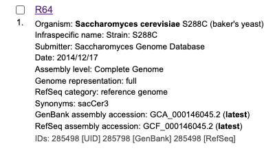
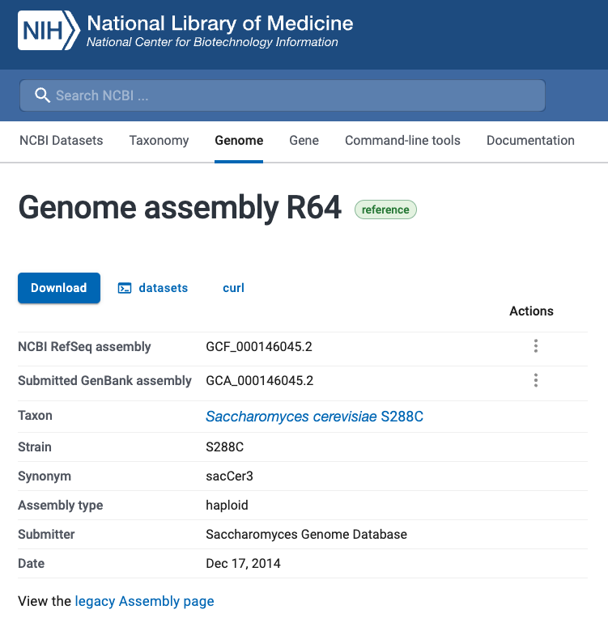
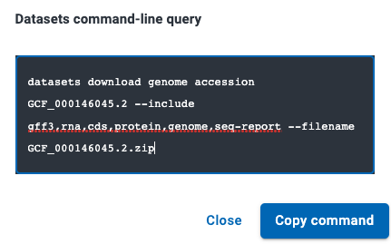

## Downloading a Genome

- Go to [NCBI Assembly](https://www.ncbi.nlm.nih.gov/assembly/) and search for genome of interest.


- Select a genome 

- Select `datasets` 

- 

## Download S cerevisiae Genome Example

```bash
cd data/ncbi/s_cerevisiae/
datasets download genome accession GCF_000146045.2 --include gff3,rna,cds,protein,genome,seq-report --filename GCF_000146045.2.zip
```
